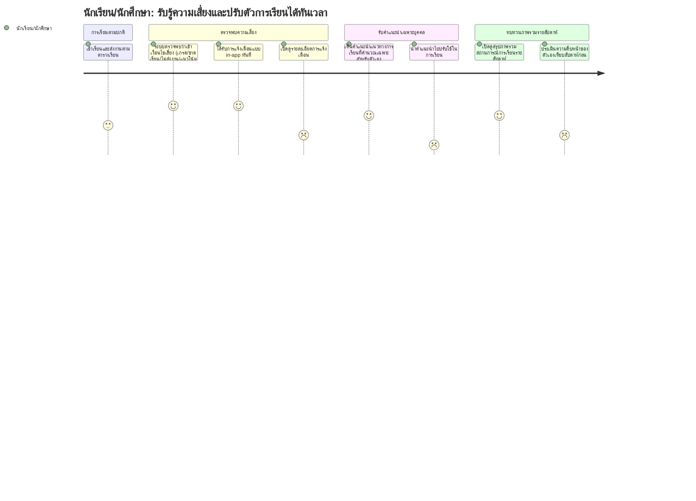

# User Journey: นักเรียน/นักศึกษา — รับรู้ความเสี่ยงในการเรียนและปรับตัวได้ทันเวลา

**สร้างจาก:** [[../../01-requirements/01-spec/20260825-01-personalized-learning-reminder|ระบบเตือนและแนะนำแนวทางการเรียนส่วนบุคคล]]
**เกี่ยวข้องกับ:** [[./20260827-01-features-list-personalized-learning-reminder|Features List]]

## Persona
นักเรียน/นักศึกษาที่กำลังเรียนอยู่ในระบบ Grade Runway มีข้อมูลผลการเรียน การเข้าเรียน และการส่งงานสะสมอยู่ในระบบ ต้องการรู้ตัวก่อนที่สถานการณ์การเรียนจะแย่ลงจนแก้ไขไม่ทัน

## เป้าหมาย (Goal)
รับรู้เมื่อผลการเรียน/พฤติกรรมการเรียนของตัวเองเข้าเงื่อนไขความเสี่ยง และได้รับคำแนะนำแนวทางการเรียนที่เหมาะกับสถานการณ์เฉพาะของตัวเอง เพื่อปรับตัวได้ทันเวลา

## แผนภาพ Journey

คะแนนในแต่ละขั้นตอนสื่อถึง **ความมั่นใจตามความชัดเจนของ spec** (สูง = spec ระบุตรงๆ, ต่ำ = อนุมานเอง) ไม่ใช่ความพึงพอใจของผู้ใช้

## คำอธิบายแต่ละขั้นตอน

| ขั้นตอน | Touchpoint | Pain Point / Emotion | ฟีเจอร์ที่เกี่ยวข้อง |
|---|---|---|---|
| เข้าเรียนและส่งงานตามตารางเรียน | ระบบเก็บข้อมูลเบื้องหลัง (attendance/assignment tracking) | คะแนนปานกลาง (3) เพราะ spec ไม่ได้ระบุรายละเอียดว่าระบบเก็บข้อมูลจากช่องทางใด (manual input, sync จากระบบอื่น) — เป็นการอนุมาน | #1 ติดตามตัวแปรผลการเรียน |
| ระบบตรวจพบว่าเข้าเงื่อนไขเสี่ยง | Background process ประเมินเงื่อนไขหลายตัวแปร | คะแนนสูง (5) เพราะ Business Rules ระบุตัวแปรและหลักการ configurable ไว้ชัดเจน | #2 เงื่อนไขแจ้งเตือนแบบหลายตัวแปร |
| ได้รับการแจ้งเตือนแบบ in-app ทันที | หน้าจอ/ศูนย์การแจ้งเตือนในแอป | คะแนนสูง (5) เพราะ BR ระบุช่องทางและจังหวะเวลา (ทันทีที่ตรวจพบ) ไว้ชัดเจน | #3 การแจ้งเตือนแบบ in-app ทันที |
| เปิดดูรายละเอียดการแจ้งเตือน | หน้ารายละเอียดการแจ้งเตือน | คะแนนต่ำ (2) — สมมติฐาน: การแจ้งเตือนมีลิงก์นำไปสู่หน้าคำแนะนำโดยตรง แต่ spec ไม่ได้ระบุรูปแบบเนื้อหา/UI ของการแจ้งเตือน | #3 การแจ้งเตือนแบบ in-app ทันที |
| เห็นคำแนะนำแนวทางการเรียนเฉพาะบุคคล | หน้าคำแนะนำส่วนบุคคล | คะแนนสูง (4) เพราะ US2/BR3 ระบุชัดว่าต้องคำนวณจากข้อมูลย้อนหลังของแต่ละคน | #4 คำแนะนำแนวทางการเรียนเฉพาะบุคคล |
| นำคำแนะนำไปปรับใช้ในการเรียน | นอกระบบ (พฤติกรรมผู้ใช้) | คะแนนต่ำสุด (1) — เป็นขั้นตอนที่อนุมานล้วนๆ เพราะ spec ไม่มี feedback loop หรือกลไกติดตามผลว่าผู้เรียนนำคำแนะนำไปใช้จริงหรือไม่ | (ไม่มีฟีเจอร์รองรับโดยตรงใน MoSCoW) |
| เปิดดูสรุปภาพรวมสถานการณ์การเรียนรายสัปดาห์ | หน้าสรุปรายสัปดาห์ | คะแนนสูง (4) เพราะ US3 ระบุ requirement นี้ไว้ชัดเจน | #5 สรุปภาพรวมสถานการณ์การเรียนรายสัปดาห์ |
| ประเมินความคืบหน้าของตัวเองเทียบสัปดาห์ก่อน | หน้าสรุปรายสัปดาห์ (ส่วน trend/comparison) | คะแนนต่ำ (2) — สมมติฐานว่ามีการเปรียบเทียบกับสัปดาห์ก่อน แต่ spec ไม่ได้ระบุรายละเอียดของเนื้อหาในสรุปรายสัปดาห์ | #5 สรุปภาพรวมสถานการณ์การเรียนรายสัปดาห์ |

## Edge Cases / ทางเลือกอื่น
- นักเรียนที่เพิ่งเข้าเรียนและยังไม่มีข้อมูลย้อนหลังเพียงพอ — คำแนะนำเฉพาะบุคคลอาจคำนวณได้ไม่แม่นยำหรือคำนวณไม่ได้เลย (spec ไม่ได้ระบุ fallback สำหรับกรณีนี้)
- นักเรียนที่เข้าเงื่อนไขเสี่ยงหลายตัวแปรพร้อมกันในเวลาเดียวกัน — ลำดับความสำคัญ/การจัดกลุ่มของการแจ้งเตือนยังไม่ได้ระบุไว้ใน spec
- ผู้ดูแลระบบปรับเปลี่ยนเกณฑ์ระหว่างที่มีการแจ้งเตือนที่ยังไม่ได้อ่านค้างอยู่ — ผลกระทบต่อการแจ้งเตือนที่ค้างอยู่ยังไม่ได้ระบุ

---
ย้อนกลับ: [[index|01-prototypes]]
