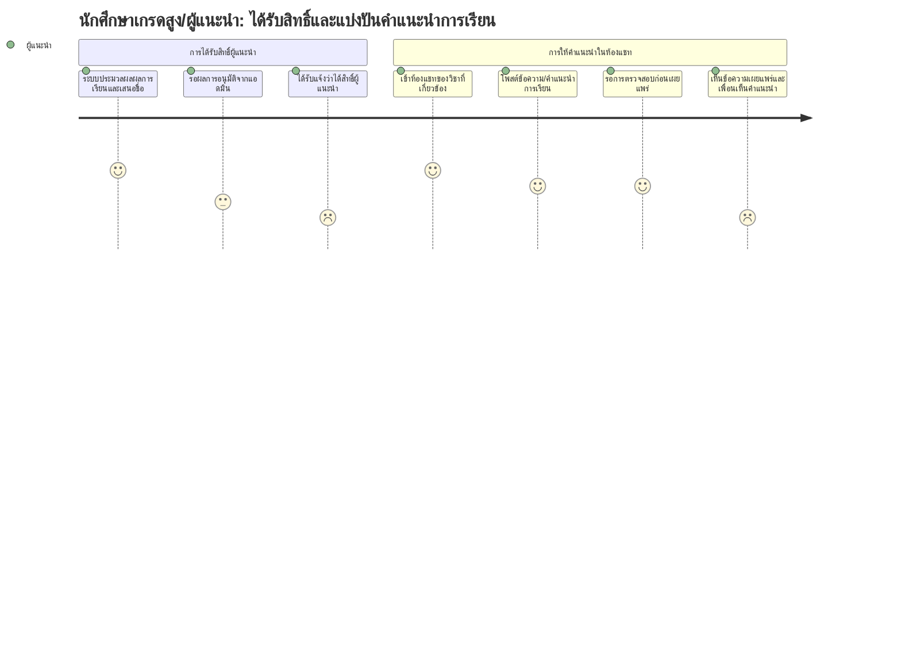

# User Journey: นักศึกษาเกรดสูง/ผู้แนะนำ — ได้รับสิทธิ์และแบ่งปันคำแนะนำการเรียน

**สร้างจาก:** [[../../01-requirements/01-spec/20260825-02-high-grade-peer-review-chat|ช่องแชทรีวิวและแนะนำวิธีการเรียนจากนักศึกษาเกรดสูง]]
**เกี่ยวข้องกับ:** [[./20260827-03-features-list-high-grade-peer-review-chat|Features List]]

## Persona
นักศึกษาที่มีผลการเรียนสูงหรือผ่านเกณฑ์ที่ระบบกำหนดในรายวิชาใดวิชาหนึ่ง มีความตั้งใจอยากช่วยเหลือเพื่อนนักศึกษาในวิชาเดียวกันด้วยการแบ่งปันวิธีเรียนของตนเอง

## เป้าหมาย (Goal)
ได้รับสิทธิ์เป็นผู้แนะนำ/ผู้รีวิวในห้องแชทของวิชาที่ตนเรียน และสามารถโพสต์คำแนะนำที่เป็นประโยชน์ให้เพื่อนนักศึกษาเห็นได้จริง

## แผนภาพ Journey

คะแนนในแต่ละขั้นตอนสื่อถึง **ความมั่นใจตามความชัดเจนของ spec** (สูง = spec ระบุตรงๆ, ต่ำ = อนุมานเอง) ไม่ใช่ความพึงพอใจของผู้ใช้

## คำอธิบายแต่ละขั้นตอน

| ขั้นตอน | Touchpoint | Pain Point / Emotion | ฟีเจอร์ที่เกี่ยวข้อง |
|---|---|---|---|
| ระบบประมวลผลผลการเรียนและเสนอชื่อ | ระบบหลังบ้าน (ไม่มี UI ฝั่งนักศึกษา) | มั่นใจสูง — BR1 ข้อ 1 ระบุกลไกนี้ตรงๆ | แถว 3 |
| รอผลการอนุมัติจากแอดมิน | ไม่มี UI ชัดเจนที่นักศึกษาเห็นสถานะระหว่างรอ | ระยะเวลารอไม่ระบุ อาจรู้สึกไม่แน่ใจว่าต้องรอนานแค่ไหน (สเปกไม่ระบุ SLA) | แถว 5 |
| ได้รับแจ้งว่าได้สิทธิ์ผู้แนะนำ | การแจ้งเตือน (ช่องทางไม่ระบุ) | **อนุมาน** — สเปกไม่ได้พูดถึงกลไกแจ้งผลการอนุมัติให้นักศึกษาทราบเลย จึงให้คะแนนต่ำ | แถว 10 |
| เข้าห้องแชทของวิชาที่เกี่ยวข้อง | หน้าห้องแชทแยกตามวิชา | มั่นใจสูง — BR2 ระบุชัดเจนว่าแยกตามรายวิชา | แถว 1, 6 |
| โพสต์ข้อความ/คำแนะนำการเรียน | ช่องพิมพ์ข้อความในห้องแชท | มั่นใจสูง — ตรงกับ US1 โดยตรง | แถว 7 |
| รอการตรวจสอบก่อนเผยแพร่ | สถานะข้อความ (รอตรวจสอบ) | มั่นใจสูงว่าต้องมีขั้นตอนนี้ (BR4) แต่ระยะเวลารอ/SLA ยังไม่ระบุ | แถว 9 |
| เห็นข้อความเผยแพร่และเพื่อนเห็นคำแนะนำ | หน้าห้องแชท/สถานะข้อความ | **อนุมาน** — สเปกไม่ได้พูดถึง feedback loop หรือการแจ้งผลเผยแพร่ให้ผู้โพสต์ทราบ | แถว 10 |

## Edge Cases / ทางเลือกอื่น
- ระบบเสนอชื่อแล้วแต่แอดมินไม่อนุมัติ (reject) — นักศึกษาจะไม่ได้รับสิทธิ์ผู้แนะนำ ยังไม่ระบุว่ามีการแจ้งเหตุผลหรือให้ยื่นใหม่ได้หรือไม่
- ข้อความที่โพสต์ถูกแอดมินปฏิเสธไม่เผยแพร่ — ยังไม่ระบุว่าผู้โพสต์จะได้รับแจ้งเหตุผลหรือไม่ (อนุมานว่าควรมี แต่ไม่ยืนยันจาก spec)
- นักศึกษาที่เคยเข้าเกณฑ์แล้วผลการเรียนภาคถัดไปตกลงต่ำกว่าเกณฑ์ — ยังไม่ระบุว่าจะถูกถอนสิทธิ์ผู้แนะนำหรือไม่

---
ย้อนกลับ: [[index|01-prototypes]]
