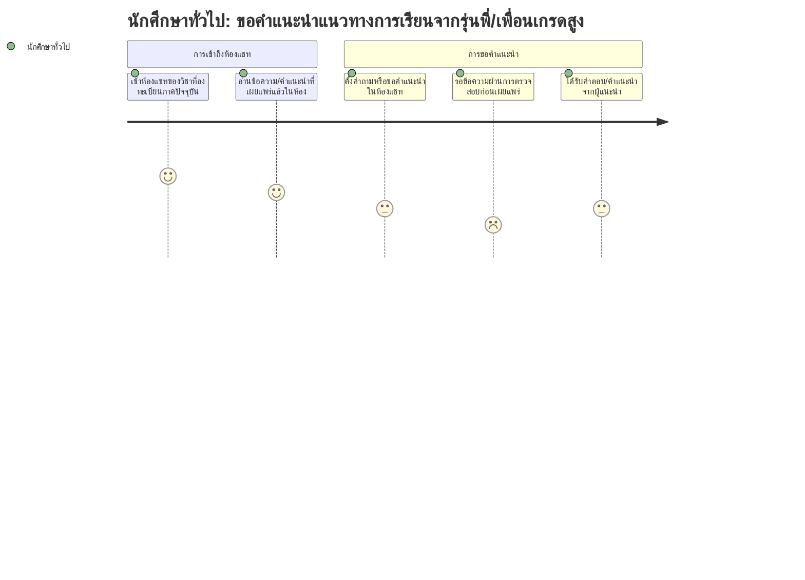

# User Journey: นักศึกษาทั่วไป — ขอคำแนะนำแนวทางการเรียนจากรุ่นพี่/เพื่อนเกรดสูง

**สร้างจาก:** [[../../01-requirements/01-spec/20260825-02-high-grade-peer-review-chat|ช่องแชทรีวิวและแนะนำวิธีการเรียนจากนักศึกษาเกรดสูง]]
**เกี่ยวข้องกับ:** [[./20260827-03-features-list-high-grade-peer-review-chat|Features List]]

## Persona
นักศึกษาทั่วไปที่ลงทะเบียนเรียนวิชาหนึ่ง ต้องการแนวทางการเรียนที่ได้ผลจริงและตรงกับวิชานั้น จึงต้องการเข้าไปอ่านหรือสนทนากับนักศึกษาที่ได้เกรดสูงในวิชาเดียวกัน

## เป้าหมาย (Goal)
ได้รับคำแนะนำแนวทางการเรียนที่เป็นประโยชน์และตรงกับรายวิชาที่กำลังเรียนอยู่ จากผู้แนะนำที่ผ่านการรับรองในห้องแชทของวิชานั้น

## แผนภาพ Journey

คะแนนในแต่ละขั้นตอนสื่อถึง **ความมั่นใจตามความชัดเจนของ spec** (สูง = spec ระบุตรงๆ, ต่ำ = อนุมานเอง) ไม่ใช่ความพึงพอใจของผู้ใช้

## คำอธิบายแต่ละขั้นตอน

| ขั้นตอน | Touchpoint | Pain Point / Emotion | ฟีเจอร์ที่เกี่ยวข้อง |
|---|---|---|---|
| เข้าห้องแชทของวิชาที่ลงทะเบียนภาคปัจจุบัน | หน้าห้องแชทแยกตามวิชา | มั่นใจสูง — BR3 ระบุขอบเขตการเข้าถึงชัดเจน | แถว 1, 2 |
| อ่านข้อความ/คำแนะนำที่เผยแพร่แล้วในห้อง | หน้าห้องแชท | มั่นใจสูง — ตรงกับ US2 โดยตรง | แถว 8 |
| ตั้งคำถามหรือขอคำแนะนำในห้องแชท | ช่องพิมพ์ข้อความ | ปานกลาง — US2 ระบุว่า "สนทนา" แต่ spec ไม่ได้ลงรายละเอียดกลไกตั้งคำถาม/ตอบกลับที่ชัดเจนว่ามีรูปแบบเฉพาะหรือไม่ | แถว 8 |
| รอข้อความผ่านการตรวจสอบก่อนเผยแพร่ | สถานะข้อความ | **อนุมาน** — BR4 ระบุว่า "ทุกข้อความ" ต้อง pre-moderate จึงตีความว่าคำถามของนักศึกษาทั่วไปก็ต้องผ่านขั้นตอนนี้ด้วย แต่ spec ไม่ได้แยกพูดถึงกรณีนี้ตรงๆ จึงให้คะแนนต่ำ | แถว 9 |
| ได้รับคำตอบ/คำแนะนำจากผู้แนะนำ | หน้าห้องแชท | ปานกลาง — เป็นผลลัพธ์ตามธรรมชาติของ US1+US2 แต่ spec ไม่ได้ระบุว่ามีกลไกรับประกันว่าจะมีคนตอบ | แถว 6, 7 |

## Edge Cases / ทางเลือกอื่น
- วิชาที่ยังไม่มีนักศึกษาผ่านเกณฑ์เป็นผู้แนะนำเลย — ห้องแชทของวิชานั้นจะว่างเปล่า ไม่มีใครตอบคำถาม (ไม่มี fallback ระบุใน spec)
- นักศึกษาลงทะเบียนวิชาใหม่ระหว่างภาคการศึกษา (เพิ่ม/ถอนวิชา) — ยังไม่ระบุว่าจะได้เข้าห้องแชทของวิชานั้นทันทีหรือมีดีเลย์
- คำถามที่ถูกปฏิเสธในขั้น pre-moderation — ยังไม่ระบุว่าผู้ถามจะทราบเหตุผลหรือถามซ้ำได้อย่างไร

---
ย้อนกลับ: [[index|01-prototypes]]
