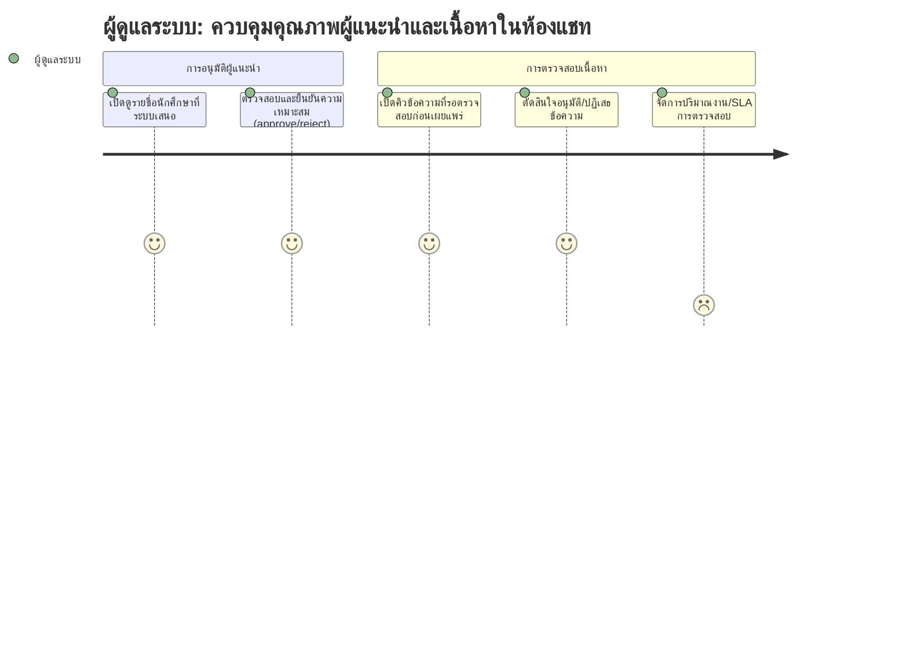

# User Journey: ผู้ดูแลระบบ — ควบคุมคุณภาพผู้แนะนำและเนื้อหาในห้องแชท

**สร้างจาก:** [[../../01-requirements/01-spec/20260825-02-high-grade-peer-review-chat|ช่องแชทรีวิวและแนะนำวิธีการเรียนจากนักศึกษาเกรดสูง]]
**เกี่ยวข้องกับ:** [[./20260827-03-features-list-high-grade-peer-review-chat|Features List]]

## Persona
ผู้ดูแลระบบ (หรือผู้ที่ได้รับมอบหมาย) ที่รับผิดชอบตรวจสอบความเหมาะสมของทั้งผู้ที่จะได้สิทธิ์เป็นผู้แนะนำ และเนื้อหาทุกข้อความที่จะเผยแพร่ในห้องแชทแต่ละวิชา

## เป้าหมาย (Goal)
รับรองว่าเฉพาะนักศึกษาที่เหมาะสมเท่านั้นที่ได้สิทธิ์เป็นผู้แนะนำ และเนื้อหาทุกข้อความในห้องแชทเหมาะสม เป็นประโยชน์ ก่อนเผยแพร่ให้นักศึกษาคนอื่นเห็น

## แผนภาพ Journey

คะแนนในแต่ละขั้นตอนสื่อถึง **ความมั่นใจตามความชัดเจนของ spec** (สูง = spec ระบุตรงๆ, ต่ำ = อนุมานเอง) ไม่ใช่ความพึงพอใจของผู้ใช้

## คำอธิบายแต่ละขั้นตอน

| ขั้นตอน | Touchpoint | Pain Point / Emotion | ฟีเจอร์ที่เกี่ยวข้อง |
|---|---|---|---|
| เปิดดูรายชื่อนักศึกษาที่ระบบเสนอ | หน้าคิวอนุมัติผู้แนะนำ | มั่นใจสูง — US3, US4 ระบุกลไกนี้ตรงๆ | แถว 3, 5 |
| ตรวจสอบและยืนยันความเหมาะสม (approve/reject) | ปุ่ม approve/reject ในหน้าคิว | มั่นใจสูง — US4 ระบุตรงๆ ว่าแอดมินต้อง approve ก่อนให้สิทธิ์ | แถว 5, 6 |
| เปิดคิวข้อความที่รอตรวจสอบก่อนเผยแพร่ | หน้าคิว pre-moderation | มั่นใจสูง — US5/BR4 ระบุตรงๆ ว่าทุกข้อความต้องผ่านการตรวจสอบ | แถว 9 |
| ตัดสินใจอนุมัติ/ปฏิเสธข้อความ | ปุ่ม approve/reject ในหน้าคิว moderation | มั่นใจสูง — US5 ระบุตรงๆ | แถว 9 |
| จัดการปริมาณงาน/SLA การตรวจสอบ | ไม่มี UI ที่ระบุชัดเจน | **อนุมาน/คะแนนต่ำที่สุด** — spec ระบุไว้เองในหัวข้อ Business Rules ว่า "ต้องการข้อมูลเพิ่มเติมจากผู้ใช้" เรื่องผู้รับผิดชอบ pre-moderation (แอดมินส่วนกลางหรืออาจารย์ประจำวิชา) และ SLA ของการตรวจสอบ ยังไม่มีคำตอบ | แถว 11 (สมมติฐาน) |

## Edge Cases / ทางเลือกอื่น
- ปริมาณข้อความ/รายชื่อที่ต้องตรวจสอบมากเกินกำลังของแอดมินคนเดียว หรือมีหลายวิชาพร้อมกัน — spec ยังไม่ระบุว่ามีการกระจายงานหรือกำหนด SLA อย่างไร
- ผู้รับผิดชอบ pre-moderation เป็นแอดมินส่วนกลางของระบบ หรืออาจารย์ประจำวิชานั้นๆ — spec ใช้คำว่า "ผู้ดูแลระบบหรือผู้ที่ได้รับมอบหมาย" ซึ่งยังไม่ชี้ชัดบทบาท
- กรณีแอดมินปฏิเสธรายชื่อผู้แนะนำที่ระบบเสนอซ้ำๆ ในภาคถัดไป (เกรดยังเข้าเกณฑ์แต่แอดมินไม่เห็นด้วยซ้ำ) — ยังไม่มีกลไกจัดการที่ระบุใน spec

---
ย้อนกลับ: [[index|01-prototypes]]

> ดู prototype ที่ derive จากเอกสารนี้: [[prototypes/high-grade-mentor-chat/index|Prototype: ช่องแชทรีวิวและแนะนำวิธีการเรียนจากนักศึกษาเกรดสูง]]
