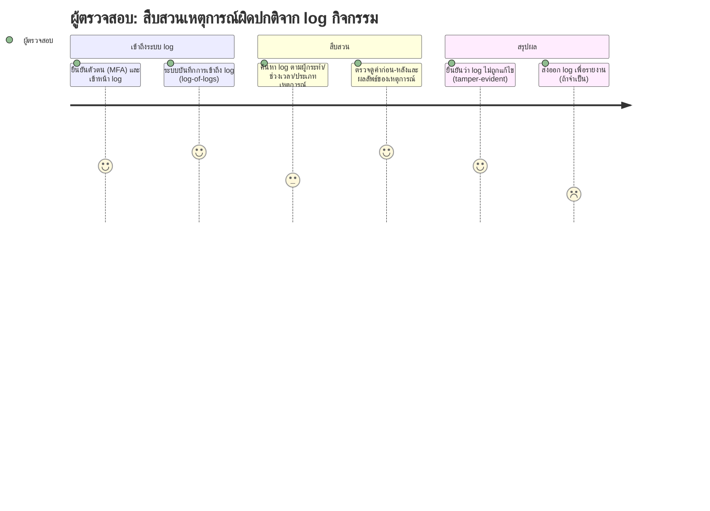

# User Journey: ผู้ดูแลระบบระดับสูง/ผู้ตรวจสอบ — สืบสวนเหตุการณ์ผิดปกติจาก log กิจกรรม

**สร้างจาก:** [[../../01-requirements/01-spec/20260825-03-logging-pdpa-compliance|การเก็บ Log กิจกรรมและการปฏิบัติตาม PDPA]]
**เกี่ยวข้องกับ:** [[./20261007-01-features-list-logging-pdpa-compliance|Features List]]

## Persona
ผู้ดูแลระบบระดับสูงหรือผู้ตรวจสอบที่ได้รับอนุญาตให้เข้าถึง log กิจกรรม ใช้ log เพื่อตรวจสอบเหตุการณ์ผิดปกติหรือข้อพิพาท (เช่น เกรดถูกแก้โดยใคร เมื่อใด)

## เป้าหมาย (Goal)
สืบสวนเหตุการณ์ย้อนหลังได้อย่างเชื่อถือได้ โดยมั่นใจว่า log ไม่ถูกแก้ไขและการเข้าถึง log ของตนเองถูกบันทึกด้วย

## แผนภาพ Journey

คะแนนในแต่ละขั้นตอนสื่อถึง **ความมั่นใจตามความชัดเจนของ spec** (สูง = spec ระบุตรงๆ, ต่ำ = อนุมานเอง) ไม่ใช่ความพึงพอใจของผู้ใช้

## คำอธิบายแต่ละขั้นตอน

| ขั้นตอน | Touchpoint | Pain Point / Emotion | ฟีเจอร์ที่เกี่ยวข้อง |
|---|---|---|---|
| ยืนยันตัวตน (MFA) และเข้าหน้า log | หน้า login + หน้าดู log | MFA สำหรับบัญชีแอดมินระบุตรงๆ แต่ผู้มีสิทธิ์เข้า log คือใครไม่ชัด _(สมมติฐาน: บทบาทแยกจากแอดมินทั่วไป)_ | แถว 9, 18 |
| ระบบบันทึกการเข้าถึง log (log-of-logs) | เบื้องหลังระบบ (ผู้ใช้ไม่เห็น) | มั่นใจสูง — BR ระบุตรงๆ | แถว 9 |
| ค้นหา log ตามผู้กระทำ/ช่วงเวลา/ประเภทเหตุการณ์ | หน้าค้นหา/กรอง log | **อนุมาน** — spec ระบุต้องดู log ย้อนหลังได้ แต่ไม่ระบุตัวกรองหรือ UI | แถว 10 _(สมมติฐาน)_ |
| ตรวจดูค่าก่อน-หลังและผลลัพธ์ของเหตุการณ์ | หน้ารายละเอียด log | มั่นใจสูง — BR ระบุ actor/action/timestamp/target/result และค่าก่อน-หลังของเกรด | แถว 2, 7 |
| ยืนยันว่า log ไม่ถูกแก้ไข (tamper-evident) | ตัวบ่งชี้ความสมบูรณ์ของ log | ข้อกำหนด immutable ชัด แต่วิธีให้ผู้ตรวจสอบตรวจเห็นความสมบูรณ์ไม่ระบุ _(สมมติฐาน)_ | แถว 8 |
| ส่งออก log เพื่อรายงาน (ถ้าจำเป็น) | ปุ่ม export | **อนุมาน/คะแนนต่ำ** — spec ระบุให้ log การ export แต่ไม่ระบุว่ามีฟีเจอร์ export log เอง | แถว 5 _(สมมติฐาน)_ |

## Edge Cases / ทางเลือกอื่น
- แอดมินระดับปกติพยายามแก้ไข/ลบ log ย้อนหลัง — ต้องถูกปฏิเสธและบันทึกความพยายามนั้น
- ต้องสืบสวน log ที่เก่ากว่า 1 ปี — ถูกลบไปแล้วตามระยะเก็บ (ปรับค่าได้)
- ผู้ตรวจสอบเองเข้าถึงข้อมูลส่วนบุคคลใน log — การเข้าถึงนั้นถูกบันทึกด้วย

---
ย้อนกลับ: [[index|01-prototypes]]
