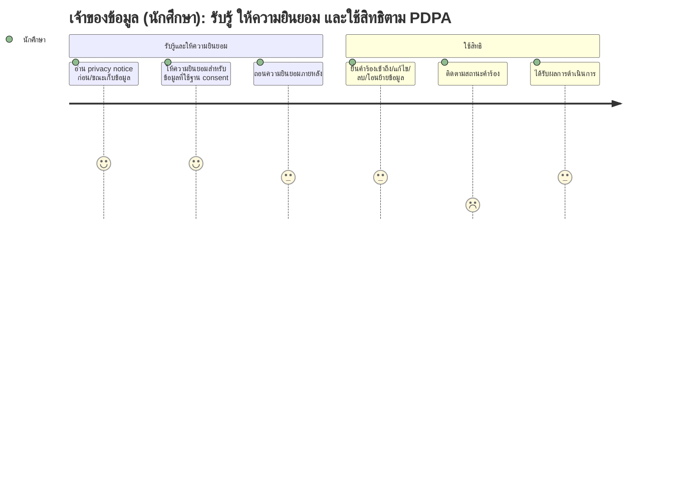

# User Journey: เจ้าของข้อมูลส่วนบุคคล (นักศึกษา) — รับรู้ ให้ความยินยอม และใช้สิทธิตาม PDPA

**สร้างจาก:** [[../../01-requirements/01-spec/20260825-03-logging-pdpa-compliance|การเก็บ Log กิจกรรมและการปฏิบัติตาม PDPA]]
**เกี่ยวข้องกับ:** [[./20261007-01-features-list-logging-pdpa-compliance|Features List]]

## Persona
นักศึกษา (หรือบุคลากร) ที่เป็นเจ้าของข้อมูลส่วนบุคคลในระบบ ต้องการรู้ว่าข้อมูลถูกใช้ทำอะไร และควบคุมข้อมูลของตนได้

## เป้าหมาย (Goal)
รับรู้วัตถุประสงค์การเก็บข้อมูล ให้หรือถอน consent ตามความสมัครใจ และร้องขอเข้าถึง/แก้ไข/ลบ/โอนย้ายข้อมูลของตนเองได้

## แผนภาพ Journey

คะแนนในแต่ละขั้นตอนสื่อถึง **ความมั่นใจตามความชัดเจนของ spec** (สูง = spec ระบุตรงๆ, ต่ำ = อนุมานเอง) ไม่ใช่ความพึงพอใจของผู้ใช้

## คำอธิบายแต่ละขั้นตอน

| ขั้นตอน | Touchpoint | Pain Point / Emotion | ฟีเจอร์ที่เกี่ยวข้อง |
|---|---|---|---|
| อ่าน privacy notice ก่อน/ขณะเก็บข้อมูล | หน้า/ป๊อปอัป privacy notice | BR ระบุให้แจ้งชัด แต่ตำแหน่งและความถี่ที่แสดงไม่ระบุ _(สมมติฐาน: แสดงตอนเข้าใช้ฟีเจอร์ที่เก็บข้อมูล)_ | แถว 12, 13 |
| ให้ความยินยอมสำหรับข้อมูลที่ใช้ฐาน consent | ปุ่ม/ช่องติ๊ก consent (เช่น ก่อนเข้าห้องแชท) | มั่นใจสูง — BR แยกฐานทางกฎหมายชัด ข้อมูลที่ไม่จำเป็นโดยตรงใช้ consent | แถว 12, 14 |
| ถอนความยินยอมภายหลัง | หน้าจัดการ consent | สิทธิถอน consent ระบุตรงๆ แต่ผลต่อบริการที่ใช้ consent นั้นไม่ระบุ _(สมมติฐาน: ออกจากห้องแชท/หยุดใช้ฟีเจอร์ที่ใช้ consent)_ | แถว 14 |
| ยื่นคำร้องเข้าถึง/แก้ไข/ลบ/โอนย้ายข้อมูล | หน้าส่งคำร้องใช้สิทธิ | **อนุมาน** — spec ระบุสิทธิชัดแต่ไม่ระบุช่องทางยื่น _(สมมติฐาน: ฟอร์มในระบบ)_ | แถว 15 |
| ติดตามสถานะคำร้อง | หน้าสถานะคำร้อง | **อนุมาน/คะแนนต่ำ** — spec ไม่ระบุ SLA หรือการแจ้งสถานะ | แถว 22 _(สมมติฐาน)_ |
| ได้รับผลการดำเนินการ | อีเมล/การแจ้งเตือนในระบบ | ผลการดำเนินการถูก log ตาม spec แต่ช่องทางแจ้งกลับผู้ใช้ไม่ระบุ _(สมมติฐาน: แจ้งในระบบ)_ | แถว 6, 15, 16 |

## Edge Cases / ทางเลือกอื่น
- ขอลบข้อมูลที่ต้องเก็บตามระเบียบ (เช่น ทรานสคริปต์) — ปฏิเสธส่วนนั้นพร้อมแจ้งเหตุผล
- ถอน consent แล้วข้อความที่เคยโพสต์ในห้องแชทถูกจัดการอย่างไร — spec ยังไม่ระบุ
- ข้อมูลของตนถูกอ้างถึงในแชทของผู้อื่น — อยู่ภายใต้หลักการ PDPA เดียวกัน (แถว 21)
- พ้นสถานภาพนักศึกษาเกิน 5 ปี — ข้อมูลถูกลบหรือ anonymize (แถว 17)

---
ย้อนกลับ: [[index|01-prototypes]]
