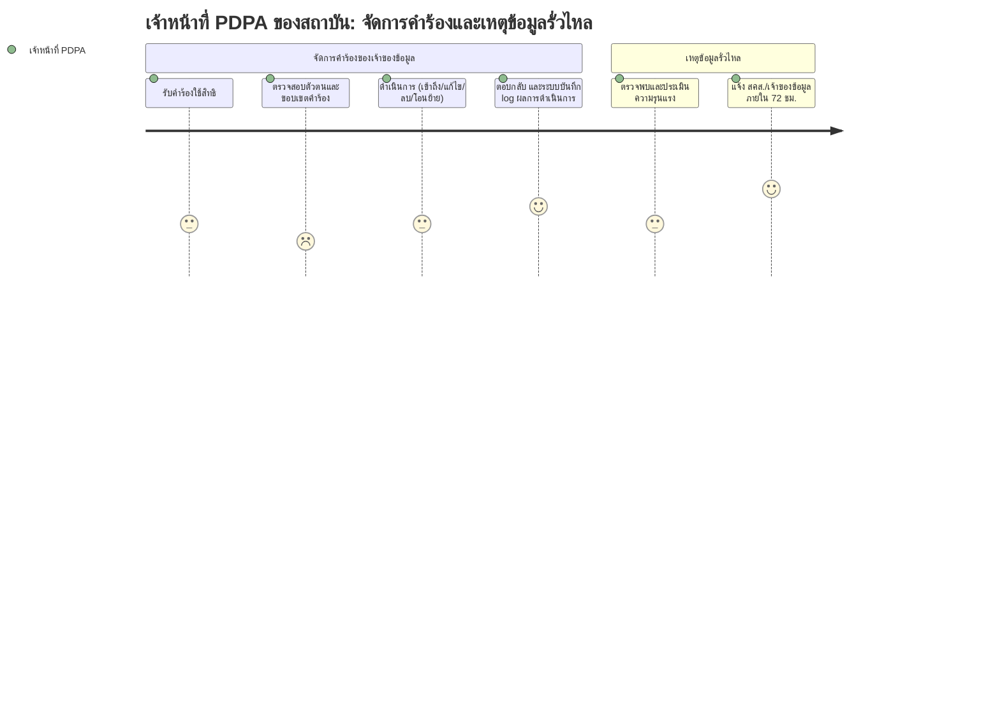

# User Journey: เจ้าหน้าที่คุ้มครองข้อมูลของสถาบัน (Data Controller) — จัดการคำร้องและเหตุข้อมูลรั่วไหล

**สร้างจาก:** [[../../01-requirements/01-spec/20260825-03-logging-pdpa-compliance|การเก็บ Log กิจกรรมและการปฏิบัติตาม PDPA]]
**เกี่ยวข้องกับ:** [[./20261007-01-features-list-logging-pdpa-compliance|Features List]]

## Persona
ผู้แทนสถาบันการศึกษาในฐาน Data Controller (เช่น เจ้าหน้าที่ PDPA) ที่รับผิดชอบคำร้องของเจ้าของข้อมูลและการแจ้งเหตุข้อมูลรั่วไหล โดยทีม Grade Runway ทำหน้าที่ Data Processor

## เป้าหมาย (Goal)
ดำเนินการตามคำร้องของเจ้าของข้อมูลได้ครบถ้วน และแจ้งเหตุข้อมูลรั่วไหลภายใน 72 ชั่วโมง เพื่อให้สอดคล้อง PDPA

## แผนภาพ Journey

คะแนนในแต่ละขั้นตอนสื่อถึง **ความมั่นใจตามความชัดเจนของ spec** (สูง = spec ระบุตรงๆ, ต่ำ = อนุมานเอง) ไม่ใช่ความพึงพอใจของผู้ใช้

## คำอธิบายแต่ละขั้นตอน

| ขั้นตอน | Touchpoint | Pain Point / Emotion | ฟีเจอร์ที่เกี่ยวข้อง |
|---|---|---|---|
| รับคำร้องใช้สิทธิ | หน้าคิวคำร้อง | US4 ระบุให้มีกระบวนการรองรับ แต่รูปแบบคิวไม่ระบุ _(สมมติฐาน: มีคิวคำร้องในระบบ)_ | แถว 15, 16 |
| ตรวจสอบตัวตนและขอบเขตคำร้อง | หน้ารายละเอียดคำร้อง | **อนุมาน/คะแนนต่ำ** — spec ไม่ระบุวิธียืนยันตัวตนผู้ร้อง | แถว 16 _(สมมติฐาน)_ |
| ดำเนินการ (เข้าถึง/แก้ไข/ลบ/โอนย้าย) | ฟังก์ชันจัดการข้อมูลของเจ้าของข้อมูล | สิทธิต่างๆ ระบุชัด แต่เงื่อนไขชนกับระเบียบเก็บถาวรไม่ระบุ _(สมมติฐาน: ปฏิเสธส่วนที่ต้องเก็บถาวรพร้อมเหตุผล)_ | แถว 15, 17 |
| ตอบกลับ และระบบบันทึก log ผลการดำเนินการ | การแจ้งผลกลับ + log | มั่นใจสูง — BR ระบุให้ log คำร้องและผลดำเนินการ ส่วนช่องทางตอบกลับ/SLA ไม่ระบุ | แถว 6 |
| ตรวจพบและประเมินความรุนแรง | กระบวนการภายในของสถาบัน | spec ระบุแค่ระดับนโยบาย ไม่รวมระบบแจ้งเตือนอัตโนมัติ _(สมมติฐาน: ประเมินด้วยเกณฑ์ภายในของสถาบัน)_ | แถว 19, 23 |
| แจ้ง สคส./เจ้าของข้อมูลภายใน 72 ชม. | ช่องทางแจ้งเหตุตามนโยบาย | มั่นใจสูง — BR ระบุกรอบ 72 ชม. ตรงๆ ส่วนช่องทางจริงไม่ระบุ | แถว 19 |

## Edge Cases / ทางเลือกอื่น
- คำร้องขอลบข้อมูลที่ต้องเก็บถาวรตามระเบียบทะเบียน
- เหตุรั่วไหลที่ประเมินแล้วไม่เข้าเกณฑ์ต้องแจ้ง — spec ไม่ระบุเกณฑ์ตัดสิน
- ได้รับคำร้องจำนวนมากพร้อมกัน — ไม่มี SLA ระบุ
- ทีม Processor พบเหตุก่อนสถาบัน — ต้องส่งต่อให้ Controller ทันทีเพื่อนับ 72 ชม. _(สมมติฐาน)_

---
ย้อนกลับ: [[index|01-prototypes]]
