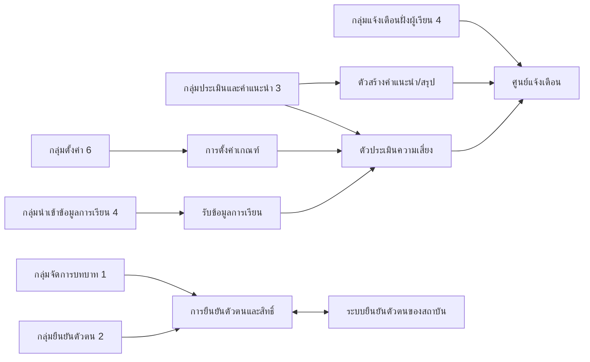
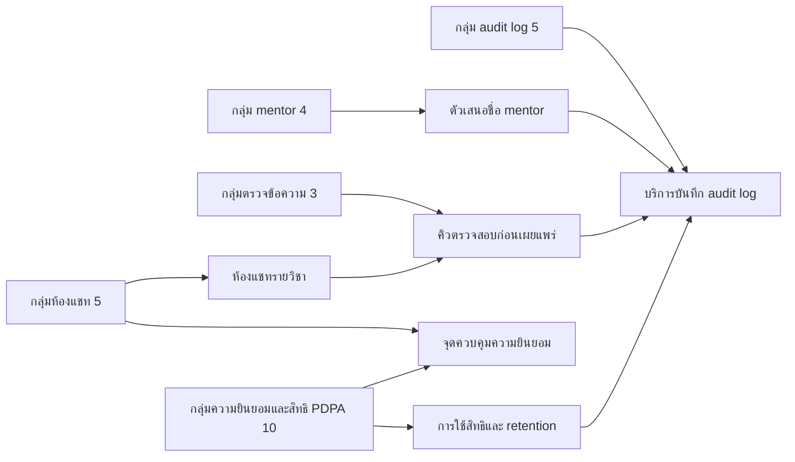
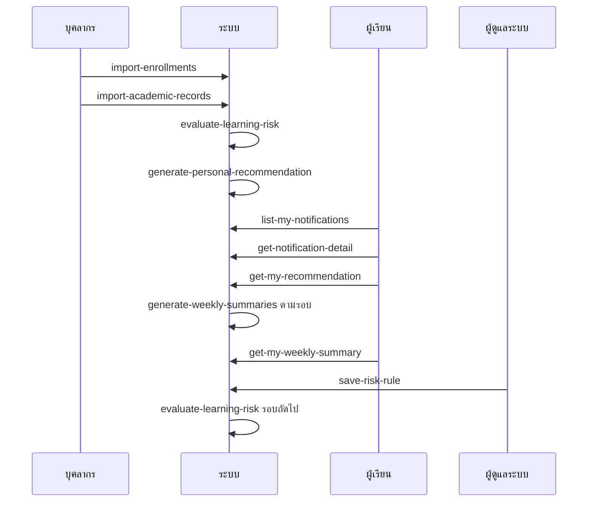
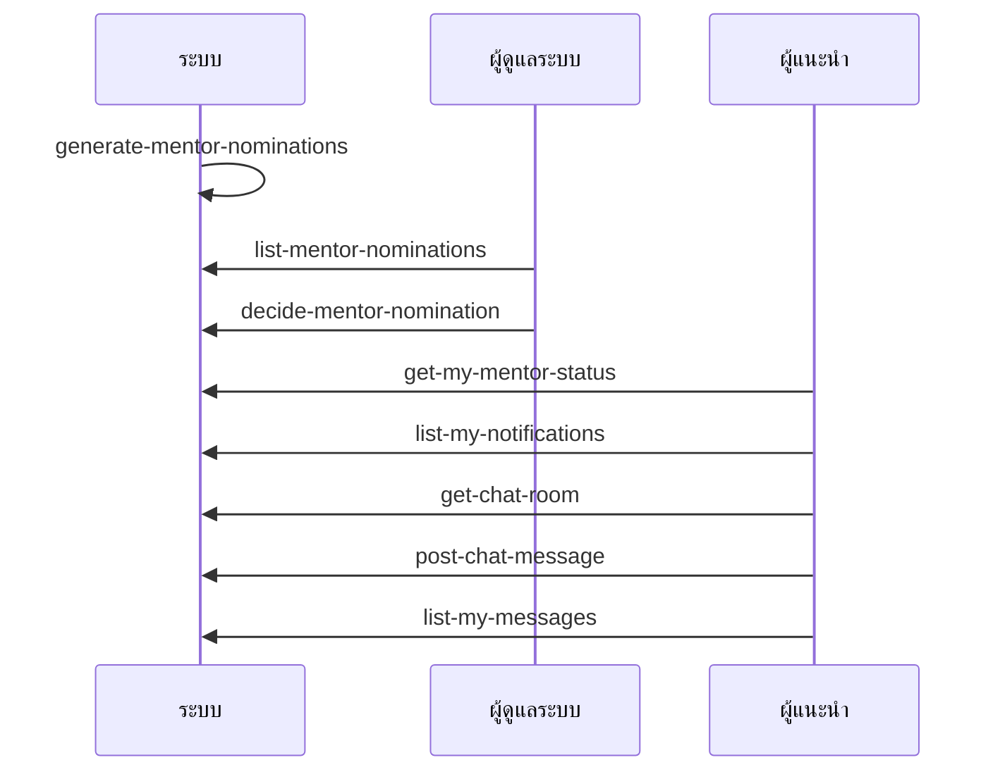
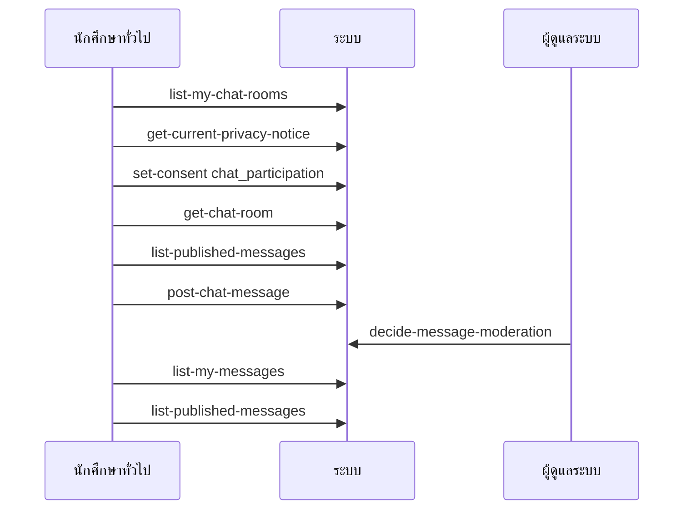
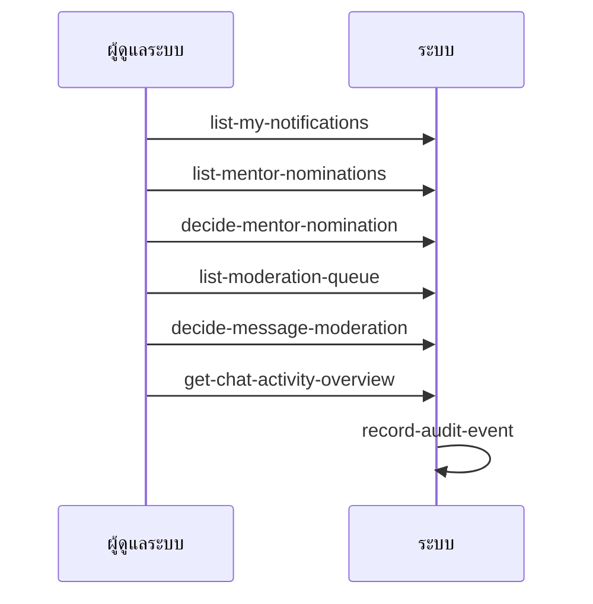
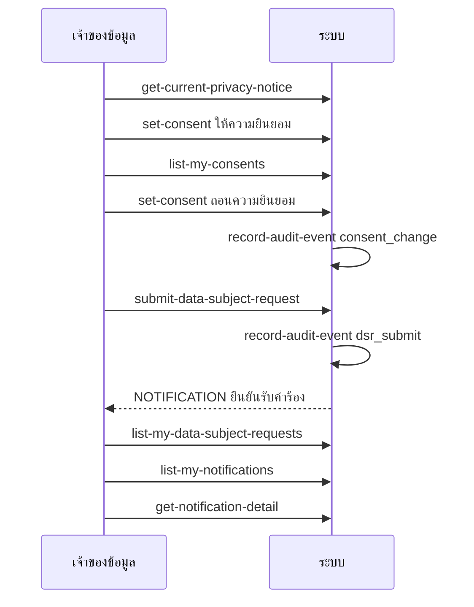
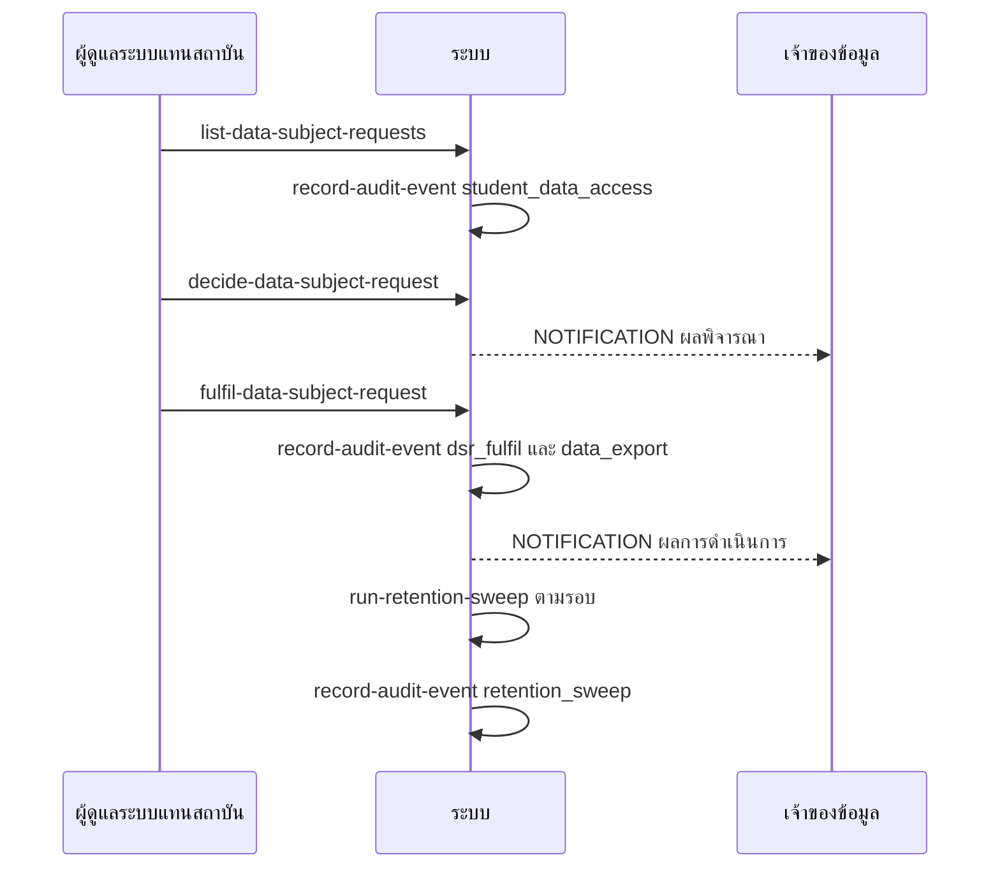
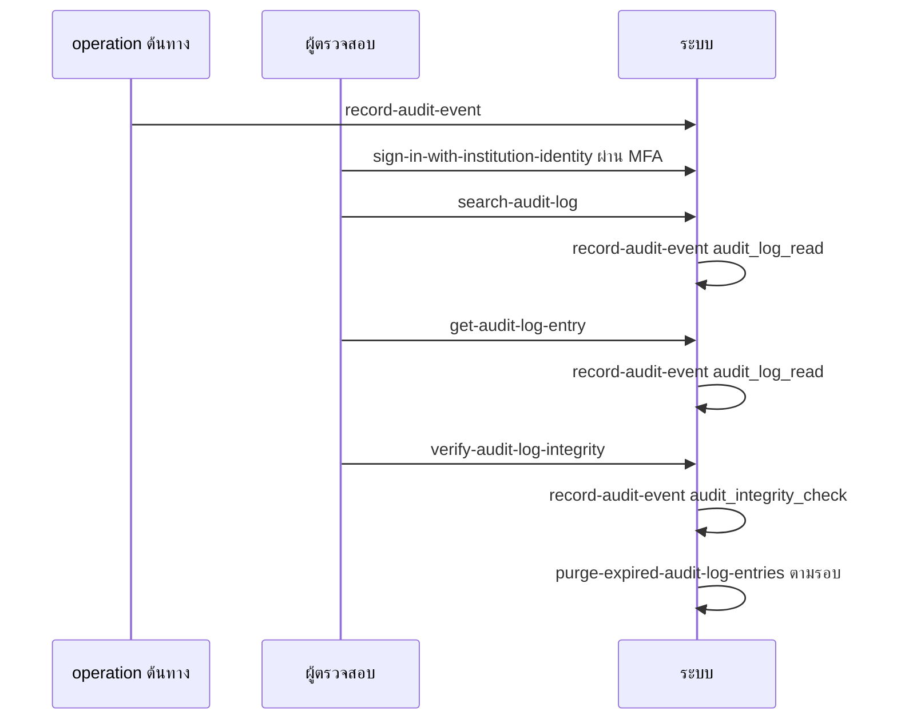
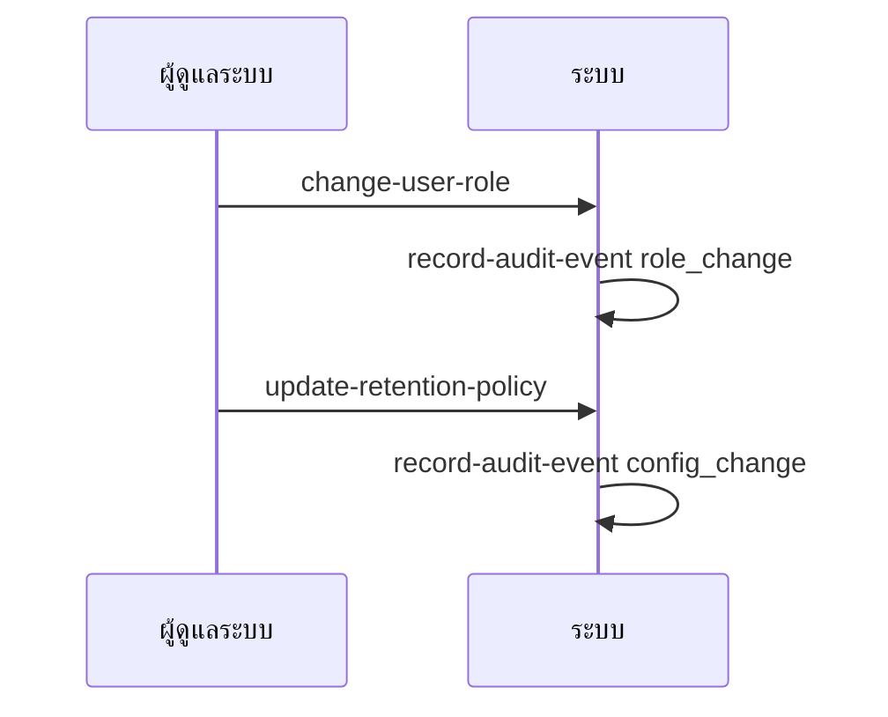

# API Spec (Conceptual)

**อัปเดตล่าสุด:** 2026-10-08
**สถานะ:** Draft
**ขอบเขตของเอกสาร:** conceptual — ยังไม่ระบุ technical stack (ไม่ระบุ HTTP method/path/รูปแบบ payload)
**ต่อยอดจาก:** [[high-level-architecture|High Level Architecture]] และ [[database-spec|Database Spec]]

## 1. วัตถุประสงค์และขอบเขต

เอกสารนี้นิยามความสามารถ (operation) เชิงแนวคิดของ Grade Runway ที่ตามรอยกลับ feature, user story, user journey และ acceptance criteria ได้ และอ่าน/เขียนเฉพาะตารางใน [[database-spec|Database Spec]] รหัสอ้างอิงที่ใช้ (นิยามเต็มดูหัวข้อ 1 ของ [[database-spec|Database Spec]]):

- spec: [[../../01-requirements/01-spec/20260825-01-personalized-learning-reminder|spec 01]] (R-US/R-BR), [[../../01-requirements/01-spec/20260825-02-high-grade-peer-review-chat|spec 02]] (C-US/C-BR), [[../../01-requirements/01-spec/20260825-03-logging-pdpa-compliance|spec 03]] (P-US1..5 = US1..US5 ตามลำดับใน spec / P-BR)
- features: F-R# ([[../01-prototypes/20260827-01-features-list-personalized-learning-reminder|list 01]]), F-C# ([[../01-prototypes/20260827-03-features-list-high-grade-peer-review-chat|list 02]]), F-P# ([[../01-prototypes/20261007-01-features-list-logging-pdpa-compliance|list 03]])
- journey: [[../01-prototypes/20260827-02-user-journey-student-personalized-learning-reminder|J-R]], [[../01-prototypes/20260827-04-user-journey-mentor-high-grade-peer-review-chat|J-Mentor]], [[../01-prototypes/20260827-05-user-journey-mentee-high-grade-peer-review-chat|J-Mentee]], [[../01-prototypes/20260827-06-user-journey-admin-high-grade-peer-review-chat|J-Admin]], [[../01-prototypes/20261007-02-user-journey-auditor-logging-pdpa-compliance|J-Auditor]], [[../01-prototypes/20261007-03-user-journey-data-subject-logging-pdpa-compliance|J-Subject]], [[../01-prototypes/20261007-04-user-journey-data-controller-logging-pdpa-compliance|J-Officer]]
- AC: AC-R# ([[../../03-testing/01-test-plan/20260907-01-acceptance-criteria-personalized-learning-reminder|AC spec 01]]), AC-C# ([[../../03-testing/01-test-plan/20260912-01-acceptance-criteria-high-grade-peer-review-chat|AC spec 02]]), AC-P# = AC-1..AC-21 ([[../../03-testing/01-test-plan/20261007-01-acceptance-criteria-logging-pdpa-compliance|AC spec 03]]); กรณีขอบอ้าง TS-# จาก [[../../03-testing/01-test-plan/index|test plan]] และ TC-P# = TC-01..TC-50 ของ [[../../03-testing/01-test-plan/20261007-02-test-plan-logging-pdpa-compliance|Test Plan 03]]
- Q# หมายถึงการตัดสินใจที่ยืนยันแล้วในหัวข้อ 10

มี 47 operation ใน 11 กลุ่ม (operation เชิงระบบ/งานตามเวลาระบุ business rule รองรับ)

อยู่นอกขอบเขต: ช่องทางแจ้งเตือนนอก in-app, การเชื่อมระบบทะเบียน/เกรดภายนอก, การให้คะแนน mentor, ห้องข้ามวิชา, รายงานเนื้อหาหลังโพสต์ (F-R8-10, F-C13-16 Won't have), ระบบแจ้งเหตุข้อมูลรั่วไหลอัตโนมัติและการบันทึกเหตุรั่วไหล (F-P19, F-P23 — กระบวนการระดับสถาบัน นอกระบบ ตาม Q13), การเลือกเครื่องมือ logging, ร่างเอกสารกฎหมาย, GDPR (F-P24-26 Won't have)

## 2. หลักการร่วมของ API (เชิงแนวคิด)

- **การยืนยันตัวตนและบทบาท:** ทุก operation (ยกเว้น `sign-in-with-institution-identity`) ต้องมีตัวตนที่ยืนยันแล้วจากระบบยืนยันตัวตนของสถาบัน บทบาทมี `student`, `admin`, `auditor`, `data_staff`; "mentor" ไม่ใช่บทบาท แต่เป็นสิทธิ์ต่อวิชาที่คำนวณจาก grant ในภาคปัจจุบัน; ไม่มีบทบาทอาจารย์ (Q14) กฎที่อ้าง "ผู้ที่ไม่ใช่เจ้าของข้อมูล" จึงไม่ผูกบทบาท; หลัก least privilege (F-P18, AC-P17); MFA บัญชีแอดมิน/ผู้ตรวจสอบเป็นข้อกำหนดจาก spec 03 (จุดที่ทำยังไม่ตัดสิน)
- **Actor ในตาราง:** ผู้เรียน = student (รวม mentor), แอดมิน = admin (รวมหน้าที่เจ้าหน้าที่ PDPA ตาม Q6), ผู้ตรวจสอบ = auditor, บุคลากร = data_staff, ระบบ = ตัวทำงานภายใน (ทริกเกอร์เหตุการณ์/ตามเวลา; actor ใน audit = `system`)
- **สิทธิ์เข้าห้องแชท:** ต้อง (1) ลงทะเบียนวิชานั้นสถานะ enrolled ในภาคปัจจุบัน และ (2) มี consent `chat_participation` เป็นจริงจึงอ่าน/โพสต์ได้; การปฏิเสธต้องแจ้งสาเหตุที่ชัดเจน (AC-C3)
- **ข้อผิดพลาดเชิงธุรกิจ (ตัวระบุเชิงแนวคิด):**

| รหัส | ความหมาย |
|---|---|
| NOT_AUTHENTICATED | ยังไม่ยืนยันตัวตนหรือการยืนยันล้มเหลว |
| FORBIDDEN_ROLE | บทบาทไม่มีสิทธิ์ใช้ operation นี้ |
| NOT_ENROLLED_CURRENT_TERM | ไม่ได้ลงทะเบียนวิชานั้นในภาคปัจจุบัน |
| CONSENT_REQUIRED | ต้องให้ consent ที่เกี่ยวข้องก่อน |
| VALIDATION_FAILED | ข้อมูลนำเข้าไม่ถูกต้อง (ติดลบ ไม่ใช่ตัวเลข ว่าง ฯลฯ) พร้อมรายละเอียดรายช่อง |
| NOT_FOUND | ไม่พบข้อมูลหรือไม่ใช่ของผู้เรียก |
| CONFLICT_STATE | สถานะปัจจุบันไม่อนุญาตการกระทำ (เช่น ตัดสินแล้ว) |
| AUDIT_UNAVAILABLE | บริการ audit log ใช้งานไม่ได้ จึงปฏิเสธการกระทำสำคัญ (ตามการตัดสินใจ Q5) |

- **การบันทึก audit:** operation ที่ระบุผลข้างเคียง "audit" ต้องเรียก `record-audit-event`; เหตุการณ์ที่ต้องบันทึกตาม spec 03 (F-P1..F-P6): sign in/out/ล้มเหลว, สร้าง/แก้/ลบเกรด (ค่าก่อน-หลัง), ผู้ที่ไม่ใช่เจ้าของข้อมูลเข้าถึงข้อมูลนักศึกษา, เปลี่ยนสิทธิ์/บทบาท (approve/reject mentor, change-user-role), export, คำร้อง PDPA และผล; เพิ่มโดยสมมติฐาน: เปลี่ยนค่าเกณฑ์/นโยบาย/ภาคปัจจุบัน, นำเข้าข้อมูล, ผลการตรวจข้อความ, เผยแพร่ notice, purge, การเข้าถึงเนื้อหาแชท, การอ่านและตรวจความสมบูรณ์ของ log
- **การบันทึกความล้มเหลว:** การปฏิเสธเพราะสิทธิ์หรือ validation ของ operation ที่ต้อง audit (แก้เกรด, เปลี่ยนบทบาท/สิทธิ์, ส่งออกข้อมูล, อ่าน audit log, คิวคำร้อง) ต้องบันทึก audit `result = failure` พร้อมเหตุผล (AC-P2, AC-P5, AC-P9) และข้อมูลเดิมไม่เปลี่ยน
- **รูปแบบรายการ audit:** ทุกรายการมี actor (ไม่ว่าง: ผู้ใช้ / `system` / ตัวอ้างอิงที่ใช้พยายามหรือ `unknown`), action, เวลา, เป้าหมาย, ผลลัพธ์ (AC-P7)
- **ความไม่เปลี่ยนแปลงของ audit log:** ไม่มี operation แก้/ลบ audit log ยกเว้น purge ตามอายุโดยระบบ; คำขอแก้/ลบที่มาถึงบริการ audit ถูกปฏิเสธและบันทึก `audit_tamper_attempt` (Q12); ผู้ตรวจสอบตรวจความสมบูรณ์ด้วย `verify-audit-log-integrity` (AC-P8)
- **เมื่อ audit log ใช้งานไม่ได้ (การตัดสินใจ Q5):** แบ่งระดับ — กลุ่ม "สำคัญ" (แก้เกรด, เปลี่ยนสิทธิ์/บทบาท, แอดมินดูข้อมูลนักศึกษาใน nomination, ผลคำร้อง PDPA, ส่งออกข้อมูล, อ่าน audit log) ปฏิเสธด้วย AUDIT_UNAVAILABLE; กลุ่มอื่น (รวม `chat_content_access` และ `student_data_access` จากคิวคำร้อง _(สมมติฐาน)_) ทำต่อและส่ง log ซ้ำภายหลัง
- **การแบ่งหน้า:** operation ประเภทดึงรายการรองรับการแบ่งหน้าและตัวกรองตามที่ระบุ; รายการข้อความเรียงเก่า→ใหม่ (AC-C5), รายการอื่นเรียงใหม่→เก่า; ผลไม่พบข้อมูลคืนผลว่างพร้อมสถานะ ไม่ใช่ข้อผิดพลาด
- **ความเป็นส่วนตัว:** ผู้เรียนเห็นเฉพาะข้อมูลของตน; ข้อความที่ยังไม่เผยแพร่เห็นเฉพาะผู้ส่งและแอดมิน; ผลการเรียนที่แสดงให้แอดมิน (ในคิว nomination) ต้องบันทึก audit การเข้าถึง; การเปิดข้อมูลของตนเองไม่ถือเป็นการเข้าถึงข้อมูลของผู้อื่น (AC-P3)
- **การเรียกซ้ำ/ไม่ซ้ำ:** operation นำเข้าและงานตามเวลาต้องทำซ้ำได้ปลอดภัย (upsert ตามคีย์ธรรมชาติ, การแจ้งเตือนกันซ้ำด้วย fingerprint/dedupe_key)
- **ช่องทางแจ้งเตือน:** in-app เท่านั้น (ตรรกะตัดสินใจแยกจากช่องทางส่งออกตาม architecture)

## 3. ภาพรวมกลุ่ม API

### 3.1 กลุ่มฝั่งการเรียนและการตั้งค่า

### 3.2 กลุ่มฝั่งแชทและการกำกับ

### 3.3 สรุป operation

| # | Operation | กลุ่ม | ประเภท | Actor | Feature | User story |
|---|---|---|---|---|---|---|
| 1 | sign-in-with-institution-identity | ยืนยันตัวตน | สั่งงาน | ทุกบทบาท | F-P1, F-P18 | P-US1 |
| 2 | sign-out | ยืนยันตัวตน | สั่งงาน | ทุกบทบาท | F-P1 | P-US1 |
| 3 | import-enrollments | นำเข้า | สร้าง/แก้ไข | data_staff | F-R1, F-C1, F-C2 | R-US1, C-US1, C-US2 |
| 4 | import-academic-records | นำเข้า | สร้าง/แก้ไข | data_staff | F-R1, F-P2 | R-US1, R-US2, P-US1 |
| 5 | correct-academic-record | นำเข้า | แก้ไข | data_staff | F-R1, F-P2, F-P3 | R-US1, P-US1 |
| 6 | set-current-term | นำเข้า | แก้ไข | admin | F-C2 | C-BR3 |
| 7 | evaluate-learning-risk | ประเมิน | งานตามเวลา | ระบบ | F-R2, F-R3 | R-US1 |
| 8 | generate-personal-recommendation | ประเมิน | งานตามเวลา | ระบบ | F-R4 | R-US2 |
| 9 | generate-weekly-summaries | ประเมิน | งานตามเวลา | ระบบ | F-R5 | R-US3 |
| 10 | list-my-notifications | แจ้งเตือน | ดึงข้อมูล | ทุกบทบาทที่เป็นผู้รับ | F-R3, F-C10, F-C11 | R-US1 |
| 11 | get-notification-detail | แจ้งเตือน | ดึงข้อมูล | ผู้รับ | F-R3 | R-US1 |
| 12 | get-my-recommendation | แจ้งเตือน | ดึงข้อมูล | student | F-R4 | R-US2 |
| 13 | get-my-weekly-summary | แจ้งเตือน | ดึงข้อมูล | student | F-R5 | R-US3 |
| 14 | list-risk-rules | ตั้งค่า | ดึงข้อมูล | admin | F-R6 | R-US4 |
| 15 | save-risk-rule | ตั้งค่า | สร้าง/แก้ไข | admin | F-R2, F-R6 | R-US4 |
| 16 | list-mentor-criteria | ตั้งค่า | ดึงข้อมูล | admin | F-C4 | C-BR1 |
| 17 | save-mentor-criteria | ตั้งค่า | สร้าง/แก้ไข | admin | F-C4 | C-BR1 |
| 18 | list-retention-policies | ตั้งค่า | ดึงข้อมูล | admin | F-P11, F-P17 | P-US1, P-US4 |
| 19 | update-retention-policy | ตั้งค่า | แก้ไข | admin | F-P11, F-P17 | P-US1, P-US4 |
| 20 | generate-mentor-nominations | mentor | งานตามเวลา | ระบบ | F-C3 | C-US3 |
| 21 | list-mentor-nominations | mentor | ดึงข้อมูล | admin | F-C5, F-P3 | C-US4, P-US1 |
| 22 | decide-mentor-nomination | mentor | สั่งงาน | admin | F-C5, F-C6, F-C10, F-P4 | C-US4, P-US1 |
| 23 | get-my-mentor-status | mentor | ดึงข้อมูล | student | F-C6, F-C10 | C-US1 |
| 24 | list-my-chat-rooms | ห้องแชท | ดึงข้อมูล | student | F-C1, F-C2 | C-US1, C-US2 |
| 25 | get-chat-room | ห้องแชท | ดึงข้อมูล | student | F-C2 | C-US2 |
| 26 | list-published-messages | ห้องแชท | ดึงข้อมูล | student | F-C8 | C-US2 |
| 27 | post-chat-message | ห้องแชท | สร้าง | student | F-C7, F-C8, F-C9 | C-US1, C-US2 |
| 28 | list-my-messages | ห้องแชท | ดึงข้อมูล | student | F-C10 | C-BR4 |
| 29 | list-moderation-queue | ตรวจข้อความ | ดึงข้อมูล | admin | F-C9, F-P21 | C-US5, P-US2, P-US4 |
| 30 | decide-message-moderation | ตรวจข้อความ | สั่งงาน | admin | F-C9, F-C10 | C-US5 |
| 31 | get-chat-activity-overview | ตรวจข้อความ | ดึงข้อมูล | admin | F-C12 | (อนุมานจาก F-C12) |
| 32 | get-current-privacy-notice | PDPA | ดึงข้อมูล | ทุกบทบาท | F-P12, F-P13 | P-US2 |
| 33 | publish-privacy-notice | PDPA | สร้าง | admin | F-P13 | P-US2 |
| 34 | set-consent | PDPA | สร้าง | ผู้เรียน | F-P12, F-P14 | P-US2 |
| 35 | list-my-consents | PDPA | ดึงข้อมูล | ผู้เรียน | F-P14 | P-US2 |
| 36 | submit-data-subject-request | PDPA | สร้าง | ผู้เรียน | F-P6, F-P15 | P-US3 |
| 37 | list-my-data-subject-requests | PDPA | ดึงข้อมูล | ผู้เรียน | F-P22 | P-US3 |
| 38 | list-data-subject-requests | PDPA | ดึงข้อมูล | admin | F-P16 | P-US4 |
| 39 | decide-data-subject-request | PDPA | สั่งงาน | admin | F-P6, F-P16 | P-US4 |
| 40 | fulfil-data-subject-request | PDPA | สั่งงาน | admin | F-P5, F-P6, F-P15, F-P16, F-P17, F-P21 | P-US3, P-US4 |
| 41 | run-retention-sweep | PDPA | งานตามเวลา | ระบบ | F-P17 | P-US2, P-US4 |
| 42 | record-audit-event | audit | สร้าง | ระบบ | F-P1..F-P8 | P-US1, P-US5 |
| 43 | search-audit-log | audit | ดึงข้อมูล | auditor | F-P9, F-P10 | P-US1, P-US5 |
| 44 | purge-expired-audit-log-entries | audit | งานตามเวลา | ระบบ | F-P11 | P-US1 |
| 45 | get-audit-log-entry | audit | ดึงข้อมูล | auditor | F-P9, F-P10 | P-US1, P-US5 |
| 46 | verify-audit-log-integrity | audit | ดึงข้อมูล | auditor | F-P8 | P-US5 |
| 47 | change-user-role | จัดการบทบาท | แก้ไข | admin | F-P4, F-P18 | P-US1 |

## 4. รายละเอียด Operation

รูปแบบ: ตาราง Input/Output ใช้ชนิดเชิงแนวคิด; "จำเป็น?" = ใช่/ไม่; "audit" = เรียก `record-audit-event`; ตารางที่อ้างคือตารางใน [[database-spec|Database Spec]]

### กลุ่ม 4.A: ยืนยันตัวตน

### 4.1 sign-in-with-institution-identity: เข้าสู่ระบบด้วยตัวตนของสถาบัน
- **วัตถุประสงค์:** รับผลยืนยันตัวตนจากระบบของสถาบัน ผูกกับ USER กำหนดบทบาท และบันทึกทั้งความสำเร็จและความล้มเหลว
- **อ้างอิง:** F-P1, F-P18; P-US1; architecture Q6; J-Auditor ขั้น "ยืนยันตัวตน (MFA) และเข้าหน้า log"; ทุก journey ขั้นแรก; AC-P1, AC-P17; TC-P1, TC-P2, TC-P3, TC-P41
- **Actor/ประเภท:** ทุกบทบาท / สั่งงาน
- Input

| ชื่อ | ชนิด | จำเป็น? | กฎ |
|---|---|---|---|
| ผลยืนยันตัวตนจากสถาบัน | โครงสร้างซ้อน | ใช่ | ประกอบด้วย ผลการยืนยัน (สำเร็จ/ไม่สำเร็จ), ตัวอ้างอิงที่ใช้พยายาม (identity_ref), สถานภาพ, ผล MFA ถ้ายืนยันที่ Grade Runway |

- Output: บทบาท, รายวิชาที่ผู้ใช้เป็น mentor ในภาคปัจจุบัน, รายการ consent ที่ยังไม่ได้ให้ (เฉพาะวัตถุประสงค์ที่ฐานกฎหมายเป็น consent)
- **เงื่อนไข:** ผลไม่สำเร็จ (รวมกรณีไม่มีบัญชีในระบบ) → ไม่เปิดเซสชัน และต้องบันทึก audit `sign_in_failed` ห้ามข้ามการบันทึก (AC-P1); บัญชี admin/auditor ต้องผ่าน MFA จึงเข้าได้ (AC-P17) _(จุดที่ทำ MFA ยังไม่ตัดสิน)_; สถานภาพ `ended` ยังเข้าได้เฉพาะสิทธิ์ที่ business rule อนุญาต _(สมมติฐาน: ผู้พ้นสถานภาพเข้าใช้ไม่ได้ ยกเว้นยื่นคำร้องสิทธิ)_; ถ้าระบบสถาบันบล็อกก่อนส่งผลมาถึง Grade Runway ระบบนี้ไม่มีข้อมูลให้บันทึก
- **ข้อผิดพลาด:** NOT_AUTHENTICATED (ผลยืนยันไม่ผ่าน/ระบบสถาบันล่ม)
- **อ่าน/เขียน:** USER (อ่าน/เขียน `last_sign_in_at`, ผูก identity_ref), USER_CATEGORY, PRIVACY_NOTICE, CONSENT_RECORD, MENTOR_GRANT, MENTOR_NOMINATION, TERM (อ่าน)
- **ผลข้างเคียง:** audit `sign_in` (result success) หรือ `sign_in_failed` (result failure พร้อมเหตุผล; actor = ตัวอ้างอิงที่ใช้พยายามหรือ `unknown`)

### 4.2 sign-out: ออกจากระบบ
- **วัตถุประสงค์:** ปิดเซสชันและบันทึกเหตุการณ์
- **อ้างอิง:** F-P1; P-US1; AC-P1; TC-P1
- **Actor/ประเภท:** ทุกบทบาท / สั่งงาน
- Input/Output: ไม่มี
- **อ่าน/เขียน:** ไม่มี (เขียน audit)
- **ผลข้างเคียง:** audit `sign_out`

### กลุ่ม 4.B: นำเข้าข้อมูลการเรียน

### 4.3 import-enrollments: นำเข้าวิชา ภาค และการลงทะเบียน
- **วัตถุประสงค์:** รับรายวิชา ภาค (รวมวันเริ่ม/สิ้นสุด) การลงทะเบียน (และสถานภาพผู้เรียน) จากบุคลากร สร้างห้องแชทของวิชาใหม่อัตโนมัติ
- **อ้างอิง:** F-R1, F-C1, F-C2; R-US1, C-US1, C-US2; J-R ขั้น "เข้าเรียนและส่งงาน", J-Mentee ขั้น "เข้าห้องแชท"; AC-C3; ตามการตัดสินใจ Q8, Q15
- **Actor/ประเภท:** data_staff / สร้าง/แก้ไข (ทำซ้ำได้ แบบ upsert; รับหลายรายการต่อครั้ง ผลเป็นรายแถว)
- Input

| ชื่อ | ชนิด | จำเป็น? | กฎ |
|---|---|---|---|
| รายการลงทะเบียน | รายการของโครงสร้างซ้อน | ใช่ | แต่ละแถว: identity_ref, รหัสวิชา+ชื่อ, ข้อมูลภาค, สถานะ enrolled/dropped |
| ข้อมูลภาค (ต่อแถว) | โครงสร้างซ้อน | ใช่ | รหัสภาค; วันเริ่มและวันสิ้นสุดจำเป็นเมื่อภาคนั้นยังไม่มีในระบบ (สิ้นสุด ≥ เริ่ม) |
| สถานภาพผู้เรียน | ค่าจากรายการ | ไม่ | active/ended พร้อมวันที่พ้นสถานภาพ |
| ชุดนำเข้า | ข้อความ | ไม่ | อ้างอิงชุด |

- Output: จำนวนสำเร็จ/ล้มเหลวและเหตุผลรายแถว
- **เงื่อนไข:** ผู้ใช้ที่ไม่เคยพบถูกสร้างเป็น shell (role student); วิชาใหม่ได้ CHAT_ROOM 1 ห้อง; **ภาคที่ยังไม่มี → สร้าง TERM พร้อมวันเริ่ม/สิ้นสุด โดย `is_current` = เท็จ (แอดมินสลับด้วย set-current-term); ภาคที่มีอยู่แล้วและวันที่ที่ส่งมาต่างจากเดิม → ปฏิเสธรายแถว (VALIDATION_FAILED) ไม่แก้ทับ (Q15)**; หลังนำเข้าสำเร็จ ระบบเรียก evaluate-learning-risk และ generate-mentor-nominations สำหรับผู้ที่ข้อมูลเปลี่ยน
- **ข้อผิดพลาด:** FORBIDDEN_ROLE; VALIDATION_FAILED (รายแถว เช่น ภาคใหม่ไม่มีวันที่ หรือวันที่ขัดกับภาคเดิม)
- **อ่าน/เขียน:** USER (เขียน), USER_CATEGORY (อ่าน), COURSE (เขียน), TERM (อ่าน/เขียน), ENROLLMENT (เขียน), CHAT_ROOM (เขียน)
- **ผลข้างเคียง:** audit `data_import` (สรุปต่อชุด)

### 4.4 import-academic-records: นำเข้าผลการเรียน การเข้าเรียน การส่งงาน
- **วัตถุประสงค์:** รับเกรด/คะแนน/การเข้าเรียน/การส่งงาน/GPA สะสมเข้าสู่ ACADEMIC_RECORD
- **อ้างอิง:** F-R1, F-P2; R-US1, R-US2, R-BR1, P-US1; J-R ขั้น "เข้าเรียนและส่งงาน"; AC-R1, AC-R2, AC-P2; TS-01..TS-04, TC-P4, TC-P5
- **Actor/ประเภท:** data_staff / สร้าง/แก้ไข (หลายรายการต่อครั้ง, upsert ตามคีย์ธรรมชาติ ตาม Q8)
- Input

| ชื่อ | ชนิด | จำเป็น? | กฎ |
|---|---|---|---|
| รายการข้อมูลการเรียน | รายการของโครงสร้างซ้อน | ใช่ | identity_ref, รหัสวิชา (ว่างได้เฉพาะ GPA สะสม), รหัสภาค, ชนิด, ลำดับช่วงเวลา, ค่า, สถานะส่งงาน |
| ชุดนำเข้า | ข้อความ | ไม่ | |

- Output: จำนวนสร้าง/แก้ไข/ล้มเหลวพร้อมเหตุผลรายแถว
- **เงื่อนไข:** ค่าติดลบ/นอกช่วงถูกปฏิเสธรายแถว และค่าเดิมไม่เปลี่ยน; ผู้ใช้/วิชา/ภาคต้องมีอยู่แล้ว; แถวที่สร้างใหม่ audit `grade_create` (ก่อน = ว่าง); แถวที่ค่าเปลี่ยนจากเดิมต้อง audit `grade_update` ค่าก่อน-หลัง; **แถวที่พยายามแก้ค่าเดิมแต่ถูกปฏิเสธ audit `grade_update` result=failure พร้อมเหตุผล (AC-P2 ข้อ 2)**; **เมื่อ audit ใช้งานไม่ได้ ปฏิเสธเฉพาะแถวที่ค่าเปลี่ยนด้วย AUDIT_UNAVAILABLE รายแถว แถวอื่นทำต่อ (CD-1)**; ผูก retention_policy ตามชนิดข้อมูล; ผลสำเร็จทริกเกอร์ evaluate-learning-risk และ generate-mentor-nominations
- **ข้อผิดพลาด:** FORBIDDEN_ROLE; VALIDATION_FAILED; NOT_FOUND (ผู้ใช้/วิชา/ภาคที่ไม่รู้จัก); AUDIT_UNAVAILABLE (รายแถวที่ค่าเปลี่ยน)
- **อ่าน/เขียน:** USER, COURSE, TERM, ENROLLMENT, RETENTION_POLICY (อ่าน); ACADEMIC_RECORD (อ่าน/เขียน)
- **ผลข้างเคียง:** audit `grade_create`/`grade_update`; ทริกเกอร์การประเมิน

### 4.5 correct-academic-record: แก้ไขหรือยกเลิกข้อมูลการเรียนรายการเดียว
- **วัตถุประสงค์:** แก้ค่าหรือยกเลิก (void) แถวที่ผิด พร้อมตามรอยค่าก่อน-หลัง
- **อ้างอิง:** F-R1, F-P2, F-P3; P-US1 ("เกรดถูกแก้ไขโดยใคร เมื่อใด"); AC-P2, AC-P3; TC-P4, TC-P5, TC-P6; ตาม Q8
- **Actor/ประเภท:** data_staff / แก้ไข
- Input

| ชื่อ | ชนิด | จำเป็น? | กฎ |
|---|---|---|---|
| ตัวระบุข้อมูลการเรียน | ตัวระบุ (ID) | ใช่ | |
| การกระทำ | ค่าจากรายการ | ใช่ | `update, void` |
| ค่าใหม่ | ทศนิยม | เงื่อนไข | จำเป็นเมื่อ update |
| เหตุผล | ข้อความ | ใช่ | |

- Output: ข้อมูลหลังแก้ไข
- **เงื่อนไข:** ห้ามลบจริง (void เท่านั้น); ต้อง audit สำเร็จก่อนยืนยันการแก้ (กลุ่มสำคัญตาม Q5); รายการ audit ระบุผู้กระทำ เวลา นักศึกษาเจ้าของข้อมูล (ใน target) และค่าก่อน-หลัง (void: หลัง = ว่าง); การปฏิเสธ (VALIDATION_FAILED, FORBIDDEN_ROLE) บันทึก audit result=failure และเกรดเดิมไม่เปลี่ยน
- **ข้อผิดพลาด:** FORBIDDEN_ROLE; NOT_FOUND; VALIDATION_FAILED; AUDIT_UNAVAILABLE
- **อ่าน/เขียน:** ACADEMIC_RECORD (อ่าน/เขียน)
- **ผลข้างเคียง:** audit `grade_update`/`grade_delete` พร้อม before/after; ทริกเกอร์ evaluate-learning-risk

### 4.6 set-current-term: ตั้งภาคการศึกษาปัจจุบัน
- **วัตถุประสงค์:** กำหนดภาคปัจจุบัน (ใช้คุมสิทธิ์เข้าห้องแชทและการเสนอชื่อ)
- **อ้างอิง:** F-C2; C-BR3; AC-C3 (ตามการตัดสินใจ Q1)
- **Actor/ประเภท:** admin / แก้ไข
- Input

| ชื่อ | ชนิด | จำเป็น? | กฎ |
|---|---|---|---|
| ภาคที่ต้องการ | ตัวระบุ (ID) | ใช่ | ต้องมีอยู่แล้ว (ภาคใหม่สร้างผ่าน import-enrollments) |

- Output: ภาคปัจจุบันใหม่
- **เงื่อนไข:** มีภาคปัจจุบันได้ภาคเดียว; เปลี่ยนแล้ว MENTOR_GRANT ของภาคเก่าหมดอายุโดยอัตโนมัติ (Q3)
- **ข้อผิดพลาด:** FORBIDDEN_ROLE; NOT_FOUND
- **อ่าน/เขียน:** TERM (อ่าน/เขียน)
- **ผลข้างเคียง:** audit `config_change`

### กลุ่ม 4.C: ประเมินและคำแนะนำ (เชิงระบบ)

### 4.7 evaluate-learning-risk: ประเมินความเสี่ยงการเรียน
- **วัตถุประสงค์:** ประเมินเงื่อนไขหลายตัวแปร (เกรด ขาดเรียน ไม่ส่งงาน แนวโน้มลดลง) ตามเกณฑ์ปัจจุบัน สร้าง/แทนที่/ปิด ALERT แบบรวมและแจ้งผู้เรียน
- **อ้างอิง:** F-R2, F-R3; R-US1, R-BR1, R-BR2, R-BR4; J-R ขั้น "ตรวจพบความเสี่ยง" / "ได้รับการแจ้งเตือน"; AC-R1 (รวม edge หลายตัวแปร), TS-01..TS-06, TS-12; architecture Q3 (ประเมินทันที + ตามรอบ); ตามการตัดสินใจ Q2
- **Actor/ประเภท:** ระบบ / งานตามเวลา (ทริกเกอร์เมื่อข้อมูลการเรียนเปลี่ยน และรันตามรอบ)
- Input: ทริกเกอร์ (data_change หรือ scheduled) และขอบเขตผู้ใช้ที่เปลี่ยน
- Output: จำนวน ALERT ที่สร้าง/แทนที่/ปิด
- **เงื่อนไข:** ใช้เฉพาะ RISK_RULE ที่ active ของหมวดหมู่ผู้ใช้ (ไม่ hardcode); ถ้าข้อมูลย้อนหลังน้อยกว่า `min_history_periods` ไม่ประเมินเงื่อนไขแนวโน้ม; เงื่อนไขเกิดพร้อมกัน → ALERT เดียว มีหลาย ALERT_CONDITION พร้อม snapshot ค่าจริง/เกณฑ์; ถ้ามี ALERT open ที่ fingerprint เดียวกันอยู่แล้วต้องไม่สร้างซ้ำ (ประเมินทันทีกับตามรอบ); **fingerprint เปลี่ยนเป็นชุดไม่ว่าง → สร้าง ALERT และ NOTIFICATION ใหม่ (ฉบับเดิม superseded) ส่วนชุดเดิมไม่แจ้งซ้ำ (CD-4)**; ไม่เข้าเงื่อนไขใดเลย → ไม่แจ้งเตือนและปิด ALERT open (AC-R1/TS-05)
- **ข้อผิดพลาด:** ไม่มี (ความล้มเหลวบันทึกและลองใหม่ตามรอบถัดไป)
- **อ่าน/เขียน:** USER, ENROLLMENT, TERM, RISK_RULE, ACADEMIC_RECORD (อ่าน); ALERT (อ่าน/เขียน), ALERT_CONDITION, NOTIFICATION (เขียน)
- **ผลข้างเคียง:** เรียก generate-personal-recommendation; สร้าง NOTIFICATION `risk_alert`; ปล่อยเหตุการณ์ `learning-risk-detected`

### 4.8 generate-personal-recommendation: สร้างคำแนะนำเฉพาะบุคคล
- **วัตถุประสงค์:** คำนวณคำแนะนำจากข้อมูลย้อนหลังและตัวแปรเสี่ยงของผู้ใช้คนนั้น
- **อ้างอิง:** F-R4; R-US2, R-BR3; J-R ขั้น "เห็นคำแนะนำ"; AC-R2, TS-08, TS-09
- **Actor/ประเภท:** ระบบ / งานตามเวลา (เรียกจาก evaluate-learning-risk และรอบประเมินซ้ำ)
- Input: ผู้ใช้ และ ALERT ที่มาของคำแนะนำ
- Output: RECOMMENDATION ใหม่
- **เงื่อนไข:** ข้อมูลย้อนหลังต่ำกว่า `min_history_periods` → ไม่สร้างคำแนะนำ; เนื้อหาอ้างเฉพาะตัวแปรเสี่ยงของผู้ใช้นั้น ห้ามเป็นข้อความสำเร็จรูปเดียวกัน; ฉบับเดิมเป็น superseded
- **อ่าน/เขียน:** ACADEMIC_RECORD, RISK_RULE, ALERT, ALERT_CONDITION (อ่าน); RECOMMENDATION (อ่าน/เขียน)

### 4.9 generate-weekly-summaries: สร้างสรุปรายสัปดาห์
- **วัตถุประสงค์:** สรุปเกรด/การเข้าเรียน/การส่งงาน/แนวโน้มของสัปดาห์ เทียบสัปดาห์ก่อนหน้าอย่างน้อย 1 ตัวแปร
- **อ้างอิง:** F-R5; R-US3, R-BR4; J-R ขั้น "ดูสรุปรายสัปดาห์"; AC-R3, TS-10, TS-11
- **Actor/ประเภท:** ระบบ / งานตามเวลา
- Input: สัปดาห์เป้าหมาย (ค่าเริ่มต้นคือสัปดาห์ที่ผ่านมา)
- Output: จำนวนสรุปที่สร้าง
- **เงื่อนไข:** 1 สรุปต่อผู้ใช้ต่อสัปดาห์ (ทำซ้ำไม่สร้างซ้ำ); ผู้ใช้ `student` สถานภาพ active ที่ลงทะเบียนภาคปัจจุบัน; ถ้าไม่มีข้อมูลสัปดาห์ก่อนให้ละส่วนเปรียบเทียบ
- **อ่าน/เขียน:** USER, ENROLLMENT, TERM, ACADEMIC_RECORD, WEEKLY_SUMMARY (อ่าน); WEEKLY_SUMMARY, NOTIFICATION (เขียน)
- **ผลข้างเคียง:** NOTIFICATION `weekly_summary_ready`; เหตุการณ์ `weekly-summary-ready`

### กลุ่ม 4.D: แจ้งเตือนและคำแนะนำฝั่งผู้เรียน

### 4.10 list-my-notifications: ดูรายการแจ้งเตือนของฉัน
- **วัตถุประสงค์:** แสดงกล่องแจ้งเตือน in-app (ทั้งผู้เรียนและแอดมินที่เป็นผู้รับ)
- **อ้างอิง:** F-R3, F-C10, F-C11; R-US1; J-R ขั้น "ได้รับการแจ้งเตือน", J-Mentor ขั้น "ได้รับแจ้งสิทธิ์", J-Admin ขั้น "แจ้งงานค้าง", J-Subject ขั้น "ได้รับผลการดำเนินการ"; AC-R1
- **Actor/ประเภท:** ผู้รับ / ดึงข้อมูล
- Input

| ชื่อ | ชนิด | จำเป็น? | กฎ |
|---|---|---|---|
| ตัวกรองสถานะอ่าน | ค่าจากรายการ | ไม่ | ทั้งหมด/ยังไม่อ่าน |
| ตัวกรองชนิด | ค่าจากรายการ | ไม่ | notification_type |
| หน้า | จำนวนเต็ม | ไม่ | |

- Output: รายการ (ตัวระบุ, ชนิด, หัวข้อ, ตัวอย่างเนื้อหา, สถานะอ่าน, เวลา) และจำนวนที่ยังไม่อ่าน
- **เงื่อนไข:** เห็นเฉพาะของตน; เนื้อหาเป็นข้อความ ณ ตอนสร้าง (ไม่เปลี่ยนเมื่อแก้เกณฑ์)
- **ข้อผิดพลาด:** NOT_AUTHENTICATED
- **อ่าน/เขียน:** NOTIFICATION (อ่าน)

### 4.11 get-notification-detail: ดูรายละเอียดการแจ้งเตือน
- **วัตถุประสงค์:** แสดงเงื่อนไขที่ถูกกระตุ้นครบถ้วน พร้อมลิงก์ไปยังคำแนะนำที่เกี่ยวข้อง และทำเครื่องหมายว่าอ่านแล้ว
- **อ้างอิง:** F-R3; R-US1; J-R ขั้น "เปิดดูรายละเอียดการแจ้งเตือน"; AC-R1 (edge รายละเอียด), AC-R4 (edge snapshot), TS-07, TS-14
- **Actor/ประเภท:** ผู้รับ / ดึงข้อมูล
- Input: ตัวระบุการแจ้งเตือน (ตัวระบุ (ID), จำเป็น)
- Output: ชนิด เวลา เนื้อหา; สำหรับ `risk_alert` รายการเงื่อนไข (ชื่อเงื่อนไข ค่าจริง เกณฑ์ ณ ตอนตรวจพบ) และการอ้างถึงคำแนะนำ; สำหรับชนิดอื่นสรุปต้นทาง (ผล approve เหตุผลปฏิเสธ ผลคำร้อง ฯลฯ)
- **ข้อผิดพลาด:** NOT_FOUND (ไม่ใช่ของผู้เรียก)
- **อ่าน/เขียน:** NOTIFICATION (อ่าน/เขียน `read_at`), ALERT, ALERT_CONDITION, RECOMMENDATION, WEEKLY_SUMMARY, MENTOR_NOMINATION, MESSAGE, DATA_SUBJECT_REQUEST (อ่านเพื่อสรุปต้นทาง)
- **ผลข้างเคียง:** บันทึก `read_at`

### 4.12 get-my-recommendation: ดูคำแนะนำเฉพาะบุคคลของฉัน
- **วัตถุประสงค์:** แสดงคำแนะนำปัจจุบัน หรือข้อความ fallback เมื่อข้อมูลไม่พอ
- **อ้างอิง:** F-R4; R-US2; J-R ขั้น "เห็นคำแนะนำเฉพาะบุคคล"; AC-R2, TS-08, TS-09
- **Actor/ประเภท:** student / ดึงข้อมูล
- Input: ไม่มี (ตัวเลือก: ตัวระบุ ALERT เพื่อดูของรายการนั้น)
- Output: `มีข้อมูลเพียงพอ` (จริง/เท็จ); เมื่อจริง: เนื้อหา ตัวแปรที่อ้างถึง เวลา; เมื่อเท็จ: ข้อความ fallback ("ยังไม่มีข้อมูลเพียงพอสำหรับคำแนะนำเฉพาะบุคคล")
- **เงื่อนไข:** จำนวนช่วงเวลาข้อมูลน้อยกว่า `min_history_periods` → fallback ไม่ใช่หน้าว่าง/ข้อผิดพลาด; ครบพอดีเกณฑ์ถือว่าผ่าน (สมมติฐานจาก TS-09)
- **อ่าน/เขียน:** RECOMMENDATION, ACADEMIC_RECORD, RISK_RULE (อ่าน)

### 4.13 get-my-weekly-summary: ดูสรุปรายสัปดาห์ของฉัน
- **วัตถุประสงค์:** แสดงสรุปของสัปดาห์ที่เลือก (ค่าเริ่มต้นล่าสุด) พร้อมการเปรียบเทียบ
- **อ้างอิง:** F-R5; R-US3; J-R ขั้น "ดูสรุปรายสัปดาห์" / "ประเมินความคืบหน้า"; AC-R3, TS-10, TS-11
- **Actor/ประเภท:** student / ดึงข้อมูล
- Input

| ชื่อ | ชนิด | จำเป็น? | กฎ |
|---|---|---|---|
| สัปดาห์ | วันที่ | ไม่ | ค่าเริ่มต้น = สัปดาห์ล่าสุด |

- Output: snapshot (เกรด การเข้าเรียน การส่งงาน แนวโน้ม), comparison, รายการสัปดาห์ที่เลือกได้
- **ข้อผิดพลาด:** NOT_FOUND (ไม่มีสรุปของสัปดาห์นั้น คืนคำอธิบายแทนหน้าว่าง)
- **อ่าน/เขียน:** WEEKLY_SUMMARY (อ่าน)

### กลุ่ม 4.E: ตั้งค่า

### 4.14 list-risk-rules: ดูเกณฑ์แจ้งเตือน
- **อ้างอิง:** F-R6; R-US4; AC-R4 (TS-12 ขั้น 1)
- **Actor/ประเภท:** admin / ดึงข้อมูล
- Input: หมวดหมู่ผู้ใช้ (ข้อความ, ไม่จำเป็น, ค่าเริ่มต้นทั้งหมด)
- Output: รายการเกณฑ์ (ชนิด ค่าปัจจุบัน สถานะ ผู้แก้ล่าสุด เวลา)
- **ข้อผิดพลาด:** FORBIDDEN_ROLE
- **อ่าน/เขียน:** RISK_RULE, USER_CATEGORY (อ่าน)

### 4.15 save-risk-rule: บันทึกเกณฑ์แจ้งเตือน
- **วัตถุประสงค์:** สร้าง/แก้ค่าเกณฑ์โดยไม่ต้องแก้โค้ด มีผลรอบประเมินถัดไป
- **อ้างอิง:** F-R2, F-R6, F-R7 (โครงสร้างหมวดหมู่); R-US4, R-BR2; J-R edge "แอดมินปรับเกณฑ์"; AC-R4, AC-R5, TS-12, TS-13, TS-14
- **Actor/ประเภท:** admin / สร้าง/แก้ไข
- Input

| ชื่อ | ชนิด | จำเป็น? | กฎ |
|---|---|---|---|
| หมวดหมู่ผู้ใช้ | ข้อความ | ใช่ | ต้องมีใน USER_CATEGORY |
| ชนิดเกณฑ์ | ค่าจากรายการ | ใช่ | rule_type |
| ค่าเกณฑ์ | ทศนิยม | ใช่ | เป็นตัวเลข ไม่ติดลบ ไม่ว่าง; อัตราเข้าเรียนอยู่ในช่วง 0-100 |
| ใช้งานอยู่ | จริง/เท็จ | ไม่ | |

- Output: เกณฑ์หลังบันทึก
- **เงื่อนไข:** ค่าใหม่มีผลกับการประเมินรอบถัดไปเท่านั้น; แจ้งเตือนเดิมไม่เปลี่ยน (snapshot); ค่าไม่ถูกต้องไม่กระทบค่าเดิม
- **ข้อผิดพลาด:** FORBIDDEN_ROLE; VALIDATION_FAILED (ระบุช่อง เช่น "ค่าต้องไม่ติดลบ/ต้องเป็นตัวเลข/ต้องกรอกค่า"); NOT_FOUND (หมวดหมู่)
- **อ่าน/เขียน:** RISK_RULE (อ่าน/เขียน), USER_CATEGORY (อ่าน)
- **ผลข้างเคียง:** audit `config_change` (ค่าก่อน-หลัง)

### 4.16 list-mentor-criteria: ดูเกณฑ์เสนอชื่อ mentor
- **อ้างอิง:** F-C4; C-BR1; AC-C1 (edge เปลี่ยนเกณฑ์)
- **Actor/ประเภท:** admin / ดึงข้อมูล
- Input: วิชา (ตัวระบุ (ID), ไม่จำเป็น)
- Output: เกณฑ์ตั้งต้นและเกณฑ์เฉพาะวิชา
- **ข้อผิดพลาด:** FORBIDDEN_ROLE
- **อ่าน/เขียน:** MENTOR_CRITERIA, COURSE (อ่าน)

### 4.17 save-mentor-criteria: บันทึกเกณฑ์เสนอชื่อ mentor
- **วัตถุประสงค์:** ตั้ง/ปรับเกณฑ์เกรด/GPA ต่อวิชา (หรือค่าตั้งต้น)
- **อ้างอิง:** F-C4; C-BR1; AC-C1 (ดึงค่าจากการตั้งค่า ไม่ hardcode)
- **Actor/ประเภท:** admin / สร้าง/แก้ไข
- Input

| ชื่อ | ชนิด | จำเป็น? | กฎ |
|---|---|---|---|
| วิชา | ตัวระบุ (ID) | ไม่ | ว่าง = เกณฑ์ตั้งต้น |
| ชนิดเกณฑ์ | ค่าจากรายการ | ใช่ | criteria_type |
| ค่าเกณฑ์ | ทศนิยม | ใช่ | ไม่ติดลบ |
| ใช้งานอยู่ | จริง/เท็จ | ไม่ | |

- Output: เกณฑ์หลังบันทึก
- **เงื่อนไข:** มีผลกับรอบเสนอชื่อถัดไป ไม่กระทบสิทธิ์ที่อนุมัติแล้ว (สมมติฐาน AC-C1); เมื่อมีหลายชนิดเกณฑ์ที่ active ผู้ถูกเสนอชื่อต้องผ่านทุกเกณฑ์ (AND) เทียบค่าตัวเลข (CD-3)
- **ข้อผิดพลาด:** FORBIDDEN_ROLE; VALIDATION_FAILED; NOT_FOUND (วิชา)
- **อ่าน/เขียน:** MENTOR_CRITERIA (อ่าน/เขียน), COURSE (อ่าน)
- **ผลข้างเคียง:** audit `config_change`

### 4.18 list-retention-policies: ดูนโยบายระยะเวลาเก็บ
- **อ้างอิง:** F-P11, F-P17; P-US1, P-US4; AC-P11, AC-P16 (ค่า configurable)
- **Actor/ประเภท:** admin / ดึงข้อมูล
- Output: นโยบายทุกประเภท (ระยะเวลา นับจากเมื่อใด การกำจัด ถาวรหรือไม่)
- **ข้อผิดพลาด:** FORBIDDEN_ROLE
- **อ่าน/เขียน:** RETENTION_POLICY (อ่าน)

### 4.19 update-retention-policy: แก้นโยบายระยะเวลาเก็บ
- **อ้างอิง:** F-P11, F-P17; P-US1, P-US4; AC-P11 (ข้อ 2: ปรับค่าแล้วบันทึก log), AC-P16; TC-P24
- **Actor/ประเภท:** admin / แก้ไข
- Input

| ชื่อ | ชนิด | จำเป็น? | กฎ |
|---|---|---|---|
| ประเภทข้อมูล | ค่าจากรายการ | ใช่ | data_category |
| ระยะเวลา + หน่วย | จำนวนเต็ม + ค่าจากรายการ | เงื่อนไข | > 0; ห้ามระบุเมื่อ is_permanent |

- Output: นโยบายหลังแก้
- **เงื่อนไข:** มีผลกับรอบ sweep/purge ถัดไป; ห้ามเปลี่ยนนโยบายถาวรเป็นมีอายุโดยไม่ audit _(สมมติฐาน)_
- **ข้อผิดพลาด:** FORBIDDEN_ROLE; VALIDATION_FAILED; AUDIT_UNAVAILABLE
- **อ่าน/เขียน:** RETENTION_POLICY (อ่าน/เขียน)
- **ผลข้างเคียง:** audit `config_change`

### กลุ่ม 4.F: เสนอชื่อและอนุมัติ mentor

### 4.20 generate-mentor-nominations: เสนอชื่อ mentor อัตโนมัติ
- **วัตถุประสงค์:** ประเมินผลการเรียนรายวิชา/GPA ตามเกณฑ์ แล้วสร้างรายชื่อรอแอดมินพิจารณา (ไม่ให้สิทธิ์ทันที)
- **อ้างอิง:** F-C3, F-C11; C-US3, C-BR1 ข้อ 1; J-Mentor ขั้น "ระบบประมวลผลและเสนอชื่อ"; AC-C1
- **Actor/ประเภท:** ระบบ / งานตามเวลา (หลังนำเข้าข้อมูล และตามรอบ)
- Input: ขอบเขตวิชา/ผู้ใช้ที่ข้อมูลเปลี่ยน
- Output: จำนวน nomination ที่สร้าง
- **เงื่อนไข:** เฉพาะผู้ที่ลงทะเบียน enrolled ในวิชาและภาคปัจจุบัน; เกณฑ์เฉพาะวิชาใช้แทนเกณฑ์ตั้งต้น; ต้องผ่านทุกเกณฑ์ที่ active (AND) เทียบค่าตัวเลข (CD-3); ไม่ถึงเกณฑ์ = ไม่เสนอชื่อ; ไม่สร้างซ้ำในภาคเดียวกัน; เก็บค่าจริงและเกณฑ์ ณ ตอนเสนอชื่อ
- **อ่าน/เขียน:** ENROLLMENT, TERM, ACADEMIC_RECORD, MENTOR_CRITERIA, USER (อ่าน); MENTOR_NOMINATION (อ่าน/เขียน), NOTIFICATION (เขียน)
- **ผลข้างเคียง:** NOTIFICATION `admin_pending_work` (รวมแจ้งต่อวิชา); เหตุการณ์ `mentor-nomination-created`

### 4.21 list-mentor-nominations: ดูคิวอนุมัติ mentor
- **อ้างอิง:** F-C5, F-C12, F-P3; C-US4, P-US1; J-Admin ขั้น "เปิดดูรายชื่อที่ระบบเสนอ"; AC-C1, AC-C2, AC-P3; TC-P6
- **Actor/ประเภท:** admin / ดึงข้อมูล
- Input

| ชื่อ | ชนิด | จำเป็น? | กฎ |
|---|---|---|---|
| วิชา | ตัวระบุ (ID) | ไม่ | กรองตามวิชา |
| สถานะ | ค่าจากรายการ | ไม่ | ค่าเริ่มต้น pending |
| หน้า | จำนวนเต็ม | ไม่ | |

- Output: รายการ (ผู้ถูกเสนอชื่อ วิชา ภาค ค่าจริงเทียบเกณฑ์ สถานะ เหตุผล)
- **เงื่อนไข:** การเปิดดูผลการเรียนของนักศึกษาโดยแอดมินเป็นการเข้าถึงข้อมูลส่วนบุคคลของผู้อื่น ต้อง audit ระบุผู้เปิดดู นักศึกษาเจ้าของข้อมูล และเวลา (AC-P3)
- **ข้อผิดพลาด:** FORBIDDEN_ROLE; AUDIT_UNAVAILABLE
- **อ่าน/เขียน:** MENTOR_NOMINATION, USER, COURSE, TERM, MENTOR_CRITERIA (อ่าน)
- **ผลข้างเคียง:** audit `student_data_access`

### 4.22 decide-mentor-nomination: อนุมัติหรือปฏิเสธ mentor
- **วัตถุประสงค์:** แอดมินตัดสิน nomination; ถ้าอนุมัติสร้างสิทธิ์ mentor และแจ้งผล
- **อ้างอิง:** F-C5, F-C6, F-C10, F-P4; C-US4, C-BR1 ข้อ 2, P-US1; J-Mentor ขั้น "รอผล/ได้รับแจ้ง", J-Admin ขั้น "ตรวจสอบและยืนยัน"; AC-C2, AC-P4; TC-P8, TC-P9
- **Actor/ประเภท:** admin / สั่งงาน
- Input

| ชื่อ | ชนิด | จำเป็น? | กฎ |
|---|---|---|---|
| ตัวระบุ nomination | ตัวระบุ (ID) | ใช่ | สถานะต้องเป็น pending |
| การตัดสิน | ค่าจากรายการ | ใช่ | `approve, reject` |
| เหตุผล | ข้อความ | เงื่อนไข | จำเป็นเมื่อ reject; แสดงให้นักศึกษาเห็น |

- Output: สถานะใหม่
- **เงื่อนไข:** approve → สร้าง MENTOR_GRANT; mentor active เฉพาะภาคของ nomination (Q3); ตัดสินซ้ำไม่ได้; ทั้ง approve และ reject บันทึก audit `role_change` ระบุผู้ดำเนินการ ผู้ถูกเปลี่ยน สิทธิ์ก่อน-หลัง (reject: ก่อน = หลัง พร้อมผลตัดสิน) และเวลา (AC-P4)
- **ข้อผิดพลาด:** FORBIDDEN_ROLE; NOT_FOUND; CONFLICT_STATE; VALIDATION_FAILED (ไม่ระบุเหตุผลเมื่อ reject); AUDIT_UNAVAILABLE
- **อ่าน/เขียน:** MENTOR_NOMINATION (อ่าน/เขียน), MENTOR_GRANT (เขียน), NOTIFICATION (เขียน)
- **ผลข้างเคียง:** audit `role_change`; NOTIFICATION `mentor_decision` ถึงนักศึกษา; เหตุการณ์ `mentor-decision-made`

### 4.23 get-my-mentor-status: ดูสถานะสิทธิ์ mentor ของฉัน
- **อ้างอิง:** F-C6, F-C10; C-US1; J-Mentor ขั้น "รอผลการอนุมัติ"; AC-C2 (กรณียังไม่ถูกเสนอชื่อ)
- **Actor/ประเภท:** student / ดึงข้อมูล
- Input: วิชา (ตัวระบุ (ID), ไม่จำเป็น)
- Output: ต่อวิชาที่ลงทะเบียนภาคปัจจุบัน: `ยังไม่ถูกเสนอชื่อ / รอพิจารณา / ได้รับสิทธิ์ / ถูกปฏิเสธ (พร้อมเหตุผล)` พร้อมคำอธิบาย (ไม่ใช่ผลว่าง)
- **อ่าน/เขียน:** MENTOR_NOMINATION, MENTOR_GRANT, ENROLLMENT, TERM, COURSE (อ่าน)

### กลุ่ม 4.G: ห้องแชท

### 4.24 list-my-chat-rooms: ดูรายการห้องแชทของฉัน
- **อ้างอิง:** F-C1, F-C2; C-US1, C-US2, C-BR2, C-BR3; J-Mentee ขั้น "เข้าห้องแชท"; AC-C3
- **Actor/ประเภท:** student / ดึงข้อมูล
- Output: เฉพาะห้องของวิชาที่ลงทะเบียนภาคปัจจุบัน (ชื่อวิชา, มี consent แล้วหรือไม่, ตนเป็น mentor หรือไม่, ตัวนับ mentor ของห้อง)
- **เงื่อนไข:** ไม่แสดงห้องวิชาที่ไม่ได้ลงทะเบียน
- **อ่าน/เขียน:** ENROLLMENT, TERM, CHAT_ROOM, COURSE, MENTOR_GRANT, MENTOR_NOMINATION, CONSENT_RECORD (อ่าน)

### 4.25 get-chat-room: เข้าห้องแชทรายวิชา
- **วัตถุประสงค์:** ตรวจสิทธิ์เข้าห้อง (ลงทะเบียนภาคปัจจุบัน + consent) และคืนข้อมูลห้อง
- **อ้างอิง:** F-C2; C-US2, C-BR3; J-Mentee ขั้น "ขอเข้าห้อง"; AC-C3 (รวมกรณีวิชายังไม่มี mentor)
- **Actor/ประเภท:** student / ดึงข้อมูล
- Input: ห้อง (ตัวระบุ (ID), ใช่)
- Output: ข้อมูลห้อง, จำนวน mentor, สถานะ "ยังไม่มีผู้แนะนำ" เมื่อไม่มี mentor (ยังตั้งคำถามล่วงหน้าได้)
- **ข้อผิดพลาด:** NOT_ENROLLED_CURRENT_TERM (พร้อมข้อความสาเหตุ); CONSENT_REQUIRED; NOT_FOUND
- **อ่าน/เขียน:** CHAT_ROOM, COURSE, ENROLLMENT, TERM, CONSENT_RECORD, MENTOR_GRANT, MENTOR_NOMINATION (อ่าน)

### 4.26 list-published-messages: อ่านข้อความที่เผยแพร่แล้ว
- **อ้างอิง:** F-C8; C-US2; J-Mentee ขั้น "อ่านข้อความที่เผยแพร่แล้ว"; AC-C4 (badge), AC-C5
- **Actor/ประเภท:** student / ดึงข้อมูล
- Input

| ชื่อ | ชนิด | จำเป็น? | กฎ |
|---|---|---|---|
| ห้อง | ตัวระบุ (ID) | ใช่ | |
| หน้า | จำนวนเต็ม | ไม่ | |

- Output: ข้อความสถานะ `published` เรียงเก่า→ใหม่ (ผู้เขียน เนื้อหา เวลา badge ผู้แนะนำเมื่อ `posted_as_mentor`; ผู้เขียนที่ทำให้ไม่ระบุตัวตนแล้วแสดงเป็นไม่ระบุ)
- **เงื่อนไข:** ไม่แสดงข้อความ pending/rejected/withdrawn ของผู้อื่น; ตรวจลงทะเบียนภาคปัจจุบันและ consent
- **ข้อผิดพลาด:** NOT_ENROLLED_CURRENT_TERM; CONSENT_REQUIRED
- **อ่าน/เขียน:** MESSAGE, USER, ENROLLMENT, TERM, CONSENT_RECORD (อ่าน)

### 4.27 post-chat-message: โพสต์ข้อความหรือคำถาม
- **วัตถุประสงค์:** สร้างข้อความสถานะรอตรวจ (ทั้งคำแนะนำของ mentor และคำถามของนักศึกษาทั่วไป)
- **อ้างอิง:** F-C7, F-C8, F-C9; C-US1, C-US2, C-BR4; J-Mentor ขั้น "โพสต์/รอตรวจ", J-Mentee ขั้น "ตั้งคำถาม"; AC-C4, AC-C5, AC-C6; AC-P13 (ข้อ 1: ไม่ให้ consent ใช้ไม่ได้)
- **Actor/ประเภท:** student (รวม mentor) / สร้าง
- Input

| ชื่อ | ชนิด | จำเป็น? | กฎ |
|---|---|---|---|
| ห้อง | ตัวระบุ (ID) | ใช่ | |
| เนื้อหา | ข้อความยาว | ใช่ | ไม่ว่าง |

- Output: ข้อความสถานะ `pending` (เห็นเฉพาะผู้ส่ง)
- **เงื่อนไข:** ต้องลงทะเบียนภาคปัจจุบันและมี consent (ไม่มี consent = ไม่เก็บข้อความ); ทุกข้อความเริ่มที่ `pending`; `posted_as_mentor` ตั้งเป็นจริงเมื่อผู้ส่งมี grant active ของวิชานั้น ณ ตอนโพสต์
- **ข้อผิดพลาด:** NOT_ENROLLED_CURRENT_TERM; CONSENT_REQUIRED; VALIDATION_FAILED
- **อ่าน/เขียน:** ENROLLMENT, TERM, CONSENT_RECORD, MENTOR_GRANT, MENTOR_NOMINATION, CHAT_ROOM (อ่าน); MESSAGE, NOTIFICATION (เขียน)
- **ผลข้างเคียง:** NOTIFICATION `admin_pending_work` (รวมแจ้งต่อวิชา); เหตุการณ์ `message-submitted`

### 4.28 list-my-messages: ดูข้อความของฉันและสถานะ
- **อ้างอิง:** F-C10; C-BR4; J-Mentor ขั้น "รอการตรวจสอบ", J-Mentee ขั้น "รอข้อความผ่านการตรวจ"; AC-C4, AC-C6
- **Actor/ประเภท:** student / ดึงข้อมูล
- Input: ห้อง (ไม่จำเป็น), สถานะ (ไม่จำเป็น), หน้า
- Output: ข้อความของผู้เรียกทุกสถานะ พร้อมเหตุผลเมื่อ rejected (ข้อความ `withdrawn` แสดงสถานะและสาเหตุโดยไม่มีเนื้อหา)
- **อ่าน/เขียน:** MESSAGE, MODERATION_DECISION (อ่าน)

### กลุ่ม 4.H: ตรวจข้อความ

### 4.29 list-moderation-queue: ดูคิวข้อความรอตรวจ
- **อ้างอิง:** F-C9, F-P21; C-US5, C-BR4, P-US2, P-US4; J-Admin ขั้น "เปิดคิวข้อความ"; AC-C6 (รวมกรณีคิวว่างต้องมีข้อความให้กำลังใจ), AC-P20 (ข้อ 2); TC-P49
- **Actor/ประเภท:** admin / ดึงข้อมูล
- Input: วิชา (ไม่จำเป็น), หน้า
- Output: ข้อความ pending เรียงเก่าก่อน พร้อมวิชา ผู้ส่ง เวลา และจำนวนค้าง; คิวว่าง → ผลว่างพร้อมสถานะ "ไม่มีงานค้าง"
- **เงื่อนไข:** การเปิดดูเนื้อหาแชทเป็นการเข้าถึงข้อมูลที่อาจมีข้อมูลส่วนบุคคลของผู้อื่น ต้อง audit `chat_content_access` (1 รายการต่อการเปิดคิว ระบุผู้เปิดดูและขอบเขตวิชา ไม่เก็บเนื้อหาข้อความใน log); ไม่อยู่ในกลุ่มสำคัญของ Q5 _(สมมติฐาน)_
- **ข้อผิดพลาด:** FORBIDDEN_ROLE
- **อ่าน/เขียน:** MESSAGE, CHAT_ROOM, COURSE, USER (อ่าน)
- **ผลข้างเคียง:** audit `chat_content_access`

### 4.30 decide-message-moderation: อนุมัติหรือปฏิเสธข้อความ
- **อ้างอิง:** F-C9, F-C10; C-US5, C-BR4; J-Admin ขั้น "ตัดสินอนุมัติ/ปฏิเสธ"; AC-C6
- **Actor/ประเภท:** admin / สั่งงาน
- Input

| ชื่อ | ชนิด | จำเป็น? | กฎ |
|---|---|---|---|
| ข้อความ | ตัวระบุ (ID) | ใช่ | สถานะต้องเป็น pending |
| การตัดสิน | ค่าจากรายการ | ใช่ | `approve, reject` |
| เหตุผล | ข้อความ | เงื่อนไข | จำเป็นเมื่อ reject |

- Output: สถานะใหม่ของข้อความ
- **เงื่อนไข:** approve → `published` มองเห็นแก่สมาชิกห้องทันที; reject → ไม่แสดงต่อผู้อื่น ผู้ส่งเห็นเหตุผล; ตัดสินซ้ำไม่ได้
- **ข้อผิดพลาด:** FORBIDDEN_ROLE; NOT_FOUND; CONFLICT_STATE; VALIDATION_FAILED
- **อ่าน/เขียน:** MESSAGE (อ่าน/เขียน), MODERATION_DECISION (เขียน), NOTIFICATION (เขียน)
- **ผลข้างเคียง:** audit `message_moderation`; NOTIFICATION `message_status` ถึงผู้ส่ง; เหตุการณ์ `message-moderated`

### 4.31 get-chat-activity-overview: ดูภาพรวมกิจกรรมห้องแชท
- **อ้างอิง:** F-C12 (Could have); journey admin (ภาพรวม)
- **Actor/ประเภท:** admin / ดึงข้อมูล
- Input: ภาค (ค่าเริ่มต้น = ปัจจุบัน)
- Output: ต่อวิชา: จำนวน mentor active, จำนวน nomination ค้าง, จำนวนข้อความ/ค้างตรวจ (ตัวเลขรวม ไม่มีข้อมูลส่วนบุคคล จึงไม่ audit)
- **อ่าน/เขียน:** CHAT_ROOM, COURSE, MENTOR_GRANT, MENTOR_NOMINATION, MESSAGE, TERM (อ่าน)

### กลุ่ม 4.I: ความยินยอมและสิทธิ PDPA

### 4.32 get-current-privacy-notice: ดู privacy notice ปัจจุบัน
- **อ้างอิง:** F-P12, F-P13; P-US2; J-Subject ขั้น "อ่าน privacy notice ก่อน/ขณะเก็บข้อมูล"; AC-P12; TC-P25, TC-P26; architecture §4.5
- **Actor/ประเภท:** ทุกบทบาท / ดึงข้อมูล
- Input: วัตถุประสงค์ (ไม่จำเป็น; ไม่ระบุ = ทุกวัตถุประสงค์ที่เป็น current)
- Output: notice เวอร์ชัน current ต่อวัตถุประสงค์ (วัตถุประสงค์ ฐานกฎหมาย เนื้อหา เวอร์ชัน และ "ต้องขอ consent หรือไม่" = จริงเมื่อฐานเป็น consent)
- **เงื่อนไข:** ฐาน `educational_mission` (เช่น ผลการเรียน) แสดง notice โดยไม่บังคับ consent; ฐาน `consent` (เช่น ห้องแชท) แสดงวัตถุประสงค์ก่อนใช้ฟีเจอร์ (AC-P12); ไม่เก็บหลักฐาน "การรับทราบ" notice ของฐานภารกิจการศึกษา _(สมมติฐาน)_
- **อ่าน/เขียน:** PRIVACY_NOTICE (อ่าน)

### 4.33 publish-privacy-notice: เผยแพร่ privacy notice เวอร์ชันใหม่
- **อ้างอิง:** F-P12, F-P13; P-US2; AC-P12; architecture §4.5
- **Actor/ประเภท:** admin (แทนสถาบัน) / สร้าง
- Input

| ชื่อ | ชนิด | จำเป็น? | กฎ |
|---|---|---|---|
| วัตถุประสงค์ | ค่าจากรายการ | ใช่ | |
| ฐานกฎหมาย | ค่าจากรายการ | ใช่ | educational_mission หรือ consent |
| เนื้อหา | ข้อความยาว | ใช่ | |

- Output: เวอร์ชันใหม่
- **เงื่อนไข:** เวอร์ชันเดิมของวัตถุประสงค์เดียวกันเป็น superseded; ไม่แก้เวอร์ชันเดิม
- **ข้อผิดพลาด:** FORBIDDEN_ROLE; VALIDATION_FAILED
- **อ่าน/เขียน:** PRIVACY_NOTICE (อ่าน/เขียน)
- **ผลข้างเคียง:** audit `notice_publish`

### 4.34 set-consent: ให้หรือถอนความยินยอม
- **วัตถุประสงค์:** บันทึกการให้/ถอน consent ต่อวัตถุประสงค์ มีผลทันทีทั่วระบบผ่านจุดควบคุมกลาง
- **อ้างอิง:** F-P12, F-P14; P-US2; J-Subject ขั้น "ให้ความยินยอม"/"ถอนความยินยอมภายหลัง", J-Mentee ขั้น "เข้าห้อง" (ตรวจ consent); AC-P12, AC-P13; TC-P26, TC-P27, TC-P28, TC-P29, TC-P30; architecture Q5
- **Actor/ประเภท:** ผู้เรียน / สร้าง
- Input

| ชื่อ | ชนิด | จำเป็น? | กฎ |
|---|---|---|---|
| วัตถุประสงค์ | ค่าจากรายการ | ใช่ | ต้องเป็นวัตถุประสงค์ที่ฐานเป็น consent |
| ให้ความยินยอม | จริง/เท็จ | ใช่ | ต้องระบุชัดแจ้ง ไม่มีค่าเริ่มต้น (consent ไม่ถูกเลือกไว้ล่วงหน้า — AC-P13) |

- Output: สถานะ consent ปัจจุบัน
- **เงื่อนไข:** อ้าง notice เวอร์ชัน current ของวัตถุประสงค์; บันทึกเป็นแถวใหม่ (ไม่แก้แถวเดิม); ผู้ใช้ที่ไม่กดยินยอมไม่ทำให้เกิดแถวใหม่ และใช้ฟีเจอร์ไม่ได้ (CONSENT_REQUIRED ที่ operation ปลายทาง); เมื่อถอน `chat_participation` ผู้ใช้ไม่เข้า/โพสต์ห้องแชทได้ทันที และข้อความของผู้ใช้ถูกจัดการตามการตัดสินใจ Q4 (ลบเนื้อหาที่ยังไม่เผยแพร่ ทำให้ไม่ระบุผู้เขียนข้อความที่เผยแพร่ `withdrawn_reason` = `consent_withdrawn`)
- **ข้อผิดพลาด:** VALIDATION_FAILED (วัตถุประสงค์ไม่ใช้ consent); NOT_FOUND (ไม่มี notice)
- **อ่าน/เขียน:** PRIVACY_NOTICE (อ่าน), CONSENT_RECORD (อ่าน/เขียน), MESSAGE (เขียน เมื่อถอน)
- **ผลข้างเคียง:** audit `consent_change`; เหตุการณ์ `consent-changed`

### 4.35 list-my-consents: ดูสถานะ consent ของฉัน
- **อ้างอิง:** F-P14; P-US2; J-Subject ขั้น "ถอนความยินยอมภายหลัง" (หน้าจัดการ consent); AC-P13
- **Actor/ประเภท:** ผู้เรียน / ดึงข้อมูล
- Output: ต่อวัตถุประสงค์: สถานะปัจจุบัน, เวอร์ชัน notice ที่อ้าง, เวลา, ประวัติ
- **อ่าน/เขียน:** CONSENT_RECORD, PRIVACY_NOTICE (อ่าน)

### 4.36 submit-data-subject-request: ยื่นคำร้องใช้สิทธิ
- **อ้างอิง:** F-P6, F-P15, F-P21; P-US3; J-Subject ขั้น "ยื่นคำร้องเข้าถึง/แก้ไข/ลบ/โอนย้ายข้อมูล"; AC-P6, AC-P14, AC-P15 (ข้อ 4), AC-P20; TC-P12, TC-P31, TC-P32, TC-P37, TC-P48; architecture §4.5; ตาม Q10
- **Actor/ประเภท:** ผู้เรียน / สร้าง
- Input

| ชื่อ | ชนิด | จำเป็น? | กฎ |
|---|---|---|---|
| ชนิดคำร้อง | ค่าจากรายการ | ใช่ | `access, rectify, erase, object, portability` (ถอน consent ใช้ set-consent) |
| รายละเอียด | ข้อความยาว | ไม่ | |
| ข้อความที่เกี่ยวข้อง | รายการของตัวระบุ (ID) | ไม่ | ข้อความแชทที่ผู้อื่นเขียนแต่อ้างถึงผู้ร้อง; ต้องเป็นข้อความ `published` ในห้องที่ผู้ร้องเข้าถึงได้ |

- Output: คำร้องสถานะ `submitted` พร้อมการยืนยันรับคำร้อง
- **เงื่อนไข:** ผู้ยื่นต้องเป็นเจ้าของข้อมูล; ไม่ระบุชนิดคำร้อง → ไม่สร้างคำร้องและแจ้งช่องที่ขาด (AC-P14 ข้อ 2); คำร้องที่ตอบรับแล้วต้องถูกบันทึกถาวรก่อนตอบ ไม่สูญหายแม้ยื่นพร้อมกันหลายรายการ (AC-P15); คำร้อง `erase` ที่ขัดกับข้อมูลเก็บถาวรตามระเบียบจะถูกพิจารณาในขั้นตัดสิน
- **ข้อผิดพลาด:** VALIDATION_FAILED (รายช่อง รวมข้อความที่เกี่ยวข้องที่ไม่ใช่ของห้องที่เข้าถึงได้); AUDIT_UNAVAILABLE
- **อ่าน/เขียน:** USER, MESSAGE (อ่าน), DATA_SUBJECT_REQUEST, NOTIFICATION (เขียน)
- **ผลข้างเคียง:** audit `dsr_submit`; NOTIFICATION `data_subject_request_update` ถึงผู้ร้อง (ยืนยันรับคำร้อง)

### 4.37 list-my-data-subject-requests: ดูคำร้องของฉัน
- **อ้างอิง:** F-P22 (Could have); P-US3; J-Subject ขั้น "ติดตามสถานะคำร้อง"; AC-P21; TC-P50
- **Actor/ประเภท:** ผู้เรียน / ดึงข้อมูล
- Output: คำร้องของตน (ชนิด สถานะ เหตุผล ผลดำเนินการ ผลเต็ม/บางส่วน เวลา); ไม่เห็นคำร้องของผู้อื่น
- **อ่าน/เขียน:** DATA_SUBJECT_REQUEST (อ่าน)

### 4.38 list-data-subject-requests: ดูคิวคำร้องใช้สิทธิ
- **อ้างอิง:** F-P16; P-US4; J-Officer ขั้น "รับคำร้องใช้สิทธิ"; AC-P15 (ข้อ 3, 4); TC-P34, TC-P36, TC-P37
- **Actor/ประเภท:** admin / ดึงข้อมูล
- Input: สถานะ, ชนิด, หน้า (ไม่จำเป็น)
- Output: รายการคำร้องพร้อมตัวตนผู้ยื่น
- **เงื่อนไข:** ผู้ที่ไม่ใช่ admin เปิดคิวไม่ได้; การเปิดดูตัวตนและรายละเอียดคำร้องของผู้อื่นเป็นการเข้าถึงข้อมูลส่วนบุคคล audit `student_data_access` (ไม่อยู่ในกลุ่มสำคัญของ Q5 _(สมมติฐาน)_)
- **ข้อผิดพลาด:** FORBIDDEN_ROLE
- **อ่าน/เขียน:** DATA_SUBJECT_REQUEST, USER (อ่าน)
- **ผลข้างเคียง:** audit `student_data_access`

### 4.39 decide-data-subject-request: บันทึกผลพิจารณาของสถาบัน
- **อ้างอิง:** F-P6, F-P16; P-US4; J-Officer ขั้น "ตรวจสอบตัวตนและขอบเขตคำร้อง"; AC-P6, AC-P15 (ข้อ 1, 2); TC-P13, TC-P34, TC-P35; architecture §4.5 (สถาบันพิจารณา); ตามการตัดสินใจ Q6 (admin บันทึกผลแทนสถาบัน)
- **Actor/ประเภท:** admin (บันทึกแทนสถาบัน) / สั่งงาน
- Input

| ชื่อ | ชนิด | จำเป็น? | กฎ |
|---|---|---|---|
| คำร้อง | ตัวระบุ (ID) | ใช่ | สถานะ submitted/under_review |
| ผลพิจารณา | ค่าจากรายการ | ใช่ | `under_review, approved, rejected` |
| เหตุผล | ข้อความ | เงื่อนไข | จำเป็นเมื่อ rejected (รวมกรณียืนยันตัวตนผู้ร้องไม่ผ่าน) และแจ้งผู้ร้อง |

- Output: สถานะใหม่
- **ข้อผิดพลาด:** FORBIDDEN_ROLE; NOT_FOUND; CONFLICT_STATE; VALIDATION_FAILED; AUDIT_UNAVAILABLE
- **อ่าน/เขียน:** DATA_SUBJECT_REQUEST (อ่าน/เขียน), NOTIFICATION (เขียน)
- **ผลข้างเคียง:** audit `dsr_decide`; NOTIFICATION `data_subject_request_update`; เหตุการณ์ `data-subject-request-updated`

### 4.40 fulfil-data-subject-request: ดำเนินการตามคำร้องที่อนุมัติ
- **วัตถุประสงค์:** ดำเนินการตามชนิดคำร้องที่ approved (access/portability = รวบรวมชุดข้อมูลของผู้ร้องและส่งมอบ; rectify = แก้ข้อมูลที่ระบบถือครอง; erase/object = ลบ/ทำให้ไม่ระบุตัวตน/หยุดประมวลผลตามที่อนุญาต) แล้วแจ้งผล
- **อ้างอิง:** F-P5, F-P6, F-P15, F-P16, F-P17, F-P21; P-US3, P-US4; J-Officer ขั้น "ดำเนินการ" และ "ตอบกลับ และระบบบันทึก log ผลการดำเนินการ"; AC-P5, AC-P6, AC-P14 (ข้อ 3), AC-P15, AC-P16, AC-P20 (ข้อ 1); TC-P10, TC-P11, TC-P13, TC-P33, TC-P34, TC-P48; architecture §4.5 ("ดำเนินการตามผล"); ตามการตัดสินใจ Q7, Q10, Q11, D-05
- **Actor/ประเภท:** admin / สั่งงาน
- Input: คำร้อง (ตัวระบุ (ID), ใช่; สถานะต้องเป็น approved)
- Output: สรุปผลการดำเนินการ พร้อมผลเต็ม/บางส่วน; สำหรับ access/portability: ชุดข้อมูลส่วนบุคคลของผู้ร้องเท่านั้น จัดกลุ่มตามประเภทข้อมูล ครอบคลุมทุกตารางข้อมูลส่วนบุคคลตามหัวข้อ 6 ของ [[database-spec|Database Spec]] ได้แก่ USER, ENROLLMENT, ACADEMIC_RECORD, ALERT (และ ALERT_CONDITION), RECOMMENDATION, WEEKLY_SUMMARY, NOTIFICATION, MENTOR_NOMINATION, MENTOR_GRANT, MESSAGE ที่ผู้ร้องเขียนและข้อความที่ผู้ร้องระบุว่าอ้างถึงตน (เฉพาะเนื้อหา ไม่ระบุผู้เขียน), CONSENT_RECORD และ DATA_SUBJECT_REQUEST ของตน (ไม่รวม AUDIT_LOG_ENTRY ซึ่งเป็นหลักฐานตามกฎหมาย _(สมมติฐาน)_)
- **เงื่อนไข:**
  - ข้อมูลที่ต้องเก็บถาวรตามระเบียบ (ทรานสคริปต์: course_grade, cumulative_gpa) ไม่ถูกลบ → ลบส่วนที่ลบได้ ปฏิเสธส่วนทรานสคริปต์พร้อมเหตุผลใน `result_summary` และตั้ง `fulfilment_outcome` = `partial` (AC-P14 ข้อ 3, TC-P33)
  - rectify จำกัดที่ `display_name` และการแก้เกรดต้องผ่าน correct-academic-record เท่านั้น; object = ทำให้ไม่ระบุตัวข้อมูลที่ไม่ถาวร ไม่มีสถานะระงับการประมวลผล (CD-2)
  - ไม่ส่งข้อมูลของบุคคลอื่น; `erase` ใช้กติกา MESSAGE ตาม Q4; ข้อความใน `referenced_message_ids` ถูกถอนเนื้อหา (`status` = `withdrawn`, `withdrawn_reason` = `dsr_third_party`, ล้าง content) แม้เผยแพร่แล้ว (Q10)
  - การส่งมอบชุดข้อมูลเป็นช่องทาง export เดียวของระบบ (Q11) ต้อง audit `data_export` ก่อนส่ง (ระบุผู้กระทำ ชุดข้อมูล เวลา); การเรียกโดยผู้ไม่มีสิทธิ์ถูกปฏิเสธและบันทึก `data_export` result=failure (AC-P5 ข้อ 2, TC-P11)
  - ผลการดำเนินการ (เต็ม/บางส่วน/ล้มเหลว) ต้องบันทึก audit `dsr_fulfil` ระบุผู้ดำเนินการ ผลลัพธ์ และเวลา (AC-P6); ล้มกลางทางของ erase → ย้อนกลับทั้งหน่วยต่อผู้ร้อง คงสถานะ approved ให้ลองใหม่
- **ข้อผิดพลาด:** FORBIDDEN_ROLE; NOT_FOUND; CONFLICT_STATE; AUDIT_UNAVAILABLE
- **อ่าน/เขียน:**
  - อ่าน: DATA_SUBJECT_REQUEST, USER, ENROLLMENT, ACADEMIC_RECORD, ALERT, ALERT_CONDITION, RECOMMENDATION, WEEKLY_SUMMARY, NOTIFICATION, MENTOR_NOMINATION, MENTOR_GRANT, MESSAGE, CONSENT_RECORD
  - เขียน (ตามชนิดคำร้อง): DATA_SUBJECT_REQUEST (รวม `fulfilment_outcome`), USER, ENROLLMENT, ACADEMIC_RECORD, ALERT, ALERT_CONDITION, RECOMMENDATION, WEEKLY_SUMMARY, NOTIFICATION, MENTOR_NOMINATION, MENTOR_GRANT, MESSAGE, CONSENT_RECORD
- **ผลข้างเคียง:** audit `dsr_fulfil` และ `data_export` (เมื่อส่งมอบชุดข้อมูล); NOTIFICATION `data_subject_request_update`

### 4.41 run-retention-sweep: ตามรอบ retention ข้อมูลนักศึกษา
- **วัตถุประสงค์:** ลบหรือทำให้ไม่ระบุตัวตนข้อมูลที่พ้นระยะเวลาเก็บ (สถานภาพ +5 ปี) ยกเว้นข้อมูลถาวร
- **อ้างอิง:** F-P17; P-US2, P-US4; AC-P16; TC-P15, TC-P38, TC-P39; architecture §4.5 ขั้น "ตามรอบ retention"
- **Actor/ประเภท:** ระบบ / งานตามเวลา (actor ใน audit = `system`)
- Input: ไม่มี (อ่านนโยบายปัจจุบัน)
- Output: สรุปจำนวนที่ลบ/ทำให้ไม่ระบุตัวตนต่อประเภทข้อมูล
- **เงื่อนไข:** เลือกผู้ใช้ `status = ended` ที่ผ่านพ้น `status_ended_at` + ระยะเวลานโยบายไปแล้ว (เกินระยะ; ครบพอดียังคงข้อมูลไว้ — TC-P38); ผู้ที่ยังมีสถานภาพไม่ถูกแตะ; ข้อมูลผูกนโยบายถาวรคงอยู่ (USER เป็น `minimized`); ข้อมูลอื่นลบ/ทำให้ไม่ระบุตัวตน (MESSAGE ตาม Q4); ทำซ้ำได้ปลอดภัย
- **อ่าน/เขียน:** USER, RETENTION_POLICY (อ่าน); USER, ACADEMIC_RECORD, ENROLLMENT, ALERT, ALERT_CONDITION, RECOMMENDATION, WEEKLY_SUMMARY, NOTIFICATION, MENTOR_NOMINATION, MENTOR_GRANT, MESSAGE, DATA_SUBJECT_REQUEST, CONSENT_RECORD (เขียน/ลบ)
- **ผลข้างเคียง:** audit `retention_sweep` (สรุปผล)

### กลุ่ม 4.J: audit log

### 4.42 record-audit-event: บันทึกเหตุการณ์ audit
- **วัตถุประสงค์:** รับเหตุการณ์สำคัญจากทุก operation เก็บแบบเพิ่มต่อท้ายอย่างเดียวในที่เก็บแยก
- **อ้างอิง:** F-P1..F-P8 (โดยเฉพาะ F-P7, F-P8); P-US1, P-US5; AC-P7, AC-P8; TC-P14, TC-P15, TC-P16; architecture §4.6; ตาม Q12
- **Actor/ประเภท:** ระบบ (เรียกภายใน) / สร้าง
- Input

| ชื่อ | ชนิด | จำเป็น? | กฎ |
|---|---|---|---|
| ผู้กระทำ | ข้อความ + ตัวระบุ (ID) | ใช่ | ไม่ว่างเสมอ: ผู้ใช้, `system`, หรือตัวอ้างอิงที่ใช้พยายาม/`unknown` (ล็อกอินล้มเหลวอาจไม่รู้ตัวตน) |
| การกระทำ | ค่าจากรายการ | ใช่ | audit action |
| เป้าหมาย | ข้อความ | ใช่ | ห้ามใส่เนื้อหาข้อความแชทเต็ม |
| ผลลัพธ์ | ค่าจากรายการ | ใช่ | success/failure |
| เหตุผลความล้มเหลว | ข้อความ | เงื่อนไข | จำเป็นเมื่อ failure |
| ค่าก่อน/หลัง | โครงสร้างซ้อน | ไม่ | สำหรับแก้เกรด/สิทธิ์/บทบาท/เกณฑ์ |

- Output: ตัวระบุเหตุการณ์
- **เงื่อนไข:** เพิ่มต่อท้ายเท่านั้น ไม่มี operation แก้/ลบ; ผูกนโยบาย `audit_log`; ผูก integrity marker กับรายการก่อนหน้าทุกรายการ (tamper-evident); คำขอแก้/ลบรายการที่มาถึงบริการนี้จากผู้ใช้/แอดมินปกติถูกปฏิเสธเสมอ รายการเดิมไม่เปลี่ยน และบันทึก `audit_tamper_attempt` result=failure (Q12)
- **ข้อผิดพลาด:** AUDIT_UNAVAILABLE (ผู้เรียกใช้ตามกติกา Q5)
- **อ่าน/เขียน:** AUDIT_LOG_ENTRY (อ่านรายการล่าสุดเพื่อผูก marker / เขียน), RETENTION_POLICY (อ่าน)

### 4.43 search-audit-log: ค้นหา audit log
- **อ้างอิง:** F-P9, F-P10; P-US1, P-US5; J-Auditor ขั้น "ค้นหา log ตามผู้กระทำ/ช่วงเวลา/ประเภทเหตุการณ์"; AC-P9, AC-P10, AC-P17; TC-P18, TC-P19, TC-P21, TC-P22; architecture §4.6
- **Actor/ประเภท:** auditor / ดึงข้อมูล
- Input

| ชื่อ | ชนิด | จำเป็น? | กฎ |
|---|---|---|---|
| ช่วงเวลา | วันเวลา x 2 | ไม่ | |
| ผู้กระทำ / การกระทำ / เป้าหมาย | ข้อความ/ค่าจากรายการ | ไม่ | |
| หน้า | จำนวนเต็ม | ไม่ | |

- Output: รายการสรุปเหตุการณ์ (ผู้กระทำ การกระทำ เวลา เป้าหมาย ผลลัพธ์ ตัวระบุรายการ) เรียงตามเวลา (ใหม่→เก่า) ไม่รวมค่าก่อน-หลัง (ดูด้วย get-audit-log-entry); ไม่มีรายการตรงเงื่อนไข → ผลว่างพร้อมสถานะ ไม่ใช่ข้อผิดพลาด (AC-P10)
- **เงื่อนไข:** เฉพาะ auditor ที่ผ่าน MFA; admin ปกติและบทบาทอื่นอ่านไม่ได้ และความพยายามถูกบันทึก (`audit_log_read` result=failure); การค้นหาถูกบันทึกก่อนคืนผล (log-of-logs); log ที่พ้นระยะเก็บแล้วไม่ถูกพบ
- **ข้อผิดพลาด:** FORBIDDEN_ROLE; AUDIT_UNAVAILABLE (ปฏิเสธเพราะบันทึกการอ่านไม่ได้)
- **อ่าน/เขียน:** AUDIT_LOG_ENTRY (อ่าน)
- **ผลข้างเคียง:** audit `audit_log_read`

### 4.44 purge-expired-audit-log-entries: ลบ audit log ที่พ้นอายุ
- **อ้างอิง:** F-P11; P-US1, P-US5 (แก้-ลบไม่ได้ ยกเว้นกลไกอายุของระบบ); AC-P11; TC-P15, TC-P23, TC-P24
- **Actor/ประเภท:** ระบบ / งานตามเวลา (actor ใน audit = `system`)
- **เงื่อนไข:** ลบเฉพาะแถวที่อายุเกินระยะเวลานโยบาย `audit_log` นับจากวันที่บันทึก (อายุ ≤ ระยะคงอยู่ เช่น 364/365 วันคง 366 วันลบ ที่ค่า 1 ปี — TC-P23); ใช้ค่านโยบายล่าสุดของรอบนั้น; ไม่มี actor มนุษย์เรียกได้
- **อ่าน/เขียน:** RETENTION_POLICY (อ่าน), AUDIT_LOG_ENTRY (ลบ)
- **ผลข้างเคียง:** audit `audit_purge` (สรุปจำนวน)

### 4.45 get-audit-log-entry: ดูรายละเอียดรายการ audit log
- **วัตถุประสงค์:** เปิดดูรายละเอียดรายการเดียว (รวมค่าก่อน-หลังและผลลัพธ์) และบันทึกการเปิดดูเป็น log-of-logs ต่อรายการ
- **อ้างอิง:** F-P9, F-P10; P-US1, P-US5; J-Auditor ขั้น "ตรวจดูค่าก่อน-หลังและผลลัพธ์ของเหตุการณ์"; AC-P9 (ข้อ 3), AC-P10; TC-P20, TC-P21; architecture §4.6
- **Actor/ประเภท:** auditor / ดึงข้อมูล
- Input

| ชื่อ | ชนิด | จำเป็น? | กฎ |
|---|---|---|---|
| ตัวระบุรายการ | ตัวระบุ (ID) | ใช่ | |

- Output: ผู้กระทำ, การกระทำ, เวลา, เป้าหมาย, ผลลัพธ์, เหตุผลความล้มเหลว (ถ้ามี), ค่าก่อน, ค่าหลัง
- **เงื่อนไข:** เฉพาะ auditor ที่ผ่าน MFA; การเปิดดูถูกบันทึกก่อนคืนผล; บทบาทอื่นเปิดไม่ได้ (ความพยายามถูกบันทึก)
- **ข้อผิดพลาด:** FORBIDDEN_ROLE; NOT_FOUND (ไม่พบหรือพ้นระยะเก็บแล้ว); AUDIT_UNAVAILABLE (บันทึกการอ่านไม่ได้)
- **อ่าน/เขียน:** AUDIT_LOG_ENTRY (อ่าน)
- **ผลข้างเคียง:** audit `audit_log_read` (ผู้ถูกปฏิเสธ → result=failure)

### 4.46 verify-audit-log-integrity: ตรวจความสมบูรณ์ของ audit log
- **วัตถุประสงค์:** ตรวจว่ารายการ log ในช่วงที่เลือกไม่ถูกดัดแปลง ลบ หรือแทรกนอกช่องทางปกติ (tamper-evident)
- **อ้างอิง:** F-P8; P-US5; J-Auditor ขั้น "ยืนยันว่า log ไม่ถูกแก้ไข (tamper-evident)"; AC-P8 (ข้อ 2); TC-P17
- **Actor/ประเภท:** auditor / ดึงข้อมูล
- Input: ช่วงเวลา (วันเวลา x 2, ไม่จำเป็น, ค่าเริ่มต้น = ทั้งหมดที่ยังเก็บ)
- Output: ผลตรวจ (`ปกติ` หรือ `พบความผิดปกติ`), ช่วงที่ตรวจ, รายการที่ผิดปกติ (ตัวระบุและชนิดความผิดปกติ เช่น marker ไม่ตรงเนื้อหา หรือลำดับขาด)
- **เงื่อนไข:** ตรวจความต่อเนื่องของ marker รายการต่อรายการ; หลัง purge ถือ marker ก่อนหน้าของรายการเก่าสุดที่เหลือเป็นจุดอ้างอิง; ไม่แก้ไขข้อมูล; เฉพาะ auditor
- **ข้อผิดพลาด:** FORBIDDEN_ROLE; AUDIT_UNAVAILABLE
- **อ่าน/เขียน:** AUDIT_LOG_ENTRY (อ่าน)
- **ผลข้างเคียง:** audit `audit_integrity_check` (ผล)

### กลุ่ม 4.K: จัดการบทบาทผู้ใช้

### 4.47 change-user-role: เปลี่ยนบทบาทผู้ใช้
- **วัตถุประสงค์:** ผู้ดูแลระบบกำหนดบทบาท (student, admin, auditor, data_staff) ให้บัญชี และตามรอยค่าก่อน-หลัง
- **อ้างอิง:** F-P4, F-P18; P-US1; AC-P4, AC-P17; TC-P9; architecture Q6 (Grade Runway จัดการบทบาทเอง); ตามการตัดสินใจ Q9
- **Actor/ประเภท:** admin / แก้ไข
- Input

| ชื่อ | ชนิด | จำเป็น? | กฎ |
|---|---|---|---|
| ผู้ใช้เป้าหมาย | ข้อความ | ใช่ | identity_ref ต้องมีอยู่ ไม่ใช่บัญชี `minimized/anonymized` |
| บทบาทใหม่ | ค่าจากรายการ | ใช่ | student, admin, auditor, data_staff |
| เหตุผล | ข้อความ | ใช่ | |

- Output: บทบาทหลังเปลี่ยน
- **เงื่อนไข:** ห้ามเปลี่ยนบทบาทของตนเอง; 1 บัญชี 1 บทบาท และ auditor ต้องเป็นคนละบัญชีกับ admin; ต้อง audit สำเร็จก่อนยืนยัน (กลุ่มสำคัญตาม Q5); มีผลกับคำขอถัดไปของผู้ใช้นั้น; mentor ไม่ใช่บทบาท (ใช้ decide-mentor-nomination); การปฏิเสธบันทึก audit result=failure พร้อมเหตุผล
- **ข้อผิดพลาด:** FORBIDDEN_ROLE; NOT_FOUND; VALIDATION_FAILED; CONFLICT_STATE (บทบาทเดิมเท่ากัน/เปลี่ยนตนเอง); AUDIT_UNAVAILABLE
- **อ่าน/เขียน:** USER (อ่าน/เขียน `role`)
- **ผลข้างเคียง:** audit `role_change` (บทบาทก่อน-หลัง ผู้ดำเนินการ ผู้ถูกเปลี่ยน เวลา); เหตุการณ์ `user-role-changed` (ภายใน audit เท่านั้น)

## 5. ลำดับการเรียกตาม User Journey

### 5.1 J-R: นักเรียนรับรู้ความเสี่ยงและรับคำแนะนำ

### 5.2 J-Mentor: ได้รับสิทธิ์และโพสต์คำแนะนำ

### 5.3 J-Mentee: นักศึกษาทั่วไปขอคำแนะนำ

### 5.4 J-Admin: ควบคุมคุณภาพ mentor และเนื้อหา

### 5.5 J-Subject: เจ้าของข้อมูลรับรู้ ให้ consent และใช้สิทธิ (architecture §4.5)

### 5.6 J-Officer: เจ้าหน้าที่ PDPA (admin) จัดการคำร้อง (architecture §4.5)

### 5.7 J-Auditor: ผู้ตรวจสอบสืบสวนจาก audit log (architecture §4.6)

### 5.8 ผู้ดูแลระบบเปลี่ยนบทบาทผู้ใช้

## 6. Event / การแจ้งเตือนเชิงแนวคิด

| เหตุการณ์ | ทริกเกอร์ | ข้อมูลที่แนบ | ผู้รับ |
|---|---|---|---|
| learning-risk-detected | evaluate-learning-risk สร้าง/เปลี่ยน ALERT | ผู้ใช้, รายการเงื่อนไข | ผู้เรียน (NOTIFICATION `risk_alert`) |
| weekly-summary-ready | generate-weekly-summaries | สัปดาห์ | ผู้เรียน |
| mentor-nomination-created | generate-mentor-nominations | วิชา, จำนวน | แอดมิน (`admin_pending_work`) |
| mentor-decision-made | decide-mentor-nomination | ผล, เหตุผล | นักศึกษาที่ถูกเสนอชื่อ |
| message-submitted | post-chat-message | วิชา | แอดมิน (`admin_pending_work`) |
| message-moderated | decide-message-moderation | ผล, เหตุผล | ผู้ส่ง (`message_status`) |
| consent-changed | set-consent | วัตถุประสงค์, สถานะ | จุดควบคุม consent (ผลทันทีต่อห้องแชท) |
| data-subject-request-updated | submit/decide/fulfil-data-subject-request | สถานะ (รับคำร้อง/ผลพิจารณา/ผลดำเนินการ), ผลเต็ม/บางส่วน | ผู้ร้อง (`data_subject_request_update`) |
| user-role-changed | change-user-role | บทบาทก่อน-หลัง | บริการ audit เท่านั้น (ไม่มี NOTIFICATION) |

ช่องทางส่งออกเป็น in-app เท่านั้นในเวอร์ชันนี้

## 7. การเชื่อมต่อระบบภายนอก

| ระบบภายนอก | operation ภายในที่เกี่ยวข้อง | ข้อมูลที่แลกเปลี่ยน | เมื่อระบบนั้นล่ม |
|---|---|---|---|
| ระบบยืนยันตัวตนของสถาบัน | sign-in-with-institution-identity | ตัวตน (identity_ref), สถานภาพ, ผลยืนยันสำเร็จ/ไม่สำเร็จ | เข้าระบบไม่ได้ (NOT_AUTHENTICATED) ข้อมูลเดิมไม่เสียหาย; การนำเข้าและงานตามเวลายังทำงาน |
| แหล่งข้อมูลการเรียน (บุคลากรนำเข้าเอง) | import-enrollments, import-academic-records, correct-academic-record | เกรด เข้าเรียน ส่งงาน ลงทะเบียน ภาค | ไม่มีข้อมูลใหม่ การเตือน/เสนอชื่อล่าช้า ผู้ใช้ยังดูข้อมูลเดิมได้ |
| หน่วยงานกำกับข้อมูลส่วนบุคคล | (ไม่มี operation) | รายงานเหตุรั่วไหลภายใน 72 ชั่วโมง | เป็นกระบวนการของสถาบันนอกระบบ ไม่ใช่การเชื่อมต่อของระบบ (Q13) |
| ช่องทางแจ้งเตือนนอกแอป | (ไม่มี — จุดเสียบที่คอลัมน์ `channel` ของ NOTIFICATION) | — | ยังไม่มี อยู่นอกขอบเขต |
| ระบบทะเบียน/ระบบเกรดของสถาบัน | (ไม่มี) | — | ยังไม่มี เป็นจุดขยายในอนาคต |

## 8. Traceability

### (ก) feature / user story → operation

| ที่มา | operation |
|---|---|
| F-R1 / R-US1,2 | import-enrollments, import-academic-records, correct-academic-record |
| F-R2 / R-BR1,2 | evaluate-learning-risk, save-risk-rule |
| F-R3 / R-US1 | evaluate-learning-risk, list-my-notifications, get-notification-detail |
| F-R4 / R-US2 | generate-personal-recommendation, get-my-recommendation |
| F-R5 / R-US3 | generate-weekly-summaries, get-my-weekly-summary |
| F-R6 / R-US4 | list-risk-rules, save-risk-rule |
| F-R7 | (เชิงโครงสร้าง: USER_CATEGORY + `RISK_RULE.category_code`; ไม่มี operation จัดการ ตาม AC-R5) |
| F-C1 / C-BR2 | import-enrollments, list-my-chat-rooms |
| F-C2 / C-BR3 | set-current-term, list-my-chat-rooms, get-chat-room, list-published-messages |
| F-C3 / C-US3 | generate-mentor-nominations |
| F-C4 / C-BR1 | list-mentor-criteria, save-mentor-criteria |
| F-C5 / C-US4 | list-mentor-nominations, decide-mentor-nomination |
| F-C6 / C-US1 | decide-mentor-nomination, get-my-mentor-status |
| F-C7, F-C8 / C-US1,2 | post-chat-message, list-published-messages |
| F-C9 / C-US5, C-BR4 | list-moderation-queue, decide-message-moderation |
| F-C10 | list-my-messages, decide-message-moderation, decide-mentor-nomination (ผ่าน NOTIFICATION) |
| F-C11 | generate-mentor-nominations, post-chat-message (ผ่าน NOTIFICATION), list-my-notifications |
| F-C12 | get-chat-activity-overview |
| F-P1 / P-US1 (AC-P1) | sign-in-with-institution-identity, sign-out, record-audit-event |
| F-P2 / P-US1 (AC-P2) | import-academic-records, correct-academic-record, record-audit-event |
| F-P3 / P-US1 (AC-P3) | list-mentor-nominations, correct-academic-record, list-data-subject-requests (assumption), record-audit-event |
| F-P4 / P-US1 (AC-P4) | decide-mentor-nomination, change-user-role |
| F-P5 / P-US1 (AC-P5) | fulfil-data-subject-request (ช่องทาง export เดียว, Q11) |
| F-P6 / P-US3, P-US4 (AC-P6) | submit-data-subject-request, decide-data-subject-request, fulfil-data-subject-request |
| F-P7 / P-US1 (AC-P7) | record-audit-event |
| F-P8 / P-US5 (AC-P8) | record-audit-event (marker, ปฏิเสธการแก้/ลบ), verify-audit-log-integrity |
| F-P9 / P-US1, P-US5 (AC-P9) | search-audit-log, get-audit-log-entry |
| F-P10 / P-US1 (AC-P10) | search-audit-log, get-audit-log-entry |
| F-P11 / P-US1 (AC-P11) | list-retention-policies, update-retention-policy, purge-expired-audit-log-entries |
| F-P12, F-P13 / P-US2 (AC-P12) | get-current-privacy-notice, publish-privacy-notice |
| F-P14 / P-US2 (AC-P13) | set-consent, list-my-consents |
| F-P15 / P-US3 (AC-P14) | submit-data-subject-request, fulfil-data-subject-request |
| F-P16 / P-US4 (AC-P15) | list-data-subject-requests, decide-data-subject-request, fulfil-data-subject-request |
| F-P17 / P-US2, P-US4 (AC-P16) | run-retention-sweep, fulfil-data-subject-request, list/update-retention-policy |
| F-P18 / P-US4, P-US5 (AC-P17) | หลักการร่วมข้อ 2, sign-in-with-institution-identity (MFA), change-user-role |
| F-P21 / P-US2, P-US4 (AC-P20) | fulfil-data-subject-request, submit-data-subject-request, list-moderation-queue |
| F-P22 / P-US3 (AC-P21) | list-my-data-subject-requests |

**ที่ยังไม่มี operation รองรับ:** F-R7 (เชิงโครงสร้างอย่างเดียว); F-R8-10, F-C13-16 (Won't have); F-P19 แจ้งเหตุรั่วไหล 72 ชม. และ AC-P18/TC-P43..45 (กระบวนการสถาบันนอกระบบ ตาม Q13); F-P20 Controller/Processor และ AC-P19/TC-P46..47 (นโยบาย — ขอบเขต Processor = operation ที่เปิดไว้ + FORBIDDEN_ROLE ที่ถูก audit); F-P23-26 (Won't have); ขั้น journey "นำคำแนะนำไปปรับใช้" (ไม่มี feature); ขั้น journey "จัดการปริมาณงาน/SLA การตรวจสอบ" และ SLA คำร้อง (spec ยังไม่กำหนด); ขั้น J-Auditor "ส่งออก log เพื่อรายงาน" (test plan ระบุนอกขอบเขต)

### (ข) operation → ตาราง

| operation | อ่าน | เขียน |
|---|---|---|
| sign-in-with-institution-identity | USER, USER_CATEGORY, PRIVACY_NOTICE, CONSENT_RECORD, MENTOR_GRANT, MENTOR_NOMINATION, TERM | USER |
| sign-out | — | (AUDIT_LOG_ENTRY ผ่าน record-audit-event) |
| import-enrollments | USER_CATEGORY, TERM | USER, COURSE, TERM, ENROLLMENT, CHAT_ROOM |
| import-academic-records | USER, COURSE, TERM, ENROLLMENT, RETENTION_POLICY, ACADEMIC_RECORD | ACADEMIC_RECORD |
| correct-academic-record | ACADEMIC_RECORD | ACADEMIC_RECORD |
| set-current-term | TERM | TERM |
| evaluate-learning-risk | USER, ENROLLMENT, TERM, RISK_RULE, ACADEMIC_RECORD, ALERT | ALERT, ALERT_CONDITION, NOTIFICATION |
| generate-personal-recommendation | ACADEMIC_RECORD, RISK_RULE, ALERT, ALERT_CONDITION, RECOMMENDATION | RECOMMENDATION |
| generate-weekly-summaries | USER, ENROLLMENT, TERM, ACADEMIC_RECORD, WEEKLY_SUMMARY | WEEKLY_SUMMARY, NOTIFICATION |
| list-my-notifications | NOTIFICATION | — |
| get-notification-detail | NOTIFICATION, ALERT, ALERT_CONDITION, RECOMMENDATION, WEEKLY_SUMMARY, MENTOR_NOMINATION, MESSAGE, DATA_SUBJECT_REQUEST | NOTIFICATION (read_at) |
| get-my-recommendation | RECOMMENDATION, ACADEMIC_RECORD, RISK_RULE | — |
| get-my-weekly-summary | WEEKLY_SUMMARY | — |
| list-risk-rules | RISK_RULE, USER_CATEGORY | — |
| save-risk-rule | RISK_RULE, USER_CATEGORY | RISK_RULE |
| list-mentor-criteria | MENTOR_CRITERIA, COURSE | — |
| save-mentor-criteria | MENTOR_CRITERIA, COURSE | MENTOR_CRITERIA |
| list-retention-policies | RETENTION_POLICY | — |
| update-retention-policy | RETENTION_POLICY | RETENTION_POLICY |
| generate-mentor-nominations | ENROLLMENT, TERM, ACADEMIC_RECORD, MENTOR_CRITERIA, USER, MENTOR_NOMINATION | MENTOR_NOMINATION, NOTIFICATION |
| list-mentor-nominations | MENTOR_NOMINATION, USER, COURSE, TERM, MENTOR_CRITERIA | — |
| decide-mentor-nomination | MENTOR_NOMINATION | MENTOR_NOMINATION, MENTOR_GRANT, NOTIFICATION |
| get-my-mentor-status | MENTOR_NOMINATION, MENTOR_GRANT, ENROLLMENT, TERM, COURSE | — |
| list-my-chat-rooms | ENROLLMENT, TERM, CHAT_ROOM, COURSE, MENTOR_GRANT, MENTOR_NOMINATION, CONSENT_RECORD | — |
| get-chat-room | CHAT_ROOM, COURSE, ENROLLMENT, TERM, CONSENT_RECORD, MENTOR_GRANT, MENTOR_NOMINATION | — |
| list-published-messages | MESSAGE, USER, ENROLLMENT, TERM, CONSENT_RECORD | — |
| post-chat-message | ENROLLMENT, TERM, CONSENT_RECORD, MENTOR_GRANT, MENTOR_NOMINATION, CHAT_ROOM | MESSAGE, NOTIFICATION |
| list-my-messages | MESSAGE, MODERATION_DECISION | — |
| list-moderation-queue | MESSAGE, CHAT_ROOM, COURSE, USER | — |
| decide-message-moderation | MESSAGE | MESSAGE, MODERATION_DECISION, NOTIFICATION |
| get-chat-activity-overview | CHAT_ROOM, COURSE, MENTOR_GRANT, MENTOR_NOMINATION, MESSAGE, TERM | — |
| get-current-privacy-notice | PRIVACY_NOTICE | — |
| publish-privacy-notice | PRIVACY_NOTICE | PRIVACY_NOTICE |
| set-consent | PRIVACY_NOTICE, CONSENT_RECORD | CONSENT_RECORD, MESSAGE (เมื่อถอน) |
| list-my-consents | CONSENT_RECORD, PRIVACY_NOTICE | — |
| submit-data-subject-request | USER, MESSAGE | DATA_SUBJECT_REQUEST, NOTIFICATION |
| list-my-data-subject-requests | DATA_SUBJECT_REQUEST | — |
| list-data-subject-requests | DATA_SUBJECT_REQUEST, USER | — |
| decide-data-subject-request | DATA_SUBJECT_REQUEST | DATA_SUBJECT_REQUEST, NOTIFICATION |
| fulfil-data-subject-request | DATA_SUBJECT_REQUEST, USER, ENROLLMENT, ACADEMIC_RECORD, ALERT, ALERT_CONDITION, RECOMMENDATION, WEEKLY_SUMMARY, NOTIFICATION, MENTOR_NOMINATION, MENTOR_GRANT, MESSAGE, CONSENT_RECORD | DATA_SUBJECT_REQUEST, USER, ENROLLMENT, ACADEMIC_RECORD, ALERT, ALERT_CONDITION, RECOMMENDATION, WEEKLY_SUMMARY, NOTIFICATION, MENTOR_NOMINATION, MENTOR_GRANT, MESSAGE, CONSENT_RECORD (ตามชนิดคำร้อง) |
| run-retention-sweep | USER, RETENTION_POLICY | USER, ACADEMIC_RECORD, ENROLLMENT, ALERT, ALERT_CONDITION, RECOMMENDATION, WEEKLY_SUMMARY, NOTIFICATION, MENTOR_NOMINATION, MENTOR_GRANT, MESSAGE, DATA_SUBJECT_REQUEST, CONSENT_RECORD |
| record-audit-event | RETENTION_POLICY, AUDIT_LOG_ENTRY (รายการล่าสุดเพื่อผูก marker) | AUDIT_LOG_ENTRY |
| search-audit-log | AUDIT_LOG_ENTRY | — |
| purge-expired-audit-log-entries | RETENTION_POLICY | AUDIT_LOG_ENTRY (ลบตามอายุ) |
| get-audit-log-entry | AUDIT_LOG_ENTRY | — |
| verify-audit-log-integrity | AUDIT_LOG_ENTRY | — |
| change-user-role | USER | USER |

ตรวจ coverage ฝั่งตาราง: ทุกตาราง 23 ตารางมี operation อ่านและเขียนอย่างน้อยอย่างละ 1 ตัว ยกเว้น USER_CATEGORY (ไม่มี operation เขียน เหตุผล: F-R7 เป็นงานเชิงออกแบบ ค่า seed); ตรวจสองทาง: คอลัมน์ใหม่ใน [[database-spec|Database Spec]] ถูกใช้ครบ — `failure_reason`, `integrity_marker`, `previous_marker` (record-audit-event, search/get/verify), `fulfilment_outcome` และ `referenced_message_ids` (submit/fulfil/list-my-data-subject-requests), `withdrawn_reason` (set-consent, run-retention-sweep, fulfil-data-subject-request, list-my-messages); audit action ใหม่ทั้ง 3 (`chat_content_access`, `audit_integrity_check`, `audit_tamper_attempt`) มี operation ที่เขียนครบ

## 9. ข้อจำกัดจาก Requirement

ไม่มีเทคโนโลยีที่ requirement ระบุไว้เอง ข้อบังคับที่ระบุ: พ.ร.บ.คุ้มครองข้อมูลส่วนบุคคล พ.ศ. 2562, แจ้งเหตุข้อมูลรั่วไหลภายใน 72 ชั่วโมง, เก็บ audit log 1 ปี (configurable), เก็บข้อมูลนักศึกษา +5 ปีหลังพ้นสถานภาพ, MFA บัญชีผู้ดูแลระบบ, เข้ารหัสข้อมูลขณะจัดเก็บและส่งผ่าน (ไม่ระบุวิธี), ช่องทางแจ้งเตือน in-app เท่านั้น

## 10. การตัดสินใจที่ยืนยันแล้ว

ผู้ใช้ยืนยันเมื่อ 2026-10-08 (ฐานเพิ่มเติม: การตัดสินใจเชิงสถาปัตยกรรมใน [[high-level-architecture|High Level Architecture]])

| หัวข้อ | การตัดสินใจ | เหตุผล | วันที่ |
|---|---|---|---|
| ส่วนต่างจาก data concept (D1-D6, ดู [[database-spec|Database Spec]] หัวข้อ 3) | เก็บเป็นรายละเอียดระดับ schema ไม่ย้อนแก้ architecture; แนะนำให้รัน `/sync-architecture` ภายหลัง | ไม่ให้เอกสารชั้นหลังแก้ชั้นก่อน | 2026-10-08 |
| Q1 ภาคปัจจุบัน | ตาราง TERM + `is_current`; operation set-current-term | สลับภาคจุดเดียว คุมสิทธิ์ห้องแชท/เสนอชื่อ | 2026-10-08 |
| Q2 แจ้งเตือนหลายเงื่อนไข | แจ้งรวม 1 รายการต่อรอบ + ALERT_CONDITION | ตรง AC-R1/TS-06 และ snapshot AC-R4/TS-14 | 2026-10-08 |
| Q3 อายุสิทธิ์ mentor | สิทธิ์หมดเมื่อสิ้นภาค ไม่มี operation ถอนสิทธิ์ | ภาคใหม่ต้อง approve ใหม่ ไม่เพิ่มกฎนอก spec | 2026-10-08 |
| Q4 ข้อความเมื่อถอน consent/ครบ retention | ลบเนื้อหาที่ยังไม่เผยแพร่ ทำให้ไม่ระบุตัวผู้เขียนข้อความที่เผยแพร่แล้ว | รักษาบริบทห้องแชทโดยตัดความเชื่อมโยงกับผู้โพสต์ | 2026-10-08 |
| Q5 audit log ใช้งานไม่ได้ | แบ่งระดับ: การกระทำสำคัญปฏิเสธด้วย AUDIT_UNAVAILABLE ส่วนอื่นทำต่อและส่ง log ซ้ำ | รักษาหลักฐานสำคัญโดยไม่ปิดระบบทั้งหมด | 2026-10-08 |
| Q6 ผู้บันทึกผลคำร้อง PDPA | admin บันทึกผลแทนสถาบัน | ใช้ role และ MFA ที่มีอยู่ ไม่เพิ่ม role | 2026-10-08 |
| Q7 ส่งมอบข้อมูลสิทธิเข้าถึง/โอนย้าย | ระบบรวบรวมชุดข้อมูลของผู้ร้องและส่งมอบ | ตอบสิทธิภายในระบบและบันทึก `data_export` ได้ | 2026-10-08 |
| Q8 รูปแบบนำเข้า | นำเข้าหลายรายการต่อครั้ง ผลรายแถว (upsert) + operation แก้/ยกเลิกรายการเดี่ยว | เหมาะกับข้อมูลทั้งภาคและตามรอย audit ก่อน-หลัง | 2026-10-08 |
| Q9 การเปลี่ยนบทบาทผู้ใช้ (AC-P4, TC-P9) | เพิ่ม operation change-user-role ให้ admin (ห้ามเปลี่ยนตนเอง, audit `role_change` ก่อนยืนยัน) | ตรง architecture Q6 (Grade Runway จัดการบทบาทเอง) และทดสอบ TC-P9 ได้ | 2026-10-08 |
| Q10 ข้อความแชทที่ผู้อื่นเขียนแต่อ้างถึงผู้ร้อง (AC-P20) | คอลัมน์ `referenced_message_ids` ในคำร้อง ไม่เพิ่มตาราง; fulfil ถอนเนื้อหาข้อความเหล่านั้น | ไม่เกิด entity ใหม่ และผู้ร้องเห็นเฉพาะข้อความที่ตนเข้าถึงได้อยู่แล้ว | 2026-10-08 |
| Q11 นิยาม export (AC-P5) | การส่งมอบข้อมูลตามคำร้อง access/portability เป็นช่องทาง export เดียว ไม่มี operation ส่งออกอื่น | ไม่ขยายขอบเขตเกิน features list | 2026-10-08 |
| Q12 ความพยายามแก้/ลบ audit log (AC-P8) | กติกาของบริการ audit: ไม่เปิด operation แก้/ลบ คำขอที่มาถึงถูกปฏิเสธและบันทึก `audit_tamper_attempt`; เพิ่ม operation verify-audit-log-integrity | tamper-evident เป็นจริงเชิงโครงสร้างโดยไม่เพิ่มพื้นผิวโจมตี | 2026-10-08 |
| Q13 บันทึกเหตุข้อมูลรั่วไหล (AC-P18) | อยู่นอกระบบ เป็นเอกสารของสถาบัน ไม่มี operation | ตรง architecture และ F-P23 (Won't have) | 2026-10-08 |
| Q14 บทบาทอาจารย์ (AC-P3) | ไม่เพิ่ม role `teacher`; กฎ audit การเข้าถึงข้อมูลนักศึกษาไม่ผูกบทบาท | ตรง architecture Q2 ไม่มี delta | 2026-10-08 |
| Q15 การสร้างภาคใหม่ (D-06) | import-enrollments รับวันเริ่ม/สิ้นสุดภาคต่อแถวและสร้าง TERM (`is_current` = เท็จ) เมื่อยังไม่มี; ภาคเดิมห้ามถูกแก้ทับ | ไม่เพิ่ม operation และตรงที่ database-spec ระบุว่า TERM สร้างจากการนำเข้า | 2026-10-08 |
| D-05 ชุดข้อมูลสิทธิเข้าถึง/โอนย้าย | แก้ 4.40 ให้อ่านครอบคลุมทุกตารางข้อมูลส่วนบุคคลตาม database-spec หัวข้อ 6 (ไม่รวม AUDIT_LOG_ENTRY) | ตรงสิทธิตามกฎหมาย และเลิกเป็น delta ของ detailed design | 2026-10-08 |
| CD-1..CD-4 (D-01..D-04 จาก [[detailed-design|Detailed Design]]) | พับเข้าเอกสารนี้: นำเข้าเกรดเมื่อ audit ล่มปฏิเสธเฉพาะแถวที่ค่าเปลี่ยน (4.4); rectify จำกัด `display_name` + เกรดผ่าน correct-academic-record และ object = ทำให้ไม่ระบุตัวข้อมูลที่ไม่ถาวร (4.40); เกณฑ์ mentor หลายชนิดต้องผ่านทุกข้อ AND (4.17, 4.20); fingerprint เปลี่ยนเป็นชุดไม่ว่างสร้าง ALERT+NOTIFICATION ใหม่ (4.7) | ผู้ใช้ตัดสินใจไว้แล้วใน detailed design ปรับต้นทางให้ตรงกัน | 2026-10-08 |

## 11. คำถามค้างและสมมติฐาน

ไม่มีคำถามค้างที่รอผู้ใช้ตอบ (OQ-1..OQ-7 ตอบแล้ว — ดู Q9-Q15 ในหัวข้อ 10) สมมติฐานที่ยังไม่ได้รับการยืนยัน:

- _(ต้องการข้อมูลเพิ่มเติมจากผู้ใช้)_ ค่าตัวเลขของเกณฑ์เตือนและเกณฑ์เสนอชื่อ mentor (ในเอกสารเป็นตัวอย่างจาก AC เท่านั้น), SLA ของ moderation และ SLA ของคำร้อง
- _(สมมติฐาน)_ ผู้ตรวจ/อนุมัติ mentor ผู้ตั้งค่าเกณฑ์/ภาค/นโยบาย และ "เจ้าหน้าที่ PDPA" คือ admin ส่วนกลาง (architecture Q2, Q6); auditor เป็นคนละบัญชีกับ admin; 1 บัญชี 1 role
- _(สมมติฐาน)_ การปฏิเสธ nomination/ข้อความต้องมีเหตุผลและแสดงให้ผู้เกี่ยวข้อง; ผู้เรียนที่ไม่มีข้อมูลย้อนหลังพอ → ผลอ่านเป็น fallback (ครบเกณฑ์ขั้นต่ำพอดีถือว่าผ่าน)
- _(สมมติฐาน)_ ข้อความแชทเรียงต่อเนื่อง ไม่มี reply/thread; ทุกข้อความผ่าน pre-moderation (อนุมานจาก C-BR4); ผู้พ้นสถานภาพ (`ended`) เข้าใช้ไม่ได้ ยกเว้นยื่นคำร้องสิทธิ
- _(สมมติฐาน)_ audit เพิ่มเติมจาก spec 03: เปลี่ยนเกณฑ์/นโยบาย/ภาค, นำเข้า, ผลตรวจข้อความ, เผยแพร่ notice, purge, การเข้าถึงเนื้อหาแชท, ตรวจความสมบูรณ์ของ log; `chat_content_access` (list-moderation-queue) และ `student_data_access` (list-data-subject-requests) ไม่อยู่ในกลุ่มสำคัญของ Q5 (ทำต่อและส่ง log ซ้ำ) _(ควรให้ผู้ใช้ยืนยัน)_
- _(สมมติฐาน)_ ข้อมูลเกรดรายวิชา/GPA สะสมถูกกำกับด้วยนโยบายเก็บถาวร ซึ่งกระทบ fulfil-data-subject-request (erase) และ run-retention-sweep _(ต้องให้สถาบันยืนยัน)_
- _(สมมติฐาน)_ ชุดข้อมูลสิทธิเข้าถึง/โอนย้ายไม่รวมแถว audit log; ไม่เก็บหลักฐาน "การรับทราบ" privacy notice ของฐานภารกิจการศึกษา; ค่าก่อน-หลังใน audit ไม่เก็บเนื้อหาข้อความแชทเต็ม; ผู้ตรวจสอบไม่อ่านเนื้อหาแชทโดยตรง
- _(สมมติฐาน)_ ถ้าระบบยืนยันตัวตนของสถาบันบล็อกก่อนส่งผลมาถึง Grade Runway ระบบนี้ไม่มีเหตุการณ์ให้บันทึก (AC-P1 ครอบคลุมเฉพาะที่ระบบรับรู้)
- _(สมมติฐาน)_ ผลการถอน consent ต่อข้อความเดิม (AC-P13 ข้อ 4 / TC-P30 ที่ spec ยังไม่ระบุ) ใช้ Q4 เป็นคำตอบ; AC-P19/TC-P47 (Processor ประมวลผลนอกขอบเขต) ไม่ทำเป็น operation — ขอบเขต Processor คือ operation ที่เปิดไว้
- _(ต้องการข้อมูลเพิ่มเติมจากผู้ใช้)_ MFA ของบัญชีแอดมิน/ผู้ตรวจสอบอยู่ฝั่งสถาบันหรือใน Grade Runway (architecture §10) และเกณฑ์ "ข้อมูลชุดใหญ่" ของ export (AC-P5 — ปัจจุบันถือว่าการส่งมอบตามคำร้องทุกครั้งเป็น export)
- _(ยังไม่ระบุใน spec)_ การเพิ่ม/ถอนวิชาระหว่างภาค, การจัดลำดับแจ้งเตือนหลายเงื่อนไขเกินกว่าการรวม

---
ย้อนกลับ: [[index|02-technical]] | ที่เกี่ยวข้อง: [[database-spec|Database Spec]]

> รายละเอียดขั้นตอนภายในของแต่ละ operation: [[detailed-design|Detailed Design]]
