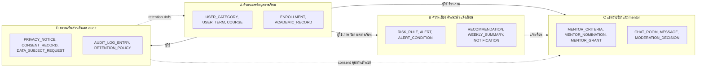
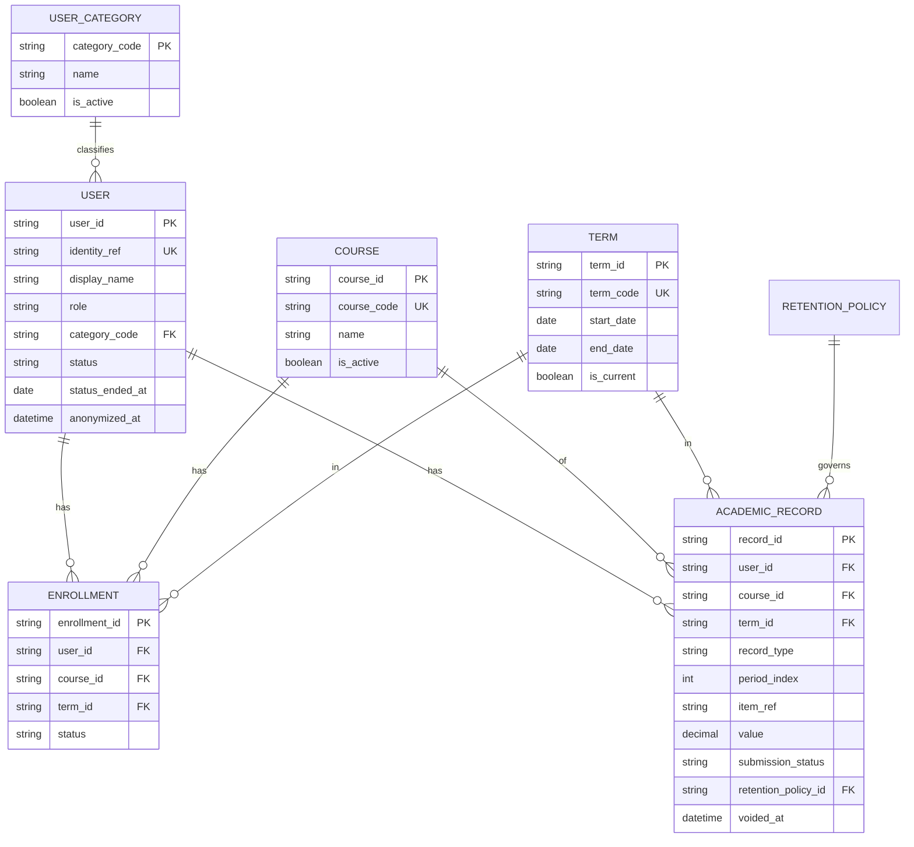
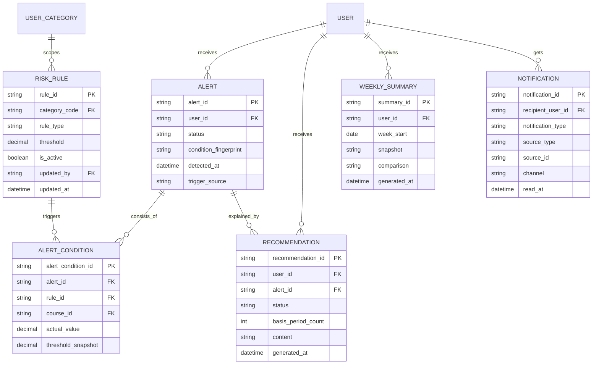
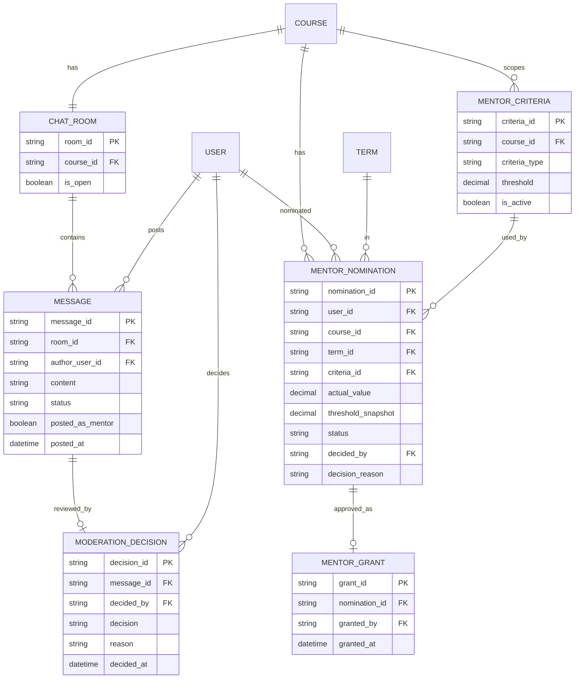
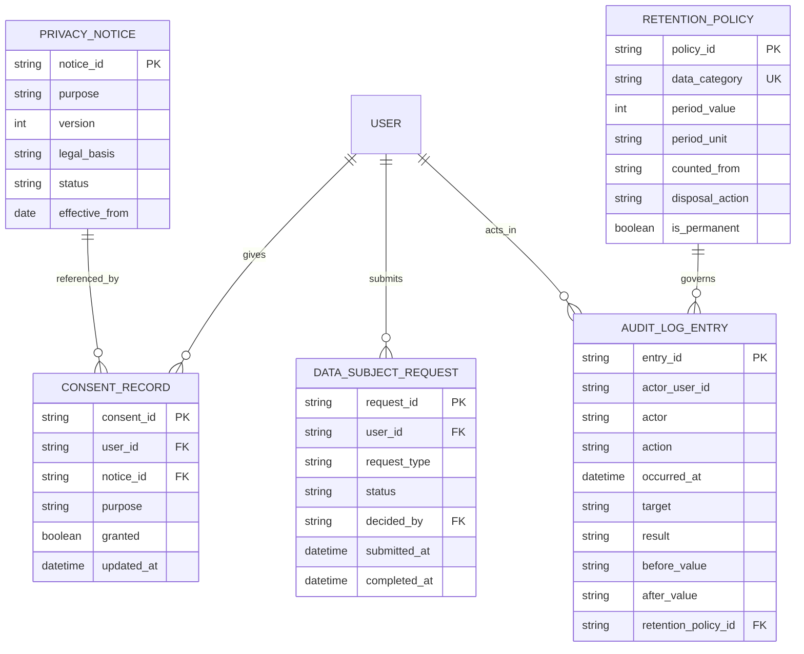

# Database Spec (Conceptual)

**อัปเดตล่าสุด:** 2026-10-08
**สถานะ:** Draft
**ขอบเขตของเอกสาร:** conceptual — ยังไม่ระบุ technical stack
**ต่อยอดจาก:** [[high-level-architecture#5. Data Concept|Data Concept]] ใน [[high-level-architecture|High Level Architecture]]

## 1. วัตถุประสงค์และขอบเขต

เอกสารนี้กำหนดโครงสร้างข้อมูลเชิงแนวคิดของ Grade Runway โดยขยายจาก data concept ใน architecture เป็นตาราง คอลัมน์ ความสัมพันธ์ กฎความสมบูรณ์ และนโยบายข้อมูล เพื่อเป็นต้นทางของ [[api-spec|API Spec]] และ detailed design

requirement ที่ครอบคลุมและรหัสอ้างอิงที่ใช้ในเอกสารนี้

| รหัส | ความหมาย | ที่มา |
|---|---|---|
| R-US1..4, R-BR1..4 | User Story / Business Rule ของระบบเตือนและแนะนำการเรียน | [[../../01-requirements/01-spec/20260825-01-personalized-learning-reminder\|spec 01]] |
| F-R1..F-R7 | ฟีเจอร์ #1-7 | [[../01-prototypes/20260827-01-features-list-personalized-learning-reminder\|Features List 01]] |
| AC-R1..AC-R5 | Acceptance Criteria ของ spec 01 | [[../../03-testing/01-test-plan/20260907-01-acceptance-criteria-personalized-learning-reminder\|AC spec 01]] |
| C-US1..5, C-BR1..4 | User Story / Business Rule ของช่องแชท | [[../../01-requirements/01-spec/20260825-02-high-grade-peer-review-chat\|spec 02]] |
| F-C1..F-C12 | ฟีเจอร์ #1-12 | [[../01-prototypes/20260827-03-features-list-high-grade-peer-review-chat\|Features List 02]] |
| AC-C1..AC-C6 | Acceptance Criteria ของ spec 02 | [[../../03-testing/01-test-plan/20260912-01-acceptance-criteria-high-grade-peer-review-chat\|AC spec 02]] |
| P-US1..5, P-BR-audit/PDPA/retention/security | User Story / Business Rule ของ log และ PDPA (ยังไม่มี features list/journey/AC) | [[../../01-requirements/01-spec/20260825-03-logging-pdpa-compliance\|spec 03]] |
| J-R, J-Mentor, J-Mentee, J-Admin | User Journey นักเรียน / mentor / นักศึกษาทั่วไป / ผู้ดูแลระบบ | [[../01-prototypes/20260827-02-user-journey-student-personalized-learning-reminder\|J-R]], [[../01-prototypes/20260827-04-user-journey-mentor-high-grade-peer-review-chat\|J-Mentor]], [[../01-prototypes/20260827-05-user-journey-mentee-high-grade-peer-review-chat\|J-Mentee]], [[../01-prototypes/20260827-06-user-journey-admin-high-grade-peer-review-chat\|J-Admin]] |

เอกสารนี้ยังใช้ test spec ใน [[../../03-testing/01-test-plan/index|test plan]] ตรวจกรณีขอบ (เช่น TS-06 แจ้งเตือนรวม, TS-09 ข้อมูลย้อนหลังไม่พอ, TS-14 snapshot เกณฑ์, TS-15 หมวดหมู่ผู้ใช้ configurable)

อยู่นอกขอบเขต: การเลือกเทคโนโลยี, ช่องทางแจ้งเตือนนอก in-app, การใช้ในบริบทองค์กร, การเชื่อมระบบเกรดภายนอก, การออกแบบระบบแจ้งเหตุข้อมูลรั่วไหลอัตโนมัติ (เป็นกระบวนการระดับสถาบัน)

## 2. ER Diagram

ภาพรวมกลุ่มข้อมูล (23 ตาราง แบ่ง 4 กลุ่ม) ตารางที่ปรากฏในหลายกลุ่มแสดง attribute เต็มเพียงครั้งเดียว

### 2.1 กลุ่ม A: ตัวตนและข้อมูลการเรียน

หมายเหตุ: คอลัมน์ที่เป็นตัวระบุ (ID) ใช้ชนิด `string` ในแผนภาพ; `ACADEMIC_RECORD.course_id` ว่างได้เฉพาะ `cumulative_gpa` (cardinality เดิมของ data concept คงไว้)

### 2.2 กลุ่ม B: ความเสี่ยง คำแนะนำ แจ้งเตือน

หมายเหตุ: ใน data concept ความสัมพันธ์ `RISK_RULE ||--o{ ALERT : triggers` เปลี่ยนเป็นผ่าน ALERT_CONDITION (ดูหัวข้อ 3); `content` เป็น "ข้อความยาว", `snapshot`/`comparison` เป็น "โครงสร้างซ้อน" เชิงแนวคิด

### 2.3 กลุ่ม C: แชทรายวิชาและ mentor

### 2.4 กลุ่ม D: ความเป็นส่วนตัวและ audit

หมายเหตุ: `actor_user_id` ใน AUDIT_LOG_ENTRY เป็นการอ้างอิงอย่างเดียว ไม่บังคับ referential เพราะอยู่ในที่เก็บแยก (ดูหัวข้อ 3); `before_value`/`after_value` เป็น "โครงสร้างซ้อน"

## 3. ความสอดคล้องกับ Data Concept

| Entity ใน architecture | ตารางในเอกสารนี้ | หมายเหตุ |
|---|---|---|
| USER | USER | คงเดิม ขยาย attribute; role มี 4 ค่า (เพิ่ม `data_staff`); status ขยาย |
| COURSE | COURSE | คงเดิม |
| ENROLLMENT | ENROLLMENT | คงเดิม ขยายด้วย `term_id` |
| ACADEMIC_RECORD | ACADEMIC_RECORD | คง 1 ตารางตาม architecture (เกรด การเข้าเรียน การส่งงาน แนวโน้มคำนวณจากแถว); `course_id` ว่างได้เฉพาะ `cumulative_gpa` |
| RISK_RULE | RISK_RULE | คงเดิม; หมวดหมู่ผู้ใช้อ้าง USER_CATEGORY |
| ALERT | ALERT | คงเดิม; ความสัมพันธ์ `RISK_RULE—ALERT` ผ่านตารางเชื่อม ALERT_CONDITION |
| RECOMMENDATION | RECOMMENDATION | คงเดิม + อ้าง ALERT (ว่างได้) |
| WEEKLY_SUMMARY | WEEKLY_SUMMARY | คงเดิม |
| MENTOR_CRITERIA | MENTOR_CRITERIA | คงเดิม + `course_id` |
| MENTOR_NOMINATION | MENTOR_NOMINATION | คงเดิม + snapshot ค่าจริง/เกณฑ์ |
| MENTOR_GRANT | MENTOR_GRANT | คงเดิม (0..1 ต่อ nomination) |
| CHAT_ROOM | CHAT_ROOM | คงเดิม 1:1 กับ COURSE |
| MESSAGE | MESSAGE | คงเดิม; `author_user_id` ว่างได้เมื่อทำให้ไม่ระบุตัวตน |
| MODERATION_DECISION | MODERATION_DECISION | คงเดิม (0..1 ต่อ MESSAGE) |
| PRIVACY_NOTICE | PRIVACY_NOTICE | คงเดิม |
| CONSENT_RECORD | CONSENT_RECORD | คงเดิม บันทึกแบบเหตุการณ์ |
| DATA_SUBJECT_REQUEST | DATA_SUBJECT_REQUEST | คงเดิม |
| AUDIT_LOG_ENTRY | AUDIT_LOG_ENTRY | คงเดิม; ขยาย before/after; อ้าง USER แบบไม่บังคับ referential |
| RETENTION_POLICY | RETENTION_POLICY | คงเดิม |

**ส่วนต่างจาก data concept ที่ผู้ใช้ยอมรับแล้ว (2026-10-08): เก็บเป็นรายละเอียดระดับ schema ในเอกสารนี้ ไม่ย้อนแก้ architecture** แนะนำให้รัน `/sync-architecture` ภายหลังเพื่อให้ data concept ใน architecture ตรงกับเอกสารนี้

| รหัส | ตาราง / การเปลี่ยน | ประเภท | เหตุผล |
|---|---|---|---|
| D1 | ALERT_CONDITION | ตารางเชื่อม | แจ้งเตือนรวมหลายเงื่อนไข + snapshot เกณฑ์ (AC-R1 edge, AC-R4 edge, TS-06, TS-14) — ทำให้ `RISK_RULE—ALERT` เป็น many-to-many |
| D2 | NOTIFICATION | ตารางใหม่ | กล่องแจ้งเตือน in-app ของ F-R3, F-C10, F-C11 และผลคำร้อง PDPA พร้อม read state |
| D3 | TERM | lookup | แทนแนวคิด "ภาคการศึกษาปัจจุบัน" (C-BR3, AC-C3) |
| D4 | USER_CATEGORY | lookup | หมวดหมู่ผู้ใช้ที่ configurable (F-R7, AC-R5, TS-15) |
| D5 | `MENTOR_CRITERIA.course_id` | ความสัมพันธ์ | เกณฑ์ต่อวิชา (F-C4) |
| D6 | role `data_staff` และ status `minimized/anonymized` | ค่า enum | บุคลากรผู้ให้ข้อมูลการเรียน (architecture §2) และการกำจัดข้อมูลตาม retention |

ส่วนขยายระดับ attribute ที่ไม่ต้องแก้ architecture: `RECOMMENDATION.alert_id` (ว่างได้), ผู้ตัดสิน (`decided_by`, `granted_by`, `updated_by`) อ้าง USER, `AUDIT_LOG_ENTRY` ผูก USER แบบอ้างอิงอย่างเดียว (ไม่ลบตาม user), และ RETENTION_POLICY กำกับตารางอื่นผ่านการแมป `data_category` ในหัวข้อ 6 (ไม่เพิ่ม FK)

เหตุผลที่ไม่เพิ่มตารางประวัติแยก: การเปลี่ยนเกณฑ์/นโยบาย/บทบาทบันทึกลง AUDIT_LOG_ENTRY (ค่าก่อน-หลัง) และ snapshot อยู่ในแถวที่เกิดจากเกณฑ์นั้น (ALERT_CONDITION, MENTOR_NOMINATION)

## 4. รายละเอียดแต่ละตาราง

รูปแบบ: "ชนิด" เป็นชนิดเชิงแนวคิด (ข้อความ, ข้อความยาว, จำนวนเต็ม, ทศนิยม, จริง/เท็จ, วันที่, วันเวลา, ตัวระบุ (ID), ค่าจากรายการ, โครงสร้างซ้อน) ชื่อ operation อ้างถึง [[api-spec|API Spec]]; Q# หมายถึงการตัดสินใจในหัวข้อ 10

### 4.1 USER
- **วัตถุประสงค์/ที่มา:** ผู้ใช้ทุกบทบาท อ้างอิงตัวตนจากระบบยืนยันตัวตนของสถาบัน (ไม่เก็บรหัสผ่าน) — architecture Q6, F-R3, F-C2, P-BR security
- **เจ้าของ / ความอ่อนไหว:** ผู้ใช้/สถาบัน — ข้อมูลส่วนบุคคล

| คอลัมน์ | ชนิด | จำเป็น? | Key | คำอธิบาย/กฎ |
|---|---|---|---|---|
| user_id | ตัวระบุ (ID) | ใช่ | PK | ตัวระบุภายใน |
| identity_ref | ข้อความ | ใช่ | UK | ตัวอ้างอิงตัวตนจากระบบของสถาบัน |
| display_name | ข้อความ | ใช่ | | ชื่อที่แสดงในห้องแชท/คิว |
| role | ค่าจากรายการ | ใช่ | | `student, admin, auditor, data_staff` (1 บัญชี 1 role) mentor ไม่ใช่ role |
| category_code | ข้อความ | ใช่ | FK → USER_CATEGORY | ค่าเริ่มต้น `student` |
| status | ค่าจากรายการ | ใช่ | | `active, ended, minimized, anonymized` |
| status_ended_at | วันที่ | ไม่ | | วันที่พ้นสถานภาพ เริ่มนับ retention |
| anonymized_at | วันเวลา | ไม่ | | เมื่อทำให้ไม่ระบุตัวตน |
| created_at / last_sign_in_at | วันเวลา | ใช่ / ไม่ | | |

- **ความสัมพันธ์:** 1 USER → หลาย ENROLLMENT, ACADEMIC_RECORD, ALERT, RECOMMENDATION, WEEKLY_SUMMARY, NOTIFICATION, MENTOR_NOMINATION, MESSAGE, CONSENT_RECORD, DATA_SUBJECT_REQUEST; AUDIT_LOG_ENTRY ผูกแบบอ้างอิงอย่างเดียว ห้ามลบ USER ที่ยังมีข้อมูลที่อยู่ในช่วง retention
- **Integrity:** `identity_ref` ไม่ซ้ำ; `status_ended_at` ต้องมีเมื่อ status = `ended`
- **วงจรชีวิต:** สร้างเป็น shell เมื่อบุคลากรนำเข้า → ผูกตัวตนเมื่อ sign in; เปลี่ยน status เป็น `ended` เมื่อพ้นสถานภาพ; หลังสถานภาพ +5 ปี ทำให้ไม่ระบุตัวตน (`anonymized`) หรือคงเฉพาะตัวระบุขั้นต่ำ (`minimized`) ถ้ายังมีข้อมูลที่ต้องเก็บถาวร
- **Operation:** อ่าน: ส่วนใหญ่ (ตรวจสิทธิ์) / เขียน: sign-in-with-institution-identity, import-enrollments, run-retention-sweep, fulfil-data-subject-request

### 4.2 USER_CATEGORY (เพิ่ม D4)
- **วัตถุประสงค์/ที่มา:** รายการหมวดหมู่ผู้ใช้ที่ใช้เกณฑ์ (เผื่อบริบทอื่น) — F-R7, AC-R5, TS-15
- **เจ้าของ / ความอ่อนไหว:** ผู้ดูแลระบบ — ไม่ใช่ข้อมูลส่วนบุคคล

| คอลัมน์ | ชนิด | จำเป็น? | Key | คำอธิบาย/กฎ |
|---|---|---|---|---|
| category_code | ข้อความ | ใช่ | PK | เช่น `student` (ค่าเดียวในเวอร์ชันนี้) |
| name | ข้อความ | ใช่ | | |
| is_active | จริง/เท็จ | ใช่ | | |

- **ความสัมพันธ์:** 1 → หลาย USER, RISK_RULE; ห้ามลบเมื่อมีผู้อ้าง
- **วงจรชีวิต:** เป็นค่าตั้งต้น (seed) ไม่มี operation จัดการในเวอร์ชันนี้
- **Operation:** อ่าน: list-risk-rules, save-risk-rule, import-enrollments, sign-in-with-institution-identity / เขียน: ไม่มี

### 4.3 TERM (เพิ่ม D3)
- **วัตถุประสงค์/ที่มา:** ภาคการศึกษา และชี้ "ภาคปัจจุบัน" — C-BR3, AC-C3, F-C2 (ตามการตัดสินใจ Q1)
- **เจ้าของ / ความอ่อนไหว:** Grade Runway/ผู้ดูแลระบบ — ไม่ใช่ข้อมูลส่วนบุคคล

| คอลัมน์ | ชนิด | จำเป็น? | Key | คำอธิบาย/กฎ |
|---|---|---|---|---|
| term_id | ตัวระบุ (ID) | ใช่ | PK | |
| term_code | ข้อความ | ใช่ | UK | |
| start_date / end_date | วันที่ | ใช่ | | end_date ≥ start_date |
| is_current | จริง/เท็จ | ใช่ | | มีได้เพียงหนึ่งแถวที่เป็นจริง |

- **ความสัมพันธ์:** 1 → หลาย ENROLLMENT, ACADEMIC_RECORD, MENTOR_NOMINATION; ห้ามลบ
- **Integrity:** `is_current` เป็นจริงได้หนึ่งแถวพร้อมกัน
- **วงจรชีวิต:** สร้างจากการนำเข้า; แอดมินสลับภาคปัจจุบัน (บันทึก audit); เก็บถาวรเป็นข้อมูลอ้างอิง
- **Operation:** อ่าน: ห้องแชทและ operation ที่ตรวจภาคปัจจุบัน / เขียน: import-enrollments, set-current-term

### 4.4 COURSE
- **วัตถุประสงค์/ที่มา:** รายวิชา ใช้แยกห้องแชทและเกณฑ์เสนอชื่อ — F-C1, F-R1
- **เจ้าของ / ความอ่อนไหว:** Grade Runway (นำเข้าโดยบุคลากร) — ทั่วไป (ไม่ใช่ข้อมูลส่วนบุคคล)

| คอลัมน์ | ชนิด | จำเป็น? | Key | คำอธิบาย/กฎ |
|---|---|---|---|---|
| course_id | ตัวระบุ (ID) | ใช่ | PK | |
| course_code | ข้อความ | ใช่ | UK | |
| name | ข้อความ | ใช่ | | |
| is_active | จริง/เท็จ | ใช่ | | |

- **ความสัมพันธ์:** 1 → หลาย ENROLLMENT, ACADEMIC_RECORD, MENTOR_NOMINATION, MENTOR_CRITERIA; 1 → 1 CHAT_ROOM; ห้ามลบ (ปิดด้วย `is_active`)
- **วงจรชีวิต:** สร้าง/อัปเดตจากการนำเข้า พร้อมสร้างห้องแชททันที
- **Operation:** เขียน: import-enrollments / อ่าน: list-mentor-criteria, list-my-chat-rooms, get-chat-room, list-moderation-queue, get-chat-activity-overview, list-mentor-nominations, get-my-mentor-status, save-mentor-criteria

### 4.5 ENROLLMENT
- **วัตถุประสงค์/ที่มา:** การลงทะเบียนต่อภาค คุมสิทธิ์เข้าห้องแชท — F-C2, AC-C3, C-BR3
- **เจ้าของ / ความอ่อนไหว:** Grade Runway — ข้อมูลส่วนบุคคล

| คอลัมน์ | ชนิด | จำเป็น? | Key | คำอธิบาย/กฎ |
|---|---|---|---|---|
| enrollment_id | ตัวระบุ (ID) | ใช่ | PK | |
| user_id / course_id / term_id | ตัวระบุ (ID) | ใช่ | FK | UK รวม (user_id, course_id, term_id) |
| status | ค่าจากรายการ | ใช่ | | `enrolled, dropped` |
| enrolled_at / dropped_at | วันเวลา | ใช่ / ไม่ | | |

- **ความสัมพันธ์:** หลาย → 1 USER, COURSE, TERM; ลบ USER ตาม retention แล้วลบตาม
- **Integrity:** สิทธิ์เข้าห้อง = status `enrolled` และ term เป็นภาคปัจจุบัน
- **วงจรชีวิต:** นำเข้า/อัปเดต; เพิ่ม/ถอนวิชาระหว่างภาคแสดงด้วยสถานะ (ยังไม่ระบุใน spec ว่ามีดีเลย์หรือไม่)
- **Operation:** เขียน: import-enrollments, run-retention-sweep / อ่าน: evaluate-learning-risk, import-academic-records, generate-mentor-nominations, generate-weekly-summaries, list-my-chat-rooms, get-chat-room, list-published-messages, post-chat-message, get-my-mentor-status

### 4.6 ACADEMIC_RECORD
- **วัตถุประสงค์/ที่มา:** ข้อมูลการเรียนต่อผู้เรียน (เกรด/GPA, คะแนน, การเข้าเรียน, การส่งงาน) เป็นฐานของการประเมิน คำแนะนำ สรุปรายสัปดาห์ และเสนอชื่อ mentor — F-R1, F-R2, F-R4, F-R5, F-C3, AC-R1..R3, AC-C1
- **เจ้าของ / ความอ่อนไหว:** Grade Runway (นำเข้าโดยบุคลากร) — **อ่อนไหวสูง**

| คอลัมน์ | ชนิด | จำเป็น? | Key | คำอธิบาย/กฎ |
|---|---|---|---|---|
| record_id | ตัวระบุ (ID) | ใช่ | PK | |
| user_id | ตัวระบุ (ID) | ใช่ | FK | |
| course_id | ตัวระบุ (ID) | เงื่อนไข | FK | จำเป็นยกเว้น `cumulative_gpa` |
| term_id | ตัวระบุ (ID) | ใช่ | FK | |
| record_type | ค่าจากรายการ | ใช่ | | `course_grade, cumulative_gpa, assessment_score, attendance, assignment_submission` |
| period_index | จำนวนเต็ม | ใช่ | | ลำดับช่วงเวลาประเมิน ใช้คำนวณแนวโน้ม |
| item_ref | ข้อความ | ไม่ | | รหัสงาน/แบบทดสอบ (ใช้กับ assignment_submission) |
| value | ทศนิยม | เงื่อนไข | | เกรด/คะแนน/อัตราเข้าเรียน (%) |
| max_value | ทศนิยม | ไม่ | | |
| submission_status | ค่าจากรายการ | เงื่อนไข | | `submitted, missed` เมื่อชนิดเป็น assignment_submission |
| observed_at | วันที่ | ใช่ | | |
| import_batch_ref | ข้อความ | ไม่ | | อ้างอิงชุดนำเข้า |
| retention_policy_id | ตัวระบุ (ID) | ใช่ | FK | `course_grade/cumulative_gpa` → นโยบายเก็บถาวร อื่นๆ → นโยบายนักศึกษา |
| voided_at | วันเวลา | ไม่ | | ยกเลิกแถว (ไม่ลบจริง) |
| recorded_by | ตัวระบุ (ID) | ใช่ | FK → USER | |
| created_at / updated_at | วันเวลา | ใช่ | | |

- **ความสัมพันธ์:** หลาย → 1 USER; หลาย → 1 COURSE (ว่างเฉพาะ cumulative_gpa); หลาย → 1 TERM; หลาย → 1 RETENTION_POLICY
- **Integrity:** UK รวม (user_id, course_id, term_id, record_type, period_index, item_ref) เพื่อ upsert; ค่าตัวเลขไม่ติดลบ; อัตราเข้าเรียน 0-100; แถวที่ `voided_at` ไม่ถูกนับในการประเมิน
- **วงจรชีวิต:** สร้างโดยการนำเข้า; แก้ไข/ยกเลิกโดย correct-academic-record (ทุกครั้งต้อง audit ค่าก่อน-หลัง); ข้อมูลที่ไม่ใช่ทรานสคริปต์ลบหรือทำให้ไม่ระบุตัวตนหลังสถานภาพ +5 ปี
- **Operation:** เขียน: import-academic-records, correct-academic-record, run-retention-sweep, fulfil-data-subject-request / อ่าน: evaluate-learning-risk, generate-personal-recommendation, generate-weekly-summaries, generate-mentor-nominations, get-my-recommendation, fulfil-data-subject-request

### 4.7 RISK_RULE
- **วัตถุประสงค์/ที่มา:** เกณฑ์แจ้งเตือนที่ตั้งค่าได้ 1 แถวต่อตัวแปรต่อหมวดหมู่ผู้ใช้ — F-R2, F-R6, AC-R4, R-BR2
- **เจ้าของ / ความอ่อนไหว:** ผู้ดูแลระบบ — ไม่ใช่ข้อมูลส่วนบุคคล

| คอลัมน์ | ชนิด | จำเป็น? | Key | คำอธิบาย/กฎ |
|---|---|---|---|---|
| rule_id | ตัวระบุ (ID) | ใช่ | PK | |
| category_code | ข้อความ | ใช่ | FK → USER_CATEGORY | |
| rule_type | ค่าจากรายการ | ใช่ | | `gpa_below, attendance_below, missed_assignments_at_least, score_decline_consecutive_periods, min_history_periods` |
| threshold | ทศนิยม | ใช่ | | ไม่ติดลบ; attendance 0-100 (ตัวอย่างอ้างอิงจาก AC-R1: 2.00, 80, 3, 2, 2 — ค่าจริงรอยืนยัน) |
| is_active | จริง/เท็จ | ใช่ | | |
| updated_by / updated_at | ตัวระบุ (ID)/วันเวลา | ใช่ | FK → USER | |

- **ความสัมพันธ์:** หลาย → 1 USER_CATEGORY; 1 → หลาย ALERT_CONDITION; ห้ามลบเมื่อมี ALERT_CONDITION อ้าง (ปิดด้วย `is_active`)
- **Integrity:** UK (category_code, rule_type) ในกลุ่ม active; ค่าที่ไม่ใช่ตัวเลข/ติดลบ/ว่างถูกปฏิเสธ (AC-R4)
- **วงจรชีวิต:** แก้ค่าแล้วมีผลกับรอบประเมินถัดไปเท่านั้น; แจ้งเตือนเดิมไม่เปลี่ยน (snapshot); ทุกการแก้บันทึก audit `config_change`
- **Operation:** เขียน: save-risk-rule / อ่าน: list-risk-rules, evaluate-learning-risk, generate-personal-recommendation, get-my-recommendation

### 4.8 ALERT
- **วัตถุประสงค์/ที่มา:** ผลประเมินความเสี่ยงต่อผู้เรียน (แจ้งเตือนทันที/ตามรอบ) — F-R3, AC-R1, R-US1
- **เจ้าของ / ความอ่อนไหว:** ผู้เรียนเจ้าของ — **อ่อนไหวสูง** (derive จากผลการเรียน)

| คอลัมน์ | ชนิด | จำเป็น? | Key | คำอธิบาย/กฎ |
|---|---|---|---|---|
| alert_id | ตัวระบุ (ID) | ใช่ | PK | |
| user_id | ตัวระบุ (ID) | ใช่ | FK | |
| status | ค่าจากรายการ | ใช่ | | `open, superseded, resolved` |
| condition_fingerprint | ข้อความ | ใช่ | | ลายนิ้วมือของชุดเงื่อนไข ใช้กันซ้ำ |
| detected_at | วันเวลา | ใช่ | | |
| trigger_source | ค่าจากรายการ | ใช่ | | `data_change, scheduled` |

- **ความสัมพันธ์:** หลาย → 1 USER; 1 → หลาย ALERT_CONDITION; 1 → หลาย RECOMMENDATION
- **Integrity:** ผู้ใช้หนึ่งคนมี ALERT สถานะ `open` ได้เพียงหนึ่งแถวต่อ fingerprint
- **วงจรชีวิต:** สร้างเมื่อเข้าเงื่อนไขใหม่; superseded เมื่อชุดเงื่อนไขเปลี่ยน; resolved เมื่อไม่เข้าเงื่อนไขแล้ว; ลบ/ทำให้ไม่ระบุตัวตนตาม retention
- **Operation:** เขียน: evaluate-learning-risk, run-retention-sweep / อ่าน: get-notification-detail, generate-personal-recommendation, fulfil-data-subject-request

### 4.9 ALERT_CONDITION (เพิ่ม D1 ตารางเชื่อม)
- **วัตถุประสงค์/ที่มา:** เงื่อนไขที่ถูกกระตุ้นต่อ ALERT พร้อม snapshot — AC-R1 edge, AC-R4 edge, TS-06, TS-14 (ตามการตัดสินใจ Q2)
- **เจ้าของ / ความอ่อนไหว:** ผู้เรียนเจ้าของ — อ่อนไหวสูง

| คอลัมน์ | ชนิด | จำเป็น? | Key | คำอธิบาย/กฎ |
|---|---|---|---|---|
| alert_condition_id | ตัวระบุ (ID) | ใช่ | PK | |
| alert_id | ตัวระบุ (ID) | ใช่ | FK | |
| rule_id | ตัวระบุ (ID) | ใช่ | FK | |
| course_id | ตัวระบุ (ID) | ไม่ | FK | สำหรับเงื่อนไขรายวิชา (เช่น ไม่ส่งงาน) |
| actual_value | ทศนิยม | ใช่ | | ค่าจริง ณ ตอนตรวจพบ |
| threshold_snapshot | ทศนิยม | ใช่ | | เกณฑ์ ณ ตอนตรวจพบ ไม่เปลี่ยนเมื่อแก้เกณฑ์ |

- **ความสัมพันธ์:** หลาย → 1 ALERT (ลบตาม ALERT), หลาย → 1 RISK_RULE (ห้ามลบ rule)
- **Integrity:** UK (alert_id, rule_id, course_id); ALERT ต้องมีอย่างน้อย 1 เงื่อนไข
- **วงจรชีวิต:** สร้างพร้อม ALERT ห้ามแก้ภายหลัง
- **Operation:** เขียน: evaluate-learning-risk, run-retention-sweep / อ่าน: get-notification-detail, generate-personal-recommendation

### 4.10 RECOMMENDATION
- **วัตถุประสงค์/ที่มา:** คำแนะนำแนวทางการเรียนเฉพาะบุคคล — F-R4, AC-R2, R-BR3
- **เจ้าของ / ความอ่อนไหว:** ผู้เรียนเจ้าของ — อ่อนไหวสูง

| คอลัมน์ | ชนิด | จำเป็น? | Key | คำอธิบาย/กฎ |
|---|---|---|---|---|
| recommendation_id | ตัวระบุ (ID) | ใช่ | PK | |
| user_id | ตัวระบุ (ID) | ใช่ | FK | |
| alert_id | ตัวระบุ (ID) | ไม่ | FK | ที่มาของคำแนะนำ (ว่างถ้าเกิดจากรอบอื่น) |
| status | ค่าจากรายการ | ใช่ | | `current, superseded` |
| basis_period_count | จำนวนเต็ม | ใช่ | | จำนวนช่วงเวลาข้อมูลที่ใช้คำนวณ |
| focus_variables | รายการ | ใช่ | | ตัวแปรเสี่ยงของผู้ใช้ที่คำแนะนำอ้างถึง |
| content | ข้อความยาว | ใช่ | | เนื้อหาเฉพาะบุคคล ห้ามเป็นข้อความสำเร็จรูปเดียวกันทุกคน |
| generated_at | วันเวลา | ใช่ | | |

- **ความสัมพันธ์:** หลาย → 1 USER; หลาย → 0..1 ALERT
- **Integrity:** ไม่สร้างเมื่อ `basis_period_count` ต่ำกว่าเกณฑ์ขั้นต่ำ (`min_history_periods`) — ผลอ่านคืนข้อความ fallback (AC-R2)
- **วงจรชีวิต:** สร้างเมื่อมี ALERT หรือประเมินซ้ำ; ฉบับเก่า superseded; ลบตาม retention
- **Operation:** เขียน: generate-personal-recommendation, run-retention-sweep / อ่าน: get-my-recommendation, get-notification-detail, fulfil-data-subject-request

### 4.11 WEEKLY_SUMMARY
- **วัตถุประสงค์/ที่มา:** สรุปภาพรวมรายสัปดาห์ — F-R5, AC-R3, R-BR4
- **เจ้าของ / ความอ่อนไหว:** ผู้เรียนเจ้าของ — อ่อนไหวสูง

| คอลัมน์ | ชนิด | จำเป็น? | Key | คำอธิบาย/กฎ |
|---|---|---|---|---|
| summary_id | ตัวระบุ (ID) | ใช่ | PK | |
| user_id | ตัวระบุ (ID) | ใช่ | FK | |
| week_start | วันที่ | ใช่ | | UK รวม (user_id, week_start) |
| snapshot | โครงสร้างซ้อน | ใช่ | | เกรด/การเข้าเรียน/การส่งงาน/แนวโน้มของสัปดาห์ |
| comparison | โครงสร้างซ้อน | ไม่ | | เปรียบเทียบสัปดาห์ก่อน อย่างน้อย 1 ตัวแปรเมื่อมีข้อมูล |
| generated_at | วันเวลา | ใช่ | | |

- **ความสัมพันธ์:** หลาย → 1 USER
- **วงจรชีวิต:** สร้างตามรอบสัปดาห์ ห้ามแก้ภายหลัง ลบตาม retention
- **Operation:** เขียน: generate-weekly-summaries, run-retention-sweep / อ่าน: get-my-weekly-summary, get-notification-detail, generate-weekly-summaries

### 4.12 NOTIFICATION (เพิ่ม D2)
- **วัตถุประสงค์/ที่มา:** กล่องแจ้งเตือน in-app ของทุกบทบาท พร้อมสถานะอ่าน และจุดเสียบช่องทางอื่นในอนาคต — F-R3, F-C10, F-C11, R-BR4, P-US3 (แจ้งผลคำร้อง)
- **เจ้าของ / ความอ่อนไหว:** ผู้รับ — อ่อนไหว (เนื้อหาอ้างผลการเรียน)

| คอลัมน์ | ชนิด | จำเป็น? | Key | คำอธิบาย/กฎ |
|---|---|---|---|---|
| notification_id | ตัวระบุ (ID) | ใช่ | PK | |
| recipient_user_id | ตัวระบุ (ID) | ใช่ | FK | |
| notification_type | ค่าจากรายการ | ใช่ | | `risk_alert, weekly_summary_ready, mentor_decision, message_status, admin_pending_work, data_subject_request_update` |
| source_type / source_id | ค่าจากรายการ/ตัวระบุ (ID) | ใช่ | | อ้างต้นทาง (ALERT, WEEKLY_SUMMARY, MENTOR_NOMINATION, MESSAGE, DATA_SUBJECT_REQUEST) แบบอ้างอิงไม่บังคับ FK |
| title / body | ข้อความ/ข้อความยาว | ใช่ | | เนื้อหา ณ ตอนสร้าง (snapshot) |
| channel | ค่าจากรายการ | ใช่ | | `in_app` (จุดเสียบเพิ่มช่องทางภายหลัง) |
| delivery_status | ค่าจากรายการ | ใช่ | | `pending, delivered, failed` |
| dedupe_key | ข้อความ | ไม่ | | ใช้รวมแจ้งเตือนงานค้างแอดมินที่ยังไม่อ่าน |
| created_at / read_at | วันเวลา | ใช่ / ไม่ | | |

- **ความสัมพันธ์:** หลาย → 1 USER; ลบตาม USER ตาม retention
- **วงจรชีวิต:** สร้างโดยตรรกะธุรกิจ; ผู้รับเปิดอ่านแล้ว `read_at` ถูกบันทึก; เนื้อหาไม่เปลี่ยนตามเกณฑ์ที่แก้ภายหลัง
- **Operation:** เขียน: evaluate-learning-risk, generate-weekly-summaries, generate-mentor-nominations, decide-mentor-nomination, post-chat-message, decide-message-moderation, decide-data-subject-request, fulfil-data-subject-request, get-notification-detail (read_at), run-retention-sweep / อ่าน: list-my-notifications, get-notification-detail

### 4.13 MENTOR_CRITERIA
- **วัตถุประสงค์/ที่มา:** เกณฑ์เกรด/GPA ที่ใช้เสนอชื่อ mentor ต่อวิชา — F-C4, AC-C1, C-BR1
- **เจ้าของ / ความอ่อนไหว:** ผู้ดูแลระบบ — ไม่ใช่ข้อมูลส่วนบุคคล

| คอลัมน์ | ชนิด | จำเป็น? | Key | คำอธิบาย/กฎ |
|---|---|---|---|---|
| criteria_id | ตัวระบุ (ID) | ใช่ | PK | |
| course_id | ตัวระบุ (ID) | ไม่ | FK (D5) | ว่าง = เกณฑ์ตั้งต้นทุกวิชา; ระบุ = เกณฑ์เฉพาะวิชา (ใช้แทนตั้งต้น) |
| criteria_type | ค่าจากรายการ | ใช่ | | `course_grade_at_least, cumulative_gpa_at_least` |
| threshold | ทศนิยม | ใช่ | | ไม่ติดลบ |
| is_active | จริง/เท็จ | ใช่ | | |
| updated_by / updated_at | ตัวระบุ (ID)/วันเวลา | ใช่ | FK | |

- **ความสัมพันธ์:** หลาย → 0..1 COURSE; 1 → หลาย MENTOR_NOMINATION; ห้ามลบเมื่อมี nomination อ้าง
- **Integrity:** UK (course_id, criteria_type) ในกลุ่ม active
- **วงจรชีวิต:** แก้ไขแล้วมีผลกับรอบเสนอชื่อถัดไป ไม่กระทบสิทธิ์ที่อนุมัติแล้ว (assumption จาก AC-C1); บันทึก audit
- **Operation:** เขียน: save-mentor-criteria / อ่าน: list-mentor-criteria, generate-mentor-nominations, list-mentor-nominations

### 4.14 MENTOR_NOMINATION
- **วัตถุประสงค์/ที่มา:** รายชื่อที่ระบบเสนอและผลตัดสินของแอดมิน — F-C3, F-C5, AC-C1, AC-C2, C-BR1
- **เจ้าของ / ความอ่อนไหว:** ผู้ดูแลระบบ/นักศึกษา — ข้อมูลส่วนบุคคล (อิงผลการเรียน)

| คอลัมน์ | ชนิด | จำเป็น? | Key | คำอธิบาย/กฎ |
|---|---|---|---|---|
| nomination_id | ตัวระบุ (ID) | ใช่ | PK | |
| user_id / course_id / term_id | ตัวระบุ (ID) | ใช่ | FK | UK รวม (user_id, course_id, term_id) |
| criteria_id | ตัวระบุ (ID) | ใช่ | FK | |
| actual_value / threshold_snapshot | ทศนิยม | ใช่ | | ค่าจริงเทียบเกณฑ์ ณ ตอนเสนอชื่อ |
| status | ค่าจากรายการ | ใช่ | | `pending, approved, rejected` |
| nominated_at | วันเวลา | ใช่ | | |
| decided_by | ตัวระบุ (ID) | เงื่อนไข | FK → USER | role admin |
| decided_at | วันเวลา | เงื่อนไข | | |
| decision_reason | ข้อความ | เงื่อนไข | | จำเป็นเมื่อ rejected (assumption จาก AC-C2) |

- **ความสัมพันธ์:** หลาย → 1 COURSE, USER, TERM, MENTOR_CRITERIA; 1 → 0..1 MENTOR_GRANT
- **Integrity:** ผู้ใช้ต้องมี ENROLLMENT สถานะ enrolled ในวิชา/ภาคนั้น; เสนอชื่อซ้ำไม่ได้ในภาคเดียวกัน; status เปลี่ยนจาก `pending` ได้ครั้งเดียว
- **วงจรชีวิต:** สร้างโดยระบบ (pending) → แอดมินตัดสิน; ลบ/ทำให้ไม่ระบุตัวตนตาม retention
- **Operation:** เขียน: generate-mentor-nominations, decide-mentor-nomination, run-retention-sweep / อ่าน: list-mentor-nominations, get-my-mentor-status, list-my-chat-rooms, get-chat-room, post-chat-message, get-chat-activity-overview, get-notification-detail

### 4.15 MENTOR_GRANT
- **วัตถุประสงค์/ที่มา:** สิทธิ์ผู้แนะนำที่ได้หลัง approve — F-C6, AC-C2, AC-C4 (ตามการตัดสินใจ Q3)
- **เจ้าของ / ความอ่อนไหว:** ผู้ดูแลระบบ/นักศึกษา — ข้อมูลส่วนบุคคล

| คอลัมน์ | ชนิด | จำเป็น? | Key | คำอธิบาย/กฎ |
|---|---|---|---|---|
| grant_id | ตัวระบุ (ID) | ใช่ | PK | |
| nomination_id | ตัวระบุ (ID) | ใช่ | FK, UK | nomination ต้อง approved |
| granted_by | ตัวระบุ (ID) | ใช่ | FK → USER | |
| granted_at | วันเวลา | ใช่ | | |

- **ความสัมพันธ์:** 0..1 ต่อ MENTOR_NOMINATION; mentor active = มี grant และ term ของ nomination เป็นภาคปัจจุบัน (สิทธิ์หมดเมื่อสิ้นภาค ไม่มีคอลัมน์/operation ถอนสิทธิ์ ตาม Q3)
- **วงจรชีวิต:** สร้างตอน approve (บันทึก audit `role_change`); หมดอายุเมื่อสิ้นภาค; ลบตาม retention
- **Operation:** เขียน: decide-mentor-nomination, run-retention-sweep / อ่าน: post-chat-message, list-my-chat-rooms, get-chat-room, get-my-mentor-status, get-chat-activity-overview

### 4.16 CHAT_ROOM
- **วัตถุประสงค์/ที่มา:** ห้องแชทต่อรายวิชา — F-C1, AC-C3, C-BR2
- **เจ้าของ / ความอ่อนไหว:** ผู้ดูแลระบบ — ทั่วไป

| คอลัมน์ | ชนิด | จำเป็น? | Key | คำอธิบาย/กฎ |
|---|---|---|---|---|
| room_id | ตัวระบุ (ID) | ใช่ | PK | |
| course_id | ตัวระบุ (ID) | ใช่ | FK, UK | 1 วิชา 1 ห้อง |
| is_open | จริง/เท็จ | ใช่ | | |
| created_at | วันเวลา | ใช่ | | |

- **ความสัมพันธ์:** 1:1 COURSE; 1 → หลาย MESSAGE; ห้ามลบเมื่อมีข้อความ
- **วงจรชีวิต:** สร้างอัตโนมัติเมื่อสร้างวิชา; ห้องคงอยู่ข้ามภาค ผู้เข้าถึงตัดสินจากการลงทะเบียนภาคปัจจุบัน
- **Operation:** เขียน: import-enrollments / อ่าน: list-my-chat-rooms, get-chat-room, post-chat-message, list-moderation-queue, get-chat-activity-overview

### 4.17 MESSAGE
- **วัตถุประสงค์/ที่มา:** ข้อความในห้องแชทและสถานะ — F-C7, F-C8, F-C9, F-C10, AC-C4..C6, C-BR4
- **เจ้าของ / ความอ่อนไหว:** ผู้โพสต์ — อาจมีข้อมูลส่วนบุคคลของผู้อื่น (P-BR PDPA)

| คอลัมน์ | ชนิด | จำเป็น? | Key | คำอธิบาย/กฎ |
|---|---|---|---|---|
| message_id | ตัวระบุ (ID) | ใช่ | PK | |
| room_id | ตัวระบุ (ID) | ใช่ | FK | |
| author_user_id | ตัวระบุ (ID) | เงื่อนไข | FK | ว่างได้เมื่อทำให้ไม่ระบุตัวตน |
| content | ข้อความยาว | เงื่อนไข | | ไม่ว่างยกเว้นเมื่อถูกลบ/ล้างเนื้อหา |
| status | ค่าจากรายการ | ใช่ | | `pending, published, rejected, withdrawn` ค่าเริ่มต้น `pending` เสมอ |
| posted_as_mentor | จริง/เท็จ | ใช่ | | snapshot สิทธิ์ ณ ตอนโพสต์ ใช้แสดง badge |
| posted_at / published_at | วันเวลา | ใช่ / ไม่ | | |

- **ความสัมพันธ์:** หลาย → 1 CHAT_ROOM; หลาย → 1 USER (ว่างได้หลังทำให้ไม่ระบุตัวตน); 1 → 0..1 MODERATION_DECISION
- **Integrity:** ผู้อื่นอ่านได้เฉพาะ `published`; ผู้ส่งเห็นข้อความของตนทุกสถานะ; `published_at` ต้องมีเมื่อ published
- **วงจรชีวิต:** สร้าง pending → ผ่าน/ไม่ผ่านการตรวจ; เมื่อผู้โพสต์ถอน consent/ครบ retention/ถูกลบตามคำร้อง: ลบเนื้อหาที่ยังไม่เผยแพร่ (สถานะ `withdrawn`) ส่วนที่เผยแพร่แล้วทำให้ไม่ระบุตัวผู้เขียน (ตาม Q4)
- **Operation:** เขียน: post-chat-message, decide-message-moderation, set-consent (กรณีถอน), run-retention-sweep, fulfil-data-subject-request / อ่าน: list-published-messages, list-my-messages, list-moderation-queue, get-chat-activity-overview, get-notification-detail, fulfil-data-subject-request

### 4.18 MODERATION_DECISION
- **วัตถุประสงค์/ที่มา:** ผลการตรวจข้อความก่อนเผยแพร่ — F-C9, AC-C6
- **เจ้าของ / ความอ่อนไหว:** ผู้ตรวจ — ข้อมูลส่วนบุคคล (ตัวตนผู้ตรวจ)

| คอลัมน์ | ชนิด | จำเป็น? | Key | คำอธิบาย/กฎ |
|---|---|---|---|---|
| decision_id | ตัวระบุ (ID) | ใช่ | PK | |
| message_id | ตัวระบุ (ID) | ใช่ | FK, UK | 0..1 ต่อข้อความ |
| decided_by | ตัวระบุ (ID) | ใช่ | FK → USER | role admin |
| decision | ค่าจากรายการ | ใช่ | | `approved, rejected` |
| reason | ข้อความ | เงื่อนไข | | จำเป็นเมื่อ rejected แสดงให้ผู้ส่งเห็น |
| decided_at | วันเวลา | ใช่ | | |

- **ความสัมพันธ์:** 0..1 ต่อ MESSAGE; ห้ามแก้ภายหลัง
- **วงจรชีวิต:** สร้างครั้งเดียว (บันทึก audit); ลบตามข้อความ
- **Operation:** เขียน: decide-message-moderation / อ่าน: list-my-messages

### 4.19 PRIVACY_NOTICE
- **วัตถุประสงค์/ที่มา:** privacy notice ต่อวัตถุประสงค์และเวอร์ชัน — P-US2, P-BR PDPA
- **เจ้าของ / ความอ่อนไหว:** สถาบัน — ไม่ใช่ข้อมูลส่วนบุคคล

| คอลัมน์ | ชนิด | จำเป็น? | Key | คำอธิบาย/กฎ |
|---|---|---|---|---|
| notice_id | ตัวระบุ (ID) | ใช่ | PK | |
| purpose | ค่าจากรายการ | ใช่ | | `academic_service, chat_participation` (ขยายได้) |
| version | จำนวนเต็ม | ใช่ | | UK รวม (purpose, version) |
| legal_basis | ค่าจากรายการ | ใช่ | | `educational_mission, consent` |
| content | ข้อความยาว | ใช่ | | |
| status | ค่าจากรายการ | ใช่ | | `current, superseded` หนึ่ง current ต่อ purpose |
| effective_from / published_by | วันที่/ตัวระบุ (ID) | ใช่ | FK | |

- **ความสัมพันธ์:** 1 → หลาย CONSENT_RECORD; ห้ามลบเวอร์ชันที่มี consent อ้าง
- **วงจรชีวิต:** เผยแพร่เวอร์ชันใหม่ = เวอร์ชันเดิม superseded; ไม่แก้ย้อนหลัง
- **Operation:** เขียน: publish-privacy-notice / อ่าน: get-current-privacy-notice, set-consent, list-my-consents

### 4.20 CONSENT_RECORD
- **วัตถุประสงค์/ที่มา:** หลักฐานการให้/ถอน consent ต่อวัตถุประสงค์ — P-US2, architecture Q5
- **เจ้าของ / ความอ่อนไหว:** เจ้าของข้อมูล — ข้อมูลส่วนบุคคล

| คอลัมน์ | ชนิด | จำเป็น? | Key | คำอธิบาย/กฎ |
|---|---|---|---|---|
| consent_id | ตัวระบุ (ID) | ใช่ | PK | |
| user_id / notice_id | ตัวระบุ (ID) | ใช่ | FK | |
| purpose | ค่าจากรายการ | ใช่ | | ตรงกับ notice |
| granted | จริง/เท็จ | ใช่ | | จริง = ให้, เท็จ = ถอน |
| updated_at | วันเวลา | ใช่ | | เวลาเหตุการณ์ |

- **ความสัมพันธ์:** หลาย → 1 USER, PRIVACY_NOTICE
- **Integrity:** บันทึกแบบเพิ่มต่อท้าย; สถานะปัจจุบัน = แถวล่าสุดต่อ (user_id, purpose); ไม่อนุญาตแก้แถวเดิม
- **วงจรชีวิต:** สร้างทุกครั้งที่ให้/ถอน (บันทึก audit); เก็บเป็นหลักฐานตามนโยบายนักศึกษา
- **Operation:** เขียน: set-consent, run-retention-sweep / อ่าน: list-my-consents, list-my-chat-rooms, get-chat-room, list-published-messages, post-chat-message, set-consent

### 4.21 DATA_SUBJECT_REQUEST
- **วัตถุประสงค์/ที่มา:** คำร้องใช้สิทธิตาม PDPA — P-US3, P-US4, P-BR PDPA
- **เจ้าของ / ความอ่อนไหว:** เจ้าของข้อมูล — ข้อมูลส่วนบุคคล

| คอลัมน์ | ชนิด | จำเป็น? | Key | คำอธิบาย/กฎ |
|---|---|---|---|---|
| request_id | ตัวระบุ (ID) | ใช่ | PK | |
| user_id | ตัวระบุ (ID) | ใช่ | FK | |
| request_type | ค่าจากรายการ | ใช่ | | `access, rectify, erase, object, portability` (สิทธิถอน consent ใช้ set-consent) |
| detail | ข้อความยาว | ไม่ | | |
| status | ค่าจากรายการ | ใช่ | | `submitted, under_review, approved, rejected, completed` |
| decided_by / decided_at / decision_reason | FK/วันเวลา/ข้อความ | เงื่อนไข | | ผู้ตัดสิน (role admin ตาม Q6) |
| completed_at / result_summary | วันเวลา/ข้อความยาว | เงื่อนไข | | ผลการดำเนินการ |
| submitted_at | วันเวลา | ใช่ | | |

- **ความสัมพันธ์:** หลาย → 1 USER; ห้ามลบก่อนสิ้นนโยบาย
- **วงจรชีวิต:** submitted → under_review → approved/rejected → completed; ทุกการเปลี่ยนสถานะบันทึก audit
- **Operation:** เขียน: submit-data-subject-request, decide-data-subject-request, fulfil-data-subject-request, run-retention-sweep / อ่าน: list-my-data-subject-requests, list-data-subject-requests

### 4.22 AUDIT_LOG_ENTRY
- **วัตถุประสงค์/ที่มา:** หลักฐานเหตุการณ์สำคัญ immutable — P-US1, P-US5, P-BR audit
- **เจ้าของ / ความอ่อนไหว:** ผู้ตรวจสอบ — อาจมีค่าก่อน-หลังของข้อมูลอ่อนไหว จำกัดการอ่าน; อยู่ในที่เก็บแยก

| คอลัมน์ | ชนิด | จำเป็น? | Key | คำอธิบาย/กฎ |
|---|---|---|---|---|
| entry_id | ตัวระบุ (ID) | ใช่ | PK | |
| actor_user_id | ตัวระบุ (ID) | ไม่ | อ้างอิง | ไม่บังคับ referential (ว่างสำหรับระบบ/ล็อกอินล้มเหลวที่ไม่รู้ตัวตน) |
| actor | ข้อความ | ใช่ | | ผู้กระทำ (ตัวตน/ระบบ) |
| action | ค่าจากรายการ | ใช่ | | ดูหัวข้อ 5 |
| occurred_at | วันเวลา | ใช่ | | |
| target | ข้อความ | ใช่ | | ทรัพยากร/เป้าหมาย |
| result | ค่าจากรายการ | ใช่ | | `success, failure` |
| before_value / after_value | โครงสร้างซ้อน | ไม่ | | ค่าก่อน-หลัง (เกรด สิทธิ์ ค่าเกณฑ์) |
| retention_policy_id | ตัวระบุ (ID) | ใช่ | FK | นโยบาย audit log (1 ปี configurable) |

- **ความสัมพันธ์:** หลาย → USER แบบอ้างอิงอย่างเดียว; หลาย → 1 RETENTION_POLICY
- **Integrity:** เพิ่มต่อท้ายอย่างเดียว ไม่มี operation แก้/ลบ ยกเว้น purge ตามอายุ; ลบ USER ไม่ลบแถว audit
- **วงจรชีวิต:** สร้างโดย record-audit-event; เก็บ 1 ปี (ค่าที่ตั้งได้) แล้ว purge-expired-audit-log-entries
- **Operation:** เขียน: record-audit-event (เรียกจากทุก operation ที่กำหนด), purge-expired-audit-log-entries / อ่าน: search-audit-log

### 4.23 RETENTION_POLICY
- **วัตถุประสงค์/ที่มา:** กฎระยะเวลาเก็บต่อประเภทข้อมูล — P-BR retention, P-BR audit
- **เจ้าของ / ความอ่อนไหว:** สถาบัน — ไม่ใช่ข้อมูลส่วนบุคคล

| คอลัมน์ | ชนิด | จำเป็น? | Key | คำอธิบาย/กฎ |
|---|---|---|---|---|
| policy_id | ตัวระบุ (ID) | ใช่ | PK | |
| data_category | ค่าจากรายการ | ใช่ | UK | `student_personal_data, permanent_academic_record, audit_log` |
| period_value / period_unit | จำนวนเต็ม/ค่าจากรายการ | เงื่อนไข | | ตัวอย่าง: student_personal_data = 5 ปี, audit_log = 1 ปี; ว่างเมื่อ is_permanent |
| counted_from | ค่าจากรายการ | ใช่ | | `status_ended, recorded` |
| disposal_action | ค่าจากรายการ | ใช่ | | `delete, anonymize, none` |
| is_permanent | จริง/เท็จ | ใช่ | | |
| updated_by / updated_at | FK/วันเวลา | ใช่ | | |

- **ความสัมพันธ์:** 1 → หลาย ACADEMIC_RECORD, AUDIT_LOG_ENTRY; ตารางอื่นที่มีข้อมูลส่วนบุคคลของนักศึกษาถูกกำกับด้วยนโยบาย `student_personal_data` ผ่านการแมปในหัวข้อ 6 (ไม่เพิ่ม FK)
- **วงจรชีวิต:** แก้ค่าได้ (audit `config_change`); ค่าที่เปลี่ยนมีผลกับรอบ sweep ถัดไป
- **Operation:** เขียน: update-retention-policy / อ่าน: list-retention-policies, import-academic-records, record-audit-event, run-retention-sweep, purge-expired-audit-log-entries

## 5. ค่าอ้างอิงและรายการ enum

| ชื่อรายการ | ค่าที่เป็นไปได้ | ใช้ที่คอลัมน์ | มาจาก |
|---|---|---|---|
| role | student, admin, auditor, data_staff | USER.role | architecture §2-3, spec 03 |
| user status | active, ended, minimized, anonymized | USER.status | P-BR retention |
| enrollment status | enrolled, dropped | ENROLLMENT.status | C-BR3 |
| academic record type | course_grade, cumulative_gpa, assessment_score, attendance, assignment_submission | ACADEMIC_RECORD.record_type | R-BR1 |
| submission status | submitted, missed | ACADEMIC_RECORD.submission_status | R-BR1 |
| risk rule type | gpa_below, attendance_below, missed_assignments_at_least, score_decline_consecutive_periods, min_history_periods | RISK_RULE.rule_type | R-BR1, AC-R1, AC-R2 |
| alert status | open, superseded, resolved | ALERT.status | AC-R1 |
| trigger source | data_change, scheduled | ALERT.trigger_source | architecture Q3 |
| recommendation status | current, superseded | RECOMMENDATION.status | F-R4 |
| notification type | risk_alert, weekly_summary_ready, mentor_decision, message_status, admin_pending_work, data_subject_request_update | NOTIFICATION.notification_type | F-R3, F-C10, F-C11 |
| notification channel | in_app | NOTIFICATION.channel | R-BR4 (เพิ่มได้ภายหลัง) |
| delivery status | pending, delivered, failed | NOTIFICATION.delivery_status | |
| mentor criteria type | course_grade_at_least, cumulative_gpa_at_least | MENTOR_CRITERIA.criteria_type | C-BR1 |
| nomination status | pending, approved, rejected | MENTOR_NOMINATION.status | C-BR1, AC-C2 |
| message status | pending, published, rejected, withdrawn | MESSAGE.status | C-BR4, AC-C4..C6 |
| moderation decision | approved, rejected | MODERATION_DECISION.decision | AC-C6 |
| privacy purpose | academic_service, chat_participation | PRIVACY_NOTICE.purpose, CONSENT_RECORD.purpose | P-BR PDPA |
| legal basis | educational_mission, consent | PRIVACY_NOTICE.legal_basis | P-BR PDPA |
| request type | access, rectify, erase, object, portability | DATA_SUBJECT_REQUEST.request_type | P-BR PDPA |
| request status | submitted, under_review, approved, rejected, completed | DATA_SUBJECT_REQUEST.status | P-US3 |
| audit action | sign_in, sign_in_failed, sign_out, grade_create, grade_update, grade_delete, student_data_access, role_change, config_change, data_import, data_export, message_moderation, notice_publish, consent_change, dsr_submit, dsr_decide, dsr_fulfil, retention_sweep, audit_log_read, audit_purge | AUDIT_LOG_ENTRY.action | P-BR audit (+ assumption) |
| audit result | success, failure | AUDIT_LOG_ENTRY.result | P-BR audit |
| retention category | student_personal_data, permanent_academic_record, audit_log | RETENTION_POLICY.data_category | P-BR retention |
| retention disposal | delete, anonymize, none | RETENTION_POLICY.disposal_action | P-BR retention |
| user category | student (ขยายได้) | USER_CATEGORY.category_code | F-R7 |

## 6. ข้อมูลส่วนบุคคลและนโยบายข้อมูล

| ตาราง | ระดับ | ฐานกฎหมาย | นโยบายเก็บ | การกำจัด |
|---|---|---|---|---|
| USER | ข้อมูลส่วนบุคคล | ภารกิจทางการศึกษา | สถานภาพ +5 ปี | ทำให้ไม่ระบุตัวตน หรือ `minimized` ถ้ายังมีข้อมูลถาวร |
| ENROLLMENT | ข้อมูลส่วนบุคคล | ภารกิจทางการศึกษา | student_personal_data | ลบ |
| ACADEMIC_RECORD | อ่อนไหวสูง | ภารกิจทางการศึกษา | `course_grade`/`cumulative_gpa` → เก็บถาวร (ตามระเบียบทะเบียน _ต้องให้สถาบันยืนยัน_); ชนิดอื่น → student_personal_data | ลบหรือทำให้ไม่ระบุตัวตน |
| ALERT, ALERT_CONDITION, RECOMMENDATION, WEEKLY_SUMMARY | อ่อนไหวสูง | ภารกิจทางการศึกษา | student_personal_data | ลบ |
| NOTIFICATION | ข้อมูลส่วนบุคคล | ภารกิจทางการศึกษา | student_personal_data | ลบ |
| MENTOR_NOMINATION, MENTOR_GRANT | ข้อมูลส่วนบุคคล | ภารกิจทางการศึกษา | student_personal_data | ลบ |
| MESSAGE, MODERATION_DECISION | อาจมีข้อมูลของผู้อื่น | consent (การเข้าร่วมแชท) | student_personal_data | ตาม Q4 (ลบเนื้อหาที่ยังไม่เผยแพร่ ทำให้ไม่ระบุผู้เขียนข้อความที่เผยแพร่) |
| CONSENT_RECORD | ข้อมูลส่วนบุคคล | หน้าที่ตามกฎหมาย (หลักฐาน consent) | student_personal_data | ทำให้ไม่ระบุตัวตน |
| DATA_SUBJECT_REQUEST | ข้อมูลส่วนบุคคล | หน้าที่ตามกฎหมาย | student_personal_data | ทำให้ไม่ระบุตัวตน |
| AUDIT_LOG_ENTRY | อาจมีค่าก่อน-หลังอ่อนไหว | หน้าที่ตามกฎหมาย | audit_log 1 ปี (configurable) | purge ตามอายุ |
| RISK_RULE, MENTOR_CRITERIA, RETENTION_POLICY, PRIVACY_NOTICE, TERM, COURSE, CHAT_ROOM, USER_CATEGORY | ไม่ใช่ข้อมูลส่วนบุคคล | — | ไม่หมดอายุ | — |

- **สิทธิทั้ง 6:** เข้าถึง/แก้ไข/ลบ/คัดค้าน/โอนย้าย → DATA_SUBJECT_REQUEST; ถอนความยินยอม → CONSENT_RECORD (มีผลทันที)
- **ความปลอดภัย:** เข้ารหัสทั้งขณะจัดเก็บและส่งผ่าน (ไม่ระบุวิธี); least privilege ตามหัวข้อ 7; MFA บัญชีแอดมิน (ที่เก็บผลยังไม่ตัดสิน)
- **Audit:** การเข้าถึงข้อมูลนักศึกษาโดยแอดมิน, แก้เกรด, เปลี่ยนสิทธิ์, คำร้อง PDPA และการอ่าน log ต้องมีแถว AUDIT_LOG_ENTRY
- **Data Controller/Processor:** สถาบันเป็น Controller, Grade Runway เป็น Processor
- **เหตุข้อมูลรั่วไหล 72 ชม.:** เป็นกระบวนการระดับสถาบัน ไม่มีตาราง
- **เนื้อหาแชท:** อยู่ภายใต้หลักการเดียวกัน (ข้อความอ้างถึงผู้อื่น)

## 7. ข้อกำหนดด้านการเข้าถึงข้อมูลเชิงแนวคิด

R = อ่าน, W = เขียน, — = ไม่ได้, "เจ้าของ" = เฉพาะแถวของตนเอง, "(ผ่าน op)" = เฉพาะผ่าน operation ที่กำหนด

| กลุ่มข้อมูล | ผู้เรียน (student) | mentor (ผู้เรียนที่มี grant) | admin | auditor | data_staff |
|---|---|---|---|---|---|
| USER | R เจ้าของ | R เจ้าของ | R | — | R (ผ่าน op) |
| ENROLLMENT, COURSE, TERM | R เจ้าของ | R เจ้าของ | R | — | W (นำเข้า) |
| ACADEMIC_RECORD | R เจ้าของ (ผ่านคำแนะนำ/สรุป) | เหมือนผู้เรียน | R เฉพาะค่าที่แสดงใน nomination (บันทึก audit) | — | W (นำเข้า/แก้ไข) |
| ALERT, RECOMMENDATION, WEEKLY_SUMMARY, NOTIFICATION | R เจ้าของ | R เจ้าของ | NOTIFICATION ของตน | — | — |
| RISK_RULE, MENTOR_CRITERIA, RETENTION_POLICY | — | — | R/W | — | — |
| MENTOR_NOMINATION, MENTOR_GRANT | R สถานะของตน | R สถานะของตน | R/W | — | — |
| CHAT_ROOM / MESSAGE (published) | R ห้องที่ลงทะเบียนภาคปัจจุบัน + consent | R/W | R | — | — |
| MESSAGE (pending/rejected) | R ของตน | R ของตน | R/W (คิว) | — | — |
| PRIVACY_NOTICE | R | R | R/W | — | — |
| CONSENT_RECORD | R/W เจ้าของ | เหมือนผู้เรียน | — | — | — |
| DATA_SUBJECT_REQUEST | R/W เจ้าของ | เหมือนผู้เรียน | R/W (ตัดสิน/ดำเนินการ) | — | — |
| AUDIT_LOG_ENTRY | — | — | — (แก้/ลบไม่ได้) | R (ถูกบันทึกการอ่าน) | — |

## 8. Traceability

| ตาราง | feature | user story / business rule | AC / test spec |
|---|---|---|---|
| USER | F-R3, F-C2 | P-BR security, architecture Q6 | AC-C3 |
| USER_CATEGORY | F-R7 | R overview | AC-R5, TS-15 |
| TERM | F-C2 | C-BR3 | AC-C3 |
| COURSE | F-C1 | C-BR2 | AC-C3 |
| ENROLLMENT | F-C2 | C-BR3 | AC-C3 |
| ACADEMIC_RECORD | F-R1, F-C3 | R-US1, R-US2, R-BR1, C-US3 | AC-R1..R3, AC-C1, TS-01..TS-04, TS-09 |
| RISK_RULE | F-R2, F-R6, F-R7 | R-US4, R-BR2 | AC-R4, AC-R5, TS-12, TS-13 |
| ALERT, ALERT_CONDITION | F-R3 | R-US1, R-BR4 | AC-R1, AC-R4 edge, TS-05, TS-06, TS-14 |
| RECOMMENDATION | F-R4 | R-US2, R-BR3 | AC-R2, TS-08, TS-09 |
| WEEKLY_SUMMARY | F-R5 | R-US3, R-BR4 | AC-R3, TS-10, TS-11 |
| NOTIFICATION | F-R3, F-C10, F-C11 | R-BR4, C-US4, C-US5 | AC-R1 edge, AC-C2, AC-C6, TS-07 |
| MENTOR_CRITERIA | F-C4 | C-BR1 | AC-C1 |
| MENTOR_NOMINATION | F-C3, F-C5 | C-US3, C-US4, C-BR1 | AC-C1, AC-C2 |
| MENTOR_GRANT | F-C6 | C-US1, C-US4 | AC-C2, AC-C4 |
| CHAT_ROOM | F-C1 | C-BR2 | AC-C3 |
| MESSAGE | F-C7, F-C8, F-C10 | C-US1, C-US2, C-BR4 | AC-C4, AC-C5, AC-C6 |
| MODERATION_DECISION | F-C9 | C-US5, C-BR4 | AC-C6 |
| PRIVACY_NOTICE, CONSENT_RECORD | (ไม่มี features list) | P-US2, P-BR PDPA | — |
| DATA_SUBJECT_REQUEST | — | P-US3, P-US4 | — |
| AUDIT_LOG_ENTRY | — | P-US1, P-US5, P-BR audit | — |
| RETENTION_POLICY | — | P-BR retention | — |

## 9. ข้อจำกัดจาก Requirement

ไม่มีเทคโนโลยีที่ requirement ระบุไว้เอง ข้อบังคับที่ระบุ: พ.ร.บ.คุ้มครองข้อมูลส่วนบุคคล พ.ศ. 2562, แจ้งเหตุข้อมูลรั่วไหลภายใน 72 ชั่วโมง, เก็บ audit log 1 ปี (configurable), เก็บข้อมูลนักศึกษา +5 ปีหลังพ้นสถานภาพ, MFA สำหรับบัญชีผู้ดูแลระบบ, เข้ารหัสข้อมูลขณะจัดเก็บและส่งผ่าน (ไม่ระบุวิธี)

## 10. การตัดสินใจที่ยืนยันแล้ว

ผู้ใช้ยืนยันเมื่อ 2026-10-08 (ฐานเพิ่มเติม: การตัดสินใจเชิงสถาปัตยกรรม Q1-Q6 ใน [[high-level-architecture|High Level Architecture]])

| หัวข้อ | การตัดสินใจ | เหตุผล | วันที่ |
|---|---|---|---|
| ส่วนต่างจาก data concept (D1-D6) | เก็บเป็นรายละเอียดระดับ schema ในเอกสารนี้ ไม่ย้อนแก้ architecture; แนะนำให้รัน `/sync-architecture` ภายหลังเพื่อให้ตรงกัน | ไม่ให้เอกสารชั้นหลังแก้ชั้นก่อน และไม่ชะงักงาน | 2026-10-08 |
| Q1 ภาคการศึกษา/ภาคปัจจุบัน | ตาราง TERM ที่มี `is_current` หนึ่งภาค | สลับภาคจุดเดียว คุมสิทธิ์ห้องแชท/เสนอชื่อ/สรุปรายสัปดาห์ได้ | 2026-10-08 |
| Q2 แจ้งเตือนหลายเงื่อนไข | แจ้งรวม 1 รายการต่อรอบ + ตารางเชื่อม ALERT_CONDITION เก็บ snapshot | ตรง AC-R1/TS-06 และ AC-R4/TS-14 | 2026-10-08 |
| Q3 อายุสิทธิ์ mentor | สิทธิ์ผูกกับภาคที่ approve หมดเมื่อสิ้นภาค ไม่มีคอลัมน์/operation ถอนสิทธิ์ | ภาคใหม่ต้องถูกเสนอชื่อและ approve ใหม่ ไม่เพิ่มกฎนอก spec | 2026-10-08 |
| Q4 ข้อความเมื่อถอน consent/ครบ retention/ลบตามคำร้อง | ลบเนื้อหาที่ยังไม่เผยแพร่ ส่วนที่เผยแพร่แล้วทำให้ไม่ระบุตัวผู้เขียน | รักษาบริบทของห้องแชทโดยตัดความเชื่อมโยงกับผู้โพสต์ | 2026-10-08 |
| Q5 เมื่อ audit log ใช้งานไม่ได้ | แบ่งระดับ: การกระทำสำคัญปฏิเสธ ส่วนอื่นทำต่อและส่ง log ซ้ำ (กระทบ API เป็นหลัก) | รักษาหลักฐานสำคัญโดยไม่ปิดระบบทั้งหมด | 2026-10-08 |
| Q6 ผู้บันทึกผลคำร้อง PDPA | admin บันทึกผลแทนสถาบัน (ไม่เพิ่ม role) | ใช้ role และ MFA ที่มีอยู่ | 2026-10-08 |
| Q7 ส่งมอบข้อมูลสิทธิเข้าถึง/โอนย้าย | ระบบรวบรวมชุดข้อมูลของผู้ร้องและส่งมอบ (กระทบ API เป็นหลัก ไม่เปลี่ยนโครงสร้างตาราง) | ตอบสิทธิภายในระบบและบันทึก `data_export` ได้ | 2026-10-08 |
| Q8 รูปแบบนำเข้าข้อมูล | นำเข้าหลายรายการต่อครั้ง ผลรายแถว + operation แก้/ยกเลิกรายการเดี่ยว (upsert ตามคีย์ธรรมชาติ ใน ACADEMIC_RECORD) | เหมาะกับการนำเข้าทั้งภาคและตามรอย audit ก่อน-หลัง | 2026-10-08 |

## 11. คำถามค้างและสมมติฐาน

ไม่มีคำถามค้างที่รอผู้ใช้ตอบ สมมติฐานที่ยังไม่ได้รับการยืนยัน:

- _(สมมติฐาน)_ role มี 4 ค่า 1 บัญชี 1 role; mentor คำนวณจาก MENTOR_GRANT ในภาคปัจจุบัน (architecture §10)
- _(ต้องการข้อมูลเพิ่มเติมจากผู้ใช้)_ ค่าตัวเลขของเกณฑ์ (ในเอกสารเป็นตัวอย่างจาก AC เท่านั้น: GPA < 2.00, เข้าเรียน < 80%, ไม่ส่งงาน ≥ 3, คะแนนลดลงติดกัน ≥ 2, ข้อมูลย้อนหลังขั้นต่ำ 2 ช่วงเวลา) และเกณฑ์เสนอชื่อ mentor
- _(สมมติฐาน)_ ACADEMIC_RECORD เป็นตารางเดียว GPA สะสมนำเข้าเป็นค่า (`course_id` ว่าง); การ "ลบ" เกรดเป็นการยกเลิกแถว (`voided_at`) ไม่ลบจริง
- _(ต้องการข้อมูลเพิ่มเติมจากสถาบัน)_ `course_grade` และ `cumulative_gpa` อยู่ในนโยบายเก็บถาวร (ทรานสคริปต์) ส่วนข้อมูลอื่นผูกนโยบาย "สถานภาพ +5 ปี"; เมื่อมีข้อมูลถาวร USER คงเฉพาะตัวระบุขั้นต่ำ (`minimized`)
- _(สมมติฐาน)_ ผู้ใช้ถูกสร้างเป็น shell เมื่อบุคลากรนำเข้า (คีย์ `identity_ref`) แล้วผูกตัวตนเมื่อ sign in; สถานภาพ (`active/ended`) มาจากการนำเข้าหรือระบบสถาบัน
- _(สมมติฐาน)_ แชทเป็นรายการเรียงตามเวลา ไม่มี reply/thread; แสดง `display_name`; badge ใช้ `posted_as_mentor`; ทุกข้อความ pre-moderation; การปฏิเสธ nomination/ข้อความต้องมีเหตุผลและแสดงให้ผู้เกี่ยวข้อง
- _(สมมติฐาน)_ กันแจ้งเตือนซ้ำด้วย `condition_fingerprint` (ชุดเงื่อนไขเปลี่ยน → supersede แล้วสร้างใหม่; ไม่เข้าเงื่อนไข → resolved); แจ้งงานค้างแอดมินแบบรวม (`dedupe_key`)
- _(สมมติฐาน)_ สรุปรายสัปดาห์ 1 รายการต่อผู้ใช้ต่อสัปดาห์ เทียบสัปดาห์ก่อนอย่างน้อย 1 ตัวแปร; คำแนะนำไม่สร้างเมื่อข้อมูลย้อนหลังต่ำกว่าขั้นต่ำ
- _(สมมติฐาน)_ consent บันทึกแบบเหตุการณ์ (append-only) สถานะปัจจุบัน = แถวล่าสุดต่อวัตถุประสงค์; ฐานกฎหมาย ผลการเรียน/ทะเบียน = ภารกิจทางการศึกษา, เข้าห้องแชท = consent
- _(สมมติฐาน)_ audit บันทึกเพิ่มจาก spec 03: เปลี่ยนเกณฑ์/นโยบาย/ภาค, นำเข้าข้อมูล, ผลตรวจข้อความ, เผยแพร่ notice, purge
- _(สมมติฐาน)_ ช่องทางแจ้งเตือนมีเฉพาะ in-app (`channel` เป็นจุดเสียบ) ไม่เพิ่มตารางช่องทาง
- _(ต้องการข้อมูลเพิ่มเติมจากผู้ใช้)_ MFA ของบัญชีแอดมินอยู่ฝั่งสถาบันหรือใน Grade Runway (architecture §10) เอกสารนี้ไม่ออกแบบข้อมูล MFA
- _(ยังไม่ระบุใน spec)_ การเพิ่ม/ถอนวิชาระหว่างภาค, SLA ของ moderation
- _(สมมติฐาน)_ spec 03 ไม่มี features list/journey/AC ใช้ User Stories + Business Rules; ปรับเมื่อมีเอกสารเหล่านั้น

---
ย้อนกลับ: [[index|02-technical]] | ที่เกี่ยวข้อง: [[api-spec|API Spec]]
