# Detailed Design (Conceptual)

**อัปเดตล่าสุด:** 2026-10-08
**สถานะ:** Draft
**ขอบเขตของเอกสาร:** conceptual — ยังไม่ระบุ technical stack
**ต่อยอดจาก:** [[high-level-architecture|High Level Architecture]], [[database-spec|Database Spec]], [[api-spec|API Spec]]

## 1. วัตถุประสงค์และขอบเขต

เอกสารนี้ลงลึกการทำงาน **ภายใน** ของทั้ง 44 operation ใน [[api-spec#3.3 สรุป operation|API Spec]] ได้แก่ ลำดับขั้นตอน กฎ validation การรับมือ exception และ security เฉพาะจุด โดยอิง requirement จาก [[../../01-requirements/01-spec/20260825-01-personalized-learning-reminder|spec 01]], [[../../01-requirements/01-spec/20260825-02-high-grade-peer-review-chat|spec 02]], [[../../01-requirements/01-spec/20260825-03-logging-pdpa-compliance|spec 03]], journey ([[../01-prototypes/20260827-02-user-journey-student-personalized-learning-reminder|J-R]], [[../01-prototypes/20260827-04-user-journey-mentor-high-grade-peer-review-chat|J-Mentor]], [[../01-prototypes/20260827-05-user-journey-mentee-high-grade-peer-review-chat|J-Mentee]], [[../01-prototypes/20260827-06-user-journey-admin-high-grade-peer-review-chat|J-Admin]]) และ test plan ใน [[../../03-testing/01-test-plan/index|01-test-plan]]

เอกสารนี้ **ไม่ทำซ้ำ** sequence ตาม journey ของ [[api-spec#5. ลำดับการเรียกตาม User Journey|API Spec หัวข้อ 5]] และไม่คัดลอกตาราง input/output ของ operation

สัญลักษณ์อ้างอิง: `TS-nn` = test spec ของ spec 01; `TCc-nn` = TC-nn ใน [[../../03-testing/01-test-plan/20260912-02-test-plan-high-grade-peer-review-chat|test plan แชท]]; `DR-xx` = รหัสกฎออกแบบของเอกสารนี้; `CD-n` = การตัดสินใจที่ยืนยันแล้วในหัวข้อ 11; `A-n` = สมมติฐานในหัวข้อ 12; `D-nn` = delta ในหัวข้อ 9; R-BR/C-BR/P-BR = business rule ของ spec 01/02/03; spec 03 ไม่มี AC/test case จึงอ้าง P-US/P-BR เป็นหลัก

## 2. แนวทางร่วมของการออกแบบ (Shared Design Rules)

### 2.1 รูปแบบ validation ร่วม

| ลำดับ | การตรวจ | ผลเมื่อไม่ผ่าน |
|---|---|---|
| V1 | ตัวตนที่ยืนยันแล้ว และ USER status ที่อนุญาต (A-3) | NOT_AUTHENTICATED |
| V2 | role ตรงกับ Actor (ตาราง database-spec §7) | FORBIDDEN_ROLE |
| V3 | (ห้องแชท) Room Access Gate | NOT_ENROLLED_CURRENT_TERM / CONSENT_REQUIRED |
| V4 | รูปแบบ input: ชนิด ไม่ว่าง ไม่ติดลบ ช่วงค่า enum | VALIDATION_FAILED (รายช่อง) |
| V5 | ทรัพยากรมีอยู่และอยู่ในขอบเขตผู้เรียก | NOT_FOUND |
| V6 | สถานะปัจจุบันอนุญาต | CONFLICT_STATE |
| V7 | (กลุ่มสำคัญ) ความพร้อมบริการ audit | AUDIT_UNAVAILABLE |

**Room Access Gate (DR-G1)** ใช้ใน operation 25, 26, 27:

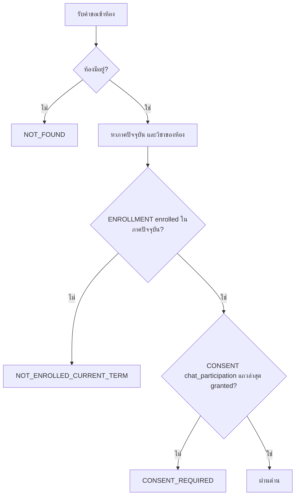
```mermaid
flowchart TD
    G0["รับคำขอเข้าห้อง"] --> G1{"ห้องมีอยู่?"}
    G1 -->|ไม่| GE0["NOT_FOUND"]
    G1 -->|ใช่| G2["หาภาคปัจจุบัน และวิชาของห้อง"]
    G2 --> G3{"ENROLLMENT enrolled ในภาคปัจจุบัน?"}
    G3 -->|ไม่| GE1["NOT_ENROLLED_CURRENT_TERM"]
    G3 -->|ใช่| G4{"CONSENT chat_participation แถวล่าสุด granted?"}
    G4 -->|ไม่| GE2["CONSENT_REQUIRED"]
    G4 -->|ใช่| G5["ผ่านด่าน"]
```

อ้างอิง: C-BR3, AC-C3, TCc-08, TCc-09. ตรวจลงทะเบียนก่อน consent (DR-G2) เพื่อให้สาเหตุที่แจ้งตรงที่สุด ระดับการเปิดเผยในข้อความปฏิเสธเป็นไปตาม CD-7

### 2.2 รูปแบบการรับมือข้อผิดพลาดร่วม

| ประเภท | พฤติกรรมระบบ | แจ้งผู้ใช้ | บันทึก |
|---|---|---|---|
| input ไม่ถูกต้อง | ปฏิเสธ ไม่เปลี่ยนข้อมูล | ระบุช่องและเหตุผล | ไม่ audit (ยกเว้นกลุ่มสำคัญ) |
| ไม่มีสิทธิ์ | ปฏิเสธก่อนอ่านข้อมูล | แจ้งว่าไม่มีสิทธิ์ใช้ฟังก์ชันนี้ | log ความล้มเหลวตามระดับ |
| ไม่พบ/ไม่ใช่ของผู้เรียก | ตอบเหมือนกันทั้งสองกรณี | แจ้งว่าไม่พบรายการ | — |
| ขัดกฎธุรกิจ/สถานะ | ปฏิเสธ ไม่เปลี่ยนข้อมูล | อธิบายสถานะปัจจุบัน | — |
| audit ล่ม (กลุ่มสำคัญ) | ปฏิเสธก่อนเปลี่ยนข้อมูล | แจ้งว่าทำรายการไม่ได้ชั่วคราว | — |
| audit ล่ม (กลุ่มอื่น) | ทำต่อและพักเหตุการณ์ส่งซ้ำ | ไม่แจ้ง | ส่งซ้ำเมื่อบริการกลับมา |
| ระบบยืนยันตัวตนล่ม | ไม่ให้เข้าระบบ ข้อมูลเดิมไม่เสียหาย | เข้าระบบไม่ได้ชั่วคราว | audit `sign_in_failed` |
| งานเบื้องหลังล้มเหลวบางราย | ข้ามรายนั้น รายอื่นทำต่อ ลองรอบถัดไป | — | บันทึกตัวระบุผู้ใช้ที่ล้มเหลว |

### 2.3 หลักความสอดคล้องของข้อมูล

- **DR-A1 Atomic ต่อหน่วยงาน:** การเปลี่ยนสถานะ + แถวผูก + แจ้งเตือนจากเหตุเดียวกันสำเร็จหรือล้มทั้งกลุ่ม (ตัดสิน nomination, ตัดสินข้อความ, ถอน consent, สร้าง ALERT)
- **DR-A2 ตรวจสถานะตอนเขียน:** เปลี่ยนสถานะเฉพาะเมื่อสถานะยังเป็นค่าเดิม ณ ขณะเขียน ผู้ตัดสินพร้อมกันคนที่สองได้ CONFLICT_STATE
- **DR-A3 ทำซ้ำได้:** ใช้คีย์ธรรมชาติและ fingerprint/dedupe_key
- **DR-A4 งานเป็นชุดแยกหน่วย:** atomic ต่อแถว/ต่อผู้ใช้ ความล้มเหลวหน่วยหนึ่งไม่ย้อนหน่วยอื่น
- **DR-A5 ผลสืบเนื่องหลัง commit:** การทริกเกอร์ evaluate-learning-risk/generate-mentor-nominations ทำหลังข้อมูลถูกยืนยัน ไม่อยู่ใน atomic เดียวกัน
- **DR-A6 audit กลุ่มสำคัญ (A-2):** ตรวจความพร้อม → บันทึก audit → ยืนยันข้อมูล; ถ้าข้อมูลล้มหลัง audit บันทึก audit ผลล้มเหลวชดเชย
- **DR-A7 แก้พร้อมกัน (CD-8):** การตั้งค่า (เกณฑ์/นโยบาย) last write ชนะ โดย audit เก็บค่าก่อน-หลังตามค่าจริง ณ ตอนเขียน

### 2.4 หลัก Security ร่วม

- **DR-S1 least privilege:** สิทธิ์ตาม database-spec §7; "mentor" คำนวณจาก MENTOR_GRANT ที่ nomination.term = ภาคปัจจุบัน ไม่เก็บเป็น role
- **DR-S2 เห็นเฉพาะของตน:** ฝั่งผู้เรียนกรองด้วยผู้ใช้ที่ยืนยันแล้วเสมอ ไม่รับตัวระบุผู้ใช้จาก input
- **DR-S3 ข้อความผิดพลาดและ log ไม่ใส่ข้อมูลอ่อนไหว:** ไม่ใส่ค่าเกรด เนื้อหาข้อความ ค่าก่อน-หลัง (อยู่ใน audit เท่านั้น)
- **DR-S4 ข้อมูลส่วนบุคคลในผลลัพธ์:** ส่งเฉพาะฟิลด์ที่จำเป็น (display_name ไม่ใช่ identity_ref ในห้องแชท)
- เข้ารหัสขณะจัดเก็บ/ส่งผ่านตามข้อจำกัดจาก requirement; **MFA แอดมิน** _(ต้องการข้อมูลเพิ่มเติมจากผู้ใช้: จุดที่ทำยังไม่ตัดสินในต้นทาง — A-14)_

## 3. ภาพรวม Operation และความซับซ้อน

| # | operation | กลุ่ม | ระดับ logic | ตารางที่เขียน | ผลข้างเคียงภายนอก | หัวข้อ |
|---|---|---|---|---|---|---|
| 1 | sign-in-with-institution-identity | A | ปานกลาง | USER | ระบบยืนยันตัวตน, audit | 4.A.1 |
| 2 | sign-out | A | ง่าย | — | audit | 4.A.2 (สั้น) |
| 3 | import-enrollments | B | ซับซ้อน | USER, COURSE, ENROLLMENT, CHAT_ROOM | audit, ทริกเกอร์ | 4.B.1 |
| 4 | import-academic-records | B | ซับซ้อน | ACADEMIC_RECORD | audit, ทริกเกอร์ | 4.B.2 |
| 5 | correct-academic-record | B | ปานกลาง | ACADEMIC_RECORD | audit (สำคัญ) | 4.B.3 |
| 6 | set-current-term | B | ปานกลาง | TERM | audit | 4.B.4 |
| 7 | evaluate-learning-risk | C | ซับซ้อน | ALERT, ALERT_CONDITION, NOTIFICATION | event | 4.C.1 |
| 8 | generate-personal-recommendation | C | ซับซ้อน | RECOMMENDATION | — | 4.C.2 |
| 9 | generate-weekly-summaries | C | ปานกลาง | WEEKLY_SUMMARY, NOTIFICATION | event | 4.C.3 |
| 10 | list-my-notifications | D | ง่าย | — | — | 4.D.1 (สั้น) |
| 11 | get-notification-detail | D | ปานกลาง | NOTIFICATION(read_at) | — | 4.D.2 |
| 12 | get-my-recommendation | D | ปานกลาง | — | — | 4.D.3 |
| 13 | get-my-weekly-summary | D | ง่าย | — | — | 4.D.4 (สั้น) |
| 14 | list-risk-rules | E | ง่าย | — | — | 4.E.1 (สั้น) |
| 15 | save-risk-rule | E | ปานกลาง | RISK_RULE | audit | 4.E.2 |
| 16 | list-mentor-criteria | E | ง่าย | — | — | 4.E.1 (สั้น) |
| 17 | save-mentor-criteria | E | ปานกลาง | MENTOR_CRITERIA | audit | 4.E.3 |
| 18 | list-retention-policies | E | ง่าย | — | — | 4.E.1 (สั้น) |
| 19 | update-retention-policy | E | ปานกลาง | RETENTION_POLICY | audit (สำคัญ) | 4.E.4 |
| 20 | generate-mentor-nominations | F | ซับซ้อน | MENTOR_NOMINATION, NOTIFICATION | event | 4.F.1 |
| 21 | list-mentor-nominations | F | ปานกลาง | — | audit (สำคัญ) | 4.F.2 |
| 22 | decide-mentor-nomination | F | ซับซ้อน | NOMINATION, GRANT, NOTIFICATION | audit (สำคัญ), event | 4.F.3 |
| 23 | get-my-mentor-status | F | ง่าย | — | — | 4.F.4 (สั้น) |
| 24 | list-my-chat-rooms | G | ง่าย | — | — | 4.G.1 (สั้น) |
| 25 | get-chat-room | G | ปานกลาง | — | — | 4.G.2 |
| 26 | list-published-messages | G | ง่าย | — | — | 4.G.3 (สั้น) |
| 27 | post-chat-message | G | ซับซ้อน | MESSAGE, NOTIFICATION | event | 4.G.4 |
| 28 | list-my-messages | G | ง่าย | — | — | 4.G.5 (สั้น) |
| 29 | list-moderation-queue | H | ง่าย | — | — | 4.H.1 (สั้น) |
| 30 | decide-message-moderation | H | ซับซ้อน | MESSAGE, MODERATION_DECISION, NOTIFICATION | audit, event | 4.H.2 |
| 31 | get-chat-activity-overview | H | ง่าย | — | — | 4.H.3 (สั้น) |
| 32 | get-current-privacy-notice | I | ง่าย | — | — | 4.I.1 (สั้น) |
| 33 | publish-privacy-notice | I | ปานกลาง | PRIVACY_NOTICE | audit | 4.I.2 |
| 34 | set-consent | I | ซับซ้อน | CONSENT_RECORD, MESSAGE | audit, event | 4.I.3 |
| 35 | list-my-consents | I | ง่าย | — | — | 4.I.4 (สั้น) |
| 36 | submit-data-subject-request | I | ปานกลาง | DATA_SUBJECT_REQUEST | audit (สำคัญ) | 4.I.5 |
| 37 | list-my-data-subject-requests | I | ง่าย | — | — | 4.I.6 (สั้น) |
| 38 | list-data-subject-requests | I | ง่าย | — | — | 4.I.6 (สั้น) |
| 39 | decide-data-subject-request | I | ปานกลาง | DATA_SUBJECT_REQUEST, NOTIFICATION | audit (สำคัญ), event | 4.I.7 |
| 40 | fulfil-data-subject-request | I | ซับซ้อน | หลายตาราง | audit (สำคัญ), data_export | 4.I.8 |
| 41 | run-retention-sweep | I | ซับซ้อน | หลายตาราง | audit | 5.2 |
| 42 | record-audit-event | J | ปานกลาง | AUDIT_LOG_ENTRY | — | 4.J.1 |
| 43 | search-audit-log | J | ปานกลาง | (audit ผ่าน 42) | audit | 4.J.2 |
| 44 | purge-expired-audit-log-entries | J | ปานกลาง | AUDIT_LOG_ENTRY (ลบ) | audit | 5.3 |

operation ระดับ "ง่าย" ไม่ลงลึกเพราะเป็นการอ่านข้อมูลตามสิทธิของผู้เรียก ไม่มีการตัดสินใจหรือผลข้างเคียง

## 4. รายละเอียดการออกแบบรายกลุ่ม Operation

### 4.A กลุ่มยืนยันตัวตน

#### 4.A.1 sign-in-with-institution-identity: เข้าสู่ระบบ

##### อ้างอิง
[[api-spec#4.1 sign-in-with-institution-identity: เข้าสู่ระบบด้วยตัวตนของสถาบัน|API 4.1]]; [[database-spec#4.1 USER|USER]]; P-BR audit (login), P-BR security; architecture Q6

##### ขั้นตอนการทำงานภายใน
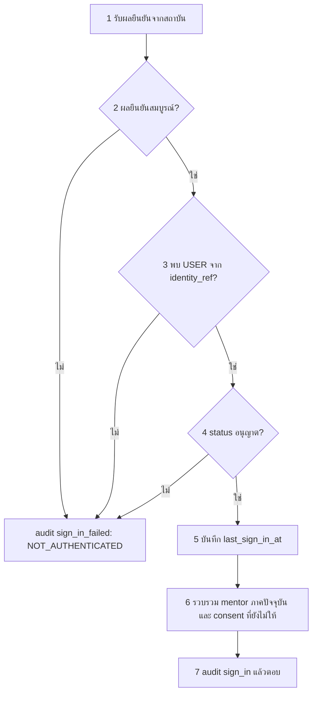
```mermaid
flowchart TD
    A1["1 รับผลยืนยันจากสถาบัน"] --> A2{"2 ผลยืนยันสมบูรณ์?"}
    A2 -->|ไม่| AE1["audit sign_in_failed: NOT_AUTHENTICATED"]
    A2 -->|ใช่| A3{"3 พบ USER จาก identity_ref?"}
    A3 -->|ไม่| AE1
    A3 -->|ใช่| A4{"4 status อนุญาต?"}
    A4 -->|ไม่| AE1
    A4 -->|ใช่| A5["5 บันทึก last_sign_in_at"]
    A5 --> A6["6 รวบรวม mentor ภาคปัจจุบัน และ consent ที่ยังไม่ให้"]
    A6 --> A7["7 audit sign_in แล้วตอบ"]
```
| ขั้น | การกระทำ | อ่าน/เขียน | เงื่อนไข/ผลลัพธ์ | อ้างอิง |
|---|---|---|---|---|
| 2 | ตรวจผลยืนยันมี identity_ref และสถานภาพ | — | ขาด/ระบบสถาบันล่ม → NOT_AUTHENTICATED | api 4.1 |
| 3 | ค้น USER ด้วย identity_ref | USER | ไม่พบ → ล้มเหลว (A-3) | arch §6 |
| 4 | `active` ผ่าน; `ended` จำกัดสิทธิ์ (A-3); `minimized/anonymized` ไม่ผ่าน | USER.status | — | P-BR retention |
| 5 | เขียน last_sign_in_at (ผูกตัวตนครั้งแรกของ shell) | USER | — | database 4.1 |
| 6 | หา grant ภาคปัจจุบัน; หาวัตถุประสงค์ consent ที่ยังไม่ granted | MENTOR_GRANT, TERM, CONSENT_RECORD | อ่านเท่านั้น | api 4.1 |

##### กฎธุรกิจและ Validation
| รหัส | ตรวจ | เงื่อนไข | ไม่ผ่าน | อ้างอิง |
|---|---|---|---|---|
| DR-1.1 | identity_ref | ตรงกับ USER เดิม ไม่สร้างผู้ใช้ตอน sign-in | NOT_AUTHENTICATED | A-3 |
| DR-1.2 | status | ตาม A-3 | NOT_AUTHENTICATED | P-BR retention |

##### Exception และ Error Handling
| กรณี | ขั้น | รับมือ | แจ้งผู้ใช้ | สถานะข้อมูล | test |
|---|---|---|---|---|---|
| ระบบสถาบันล่ม | 2 | ปฏิเสธ | เข้าระบบไม่ได้ชั่วคราว | ไม่เปลี่ยน | _(ไม่มี — testGaps)_ |
| ไม่รู้จักตัวตน | 3 | ปฏิเสธ | ไม่พบสิทธิ์ใช้งาน ติดต่อผู้ดูแล | ไม่เปลี่ยน | _(ไม่มี)_ |
| audit ล่ม | 7 | ทำต่อ ส่ง log ซ้ำ | — | คงไว้ | _(ไม่มี)_ |

##### Security เฉพาะจุด
| ประเด็น | ขั้น | มาตรการ | อ้างอิง |
|---|---|---|---|
| ไม่เก็บรหัสผ่าน | 1-2 | พึ่งผลยืนยันของสถาบัน | arch Q6 |
| ไม่แยกแยะ "ไม่พบผู้ใช้" กับ "สถานะไม่ผ่าน" | 3-4 | ข้อความเดียวกัน กันไล่ตรวจตัวตน | P-BR security |
| actor ว่างใน log ล้มเหลว | 2-4 | บันทึก actor เป็นไม่ทราบ | api 4.42 |

##### ผลข้างเคียงและการเชื่อมต่อภายนอก
ระบบยืนยันตัวตนของสถาบัน (ล่ม = เข้าไม่ได้ ข้อมูลเดิมไม่เสียหาย ตาม [[api-spec#7. การเชื่อมต่อระบบภายนอก|API §7]]); audit `sign_in`/`sign_in_failed`

#### 4.A.2 sign-out (สั้น)
ปิดเซสชันแล้วบันทึก audit `sign_out` (กลุ่มอื่น ล้มเหลวไม่ขวางการออก) ไม่แตะตารางธุรกิจ จึงไม่ลงลึกต่อ อ้าง P-BR audit

### 4.B กลุ่มนำเข้าข้อมูลการเรียน

#### 4.B.1 import-enrollments: นำเข้าวิชา ภาค การลงทะเบียน

##### อ้างอิง
[[api-spec#4.3 import-enrollments: นำเข้าวิชา ภาค และการลงทะเบียน|API 4.3]]; USER, COURSE, TERM, ENROLLMENT, CHAT_ROOM; F-R1, F-C1, F-C2; AC-C3; C-BR2, C-BR3; Q8 ต้นทาง; D-06 / CD-6

##### ขั้นตอนการทำงานภายใน
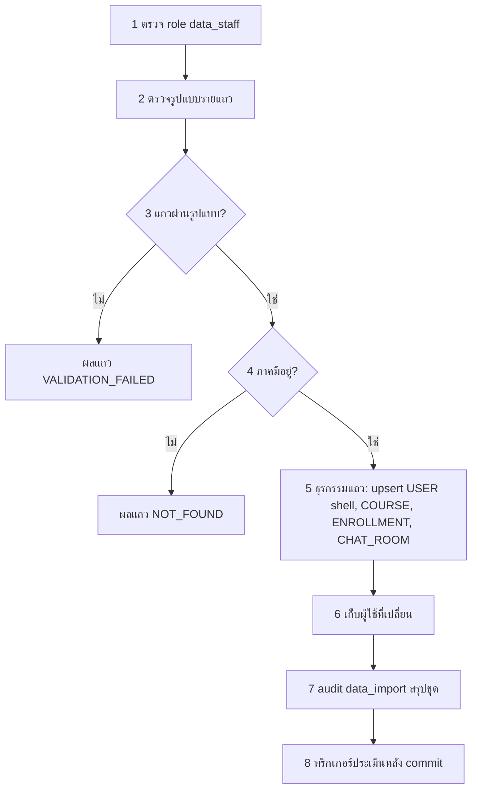
```mermaid
flowchart TD
    B1["1 ตรวจ role data_staff"] --> B2["2 ตรวจรูปแบบรายแถว"]
    B2 --> B3{"3 แถวผ่านรูปแบบ?"}
    B3 -->|ไม่| BR1["ผลแถว VALIDATION_FAILED"]
    B3 -->|ใช่| B4{"4 ภาคมีอยู่?"}
    B4 -->|ไม่| BR2["ผลแถว NOT_FOUND"]
    B4 -->|ใช่| B5["5 ธุรกรรมแถว: upsert USER shell, COURSE, ENROLLMENT, CHAT_ROOM"]
    B5 --> B6["6 เก็บผู้ใช้ที่เปลี่ยน"]
    B6 --> B7["7 audit data_import สรุปชุด"]
    B7 --> B8["8 ทริกเกอร์ประเมินหลัง commit"]
```
| ขั้น | การกระทำ | อ่าน/เขียน | เงื่อนไข/ผลลัพธ์ | อ้างอิง |
|---|---|---|---|---|
| 1 | ตรวจ role | USER | ไม่ใช่ data_staff → FORBIDDEN_ROLE ทั้งคำขอ | api 4.3 |
| 2 | identity_ref/รหัสวิชา/ชื่อ/รหัสภาค ไม่ว่าง; สถานะ ∈ {enrolled, dropped}; สถานภาพ ∈ {active, ended} และ ended ต้องมีวันที่ | — | แถวไม่ผ่านถูกข้าม | database 4.1, 4.5 |
| 4 | ค้น TERM ด้วย term_code | TERM | ไม่พบ → NOT_FOUND รายแถว (CD-6) | D-06 |
| 5a | upsert USER ตาม identity_ref (ไม่พบ → shell role `student`, category `student`); อัปเดต status/status_ended_at ถ้าส่งมา | USER, USER_CATEGORY(อ่าน) | ห้ามเขียนทับ role ผู้ใช้เดิม | database 4.1 |
| 5b | upsert COURSE ตาม course_code | COURSE | วิชาใหม่ → 5d | C-BR2 |
| 5c | upsert ENROLLMENT ตาม (user, course, term) พร้อม enrolled_at/dropped_at | ENROLLMENT | dropped→enrolled อนุญาตเมื่อนำเข้าใหม่ | database 4.5 |
| 5d | สร้าง CHAT_ROOM 1 ห้องต่อวิชาที่เพิ่งสร้าง | CHAT_ROOM | UK(course_id) | C-BR2, AC-C3 |

##### กฎธุรกิจและ Validation
| รหัส | ตรวจ | เงื่อนไข | ไม่ผ่าน | อ้างอิง |
|---|---|---|---|---|
| DR-3.1 | รูปแบบแถว | ตามขั้น 2 | VALIDATION_FAILED รายแถว | api 4.3 |
| DR-3.2 | ภาค | ต้องมี TERM แล้ว ระบบนี้ไม่สร้างภาคจากการนำเข้า (CD-6) | NOT_FOUND รายแถว | D-06 |
| DR-3.3 | คีย์ซ้ำในชุด | ใช้แถวหลังสุด | — | Q8 ต้นทาง |

##### Exception และ Error Handling
| กรณี | ขั้น | รับมือ | แจ้ง | สถานะ | test |
|---|---|---|---|---|---|
| ไม่ใช่ data_staff | 1 | ปฏิเสธทั้งคำขอ | ไม่มีสิทธิ์ | ไม่เปลี่ยน | _(ไม่มี)_ |
| แถวเสียบางส่วน | 2-4 | ข้ามแถว ทำต่อ | ผลรายแถว | แถวที่ผ่านคงไว้ | _(ไม่มี)_ |
| ภาคใหม่ที่ยังไม่มีใน TERM | 4 | ปฏิเสธรายแถว; **ภาคใหม่นำเข้าไม่ได้จนกว่าต้นทางจะมีวิธีสร้าง TERM** (ควรรัน `/sync-api-db` ภายหลัง) | NOT_FOUND ระบุรหัสภาค | ไม่เขียน | _(ไม่มี)_ |
| ถอนวิชากลางภาค | 5c | status=dropped ทันที (A-15: ไม่มีดีเลย์) ห้อง/สิทธิ์หายทันที | — | ข้อความเดิมคงอยู่ | _(ไม่มี)_ |
| นำเข้าซ้ำ | ทั้งหมด | upsert ไม่สร้างซ้ำ ไม่ทริกเกอร์ผู้ที่ไม่เปลี่ยน | จำนวนสร้าง/แก้ | เท่าเดิม | _(ไม่มี)_ |

##### Security เฉพาะจุด
| ประเด็น | ขั้น | มาตรการ | อ้างอิง |
|---|---|---|---|
| input ไม่น่าเชื่อถือ | 2 | ตรวจชนิด/ความยาวก่อนเขียน | P-BR security |
| ผลรายแถวไม่เปิดข้อมูลจากฐาน | ผลลัพธ์ | แสดงเลขแถวและค่าที่ผู้ส่งส่งมาเอง | DR-S3 |

##### ผลข้างเคียงและการเชื่อมต่อภายนอก
audit `data_import` (กลุ่มอื่น); หลัง commit ทริกเกอร์ evaluate-learning-risk และ generate-mentor-nominations; ไม่มีระบบภายนอก

#### 4.B.2 import-academic-records: นำเข้าผลการเรียน

##### อ้างอิง
[[api-spec#4.4 import-academic-records: นำเข้าผลการเรียน การเข้าเรียน การส่งงาน|API 4.4]]; [[database-spec#4.6 ACADEMIC_RECORD|ACADEMIC_RECORD]]; R-US1, R-US2, R-BR1; AC-R1, AC-R2; TS-01..TS-04; Q5, Q8 ต้นทาง; D-01 / CD-1

##### ขั้นตอนการทำงานภายใน
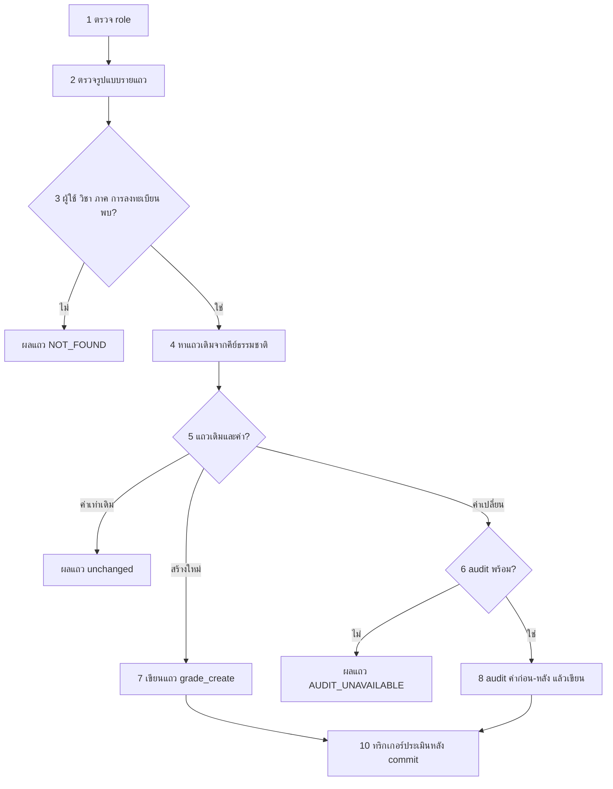
```mermaid
flowchart TD
    C1["1 ตรวจ role"] --> C2["2 ตรวจรูปแบบรายแถว"]
    C2 --> C3{"3 ผู้ใช้ วิชา ภาค การลงทะเบียน พบ?"}
    C3 -->|ไม่| CE1["ผลแถว NOT_FOUND"]
    C3 -->|ใช่| C4["4 หาแถวเดิมจากคีย์ธรรมชาติ"]
    C4 --> C5{"5 แถวเดิมและค่า?"}
    C5 -->|ค่าเท่าเดิม| C9["ผลแถว unchanged"]
    C5 -->|สร้างใหม่| C7["7 เขียนแถว grade_create"]
    C5 -->|ค่าเปลี่ยน| C6{"6 audit พร้อม?"}
    C6 -->|ไม่| CE2["ผลแถว AUDIT_UNAVAILABLE"]
    C6 -->|ใช่| C8["8 audit ค่าก่อน-หลัง แล้วเขียน"]
    C7 --> C10["10 ทริกเกอร์ประเมินหลัง commit"]
    C8 --> C10
```
| ขั้น | การกระทำ | อ่าน/เขียน | เงื่อนไข | อ้างอิง |
|---|---|---|---|---|
| 2 | course_grade/cumulative_gpa/assessment_score ต้องมี value ≥ 0; attendance 0-100; assignment_submission ต้องมี submission_status+item_ref; cumulative_gpa course_id ว่าง ชนิดอื่นต้องมี | — | VALIDATION_FAILED รายแถว | database 4.6 |
| 3 | ค้น USER, COURSE, TERM; แถวรายวิชาต้องมี ENROLLMENT (A-16) | USER, COURSE, TERM, ENROLLMENT | NOT_FOUND รายแถว | api 4.4 |
| 4 | คีย์ (user, course, term, record_type, period_index, item_ref); แถว voided → VALIDATION_FAILED (ให้ใช้ correct-academic-record) | ACADEMIC_RECORD | — | database 4.6 |
| 6 | แถวที่ค่าเปลี่ยนต้อง audit สำเร็จก่อนเขียน; ไม่พร้อม → ปฏิเสธเฉพาะแถวนั้น (CD-1) | — | AUDIT_UNAVAILABLE รายแถว | D-01 |
| 7-8 | retention_policy_id: course_grade/cumulative_gpa → permanent_academic_record; ชนิดอื่น → student_personal_data; recorded_by; import_batch_ref | RETENTION_POLICY(อ่าน), ACADEMIC_RECORD | — | database §6 |

##### กฎธุรกิจและ Validation
| รหัส | ตรวจ | เงื่อนไข | ไม่ผ่าน | อ้างอิง |
|---|---|---|---|---|
| DR-4.1 | ค่าตัวเลข | ไม่ติดลบ ไม่ว่าง เป็นตัวเลข | VALIDATION_FAILED | api 4.4 |
| DR-4.2 | อัตราเข้าเรียน | 0-100 | VALIDATION_FAILED | database 4.6 |
| DR-4.3 | ค่าเท่าเดิม | ไม่เขียน ไม่ audit ไม่ทริกเกอร์ | — | DR-A3 |
| DR-4.4 | แถวที่ค่าเปลี่ยน | audit ก่อนเขียนเสมอ (กลุ่มสำคัญ) | AUDIT_UNAVAILABLE รายแถว | CD-1, P-BR audit |

##### Exception และ Error Handling
| กรณี | ขั้น | รับมือ | แจ้ง | สถานะ | test |
|---|---|---|---|---|---|
| ค่าติดลบ/นอกช่วง | 2 | ข้ามแถว | เหตุผลรายแถว | ไม่เขียน | _(TS-13 ครอบเฉพาะเกณฑ์ — testGaps)_ |
| ผู้ใช้/วิชา/ภาคไม่รู้จัก | 3 | ข้ามแถว | NOT_FOUND | ไม่เขียน | _(ไม่มี)_ |
| audit ล่มกับแถวที่ค่าเปลี่ยน | 6 | ปฏิเสธแถว แถวสร้างใหม่/ค่าเท่าเดิมทำต่อ | AUDIT_UNAVAILABLE รายแถว นำเข้าซ้ำภายหลัง | ไม่เขียนแถวนั้น | _(ไม่มี)_ |
| ข้อมูลน้อยกว่า min_history | — | บันทึกตามปกติ | — | — | TS-09 |
| ค่าที่ทำให้เข้าเงื่อนไขเสี่ยง | 10 | ทริกเกอร์ประเมิน | — | — | TS-01..TS-04 |

##### Security เฉพาะจุด
เฉพาะ data_staff เขียน; ค่าก่อน-หลังอยู่ใน audit ไม่ใส่ในผลแถว (DR-S3); การนำเข้าที่เปลี่ยนเกรดถือเป็น grade_update (P-BR audit)

##### ผลข้างเคียงและการเชื่อมต่อภายนอก
audit `grade_create`/`grade_update` ต่อแถวและ `data_import` ต่อชุด; ทริกเกอร์ evaluate-learning-risk/generate-mentor-nominations หลัง commit; ไม่ผูกระบบภายนอก

#### 4.B.3 correct-academic-record: แก้/ยกเลิกรายการเดียว

##### อ้างอิง
[[api-spec#4.5 correct-academic-record: แก้ไขหรือยกเลิกข้อมูลการเรียนรายการเดียว|API 4.5]]; P-BR audit; P-US1; Q5, Q8 ต้นทาง

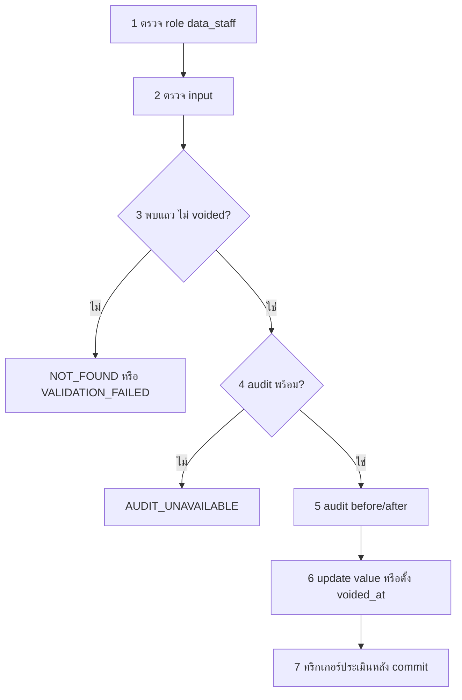
```mermaid
flowchart TD
    D1["1 ตรวจ role data_staff"] --> D2["2 ตรวจ input"]
    D2 --> D3{"3 พบแถว ไม่ voided?"}
    D3 -->|ไม่| DE["NOT_FOUND หรือ VALIDATION_FAILED"]
    D3 -->|ใช่| D4{"4 audit พร้อม?"}
    D4 -->|ไม่| DE2["AUDIT_UNAVAILABLE"]
    D4 -->|ใช่| D5["5 audit before/after"]
    D5 --> D6["6 update value หรือตั้ง voided_at"]
    D6 --> D7["7 ทริกเกอร์ประเมินหลัง commit"]
```
| ขั้น | การกระทำ | เขียน | เงื่อนไข |
|---|---|---|---|
| 2 | การกระทำ ∈ {update, void}; เหตุผลไม่ว่าง; update ต้องมีค่าใหม่ ≥ 0 (attendance ≤ 100) | — | VALIDATION_FAILED |
| 3 | แถว voided แล้ว หรือ assignment_submission ที่ขอ update ค่าตัวเลข → VALIDATION_FAILED (A-11) | — | — |
| 6 | update → เปลี่ยน value; void → voided_at (ไม่ลบจริง) | ACADEMIC_RECORD | ห้ามลบจริง |

กฎ: DR-5.1 ห้ามลบจริง; DR-5.2 audit สำเร็จก่อนยืนยัน (กลุ่มสำคัญ); DR-5.3 ค่าไม่ติดลบ. Exception: ไม่ใช่ data_staff → FORBIDDEN_ROLE; ไม่พบ → NOT_FOUND; audit ล่ม → AUDIT_UNAVAILABLE ไม่เปลี่ยนข้อมูล (test: _(ไม่มี)_). Security: เหตุผลเก็บใน audit; ค่าก่อน-หลังไม่ปรากฏในข้อความผิดพลาด. ผลข้างเคียง: audit `grade_update`/`grade_delete`; ทริกเกอร์ประเมิน

#### 4.B.4 set-current-term: ตั้งภาคปัจจุบัน

อ้างอิง [[api-spec#4.6 set-current-term: ตั้งภาคการศึกษาปัจจุบัน|API 4.6]]; [[database-spec#4.3 TERM|TERM]]; C-BR3; AC-C3; Q1, Q3 ต้นทาง

| ขั้น | การกระทำ | อ่าน/เขียน | เงื่อนไข |
|---|---|---|---|
| 1 | ตรวจ role admin | — | FORBIDDEN_ROLE |
| 2 | ตรวจภาคมีอยู่ | TERM | NOT_FOUND |
| 3 | เป็นภาคปัจจุบันอยู่แล้ว → ตอบเดิม ไม่ audit | TERM | DR-A3 |
| 4 | atomic: is_current เดิม=เท็จ ภาคใหม่=จริง ในหน่วยเดียว | TERM | DR-6.1 |
| 5 | audit `config_change` ค่าก่อน-หลัง | — | กลุ่มอื่น |

กฎ: DR-6.1 is_current จริงได้หนึ่งแถว; DR-6.2 สิทธิ์ mentor ของภาคเก่าหมดโดยคำนวณ ไม่เขียน MENTOR_GRANT (Q3 ต้นทาง) และสิทธิ์ห้องเปลี่ยนทันทีตาม ENROLLMENT ภาคใหม่. Exception: ภาคไม่มี → NOT_FOUND; สลับกลับภาคเก่าอนุญาต (grant ภาคนั้นกลับมามีผล — พฤติกรรมที่ทราบ). Security: เฉพาะ admin. test: _(ไม่มี — testGaps 5)_

### 4.C กลุ่มประเมินและคำแนะนำ

#### 4.C.1 evaluate-learning-risk: ประเมินความเสี่ยง

##### อ้างอิง
[[api-spec#4.7 evaluate-learning-risk: ประเมินความเสี่ยงการเรียน|API 4.7]]; R-BR1, R-BR2, R-BR4; AC-R1, AC-R4; TS-01..TS-06, TS-12, TS-14; architecture Q3; Q2 ต้นทาง; D-04 / CD-4

##### ขั้นตอนการทำงานภายใน
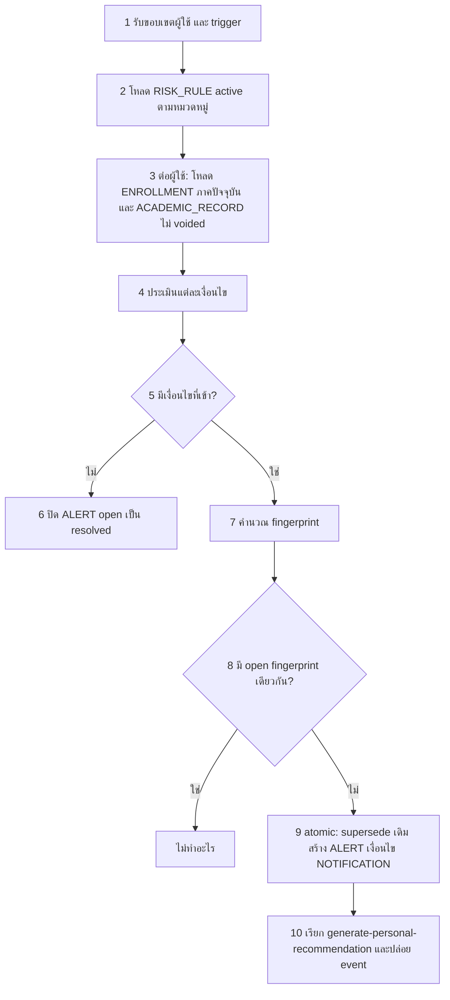
```mermaid
flowchart TD
    E1["1 รับขอบเขตผู้ใช้ และ trigger"] --> E2["2 โหลด RISK_RULE active ตามหมวดหมู่"]
    E2 --> E3["3 ต่อผู้ใช้: โหลด ENROLLMENT ภาคปัจจุบัน และ ACADEMIC_RECORD ไม่ voided"]
    E3 --> E4["4 ประเมินแต่ละเงื่อนไข"]
    E4 --> E5{"5 มีเงื่อนไขที่เข้า?"}
    E5 -->|ไม่| E6["6 ปิด ALERT open เป็น resolved"]
    E5 -->|ใช่| E7["7 คำนวณ fingerprint"]
    E7 --> E8{"8 มี open fingerprint เดียวกัน?"}
    E8 -->|ใช่| E9["ไม่ทำอะไร"]
    E8 -->|ไม่| E10["9 atomic: supersede เดิม สร้าง ALERT เงื่อนไข NOTIFICATION"]
    E10 --> E11["10 เรียก generate-personal-recommendation และปล่อย event"]
```
| ขั้น | การกระทำ | อ่าน/เขียน | เงื่อนไข/ผลลัพธ์ | อ้างอิง |
|---|---|---|---|---|
| 2 | โหลดเกณฑ์ ณ เริ่มรอบ (ค่าเดียวตลอดรอบ) | RISK_RULE | ไม่ hardcode | R-BR2, AC-R4 |
| 4a | gpa: cumulative_gpa ล่าสุด < threshold | ACADEMIC_RECORD | เท่าเกณฑ์ไม่เข้า (TS-01) | AC-R1 |
| 4b | attendance: ต่อวิชา ค่าล่าสุด < threshold | ACADEMIC_RECORD | เท่าเกณฑ์ไม่เข้า (TS-02) | AC-R1 |
| 4c | missed: ต่อวิชา นับ missed ≥ threshold | ACADEMIC_RECORD | TS-03 | AC-R1 |
| 4d | trend: ต่อวิชา assessment_score ตาม period_index ลดลงติดกัน ≥ threshold ครั้ง และช่วงข้อมูล ≥ min_history_periods (ไม่พอ → ข้ามเงื่อนไขนี้) | ACADEMIC_RECORD | TS-04: 80→75 ไม่เข้า; 80→75→68 เข้า | AC-R1, AC-R2 |
| 7 | fingerprint = ชุด (rule_id, course_id) เรียงลำดับ (A-5) | — | — | database 4.8 |
| 9 | ชุดไม่ว่างที่ต่างจาก open เดิม → ALERT ใหม่ + ALERT_CONDITION (actual_value, threshold_snapshot) + NOTIFICATION `risk_alert` 1 รายการ (CD-4); หลายเงื่อนไข → ALERT เดียว | ALERT, ALERT_CONDITION, NOTIFICATION | TS-06 | Q2 ต้นทาง |

##### กฎธุรกิจและ Validation
| รหัส | กฎ | ไม่ผ่าน | อ้างอิง |
|---|---|---|---|
| DR-7.1 | ประเมินเฉพาะ role student, status active, enrolled ภาคปัจจุบัน | ข้ามผู้ใช้ | api 4.7 |
| DR-7.2 | ไม่เข้าเงื่อนไขเลย → ไม่แจ้ง และปิด ALERT open | — | TS-05 |
| DR-7.3 | fingerprint เดิมที่ open → ไม่สร้างซ้ำ/ไม่แจ้งซ้ำ (ทั้ง data_change และ scheduled) | — | AC-R1 edge, CD-4 |
| DR-7.4 | threshold_snapshot คัดลอกจากเกณฑ์ ณ รอบ ห้ามแก้ภายหลัง | — | TS-14 |
| DR-7.5 | เกณฑ์ is_active=false ไม่ถูกประเมิน | — | database 4.7 |
| DR-7.6 | fingerprint เปลี่ยนเป็นชุดไม่ว่าง → ALERT เก่า superseded + NOTIFICATION ใหม่ | — | CD-4 |

##### Exception และ Error Handling
| กรณี | ขั้น | รับมือ | สถานะ | test |
|---|---|---|---|---|
| ไม่เข้าเงื่อนไขเลย | 5 | ปิด open ไม่แจ้ง | ไม่มี NOTIFICATION | TS-05 |
| หลายเงื่อนไขพร้อมกัน | 7-9 | ALERT เดียว | 1 NOTIFICATION | TS-06 |
| เปลี่ยนเกณฑ์ขณะมีแจ้งเตือนค้าง | 2 | ใช้เกณฑ์ใหม่เฉพาะรอบนี้ ไม่แตะ snapshot | NOTIFICATION เดิมคงเดิม | TS-12, TS-14 |
| ประเมินทันทีกับตามรอบซ้อนกัน | 8 | fingerprint + ธุรกรรมต่อผู้ใช้ | — | TS-06 บางส่วน (testGaps 7) |
| ข้อมูลย้อนหลังไม่พอ | 4d | ข้ามแนวโน้ม | — | TS-09 |
| ล้มระหว่างผู้ใช้ | 9 | ย้อนกลับผู้ใช้นั้น ลองรอบถัดไป | ไม่มีแถวครึ่งๆ | _(ไม่มี)_ |

##### Security เฉพาะจุด
NOTIFICATION ถึงเจ้าของเท่านั้น; log ล้มเหลวเก็บเฉพาะตัวระบุผู้ใช้ ไม่ใส่ค่าเกรด (DR-S3)

##### ผลข้างเคียงและการเชื่อมต่อภายนอก
event `learning-risk-detected`; เรียก generate-personal-recommendation; ช่องส่งออก in-app เท่านั้น

#### 4.C.2 generate-personal-recommendation: สร้างคำแนะนำ

อ้างอิง [[api-spec#4.8 generate-personal-recommendation: สร้างคำแนะนำเฉพาะบุคคล|API 4.8]]; R-US2, R-BR3; AC-R2; TS-08, TS-09

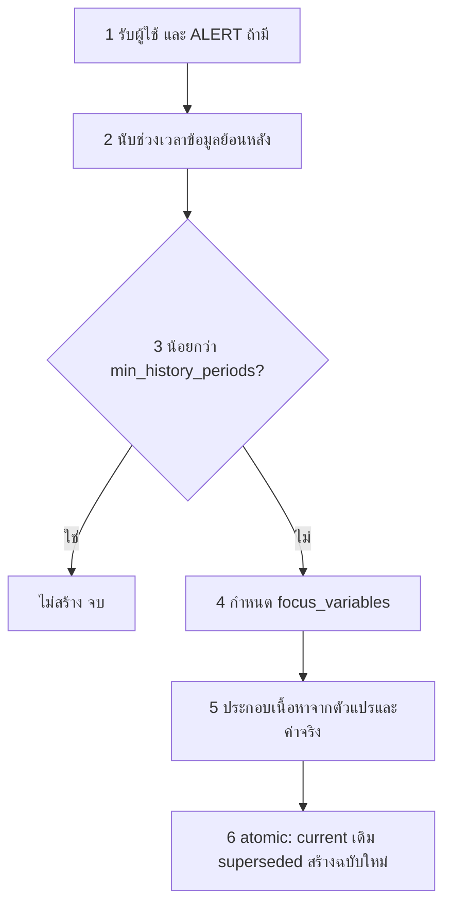
```mermaid
flowchart TD
    F1["1 รับผู้ใช้ และ ALERT ถ้ามี"] --> F2["2 นับช่วงเวลาข้อมูลย้อนหลัง"]
    F2 --> F3{"3 น้อยกว่า min_history_periods?"}
    F3 -->|ใช่| F4["ไม่สร้าง จบ"]
    F3 -->|ไม่| F5["4 กำหนด focus_variables"]
    F5 --> F6["5 ประกอบเนื้อหาจากตัวแปรและค่าจริง"]
    F6 --> F7["6 atomic: current เดิม superseded สร้างฉบับใหม่"]
```
| ขั้น | การกระทำ | อ่าน/เขียน | เงื่อนไข |
|---|---|---|---|
| 2 | basis_period_count = จำนวน period_index ที่ต่างกัน (ไม่รวม voided) | ACADEMIC_RECORD | — |
| 3 | น้อยกว่า min_history_periods → ไม่สร้าง (เท่ากับผ่าน A-4) | RISK_RULE | TS-09 |
| 4 | focus_variables = ตัวแปรจาก ALERT_CONDITION; ไม่มี ALERT → ตัวแปรที่ใกล้เกณฑ์ที่สุด (A-6) | ALERT, ALERT_CONDITION | ห้ามว่าง |
| 5 | ประกอบจากส่วนเนื้อหาเฉพาะตัวแปรผสมค่าจริงของผู้ใช้ (A-7) | — | TS-08 |

กฎ: DR-8.1 อ้างเฉพาะ focus_variables (R-BR3); DR-8.2 ห้ามข้อความสำเร็จรูปเดียวกัน; DR-8.3 หนึ่ง current ต่อผู้ใช้. Exception: ข้อมูลไม่พอ → ไม่สร้าง (ผลอ่านเป็น fallback — TS-09); ล้มเหลว → ไม่กระทบ ALERT/NOTIFICATION ลองรอบถัดไป. Security: เห็นเฉพาะเจ้าของ

#### 4.C.3 generate-weekly-summaries: สรุปรายสัปดาห์

อ้างอิง [[api-spec#4.9 generate-weekly-summaries: สร้างสรุปรายสัปดาห์|API 4.9]]; R-US3, R-BR4; AC-R3; TS-10, TS-11

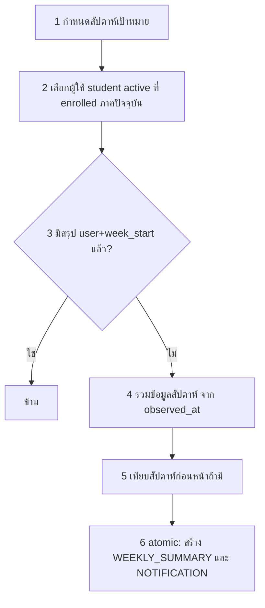
```mermaid
flowchart TD
    W1["1 กำหนดสัปดาห์เป้าหมาย"] --> W2["2 เลือกผู้ใช้ student active ที่ enrolled ภาคปัจจุบัน"]
    W2 --> W3{"3 มีสรุป user+week_start แล้ว?"}
    W3 -->|ใช่| W4["ข้าม"]
    W3 -->|ไม่| W5["4 รวมข้อมูลสัปดาห์ จาก observed_at"]
    W5 --> W6["5 เทียบสัปดาห์ก่อนหน้าถ้ามี"]
    W6 --> W7["6 atomic: สร้าง WEEKLY_SUMMARY และ NOTIFICATION"]
```
กฎ: DR-9.1 หนึ่งสรุปต่อ (user, week_start); DR-9.2 comparison อย่างน้อย 1 ตัวแปรเมื่อมีข้อมูลสัปดาห์ก่อน ไม่มี → ละส่วนเปรียบเทียบ ไม่ถือผิดพลาด (TS-11); DR-9.3 ห้ามแก้ภายหลัง; DR-9.4 ไม่มีข้อมูลสัปดาห์เลย → สร้างสรุปที่ระบุว่าไม่มีข้อมูล (A-17). Exception: รันซ้ำไม่สร้าง/ไม่แจ้งซ้ำ (testGaps 9); ล้มต่อผู้ใช้ข้ามได้. Security: เจ้าของเท่านั้น. ผลข้างเคียง: NOTIFICATION `weekly_summary_ready`, event `weekly-summary-ready`

### 4.D กลุ่มแจ้งเตือนฝั่งผู้เรียน

#### 4.D.1 list-my-notifications (สั้น)
กรอง recipient = ผู้เรียก (DR-S2), กรองอ่าน/ชนิด, แบ่งหน้าใหม่→เก่า, นับ unread; อ่านอย่างเดียวจึงไม่ลงลึก; AC-R1

#### 4.D.2 get-notification-detail: ดูรายละเอียด

อ้างอิง [[api-spec#4.11 get-notification-detail: ดูรายละเอียดการแจ้งเตือน|API 4.11]]; AC-R1, AC-R4 edge; TS-07, TS-14

| ขั้น | การกระทำ | อ่าน/เขียน | เงื่อนไข |
|---|---|---|---|
| 1 | หา NOTIFICATION ด้วย id AND recipient=ผู้เรียก | NOTIFICATION | ไม่พบ/ของผู้อื่น → NOT_FOUND (ตอบเหมือนกัน) |
| 2 | ตามชนิด: risk_alert → ALERT_CONDITION (ชื่อเงื่อนไขจาก rule_type, actual_value, threshold_snapshot) + ลิงก์ RECOMMENDATION current; weekly_summary_ready → WEEKLY_SUMMARY; mentor_decision → MENTOR_NOMINATION (ผล/เหตุผล reject); message_status → MESSAGE + เหตุผล reject; data_subject_request_update → สถานะ | ตารางต้นทางตามชนิด | เนื้อหาเงื่อนไขมาจาก snapshot ไม่ใช่เกณฑ์ปัจจุบัน (DR-11.1) |
| 3 | ตั้ง read_at เฉพาะเมื่อยังว่าง (DR-11.2) | NOTIFICATION | ทำซ้ำได้ |

Exception: ต้นทางถูกลบตาม retention → แสดง title/body ที่เก็บไว้และแจ้งว่ารายละเอียดต้นทางไม่มีแล้ว (A-18); ไม่มีคำแนะนำ → ลิงก์ไปหน้าคำแนะนำที่แสดง fallback. Security: ตรวจ recipient ก่อนอ่านต้นทาง. ผลข้างเคียง: เขียน read_at

#### 4.D.3 get-my-recommendation: ดูคำแนะนำ

อ้างอิง [[api-spec#4.12 get-my-recommendation: ดูคำแนะนำเฉพาะบุคคลของฉัน|API 4.12]]; AC-R2; TS-08, TS-09

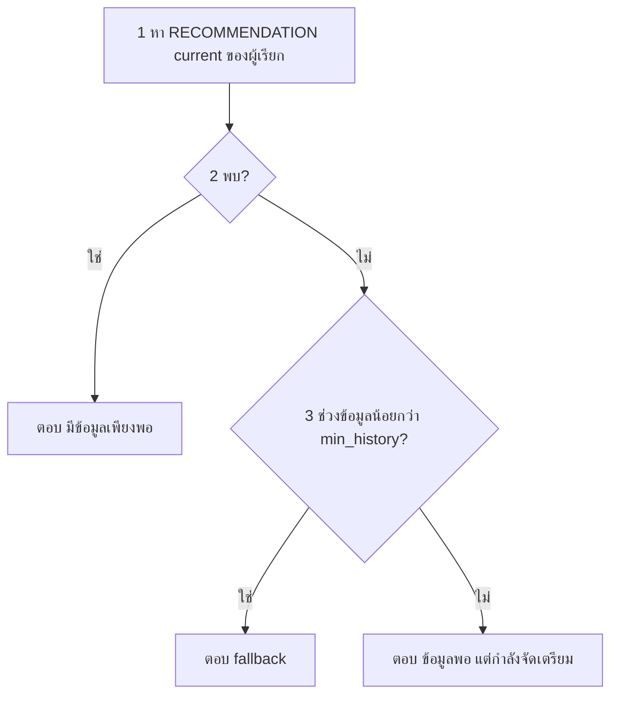
```mermaid
flowchart TD
    H1["1 หา RECOMMENDATION current ของผู้เรียก"] --> H2{"2 พบ?"}
    H2 -->|ใช่| H3["ตอบ มีข้อมูลเพียงพอ"]
    H2 -->|ไม่| H4{"3 ช่วงข้อมูลน้อยกว่า min_history?"}
    H4 -->|ใช่| H5["ตอบ fallback"]
    H4 -->|ไม่| H6["ตอบ ข้อมูลพอ แต่กำลังจัดเตรียม"]
```
กฎ: DR-12.1 ข้อมูลไม่พอ → ข้อความ fallback ไม่ใช่หน้าว่าง/error; DR-12.2 เท่ากับ min_history ถือว่าพอ (TS-09 ขั้น 6); DR-12.3 ไม่คำนวณในฝั่งอ่าน (A-19). ALERT ที่ระบุต้องเป็นของผู้เรียก มิฉะนั้น NOT_FOUND. Security: เจ้าของเท่านั้น

#### 4.D.4 get-my-weekly-summary (สั้น)
อ่าน WEEKLY_SUMMARY ของผู้เรียกตามสัปดาห์ (ค่าเริ่มต้นล่าสุด) พร้อมรายการสัปดาห์ที่เลือกได้; ไม่พบ → NOT_FOUND ที่คืนคำอธิบาย; AC-R3, TS-10, TS-11

### 4.E กลุ่มตั้งค่า

#### 4.E.1 list-risk-rules, list-mentor-criteria, list-retention-policies (สั้น)
ตรวจ role admin แล้วอ่าน RISK_RULE+USER_CATEGORY / MENTOR_CRITERIA+COURSE / RETENTION_POLICY ตามตัวกรอง ไม่เขียน ไม่ audit การอ่าน (ข้อมูลไม่ใช่ข้อมูลส่วนบุคคล); error: FORBIDDEN_ROLE, list-mentor-criteria วิชาไม่พบ → NOT_FOUND. อ้าง AC-R4 (TS-12 ขั้น 1), AC-C1, P-BR retention

#### 4.E.2 save-risk-rule: บันทึกเกณฑ์แจ้งเตือน

อ้างอิง [[api-spec#4.15 save-risk-rule: บันทึกเกณฑ์แจ้งเตือน|API 4.15]]; [[database-spec#4.7 RISK_RULE|RISK_RULE]]; R-US4, R-BR2; AC-R4, AC-R5; TS-12, TS-13, TS-14; CD-8

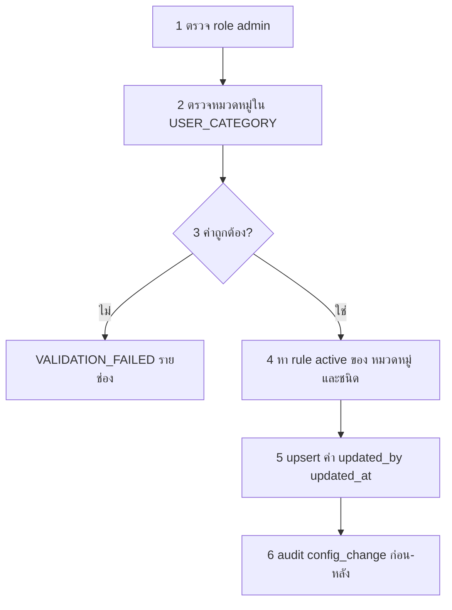
```mermaid
flowchart TD
    I1["1 ตรวจ role admin"] --> I2["2 ตรวจหมวดหมู่ใน USER_CATEGORY"]
    I2 --> I3{"3 ค่าถูกต้อง?"}
    I3 -->|ไม่| IE["VALIDATION_FAILED รายช่อง"]
    I3 -->|ใช่| I4["4 หา rule active ของ หมวดหมู่ และชนิด"]
    I4 --> I5["5 upsert ค่า updated_by updated_at"]
    I5 --> I6["6 audit config_change ก่อน-หลัง"]
```
| ขั้น | การกระทำ | เงื่อนไข |
|---|---|---|
| 3 | ลำดับตรวจ: ว่าง → ไม่ใช่ตัวเลข → ติดลบ → ช่วง (attendance 0-100; min_history_periods จำนวนเต็ม ≥ 1) | ข้อความเฉพาะต่อกรณี (TS-13) |
| 4-5 | UK (category, rule_type) active; ไม่มี → สร้าง; มี → แก้ (ไม่ย้อนแก้ ALERT/NOTIFICATION เดิม) | DR-15.1 |

กฎ: DR-15.2 ค่าไม่ถูกต้องห้ามเปลี่ยนค่าเดิม (TS-13 ขั้น 5); DR-15.3 ไม่ทริกเกอร์ประเมินทันที มีผลรอบถัดไป (AC-R4, TS-12); DR-15.4 ปิดเกณฑ์ด้วย is_active=false ได้. Exception: หมวดหมู่ไม่มี → NOT_FOUND; แอดมินสองคนแก้พร้อมกัน → last write ชนะ (CD-8). Security: เฉพาะ admin. ผลข้างเคียง: audit `config_change` (กลุ่มอื่น)

#### 4.E.3 save-mentor-criteria: บันทึกเกณฑ์เสนอชื่อ mentor

อ้างอิง [[api-spec#4.17 save-mentor-criteria: บันทึกเกณฑ์เสนอชื่อ mentor|API 4.17]]; C-BR1; AC-C1; TCc-03; D-03 / CD-3. ขั้นตอน: ตรวจ role admin → ถ้าระบุวิชาต้องมี (NOT_FOUND) → criteria_type ∈ enum และค่า ≥ 0 ไม่ว่าง (VALIDATION_FAILED) → upsert ตาม UK (course_id, criteria_type) active → audit `config_change`. กฎ: DR-17.1 มีผลรอบเสนอชื่อถัดไป ไม่กระทบ nomination/grant เดิม; DR-17.2 ไม่ลบเกณฑ์ที่ถูกอ้าง (ใช้ is_active); DR-17.3 ค่า threshold เป็นตัวเลขเทียบกับ value ที่นำเข้า (CD-3). last write ชนะ (CD-8). Security: admin เท่านั้น

#### 4.E.4 update-retention-policy: แก้นโยบายระยะเวลาเก็บ

อ้างอิง [[api-spec#4.19 update-retention-policy: แก้นโยบายระยะเวลาเก็บ|API 4.19]]; P-BR retention, P-BR audit; CD-8

| ขั้น | การกระทำ | เงื่อนไข |
|---|---|---|
| 1-2 | ตรวจ role admin; data_category ∈ enum | FORBIDDEN_ROLE/VALIDATION_FAILED |
| 3 | นโยบาย is_permanent: ห้ามส่ง period; ห้ามเปลี่ยนถาวรเป็นมีอายุโดยไม่ audit (ตีความ: ต้อง audit สำเร็จเสมอ) | VALIDATION_FAILED |
| 4 | นโยบายมีอายุ: period_value เป็นจำนวนเต็ม > 0 และ unit ∈ enum | VALIDATION_FAILED |
| 5 | ตรวจ audit พร้อม → บันทึก audit ค่าก่อน-หลัง → แก้ค่า | AUDIT_UNAVAILABLE |

กฎ: DR-19.1 ค่าใหม่มีผลรอบ sweep/purge ถัดไป ไม่ลบย้อนทันที; DR-19.2 การลดอายุ audit_log มีผลต่อ purge รอบถัดไป จึงต้อง audit ค่าก่อน-หลังเสมอ. Security: การเปลี่ยนนโยบายกระทบการลบข้อมูลถาวร จึงเป็นกลุ่มสำคัญและเฉพาะ admin. test: _(ไม่มี — testGaps 1)_

### 4.F เสนอชื่อและอนุมัติ mentor

#### 4.F.1 generate-mentor-nominations: เสนอชื่อ mentor

##### อ้างอิง
[[api-spec#4.20 generate-mentor-nominations: เสนอชื่อ mentor อัตโนมัติ|API 4.20]]; C-US3, C-BR1; AC-C1; TCc-01, TCc-02, TCc-03; D-03 / CD-3

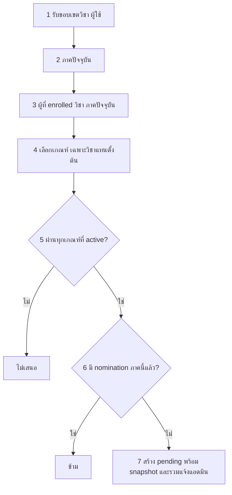
```mermaid
flowchart TD
    J1["1 รับขอบเขตวิชา ผู้ใช้"] --> J2["2 ภาคปัจจุบัน"]
    J2 --> J3["3 ผู้ที่ enrolled วิชา ภาคปัจจุบัน"]
    J3 --> J4["4 เลือกเกณฑ์ เฉพาะวิชาแทนตั้งต้น"]
    J4 --> J5{"5 ผ่านทุกเกณฑ์ที่ active?"}
    J5 -->|ไม่| J6["ไม่เสนอ"]
    J5 -->|ใช่| J7{"6 มี nomination ภาคนี้แล้ว?"}
    J7 -->|ใช่| J8["ข้าม"]
    J7 -->|ไม่| J9["7 สร้าง pending พร้อม snapshot และรวมแจ้งแอดมิน"]
```
| ขั้น | การกระทำ | อ่าน/เขียน | เงื่อนไข |
|---|---|---|---|
| 4 | ต่อชนิดเกณฑ์: ใช้ row เฉพาะวิชาที่ active ถ้ามี มิฉะนั้น row ตั้งต้น (course_id ว่าง) | MENTOR_CRITERIA | AC-C1 ไม่ hardcode |
| 5 | ค่าจริง: course_grade → ค่า course_grade ล่าสุดของวิชาไม่ voided; cumulative_gpa → ค่า cumulative_gpa ล่าสุด; เทียบค่าตัวเลข ≥ threshold (เท่ากับเกณฑ์ผ่าน); **ต้องผ่านทุกเกณฑ์ที่ active (AND)** (CD-3) | ACADEMIC_RECORD | TCc-01/02 |
| 6 | UK (user, course, term) | MENTOR_NOMINATION | มีแล้วไม่ว่าสถานะใด → ข้าม (reject แล้วไม่เสนอซ้ำภาคเดียวกัน) |
| 7 | สร้าง pending พร้อม criteria_id, actual_value, threshold_snapshot, nominated_at; NOTIFICATION `admin_pending_work` (dedupe_key ต่อวิชา) ต่อ admin | MENTOR_NOMINATION, NOTIFICATION | A-8 |

กฎ: DR-N1 ห้ามให้สิทธิ์ทันที (C-BR1 ข้อ 2); DR-N2 ไม่มีผลการเรียนวิชา/ไม่มีเกณฑ์ active → ไม่เสนอ; DR-N3 วิชา is_active=false ข้าม; DR-N4 ผลการเรียนต้องนำเข้าเป็นค่าตัวเลข (เกรดตัวอักษรต้องแปลงก่อนนำเข้า — ภาระฝั่งผู้นำเข้า). Exception: ไม่ถึงเกณฑ์ → ไม่เสนอ (TCc-02); เปลี่ยนเกณฑ์ → รอบถัดไปใช้ค่าใหม่ ไม่กระทบ nomination เดิม (TCc-03). Security: การเสนอชื่ออ่านภายในระบบ ไม่ใช่การเปิดดูโดยแอดมิน จึงไม่ audit `student_data_access`. ผลข้างเคียง: event `mentor-nomination-created`

#### 4.F.2 list-mentor-nominations: ดูคิวอนุมัติ

อ้างอิง [[api-spec#4.21 list-mentor-nominations: ดูคิวอนุมัติ mentor|API 4.21]]; AC-C1, AC-C2; TCc-01; P-BR audit. ขั้นตอน: ตรวจ role → ตรวจ audit พร้อม (กลุ่มสำคัญ) → **audit `student_data_access` ก่อนคืนผล** (ระบุตัวกรอง ไม่ใส่ค่าเกรด) → อ่าน nomination (ค่าเริ่มต้น pending) พร้อม display_name, วิชา, ภาค และค่าจริง/เกณฑ์ snapshot (แสดงค่า ณ ตอนเสนอ) → แบ่งหน้า. คิวว่าง → ผลว่างพร้อมคำอธิบาย. Exception: audit ล่ม → AUDIT_UNAVAILABLE ไม่คืนผลการเรียน. Security: แสดงเฉพาะค่าที่เกี่ยวกับการตัดสิน (DR-S4); ผู้ใช้ที่ไม่ระบุตัวตนแล้วแสดงเป็นไม่ระบุตัวตน

#### 4.F.3 decide-mentor-nomination: อนุมัติ/ปฏิเสธ

##### อ้างอิง
[[api-spec#4.22 decide-mentor-nomination: อนุมัติหรือปฏิเสธ mentor|API 4.22]]; C-US4, C-BR1; AC-C2; TCc-04, TCc-05, TCc-06; Q3, Q5 ต้นทาง

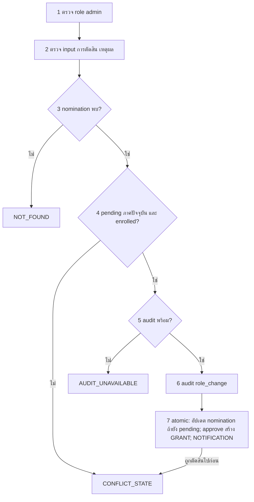
```mermaid
flowchart TD
    K1["1 ตรวจ role admin"] --> K2["2 ตรวจ input การตัดสิน เหตุผล"]
    K2 --> K3{"3 nomination พบ?"}
    K3 -->|ไม่| KE1["NOT_FOUND"]
    K3 -->|ใช่| K4{"4 pending ภาคปัจจุบัน และ enrolled?"}
    K4 -->|ไม่| KE2["CONFLICT_STATE"]
    K4 -->|ใช่| K5{"5 audit พร้อม?"}
    K5 -->|ไม่| KE3["AUDIT_UNAVAILABLE"]
    K5 -->|ใช่| K6["6 audit role_change"]
    K6 --> K7["7 atomic: อัปเดต nomination ถ้ายัง pending; approve สร้าง GRANT; NOTIFICATION"]
    K7 -->|ถูกตัดสินไปก่อน| KE2
```
| ขั้น | การกระทำ | เขียน | เงื่อนไข |
|---|---|---|---|
| 2 | การตัดสิน ∈ {approve, reject}; reject ต้องมีเหตุผลไม่ว่าง (หลัง trim) | — | VALIDATION_FAILED (TCc-06) |
| 4 | status=pending; nomination.term = ภาคปัจจุบัน; ผู้ถูกเสนอ enrolled (A-9) | — | CONFLICT_STATE |
| 7 | อัปเดต status, decided_by, decided_at, decision_reason แบบมีเงื่อนไข pending (DR-A2); approve → MENTOR_GRANT; NOTIFICATION `mentor_decision` (เหตุผลเมื่อ reject) | NOMINATION, GRANT, NOTIFICATION | DR-A1 |

กฎ: DR-22.1 ตัดสินได้ครั้งเดียว; DR-22.2 approve ไม่แก้ role (สิทธิ์ active ตามภาค); DR-22.3 เหตุผล reject แสดงต่อนักศึกษา (TCc-05). Exception: ตัดสินพร้อมกัน → คนที่สองได้ CONFLICT_STATE (testGaps 4); audit ล่ม → ไม่เปลี่ยนข้อมูล. Security: เฉพาะ admin. ผลข้างเคียง: audit `role_change`; event `mentor-decision-made`

#### 4.F.4 get-my-mentor-status (สั้น)
ต่อวิชาที่ enrolled ภาคปัจจุบัน: ไม่มี nomination → "ยังไม่ถูกเสนอชื่อ" พร้อมคำอธิบาย (TCc-07); pending → รอพิจารณา; approved+grant → ได้รับสิทธิ์; rejected → พร้อมเหตุผล. ใช้เฉพาะแถวของผู้เรียก

### 4.G ห้องแชท

#### 4.G.1 list-my-chat-rooms (สั้น)
เริ่มจาก ENROLLMENT ของผู้เรียกที่ enrolled ภาคปัจจุบัน → CHAT_ROOM/COURSE เท่านั้น (TCc-08); คืน consent แล้ว/ยัง, ตนเป็น mentor หรือไม่, จำนวน mentor active (จำนวนเท่านั้น). ไม่ตรวจ consent เพื่อแสดงรายการ

#### 4.G.2 get-chat-room: เข้าห้อง

อ้างอิง [[api-spec#4.25 get-chat-room: เข้าห้องแชทรายวิชา|API 4.25]]; C-BR3; AC-C3; TCc-09, TCc-10; CD-7. ขั้นตอน: Room Access Gate (2.1) → นับ mentor active ของวิชา → ตอบข้อมูลห้อง; ไม่มี mentor → สถานะ "ยังไม่มีผู้แนะนำ" และยังตั้งคำถามได้ (TCc-10)

| กรณี | ขั้น | รับมือ | แจ้งผู้ใช้ | test |
|---|---|---|---|---|
| ไม่ได้ลงทะเบียน (ลิงก์ตรง) | G3 | ปฏิเสธ | แจ้งสาเหตุ "ไม่ได้ลงทะเบียนวิชานี้ในภาคปัจจุบัน" เผยแค่ชื่อวิชาที่ผู้ใช้ระบุมา ไม่เผยจำนวนสมาชิก/ข้อความ/mentor (CD-7) | TCc-09 |
| ยังไม่ให้ consent | G4 | ปฏิเสธ | ต้องให้ความยินยอมก่อนเข้าห้อง พร้อมทางไปให้ | _(ไม่มี — testGaps 2)_ |
| ถอน consent ขณะอยู่ในห้อง | ทุกคำขอถัดไป | ตรวจใหม่ทุกคำขอ ปฏิเสธทันที | เหมือนข้างต้น | _(ไม่มี)_ |
| วิชาไม่มี mentor | หลังผ่านด่าน | ตอบปกติ | "ยังไม่มีผู้แนะนำ" | TCc-10 |

Security: ตรวจที่ฝั่งข้อมูล ไม่ใช่ซ่อนที่หน้าจอ

#### 4.G.3 list-published-messages (สั้น)
Room Access Gate → อ่าน MESSAGE status=published เรียงเก่า→ใหม่ (AC-C5, TCc-13) ไม่รวม pending/rejected/withdrawn ของใคร; คืน display_name (ว่างเมื่อไม่ระบุตัว → "ผู้ใช้ที่ไม่ระบุตัวตน"), เนื้อหา, badge เมื่อ posted_as_mentor (AC-C4, TCc-12)

#### 4.G.4 post-chat-message: โพสต์ข้อความ

##### อ้างอิง
[[api-spec#4.27 post-chat-message: โพสต์ข้อความหรือคำถาม|API 4.27]]; C-BR4; AC-C4, AC-C5, AC-C6; TCc-11, TCc-14, TCc-15

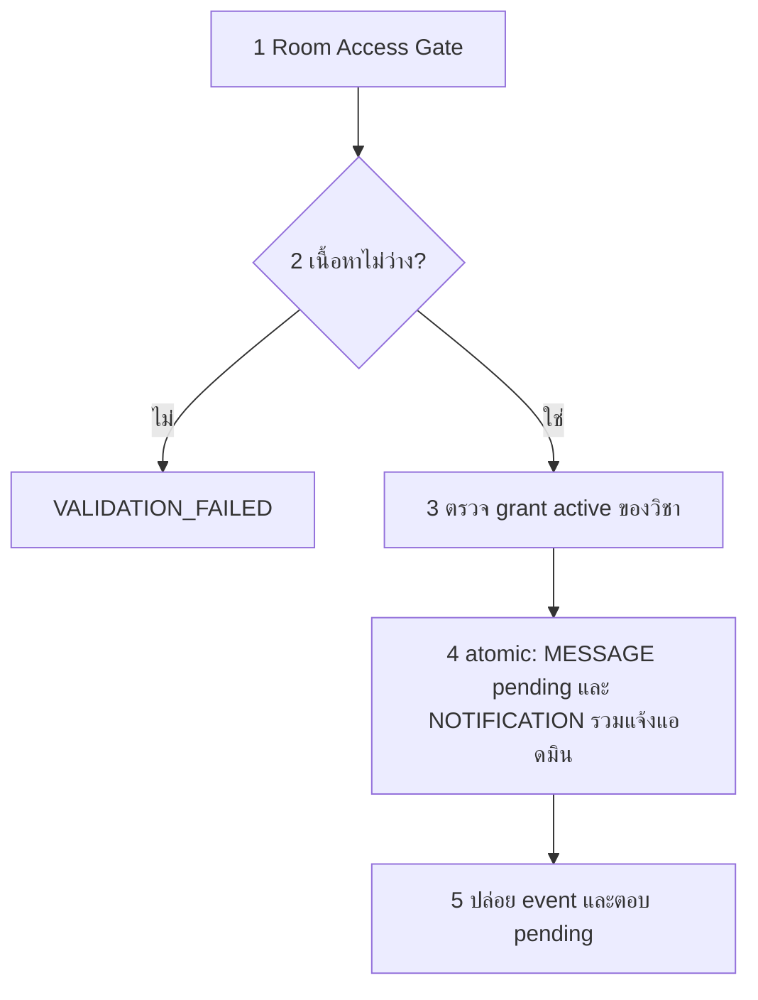
```mermaid
flowchart TD
    L1["1 Room Access Gate"] --> L2{"2 เนื้อหาไม่ว่าง?"}
    L2 -->|ไม่| LE["VALIDATION_FAILED"]
    L2 -->|ใช่| L3["3 ตรวจ grant active ของวิชา"]
    L3 --> L4["4 atomic: MESSAGE pending และ NOTIFICATION รวมแจ้งแอดมิน"]
    L4 --> L5["5 ปล่อย event และตอบ pending"]
```
| ขั้น | การกระทำ | อ่าน/เขียน | เงื่อนไข |
|---|---|---|---|
| 2 | trim แล้วไม่ว่าง (ไม่กำหนดเพดานความยาว — spec ไม่ระบุ) | — | VALIDATION_FAILED |
| 3 | posted_as_mentor=จริงเมื่อมี grant ของ nomination: user=ผู้โพสต์, course=วิชาห้อง, term=ภาคปัจจุบัน; ผู้โพสต์เลือกค่านี้เองไม่ได้ | MENTOR_GRANT, MENTOR_NOMINATION | DR-S2 |
| 4 | status=pending เสมอ (ไม่มีข้อยกเว้นสำหรับ mentor); NOTIFICATION `admin_pending_work` dedupe ต่อวิชา (A-8) | MESSAGE, NOTIFICATION | C-BR4 |

กฎ: DR-27.1 ทุกข้อความเริ่ม pending; DR-27.2 snapshot สิทธิ์ mentor ณ ตอนโพสต์; DR-27.3 ผู้ที่ไม่ใช่ mentor โพสต์เป็นคำถามทั่วไป; DR-27.4 โพสต์ซ้ำเนื้อหาเดิมเป็นข้อความใหม่ (A-20). Exception: ไม่ผ่านด่านตาม 2.1; แจ้งแอดมินล้มเหลว → ข้อความยังบันทึก แจ้งเตือนส่งซ้ำภายหลัง (A-21); เนื้อหาว่าง: test _(ไม่มี — testGaps 3)_. Security: เนื้อหาเห็นเฉพาะผู้ส่ง/admin จนเผยแพร่ (C-BR4); เนื้อหาอาจมีข้อมูลผู้อื่น (P-BR PDPA) จึงไม่ใส่เนื้อหาใน log/audit/แจ้งแอดมิน. ผลข้างเคียง: event `message-submitted`

#### 4.G.5 list-my-messages (สั้น)
อ่าน MESSAGE ที่ author_user_id = ผู้เรียกทุกสถานะ (กรองห้อง/สถานะ) + MODERATION_DECISION.reason เมื่อ rejected (TCc-17); ข้อความ withdrawn แสดงสถานะไม่มีเนื้อหา. ไม่ผ่าน Room Access Gate (ผู้ใช้ดูผลข้อความของตนได้แม้ถอน consent — A-22)

### 4.H ตรวจข้อความ

#### 4.H.1 list-moderation-queue (สั้น)
admin เท่านั้น; MESSAGE pending เรียงเก่าก่อน กรองวิชา พร้อม display_name ผู้ส่ง จำนวนค้าง; ว่าง → ข้อความ "ไม่มีงานค้าง" (AC-C6, TCc-19). ไม่ audit การเห็นเนื้อหา (A-13)

#### 4.H.2 decide-message-moderation: อนุมัติ/ปฏิเสธข้อความ

##### อ้างอิง
[[api-spec#4.30 decide-message-moderation: อนุมัติหรือปฏิเสธข้อความ|API 4.30]]; C-US5, C-BR4; AC-C6; TCc-16, TCc-17, TCc-18

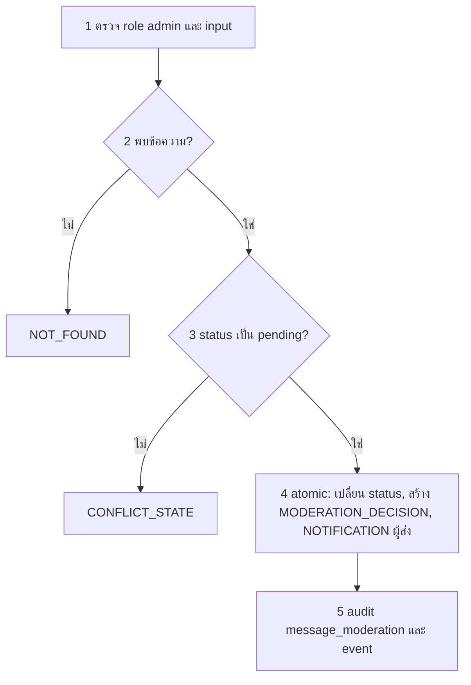
```mermaid
flowchart TD
    M1["1 ตรวจ role admin และ input"] --> M2{"2 พบข้อความ?"}
    M2 -->|ไม่| ME1["NOT_FOUND"]
    M2 -->|ใช่| M3{"3 status เป็น pending?"}
    M3 -->|ไม่| ME2["CONFLICT_STATE"]
    M3 -->|ใช่| M4["4 atomic: เปลี่ยน status, สร้าง MODERATION_DECISION, NOTIFICATION ผู้ส่ง"]
    M4 --> M5["5 audit message_moderation และ event"]
```
| ขั้น | การกระทำ | เขียน | เงื่อนไข |
|---|---|---|---|
| 1 | reject ต้องมีเหตุผลไม่ว่าง | — | VALIDATION_FAILED (TCc-18) |
| 3 | pending เท่านั้น; ข้อความ withdrawn (ผู้ส่งถอน consent ก่อน) ไม่ใช่ pending | MESSAGE | DR-A2 |
| 4 | approve → published + published_at; reject → rejected; MODERATION_DECISION (decision, reason, decided_by, decided_at); NOTIFICATION `message_status` | MESSAGE, MODERATION_DECISION, NOTIFICATION | DR-A1 |

กฎ: DR-30.1 ตัดสินครั้งเดียว ห้ามแก้ MODERATION_DECISION; DR-30.2 อนุมัติแล้วสมาชิกห้องเห็นทันที (TCc-16); DR-30.3 reject ไม่แสดงต่อผู้อื่น ผู้ส่งเห็นเหตุผล (TCc-17). Exception: ตัดสินซ้ำ/พร้อมกัน → CONFLICT_STATE; audit ล่ม → ทำต่อส่ง log ซ้ำ (กลุ่มอื่น); แจ้งผู้ส่งล้มเหลว → การตัดสินยังมีผล. Security: เฉพาะ admin. ผลข้างเคียง: audit `message_moderation`; event `message-moderated`

#### 4.H.3 get-chat-activity-overview (สั้น)
admin; ต่อวิชาในภาคที่เลือก (ค่าเริ่มต้นปัจจุบัน): จำนวน mentor active, nomination pending, ข้อความทั้งหมด/ค้างตรวจ — นับเท่านั้น ไม่เปิดเนื้อหา/ชื่อ (F-C12)

### 4.I ความยินยอมและสิทธิ PDPA

#### 4.I.1 get-current-privacy-notice (สั้น)
อ่าน PRIVACY_NOTICE status=current ต่อวัตถุประสงค์ (ทุกบทบาท) ไม่มีข้อมูลส่วนบุคคล

#### 4.I.2 publish-privacy-notice: เผยแพร่ notice
admin; ตรวจ purpose ∈ enum, legal_basis ∈ {educational_mission, consent}, เนื้อหาไม่ว่าง (VALIDATION_FAILED); atomic: เวอร์ชันเดิมของ purpose → superseded, สร้างเวอร์ชันใหม่ (version = ล่าสุด+1, status=current, published_by, effective_from); ห้ามแก้เวอร์ชันเดิม; audit `notice_publish`. consent เดิมที่อ้างเวอร์ชันเก่ายังมีผล ไม่บังคับขอใหม่ (A-23)

#### 4.I.3 set-consent: ให้/ถอน consent

##### อ้างอิง
[[api-spec#4.34 set-consent: ให้หรือถอนความยินยอม|API 4.34]]; P-US2, P-BR PDPA; Q4 ต้นทาง; architecture Q5

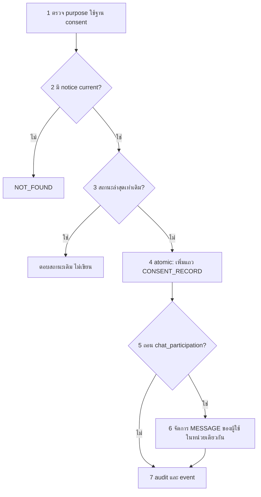
```mermaid
flowchart TD
    N1["1 ตรวจ purpose ใช้ฐาน consent"] --> N2{"2 มี notice current?"}
    N2 -->|ไม่| NE["NOT_FOUND"]
    N2 -->|ใช่| N3{"3 สถานะล่าสุดเท่าเดิม?"}
    N3 -->|ใช่| N4["ตอบสถานะเดิม ไม่เขียน"]
    N3 -->|ไม่| N5["4 atomic: เพิ่มแถว CONSENT_RECORD"]
    N5 --> N6{"5 ถอน chat_participation?"}
    N6 -->|ใช่| N7["6 จัดการ MESSAGE ของผู้ใช้ ในหน่วยเดียวกัน"]
    N6 -->|ไม่| N8["7 audit และ event"]
    N7 --> N8
```
| ขั้น | การกระทำ | เขียน | เงื่อนไข |
|---|---|---|---|
| 1 | purpose ต้องเป็นฐาน consent (`chat_participation`); `academic_service` ใช้ฐานภารกิจ ถอนผ่านนี้ไม่ได้ | — | VALIDATION_FAILED |
| 4 | แถวใหม่ (user, notice_id current, purpose, granted, updated_at) ไม่แก้แถวเดิม | CONSENT_RECORD | append-only |
| 6 | MESSAGE ของผู้ใช้: pending/rejected → ล้างเนื้อหา status=`withdrawn` (A-10); published → author_user_id ว่าง (content คงอยู่) | MESSAGE | Q4 ต้นทาง |

กฎ: DR-34.1 ถอนมีผลทันทีต่อ Room Access Gate; DR-34.2 ให้ใหม่ไม่คืนข้อความ; DR-34.3 ข้อความ published ที่ไม่ระบุตัวยังคง badge. Exception: ล้มกลางขั้น 6 → ย้อนกลับทั้งแถว consent; audit ล่ม → ทำต่อส่ง log ซ้ำ. Security: เฉพาะเจ้าของ ไม่รับ user_id จาก input. test: _(ไม่มี — testGaps 6)_. ผลข้างเคียง: audit `consent_change`; event `consent-changed`

#### 4.I.4 list-my-consents (สั้น)
ต่อวัตถุประสงค์: แถวล่าสุด + ประวัติ + เวอร์ชัน notice ที่อ้าง; เจ้าของเท่านั้น

#### 4.I.5 submit-data-subject-request: ยื่นคำร้อง

อ้างอิง [[api-spec#4.36 submit-data-subject-request: ยื่นคำร้องใช้สิทธิ|API 4.36]]; P-US3; P-BR audit. ขั้นตอน: ตัวตน (รวมผู้ `ended` — A-3) → request_type ∈ {access, rectify, erase, object, portability} (ถอน consent ให้ใช้ set-consent → VALIDATION_FAILED) → มีคำร้องชนิดเดียวกันที่ยังไม่ปิด (submitted/under_review/approved) → คืนคำร้องเดิม (DR-36.1, A-24) → ตรวจ audit พร้อม (กลุ่มสำคัญ) → audit `dsr_submit` → สร้างแถว submitted. Security: ผู้ยื่นผูกกับตัวตนที่ยืนยัน (ยื่นแทนผู้อื่นไม่ได้); erase ที่ขัดกับข้อมูลถาวรไม่ปฏิเสธตอนยื่น (พิจารณาตอนตัดสิน). แอดมินดูผ่านคิว (ไม่มี NOTIFICATION ชนิดสำหรับแอดมิน). test: _(ไม่มี)_

#### 4.I.6 list-my-data-subject-requests, list-data-subject-requests (สั้น)
ของตน: คำร้องพร้อมสถานะ/เหตุผล/ผล (เจ้าของเท่านั้น); คิว admin: ตัวกรองสถานะ/ชนิด แบ่งหน้า พร้อมตัวตนผู้ยื่น (A-13)

#### 4.I.7 decide-data-subject-request: บันทึกผลพิจารณา

อ้างอิง [[api-spec#4.39 decide-data-subject-request: บันทึกผลพิจารณาของสถาบัน|API 4.39]]; P-US4; Q5, Q6 ต้นทาง

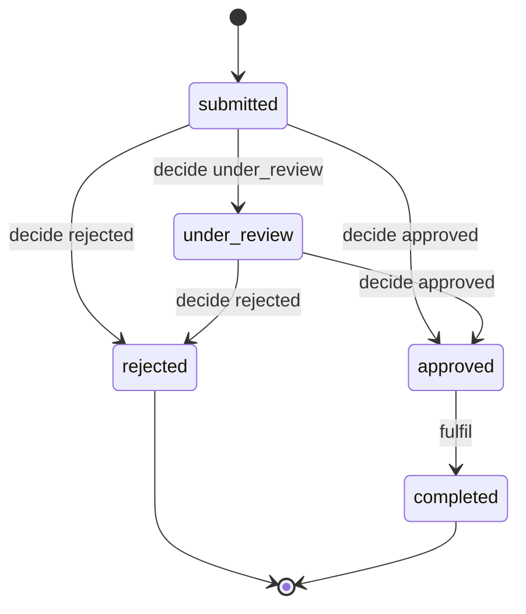
```mermaid
stateDiagram-v2
    [*] --> submitted
    submitted --> under_review: decide under_review
    submitted --> approved: decide approved
    submitted --> rejected: decide rejected
    under_review --> approved: decide approved
    under_review --> rejected: decide rejected
    approved --> completed: fulfil
    rejected --> [*]
    completed --> [*]
```
ขั้นตอน: role admin → ผลพิจารณา ∈ {under_review, approved, rejected} (rejected ต้องมีเหตุผล) → โหลดคำร้อง (NOT_FOUND) → สถานะต้องเป็น submitted/under_review (CONFLICT_STATE; under_review ซ้ำไม่อนุญาต) → ตรวจ audit พร้อม → audit `dsr_decide` → atomic: อัปเดตสถานะ + decided_by/at/reason + NOTIFICATION `data_subject_request_update`. กฎ: DR-39.1 admin ไม่ตัดสินคำร้องของตนเอง (A-25); DR-39.2 approved ไม่แก้ข้อมูลเอง (แยกเป็น fulfil). test: _(ไม่มี)_. ผลข้างเคียง: event `data-subject-request-updated`

#### 4.I.8 fulfil-data-subject-request: ดำเนินการตามคำร้อง

##### อ้างอิง
[[api-spec#4.40 fulfil-data-subject-request: ดำเนินการตามคำร้องที่อนุมัติ|API 4.40]]; P-US3, P-US4; P-BR PDPA/retention; Q4, Q7 ต้นทาง; D-02, D-05 / CD-2, CD-5

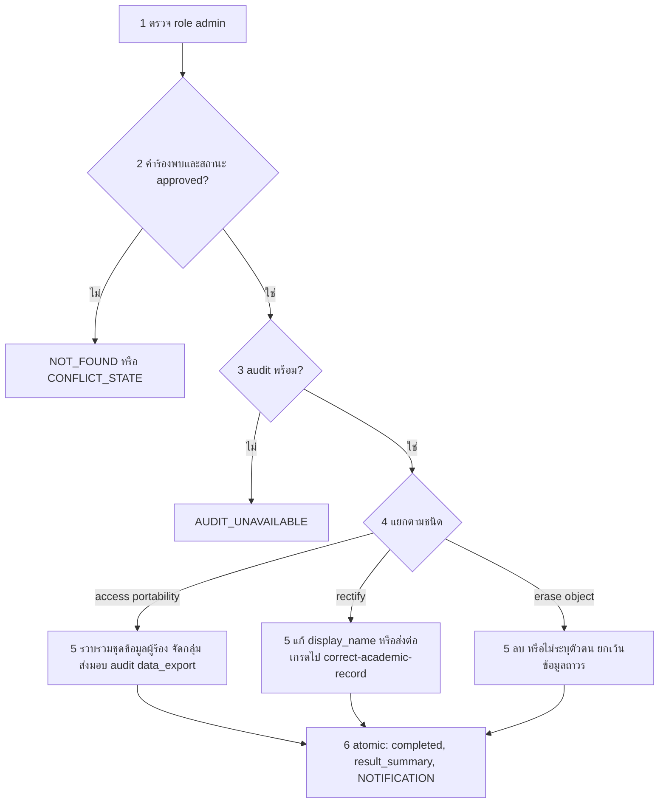
```mermaid
flowchart TD
    O1["1 ตรวจ role admin"] --> O2{"2 คำร้องพบและสถานะ approved?"}
    O2 -->|ไม่| OE["NOT_FOUND หรือ CONFLICT_STATE"]
    O2 -->|ใช่| O3{"3 audit พร้อม?"}
    O3 -->|ไม่| OE2["AUDIT_UNAVAILABLE"]
    O3 -->|ใช่| O4{"4 แยกตามชนิด"}
    O4 -->|access portability| O5["5 รวบรวมชุดข้อมูลผู้ร้อง จัดกลุ่ม ส่งมอบ audit data_export"]
    O4 -->|rectify| O6["5 แก้ display_name หรือส่งต่อเกรดไป correct-academic-record"]
    O4 -->|erase object| O7["5 ลบ หรือไม่ระบุตัวตน ยกเว้นข้อมูลถาวร"]
    O5 --> O8["6 atomic: completed, result_summary, NOTIFICATION"]
    O6 --> O8
    O7 --> O8
```
| ชนิด | การกระทำ | อ่าน/เขียน | ข้อห้าม |
|---|---|---|---|
| access / portability | รวบรวมข้อมูลของ user_id ผู้ร้องจาก**ทุกตารางข้อมูลส่วนบุคคลตาม database-spec §6** (USER, ENROLLMENT, ACADEMIC_RECORD, ALERT+เงื่อนไข, RECOMMENDATION, WEEKLY_SUMMARY, NOTIFICATION, MENTOR_NOMINATION/GRANT, MESSAGE ที่ตนเขียน, CONSENT_RECORD, DATA_SUBJECT_REQUEST ของตน) จัดกลุ่มตามประเภทข้อมูล (CD-5) | อ่านหลายตาราง | ห้ามมีแถวของผู้อื่น; ตัวตน reviewer/ผู้ตัดสินแสดงเป็นตำแหน่ง ไม่ใช่ชื่อ |
| rectify | จำกัดที่ USER.display_name (ค่าใหม่ระบุในบันทึกผลโดย admin) และการแก้เกรดต้องผ่าน correct-academic-record เท่านั้น (CD-2) | USER | ห้ามแก้ข้อมูลทะเบียนโดยตรงจาก fulfil |
| erase | ข้อมูลไม่ถาวร: ลบ/ไม่ระบุตัวตนตามหมวด; MESSAGE ตาม Q4 ต้นทาง; course_grade/cumulative_gpa (ถาวร) ไม่ลบ ระบุใน result_summary; AUDIT_LOG_ENTRY ไม่ถูกลบ | USER, ACADEMIC_RECORD, MESSAGE ฯลฯ | ห้ามลบข้อมูลถาวร |
| object | ทำให้ไม่ระบุตัวข้อมูลที่ไม่ถาวรเช่นเดียวกับ erase ไม่มีคอลัมน์ระงับการประมวลผล (CD-2) | — | — |

กฎ: DR-40.1 ส่งมอบ access/portability ต้อง audit `data_export` ก่อนส่ง; DR-40.2 result_summary ระบุส่วนที่คงไว้เพราะระเบียบ; DR-40.3 completed แล้ว → CONFLICT_STATE. Exception: ล้มกลางทางของ erase → ย้อนกลับทั้งหน่วยต่อผู้ร้อง คงสถานะ approved ให้ลองใหม่; audit ล่ม → ไม่เริ่ม. Security: ชุดข้อมูลส่งผ่านช่องทางเข้ารหัสและเฉพาะผู้ร้อง; ไม่เก็บสำเนาชุดข้อมูลที่ส่งมอบ (เก็บเฉพาะสรุปแบบนับ/กลุ่ม). ผลข้างเคียง: audit `dsr_fulfil`, `data_export`; NOTIFICATION `data_subject_request_update`. หมายเหตุ: รายการตารางที่อ่านเกินกว่า api-spec 4.40 บันทึกเป็น D-05 (ผู้ใช้ยอมรับ ต้นทางไม่ถูกแก้)

### 4.J audit log

#### 4.J.1 record-audit-event: บันทึกเหตุการณ์

อ้างอิง [[api-spec#4.42 record-audit-event: บันทึกเหตุการณ์ audit|API 4.42]]; P-US1, P-US5, P-BR audit; Q5 ต้นทาง

| ขั้น | การกระทำ | เงื่อนไข |
|---|---|---|
| 1 | รับจาก operation ภายในเท่านั้น | — |
| 2 | action ∈ enum, result ∈ {success, failure}, target และ actor ไม่ว่าง (actor_user_id ว่างได้) | VALIDATION_FAILED ภายใน |
| 3 | ผูก retention_policy_id ของ `audit_log` | — |
| 4 | เพิ่มแถวท้ายสุด occurred_at จากเวลาของระบบ (ไม่รับจาก input) | append-only (DR-42.1) |
| 5 | ล้มเหลว → AUDIT_UNAVAILABLE ให้ผู้เรียกตัดสินตามกลุ่ม | — |

กฎ: DR-42.2 before/after เฉพาะ action ที่กำหนด (เกรด สิทธิ์ เกณฑ์ นโยบาย); DR-42.3 ไม่มีเส้นทางแก้/ลบ; DR-42.4 ไม่ใส่เนื้อหาแชท/ข้อมูลที่ไม่จำเป็น (DR-S3); DR-42.5 กลุ่มสำคัญ = แก้เกรด, เปลี่ยนสิทธิ์, แอดมินดูข้อมูลนักศึกษา, ผลคำร้อง PDPA, อ่าน audit log (รวม operation ที่ api-spec ระบุ AUDIT_UNAVAILABLE: update-retention-policy, submit/decide/fulfil คำร้อง). test: _(ไม่มี — testGaps 1, 12)_

#### 4.J.2 search-audit-log: ค้นหา audit

อ้างอิง [[api-spec#4.43 search-audit-log: ค้นหา audit log|API 4.43]]; P-US1, P-US5; log-of-logs

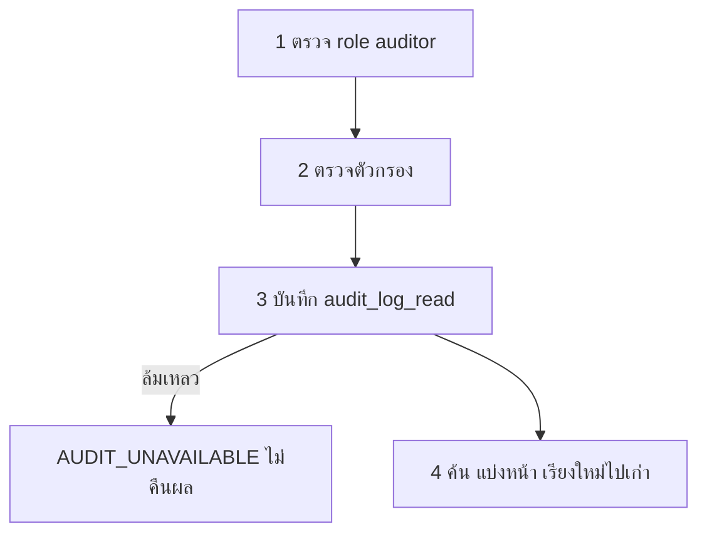
```mermaid
flowchart TD
    P1["1 ตรวจ role auditor"] --> P2["2 ตรวจตัวกรอง"]
    P2 --> P3["3 บันทึก audit_log_read"]
    P3 -->|ล้มเหลว| PE["AUDIT_UNAVAILABLE ไม่คืนผล"]
    P3 --> P4["4 ค้น แบ่งหน้า เรียงใหม่ไปเก่า"]
```
กฎ: DR-43.1 เฉพาะ auditor (admin → FORBIDDEN_ROLE); DR-43.2 บันทึกการอ่าน (ตัวกรอง) **ก่อน** คืนผล; DR-43.3 ช่วงเวลาสิ้นสุดก่อนเริ่ม → VALIDATION_FAILED; DR-43.4 ผลมีค่าก่อน-หลัง (อ่อนไหว) คืนเฉพาะหน้าที่ขอ. Security: ไม่ cache ข้ามผู้ใช้; log การอ่านเก็บเฉพาะตัวกรอง

## 5. งานตามเวลาและงานเบื้องหลัง

### 5.1 ตารางงาน
| งาน | ตัวกระตุ้น | ขอบเขตต่อรอบ | ป้องกันทำซ้ำ |
|---|---|---|---|
| evaluate-learning-risk | (ก) หลังนำเข้า/แก้ผลการเรียน = ผู้ใช้ที่เปลี่ยน (ข) ตามรอบ = ผู้ใช้ active ที่ enrolled ภาคปัจจุบัน (ความถี่ _(ต้องการข้อมูลเพิ่มเติม)_) | ต่อผู้ใช้ | fingerprint/ธุรกรรมต่อผู้ใช้ |
| generate-personal-recommendation | จาก evaluate และรอบประเมินซ้ำ | ต่อผู้ใช้ | หนึ่ง current ต่อผู้ใช้ |
| generate-weekly-summaries | ตามสัปดาห์ | ต่อผู้ใช้ | UK (user, week_start) |
| generate-mentor-nominations | หลังนำเข้า และตามรอบ | ต่อ (ผู้ใช้, วิชา) | UK nomination |
| run-retention-sweep | ตามรอบ | ต่อผู้ใช้ | สถานะต่อผู้ใช้ |
| purge-expired-audit-log-entries | ตามรอบ | ก้อนย่อย | เงื่อนไขเวลา |

หลักร่วม: ความล้มเหลวของหน่วยหนึ่งไม่หยุดรอบ (DR-A4); บันทึกตัวระบุที่ล้มเหลวและลองใหม่รอบถัดไป; งานที่หยุดครึ่งทางเสร็จเฉพาะหน่วยที่ commit

### 5.2 run-retention-sweep: ตามรอบ retention

อ้างอิง [[api-spec#4.41 run-retention-sweep: ตามรอบ retention ข้อมูลนักศึกษา|API 4.41]]; [[database-spec#6. ข้อมูลส่วนบุคคลและนโยบายข้อมูล|database §6]]; P-US4, P-BR retention; Q4 ต้นทาง

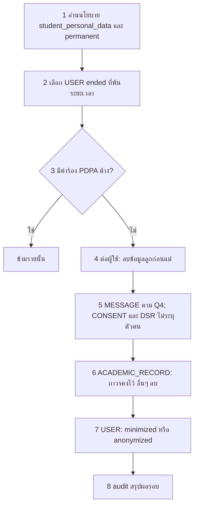
```mermaid
flowchart TD
    S1["1 อ่านนโยบาย student_personal_data และ permanent"] --> S2["2 เลือก USER ended ที่พ้นระยะเวลา"]
    S2 --> S3{"3 มีคำร้อง PDPA ค้าง?"}
    S3 -->|ใช่| S4["ข้ามรายนั้น"]
    S3 -->|ไม่| S5["4 ต่อผู้ใช้: ลบข้อมูลลูกก่อนแม่"]
    S5 --> S6["5 MESSAGE ตาม Q4; CONSENT และ DSR ไม่ระบุตัวตน"]
    S6 --> S7["6 ACADEMIC_RECORD: ถาวรคงไว้ อื่นๆ ลบ"]
    S7 --> S8["7 USER: minimized หรือ anonymized"]
    S8 --> S9["8 audit สรุปผลรอบ"]
```
ขั้นตอนต่อผู้ใช้ (ธุรกรรมเดียว): ลบ ALERT_CONDITION → ALERT, RECOMMENDATION, WEEKLY_SUMMARY, NOTIFICATION, MENTOR_GRANT → MENTOR_NOMINATION, ENROLLMENT; MESSAGE (ไม่เผยแพร่ = ล้างเนื้อหา/withdrawn; เผยแพร่ = ผู้เขียนว่าง); ACADEMIC_RECORD ที่ผูกนโยบายไม่ถาวรลบ ส่วนถาวรคงไว้; CONSENT_RECORD, DATA_SUBJECT_REQUEST → ไม่ระบุตัวตน (A-12); USER → `minimized` ถ้ายังเหลือข้อมูลถาวร มิฉะนั้น `anonymized` (ตั้ง anonymized_at). กฎ: DR-41.1 อ่านนโยบายทุกรอบ; DR-41.2 ทำซ้ำได้ (ผู้ใช้ที่ minimized/anonymized แล้วถูกข้าม); DR-41.3 ห้ามลบ AUDIT_LOG_ENTRY (ใช้ purge ตามอายุ). Exception: ล้มต่อผู้ใช้ → ย้อนกลับผู้ใช้นั้น; นโยบายผิดปกติ (ไม่ถาวรแต่ไม่มี period) → ข้ามประเภทนั้นและบันทึก. Security: audit สรุปเป็นจำนวนต่อประเภท ไม่มีตัวตนรายบุคคล. test: _(ไม่มี — testGaps 1)_

### 5.3 purge-expired-audit-log-entries
อ้างอิง [[api-spec#4.44 purge-expired-audit-log-entries: ลบ audit log ที่พ้นอายุ|API 4.44]]; P-BR audit; P-US5. อ่านนโยบาย `audit_log` (is_permanent หรือ disposal none → ไม่ทำ) → cutoff = ปัจจุบัน − ระยะเวลา → ลบแถว occurred_at < cutoff เป็นก้อนย่อย → บันทึก audit `audit_purge` (จำนวน ไม่ใช่รายการ). ไม่มี actor มนุษย์; ทำซ้ำได้; การลดค่านโยบายทำให้ purge รอบถัดไปลบมากขึ้นทันที (ผูก DR-19.2); ล้มกลางทาง → ก้อนที่ลบแล้วคงอยู่ รอบหน้าลบต่อ. test: _(ไม่มี)_

## 6. State และ Lifecycle ของข้อมูลหลัก

### 6.1 MESSAGE
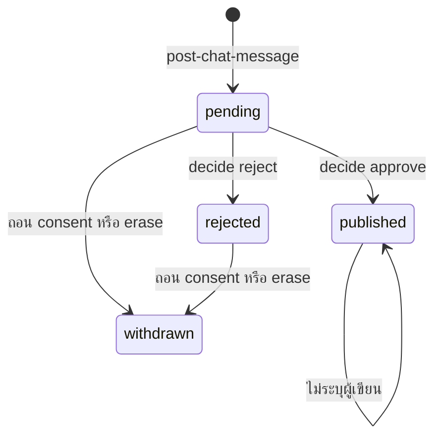
```mermaid
stateDiagram-v2
    [*] --> pending: post-chat-message
    pending --> published: decide approve
    pending --> rejected: decide reject
    pending --> withdrawn: ถอน consent หรือ erase
    rejected --> withdrawn: ถอน consent หรือ erase
    published --> published: ไม่ระบุผู้เขียน
```
| การเปลี่ยน | เงื่อนไข | ผู้เปลี่ยน | operation |
|---|---|---|---|
| pending→published/rejected | ตัดสินครั้งเดียว | admin | decide-message-moderation |
| →withdrawn / ไม่ระบุผู้เขียน | เจ้าของถอน consent / erase / ครบ retention | ระบบตามสิทธิเจ้าของ | set-consent, fulfil, run-retention-sweep |

### 6.2 ALERT
```mermaid
stateDiagram-v2
    [*] --> open: เข้าเงื่อนไข
    open --> superseded: ชุดเงื่อนไขเปลี่ยน
    open --> resolved: ไม่เข้าเงื่อนไขแล้ว
```
เปลี่ยนโดย evaluate-learning-risk เท่านั้น

### 6.3 MENTOR_NOMINATION และสิทธิ์
```mermaid
stateDiagram-v2
    [*] --> pending: generate
    pending --> approved: approve สร้าง GRANT
    pending --> rejected: reject พร้อมเหตุผล
```
สิทธิ์ mentor ไม่เป็นสถานะ: active เมื่อ nomination approved และ term = ภาคปัจจุบัน (Q3 ต้นทาง)

### 6.4 DATA_SUBJECT_REQUEST และ USER.status
แผนภาพคำร้องอยู่ที่ 4.I.7; USER.status: active → ended (นำเข้า) → minimized/anonymized (sweep/erase)

## 7. สรุป Security และข้อมูลส่วนบุคคลทั้งระบบ

| operation | ข้อมูลที่รับ/ส่ง | ระดับ | มาตรการ |
|---|---|---|---|
| 1 | identity_ref | ส่วนบุคคล | ผลยืนยันจากสถาบัน; ไม่ใส่ใน log เกินจำเป็น |
| 3, 4, 5 | ผลการเรียน/ลงทะเบียน | อ่อนไหวสูง | เฉพาะ data_staff; audit ก่อน-หลัง; ผลแถวไม่เปิดค่า |
| 7-9, 11-13 | ALERT, คำแนะนำ, สรุป | อ่อนไหวสูง | เฉพาะเจ้าของ (DR-S2); NOT_FOUND สำหรับของผู้อื่น |
| 21, 22 | ผลการเรียนในคิว nomination | อ่อนไหวสูง | audit `student_data_access` ก่อนคืนผล |
| 25-30 | เนื้อหาแชท | อาจมีข้อมูลผู้อื่น | pre-moderation; ไม่ใส่เนื้อหาใน log/แจ้งแอดมิน |
| 34 | consent | ส่วนบุคคล | append-only; ถอนมีผลทันที |
| 36-40 | คำร้อง PDPA | ส่วนบุคคล | audit กลุ่มสำคัญ; ส่งมอบเฉพาะข้อมูลผู้ร้อง |
| 41 | ข้อมูลครบอายุ | ทุกประเภท | ลบ/ไม่ระบุตัวตน; audit สรุป |
| 42-44 | audit | อาจมีค่าก่อน-หลัง | auditor เท่านั้น; log-of-logs |

## 8. Traceability

### (ก) rule/AC/test → ที่สะท้อน
| ที่มา | สะท้อนที่ |
|---|---|
| R-BR1, AC-R1, TS-01..TS-06 | 4.C.1 ขั้น 4a-4d, 5-9, DR-7.x |
| R-BR2, AC-R4, TS-12..TS-14 | 4.E.2, 4.C.1 DR-7.4, 4.D.2 DR-11.1 |
| R-BR3, AC-R2, TS-08, TS-09 | 4.C.2, 4.D.3 |
| R-BR4, AC-R3, TS-10, TS-11 | 4.C.3, 4.D.4 |
| AC-R5, TS-15 | USER_CATEGORY อ้างใน 4.E.2 ขั้น 2 (เชิงโครงสร้าง ไม่มี operation จัดการ) |
| C-BR1, AC-C1, TCc-01..03 | 4.F.1, 4.E.3 |
| AC-C2, TCc-04..07 | 4.F.3, 4.F.4 |
| C-BR2/BR3, AC-C3, TCc-08..10 | 4.B.1, 2.1 Gate, 4.G.1-4.G.2 |
| AC-C4, TCc-11, 12 | 4.G.4, 4.G.3 |
| AC-C5, TCc-13, 14 | 4.G.3, 4.G.4 |
| C-BR4, AC-C6, TCc-15..19 | 4.G.4, 4.H.1, 4.H.2 |
| P-US1, P-US5, P-BR audit | 4.J, 4.B.3, 2.3 |
| P-US2, P-BR PDPA (consent) | 4.I.1-4.I.4 |
| P-US3, P-US4 | 4.I.5-4.I.8, 5.2 |
| P-BR retention | 4.E.4, 5.2, 5.3 |
| P-BR security | 2.4, 7 |

### (ข) operation → หัวข้อ
ครบ 44 ตัวตามหัวข้อ 3

### test ที่ยังไม่สะท้อน / exception ที่ยังไม่มี test
test ที่ยังไม่สะท้อน: ไม่มี. exception ที่ยังไม่มี test ทำเครื่องหมาย "_(ไม่มี)_" ในแต่ละหัวข้อ และสรุปเป็น testGaps: (1) spec 03 ทั้งหมด (2) CONSENT_REQUIRED (3) โพสต์เนื้อหาว่าง (4) ตัดสินซ้ำ/พร้อมกัน (5) set-current-term แล้ว grant หมดอายุ (6) ถอน consent จัดการข้อความ (7) dedupe ประเมินทันที/ตามรอบ, ALERT superseded/resolved (8) นำเข้า validation/upsert/สำเร็จบางส่วน, correct-academic-record (9) สรุปรายสัปดาห์ซ้ำ/ไม่มีข้อมูลสัปดาห์ก่อน (10) get-notification-detail ของผู้อื่น/read_at (11) ถอนวิชากลางภาค (12) AUDIT_UNAVAILABLE กลุ่มสำคัญและการส่ง log ซ้ำ — เสนอรัน `/spec-to-test-plan`

## 9. Delta ที่พบกับเอกสารต้นทาง

ผู้ใช้ตัดสินใจแล้วเมื่อ 2026-10-08 ทั้ง 6 รายการ **ไม่มีรายการใดเลือกแก้เอกสารต้นทาง** — ต้นทาง (architecture, database-spec, api-spec) ยังไม่ถูกแก้ ส่วนต่างทั้งหมดถูกรับไว้ในเอกสารนี้เป็นการตีความ/ข้อจำกัดภายใน detailed design

| รหัส | เอกสารต้นทาง | ส่วนที่เกี่ยวข้อง | ความขัดแย้ง/สิ่งที่ขาด | ผลต่อ detailed design | การตัดสินใจ (ผู้ใช้ 2026-10-08) | แก้ต้นทางแล้วหรือไม่ |
|---|---|---|---|---|---|---|
| D-01 | api-spec | 4.4 import-academic-records vs Q5 | conflict: การนำเข้าที่เปลี่ยนเกรดเป็น grade_update (กลุ่มสำคัญ) แต่ error list ไม่มี AUDIT_UNAVAILABLE | 4.B.2 ปฏิเสธรายแถวเมื่อ audit ล่ม | CD-1: ปฏิเสธเฉพาะแถวที่ค่าเปลี่ยนด้วย AUDIT_UNAVAILABLE รายแถว แถวอื่นทำต่อ | ยังไม่แก้ |
| D-02 | database-spec / api-spec | 4.40 (rectify, object), 4.36 | missing: rectify ไม่มี input รายการแก้; object ไม่มีสถานะระงับประมวลผล | 4.I.8 จำกัดขอบเขต rectify/object | CD-2: rectify จำกัด display_name + เกรดผ่าน correct-academic-record; object = ทำให้ไม่ระบุตัวข้อมูลที่ไม่ถาวร ไม่เพิ่มคอลัมน์ | ยังไม่แก้ |
| D-03 | spec / api-spec | 4.17, 4.20, C-BR1 | ambiguous: หลายชนิดเกณฑ์/เกรดตัวอักษร ไม่มีกฎรวม | 4.F.1 ขั้น 5, DR-N4 | CD-3: ต้องผ่านทุกเกณฑ์ที่ active (AND) เทียบค่าตัวเลข | ยังไม่แก้ |
| D-04 | api-spec | 4.7 evaluate-learning-risk | ambiguous: ALERT ใหม่เมื่อ fingerprint เปลี่ยนต้องแจ้งซ้ำหรือไม่ | 4.C.1 ขั้น 9, DR-7.3, DR-7.6 | CD-4: สร้าง ALERT+NOTIFICATION ใหม่เมื่อ fingerprint เปลี่ยนเป็นชุดไม่ว่าง; ชุดเดิมไม่แจ้งซ้ำ | ยังไม่แก้ |
| D-05 | api-spec | 4.40 fulfil (access/portability) | missing: รายการตารางที่อ่านไม่ครอบคลุมข้อมูลส่วนบุคคลทั้งหมด | 4.I.8 อ่านทุกตารางข้อมูลส่วนบุคคลตาม database §6 (เกินกว่า api 4.40) | CD-5: ผู้ใช้ยอมรับส่วนที่เกิน เป็น delta ที่ยอมรับ ต้นทางไม่ถูกแก้ | ยังไม่แก้ |
| D-06 | api-spec | 4.3 import-enrollments vs TERM (start/end date จำเป็น) | missing: input ไม่มีวันเริ่ม/สิ้นสุดภาค | 4.B.1 DR-3.2: แถวที่อ้างภาคที่ไม่มีถูกปฏิเสธ NOT_FOUND; **ภาคใหม่นำเข้าไม่ได้จนกว่าต้นทางจะมีวิธีสร้าง TERM** | CD-6: ไม่เพิ่ม operation ไม่แก้ต้นทาง; แนะนำรัน `/sync-api-db` ภายหลัง | ยังไม่แก้ |

## 10. ข้อจำกัดจาก Requirement
ไม่มีเทคโนโลยีที่ requirement ระบุ ข้อบังคับ: PDPA พ.ศ. 2562, แจ้งเหตุรั่วไหล 72 ชม. (กระบวนการสถาบัน นอกระบบ), audit log 1 ปี (configurable), ข้อมูลนักศึกษา +5 ปีหลังพ้นสถานภาพ, MFA บัญชีแอดมิน, เข้ารหัสขณะจัดเก็บ/ส่งผ่าน, แจ้งเตือน in-app เท่านั้น

## 11. การตัดสินใจที่ยืนยันแล้ว

การตัดสินใจ Q1-Q8 ของ [[api-spec|API Spec]]/[[database-spec|Database Spec]] ยังมีผลตามเดิม (TERM+is_current, แจ้งเตือนรวม+ALERT_CONDITION, สิทธิ์ mentor หมดสิ้นภาค, ถอน consent/ข้อความ, audit ล่มแบ่งระดับ, admin ตัดสินคำร้อง, ระบบรวบรวมและส่งมอบข้อมูล, นำเข้า batch ผลรายแถว+แก้เดี่ยว) การตัดสินใจเฉพาะเอกสารนี้:

| หัวข้อ | ตัวเลือกที่เลือก | เหตุผล | วันที่ |
|---|---|---|---|
| CD-1 นำเข้าผลการเรียนเมื่อ audit ล่ม (D-01) | ปฏิเสธเฉพาะแถวที่ค่าเปลี่ยน ผลรายแถว AUDIT_UNAVAILABLE แถวอื่นทำต่อ | ไม่มีเกรดเปลี่ยนโดยไม่มีหลักฐาน แต่ไม่บล็อกทั้งชุด | 2026-10-08 |
| CD-2 rectify/object (D-02) | rectify จำกัด display_name + เกรดผ่าน correct-academic-record; object = ทำให้ไม่ระบุตัวข้อมูลที่ไม่ถาวร ไม่เพิ่มคอลัมน์ | ไม่ต้องแก้โครงสร้างต้นทาง | 2026-10-08 |
| CD-3 กฎเกณฑ์ mentor หลายชนิด (D-03) | ต้องผ่านทุกเกณฑ์ที่ active (AND) เทียบค่าตัวเลข | เข้มงวดตาม "ผ่านเกณฑ์" ไม่ต้องมีตารางแมปเกรด | 2026-10-08 |
| CD-4 แจ้งเตือนเมื่อชุดเงื่อนไขเปลี่ยน (D-04) | สร้าง ALERT+NOTIFICATION ใหม่เมื่อ fingerprint เปลี่ยนเป็นชุดไม่ว่าง; ชุดเดิมไม่แจ้งซ้ำ | ผู้เรียนรู้ความเสี่ยงล่าสุด ตรง AC-R1 | 2026-10-08 |
| CD-5 ชุดข้อมูลสิทธิเข้าถึง/โอนย้าย (D-05) | ทุกตารางข้อมูลส่วนบุคคลตาม database-spec §6; ส่วนที่เกิน api-spec 4.40 บันทึกเป็น delta ที่ยอมรับ ไม่แก้ต้นทาง | ตรงสิทธิตามกฎหมาย | 2026-10-08 |
| CD-6 ภาคใหม่จากการนำเข้า (D-06) | ไม่เพิ่ม operation ไม่แก้ต้นทาง: แถวที่อ้างภาคที่ไม่มีถูกปฏิเสธ NOT_FOUND; ภาคใหม่นำเข้าไม่ได้จนกว่าต้นทางจะมีวิธีสร้าง TERM (แนะนำรัน `/sync-api-db`) | ไม่ให้ชั้นหลังแก้ชั้นก่อน | 2026-10-08 |
| CD-7 ข้อความปฏิเสธเข้าห้องที่ไม่ได้ลงทะเบียน | แจ้งสาเหตุ เผยแค่ชื่อวิชาที่ผู้ใช้ระบุมา ไม่เผยจำนวนสมาชิก/ข้อความ/mentor | ตรง AC-C3 โดยไม่รั่วเนื้อหา | 2026-10-08 |
| CD-8 แก้ตั้งค่าพร้อมกันโดยแอดมินสองคน | last write ชนะ + audit ค่าก่อน-หลังตามค่าจริง ณ ตอนเขียน | เรียบง่าย ตามรอยได้ | 2026-10-08 |

## 12. คำถามค้างและสมมติฐาน

**คำถามค้างที่รอผู้ใช้:** ไม่มี (Q-1..Q-8 ยืนยันครบแล้ว)

**ข้อมูลที่ยังขาด:** _(ต้องการข้อมูลเพิ่มเติมจากผู้ใช้)_ ความถี่รอบประเมิน/สรุปรายสัปดาห์, ค่าตัวเลขเกณฑ์, SLA moderation, MFA แอดมินอยู่ฝั่งสถาบันหรือใน Grade Runway

**สมมติฐานที่ยังไม่ได้ยืนยัน:**
- A-1 ลำดับตรวจตามหัวข้อ 2.1
- A-2 กลุ่มสำคัญ: ตรวจ audit พร้อม → บันทึก audit → ยืนยันข้อมูล; ล้มหลัง audit บันทึก audit ชดเชย; กลุ่มอื่นส่ง log ซ้ำจากที่พักชั่วคราวระดับโครงสร้างพื้นฐาน (ไม่ใช่ตารางโดเมน)
- A-3 ผู้ที่ไม่รู้จัก identity_ref → NOT_AUTHENTICATED; ผู้ `ended` เข้าได้เฉพาะ submit/list คำร้อง และ list-my-consents/set-consent; `minimized/anonymized` เข้าไม่ได้
- A-4 GPA/อัตราเข้าเรียน "ต่ำกว่า" (เท่ากับไม่เข้า); ไม่ส่งงาน ≥; ลดลงต่อเนื่อง = จำนวนการลดลงติดกัน ≥ เกณฑ์ (TS-04); ข้อมูลเท่ากับ min_history_periods ถือว่าผ่าน (TS-09)
- A-5 attendance/missed/trend ประเมินต่อวิชา gpa ระดับผู้ใช้; fingerprint = ชุด (rule_id, course_id) เรียงลำดับ
- A-6 คำแนะนำสร้างได้แม้ไม่มี ALERT (ตัวแปรใกล้เกณฑ์ที่สุดเป็น focus)
- A-7 เนื้อหาคำแนะนำประกอบจากส่วนเฉพาะตัวแปรผสมค่าจริงของผู้ใช้
- A-8 admin_pending_work: dedupe_key = ชนิด+วิชา ต่อผู้รับ; ยังไม่อ่านอยู่ → อัปเดตแทนสร้างใหม่; source ใช้ NOMINATION/MESSAGE ล่าสุดของวิชา
- A-9 ตัดสิน nomination ของภาคที่ไม่ใช่ปัจจุบัน หรือผู้ถูกเสนอไม่ enrolled แล้ว → CONFLICT_STATE
- A-10 ถอน consent: ข้อความ rejected ล้างเนื้อหา status → withdrawn; ให้ consent ซ้ำสถานะเดิมไม่สร้างแถวใหม่; ให้ใหม่ไม่คืนข้อความ
- A-11 correct-academic-record: แถว void แล้ว/assignment_submission ขอ update ค่าตัวเลข → VALIDATION_FAILED
- A-12 ทำให้ไม่ระบุตัวตนผู้ใช้แบบ in-place (ล้าง display_name แทน identity_ref ด้วยตัวระบุย้อนกลับไม่ได้) เพราะ CONSENT_RECORD/DSR บังคับ user_id; sweep ข้ามผู้ใช้ที่มีคำร้องยังไม่ปิด
- A-13 ไม่ audit `student_data_access` สำหรับการเห็นชื่อผู้ส่งในคิวข้อความ/ตัวตนในคิวคำร้อง (ตาม api-spec; spec 03 ยกเฉพาะประวัติผลการเรียน)
- A-14 MFA แอดมิน: ยังไม่ออกแบบขั้นตอน
- A-15 การเพิ่ม/ถอนวิชากลางภาคมีผลทันที ไม่มีดีเลย์
- A-16 แถวผลการเรียนรายวิชาต้องมี ENROLLMENT ของ (user, course, term)
- A-17 ผู้ใช้ไม่มีข้อมูลสัปดาห์ → สร้างสรุปที่ระบุไม่มีข้อมูล
- A-18 ต้นทางแจ้งเตือนถูกลบตาม retention → แสดง title/body ที่เก็บไว้
- A-19 get-my-recommendation ไม่คำนวณในฝั่งอ่าน (ข้อมูลพอแต่ยังไม่มีคำแนะนำ → แจ้งกำลังจัดเตรียม)
- A-20 โพสต์ซ้ำเนื้อหาเดิมถือเป็นข้อความใหม่ ไม่ dedupe
- A-21 แจ้งแอดมินล้มเหลวหลังบันทึกข้อความ → ส่งซ้ำภายหลัง ไม่ย้อนข้อความ
- A-22 list-my-messages ไม่ผ่าน Room Access Gate (ดูข้อความของตนได้แม้ถอน consent)
- A-23 เผยแพร่ notice ใหม่ไม่บังคับขอ consent ใหม่
- A-24 ยื่นคำร้องชนิดเดียวกันที่ยังไม่ปิดซ้ำ → คืนคำร้องเดิม
- A-25 admin ไม่ตัดสินคำร้องของตนเอง (ถ้ามี admin คนเดียวจะค้าง — ให้ทบทวน)

---
ย้อนกลับ: [[index|02-technical]] | ที่เกี่ยวข้อง: [[high-level-architecture|Architecture]] · [[database-spec|Database Spec]] · [[api-spec|API Spec]]
