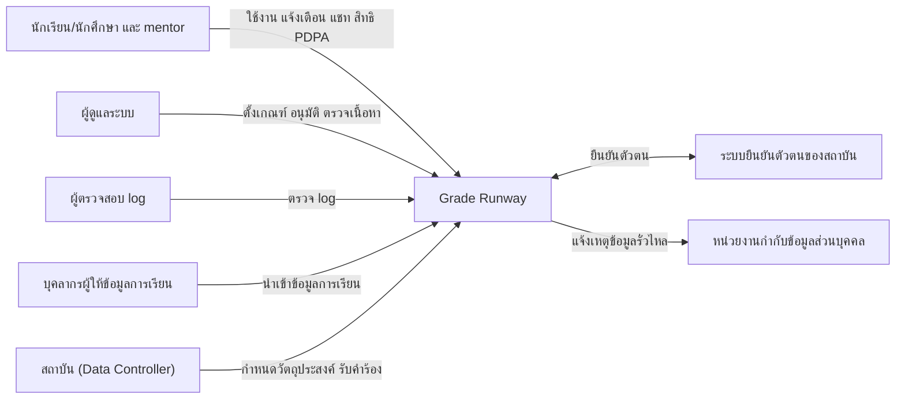
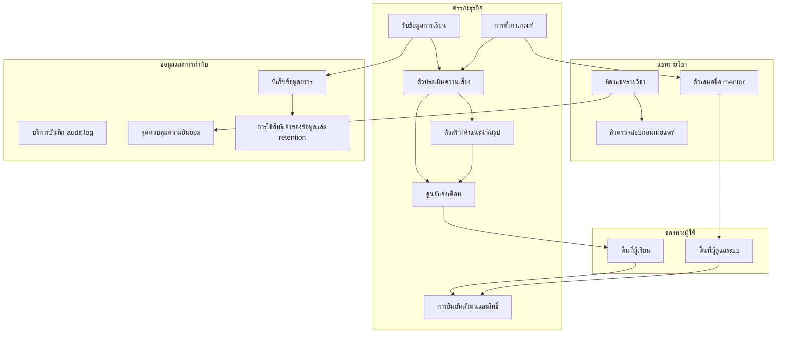
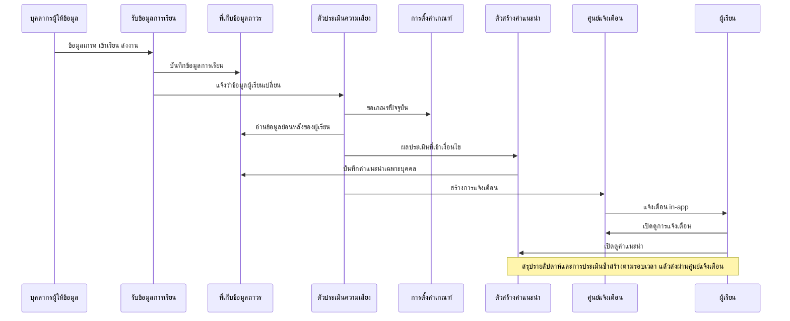
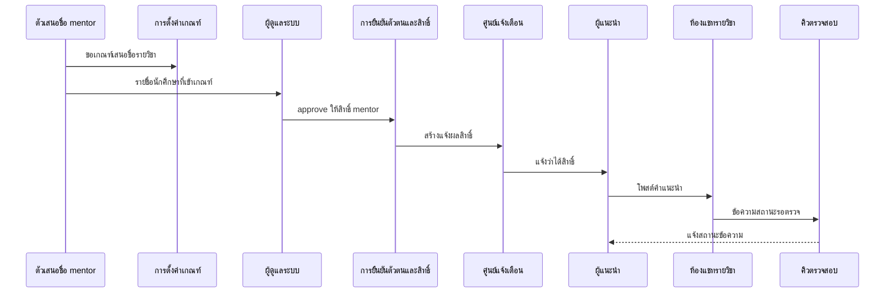
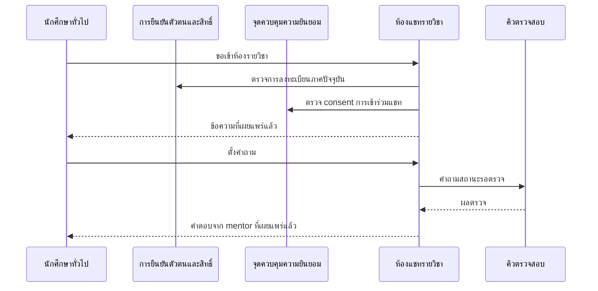
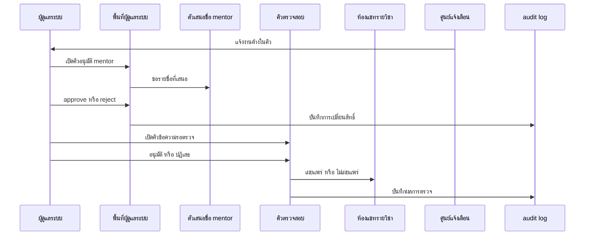
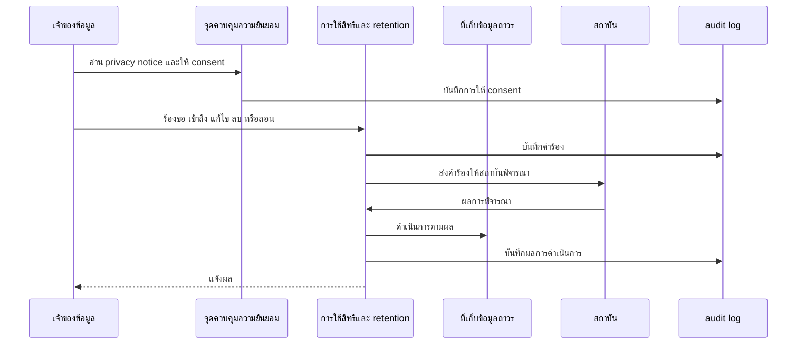
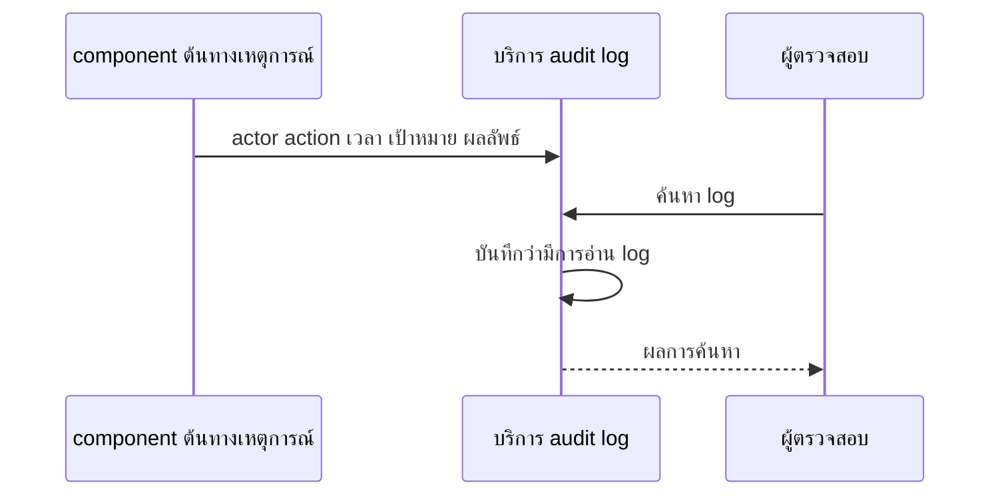
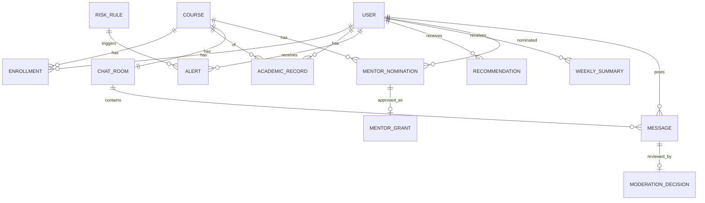
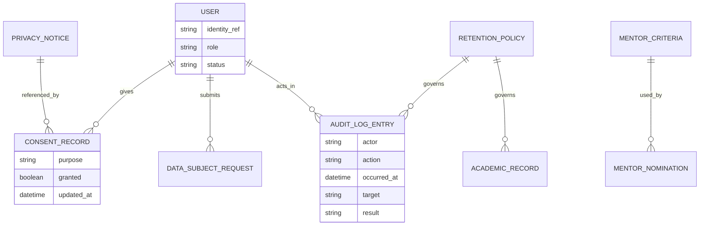

# High Level Architecture (Conceptual)

**อัปเดตล่าสุด:** 2026-10-08
**สถานะ:** Draft
**ขอบเขตของเอกสาร:** conceptual — ยังไม่ระบุ technical stack

## 1. วัตถุประสงค์และขอบเขต

เอกสารนี้อธิบายว่าระบบ Grade Runway ประกอบด้วยส่วนใดบ้าง แต่ละส่วนทำอะไร และข้อมูลไหลระหว่างผู้ใช้กับส่วนต่างๆ อย่างไร โดยยึด user journey เป็นแกนของ data flow เอกสารนี้เป็นต้นทางของ database spec และ api spec ที่จะทำต่อไป

requirement ที่ครอบคลุม:

| Spec | หัวข้อ | แหล่ง flow |
|---|---|---|
| [[../../01-requirements/01-spec/20260825-01-personalized-learning-reminder\|ระบบเตือนและแนะนำแนวทางการเรียนส่วนบุคคล]] | ติดตามตัวแปรการเรียน แจ้งเตือน คำแนะนำเฉพาะบุคคล สรุปรายสัปดาห์ | [[../01-prototypes/20260827-01-features-list-personalized-learning-reminder\|Features List]], [[../01-prototypes/20260827-02-user-journey-student-personalized-learning-reminder\|Journey นักเรียน]] |
| [[../../01-requirements/01-spec/20260825-02-high-grade-peer-review-chat\|ช่องแชทรีวิวและแนะนำวิธีการเรียนจากนักศึกษาเกรดสูง]] | ห้องแชทรายวิชา เสนอชื่อ/อนุมัติ mentor, pre-moderation | [[../01-prototypes/20260827-03-features-list-high-grade-peer-review-chat\|Features List]], [[../01-prototypes/20260827-04-user-journey-mentor-high-grade-peer-review-chat\|Journey mentor]], [[../01-prototypes/20260827-05-user-journey-mentee-high-grade-peer-review-chat\|Journey นักศึกษาทั่วไป]], [[../01-prototypes/20260827-06-user-journey-admin-high-grade-peer-review-chat\|Journey ผู้ดูแลระบบ]] |
| [[../../01-requirements/01-spec/20260825-03-logging-pdpa-compliance\|การเก็บ Log กิจกรรมและการปฏิบัติตาม PDPA]] | audit log, consent, สิทธิเจ้าของข้อมูล, retention, breach (cross-cutting) | User Stories ของ spec (ยังไม่มี journey) |

อยู่นอกขอบเขตของเอกสารนี้: การเลือกเทคโนโลยี, ช่องทางแจ้งเตือนอื่นนอกจาก in-app, การใช้งานในบริบทองค์กร, การเชื่อมระบบเกรดภายนอก (ตาม Out of Scope ของ spec แต่ละฉบับ)

## 2. ผู้ใช้และระบบภายนอก (System Context)

| Actor / ระบบภายนอก | บทบาท | ที่มา |
|---|---|---|
| นักเรียน/นักศึกษา (ผู้เรียน) | รับแจ้งเตือน/คำแนะนำ/สรุปรายสัปดาห์; อ่านและตั้งคำถามในห้องแชท; ให้/ถอนความยินยอม; ร้องขอใช้สิทธิตาม PDPA | spec 01 US1-3, spec 02 US2, spec 03 US2-3 |
| นักศึกษาผู้แนะนำ (mentor) | นักศึกษาที่ได้สิทธิ์เพิ่มหลังแอดมิน approve โพสต์คำแนะนำในห้องแชทของวิชาที่เข้าเกณฑ์ | spec 02 US1, US4 |
| ผู้ดูแลระบบ | ตั้งเกณฑ์แจ้งเตือนและเกณฑ์เสนอชื่อ mentor; approve mentor; ตรวจข้อความก่อนเผยแพร่; ดูภาพรวมห้องแชท | spec 01 US4, spec 02 US4-5 |
| ผู้ตรวจสอบ log (ผู้ดูแลระดับสูง) | ดู audit log ย้อนหลังเพื่อสืบสวน | spec 03 US1, US5 |
| บุคลากรผู้ให้ข้อมูลการเรียน | นำเข้า/บันทึกเกรด การเข้าเรียน การส่งงาน การลงทะเบียน | spec 01 BR, journey 02 ขั้นที่ 1 |
| ระบบยืนยันตัวตนของสถาบัน | ยืนยันตัวผู้ใช้ | spec 03 (MFA, login log) |
| สถาบันการศึกษา (Data Controller) | กำหนดวัตถุประสงค์การเก็บข้อมูล รับคำร้องใช้สิทธิ รับแจ้งเหตุข้อมูลรั่วไหล | spec 03 BR PDPA |
| หน่วยงานกำกับดูแลข้อมูลส่วนบุคคล | รับแจ้งเหตุข้อมูลรั่วไหลภายใน 72 ชั่วโมง | spec 03 BR PDPA |

## 3. ภาพรวม Capability / Component

หมายเหตุ: ทุก component ที่ทำการกระทำสำคัญส่งเหตุการณ์ไป "บริการบันทึก audit log" (ไม่วาดลูกศรทุกเส้นเพื่อให้แผนภาพอ่านได้) การเข้าถึงข้อมูลทั้งหมดผ่าน "การยืนยันตัวตนและสิทธิ์"

| Component | หน้าที่ | รองรับ requirement/feature |
|---|---|---|
| พื้นที่ผู้เรียน | หน้าแจ้งเตือน คำแนะนำ สรุปรายสัปดาห์ ห้องแชท การให้/ถอน consent การร้องขอสิทธิ PDPA | spec 01 features #3-5; spec 02 features #1-2, 7-8; spec 03 US2-3 |
| พื้นที่ผู้ดูแลระบบ | จัดการเกณฑ์ คิวอนุมัติ mentor คิวตรวจข้อความ ภาพรวมห้อง การดู log (เฉพาะผู้ตรวจสอบ) | spec 01 #6; spec 02 #4, 5, 9, 11, 12; spec 03 US1 |
| การยืนยันตัวตนและสิทธิ์ | รับผลยืนยันตัวตนจากระบบของสถาบัน กำหนดบทบาท (ผู้เรียน/mentor/ผู้ดูแล/ผู้ตรวจสอบ) จำกัดสิทธิ์เข้าห้องตามการลงทะเบียน MFA ของบัญชีแอดมิน | spec 02 BR3, spec 03 BR ความปลอดภัย |
| รับข้อมูลการเรียน | รับและตรวจรูปแบบข้อมูลเกรด การเข้าเรียน การส่งงาน การลงทะเบียน จากช่องทางนำเข้าของระบบเอง | spec 01 feature #1 |
| ตัวประเมินความเสี่ยง | ประเมินเงื่อนไขหลายตัวแปรตามเกณฑ์ที่ตั้งค่า (เกรดต่ำ ขาดเรียน ไม่ส่งงาน แนวโน้มลด) ทั้งทันทีเมื่อข้อมูลเปลี่ยนและตามรอบเวลา | spec 01 feature #2 |
| ตัวสร้างคำแนะนำ/สรุป | คำนวณคำแนะนำเฉพาะบุคคลจากข้อมูลย้อนหลัง และสรุปรายสัปดาห์ตามรอบเวลา | spec 01 features #4, 5 |
| ศูนย์แจ้งเตือน | จัดคิวและส่งแจ้งเตือน in-app (แจ้งความเสี่ยง ผล approve สถานะข้อความ งานค้างของแอดมิน) ออกแบบให้ช่องทางส่งออกเป็นจุดเสียบเพิ่มได้ | spec 01 feature #3, BR4; spec 02 features #10, 11 |
| การตั้งค่าเกณฑ์ | เก็บเกณฑ์ที่ตั้งค่าได้ทั้งหมด (เกณฑ์เตือน เกณฑ์เสนอชื่อ mentor ระยะเวลาเก็บ log) ไม่ hardcode | spec 01 BR2, feature #6, #7; spec 02 feature #4; spec 03 BR retention |
| ตัวเสนอชื่อ mentor | ประเมินผลการเรียนรายวิชาตามเกณฑ์ แล้วสร้างรายชื่อรอแอดมินพิจารณา | spec 02 feature #3 |
| ห้องแชทรายวิชา | ห้องแยกตามรายวิชา ควบคุมการเข้าถึงตามการลงทะเบียนภาคปัจจุบัน เก็บข้อความและสถานะ | spec 02 features #1, 2, 6, 7, 8 |
| คิวตรวจสอบก่อนเผยแพร่ | ข้อความทุกข้อความรอตรวจ ก่อนแสดงให้ผู้อื่น คิวกรองตามรายวิชาได้ | spec 02 feature #9, BR4 |
| ที่เก็บข้อมูลถาวร | เก็บข้อมูลผู้ใช้ การเรียน เกณฑ์ ห้องแชท ข้อความ แจ้งเตือน consent คำร้องสิทธิ | ทุก spec |
| บริการบันทึก audit log | รับเหตุการณ์สำคัญจากทุก component บันทึกแบบเพิ่มต่อท้ายอย่างเดียวในที่เก็บแยก จำกัดการอ่าน บันทึกการอ่าน log เอง | spec 03 BR audit |
| จุดควบคุมความยินยอม | เก็บ privacy notice เวอร์ชัน และสถานะ consent ต่อวัตถุประสงค์ ให้ฟีเจอร์สอบถามก่อนประมวลผล | spec 03 BR PDPA |
| การใช้สิทธิเจ้าของข้อมูลและ retention | รับคำร้องเข้าถึง/แก้ไข/ลบ/ถอน/คัดค้าน/โอนย้าย; ตามรอบลบหรือทำให้ไม่ระบุตัวตนเมื่อพ้นระยะเวลาเก็บ; รองรับขั้นตอนแจ้งเหตุรั่วไหลภายใน 72 ชั่วโมง | spec 03 BR PDPA |

## 4. Data Flow ตาม User Journey

### 4.1 นักเรียน/นักศึกษา: รับรู้ความเสี่ยงและรับคำแนะนำ
ที่มา: [[../01-prototypes/20260827-02-user-journey-student-personalized-learning-reminder|Journey นักเรียน]] · spec [[../../01-requirements/01-spec/20260825-01-personalized-learning-reminder|01]]

| ขั้นตอน journey | ข้อมูลเข้า/ออก | Component |
|---|---|---|
| เข้าเรียนและส่งงาน | เข้า: เกรด การเข้าเรียน การส่งงาน | รับข้อมูลการเรียน, ที่เก็บข้อมูลถาวร |
| ตรวจพบความเสี่ยง | เข้า: ข้อมูลย้อนหลัง + เกณฑ์; ออก: ผลประเมินหลายตัวแปร | ตัวประเมินความเสี่ยง, การตั้งค่าเกณฑ์ |
| ได้รับแจ้งเตือน in-app / เปิดดูรายละเอียด | ออก: ข้อความแจ้งเตือนพร้อมลิงก์ไปคำแนะนำ _(สมมติฐาน จาก journey)_ | ศูนย์แจ้งเตือน, พื้นที่ผู้เรียน |
| เห็นคำแนะนำเฉพาะบุคคล | ออก: คำแนะนำที่คำนวณจากข้อมูลของผู้เรียนคนนั้น | ตัวสร้างคำแนะนำ |
| ดูสรุปรายสัปดาห์ / เทียบสัปดาห์ก่อน | ออก: สรุปรายสัปดาห์ _(เนื้อหาเปรียบเทียบเป็นสมมติฐาน)_ | ตัวสร้างสรุป, ศูนย์แจ้งเตือน |

กรณีขอบ (ยังไม่มีคำตอบใน spec): ผู้เรียนที่ไม่มีข้อมูลย้อนหลังพอ; หลายเงื่อนไขพร้อมกัน; แอดมินเปลี่ยนเกณฑ์ขณะมีแจ้งเตือนค้าง (ต้องกันการแจ้งเตือนซ้ำระหว่างการประเมินทันทีกับการประเมินตามรอบ)

### 4.2 นักศึกษาเกรดสูง/mentor: ได้รับสิทธิ์และโพสต์คำแนะนำ
ที่มา: [[../01-prototypes/20260827-04-user-journey-mentor-high-grade-peer-review-chat|Journey mentor]] · spec [[../../01-requirements/01-spec/20260825-02-high-grade-peer-review-chat|02]]

| ขั้นตอน journey | ข้อมูลเข้า/ออก | Component |
|---|---|---|
| ระบบเสนอชื่อ | เข้า: ผลการเรียนรายวิชา/GPA + เกณฑ์; ออก: รายชื่อรอพิจารณา | ตัวเสนอชื่อ mentor, การตั้งค่าเกณฑ์ |
| รอผล approve / ได้รับแจ้งสิทธิ์ | ออก: ผลการตัดสินใจ _(กลไกแจ้งเป็นสมมติฐาน)_ | พื้นที่ผู้ดูแลระบบ, ศูนย์แจ้งเตือน |
| เข้าห้อง โพสต์ข้อความ | เข้า: ข้อความ; ออก: ข้อความสถานะรอตรวจ | ห้องแชทรายวิชา |
| รอตรวจก่อนเผยแพร่ | ออก: สถานะข้อความ | คิวตรวจสอบก่อนเผยแพร่ |

การ approve mentor เป็นเหตุการณ์เปลี่ยนสิทธิ์ ต้องบันทึก audit log (ดู 4.6) กรณีขอบ: reject, ข้อความถูกปฏิเสธ, ถอนสิทธิ์เมื่อเกรดตกในภาคถัดไป (ยังไม่ระบุใน spec)

### 4.3 นักศึกษาทั่วไป: ขอคำแนะนำในห้องแชท
ที่มา: [[../01-prototypes/20260827-05-user-journey-mentee-high-grade-peer-review-chat|Journey นักศึกษาทั่วไป]]

| ขั้นตอน journey | ข้อมูลเข้า/ออก | Component |
|---|---|---|
| เข้าห้อง | เข้า: ตัวตน + การลงทะเบียนภาคปัจจุบัน + consent; ออก: อนุญาต/ไม่อนุญาต | การยืนยันตัวตนและสิทธิ์, จุดควบคุมความยินยอม, ห้องแชท |
| อ่านข้อความ | ออก: เฉพาะข้อความสถานะเผยแพร่แล้ว | ห้องแชท |
| ตั้งคำถามและรอตรวจ | เข้า: คำถาม (ผ่าน pre-moderation เช่นเดียวกับทุกข้อความ _อนุมานจาก BR4_) | ห้องแชท, คิวตรวจ |

### 4.4 ผู้ดูแลระบบ: ควบคุมคุณภาพ mentor และเนื้อหา
ที่มา: [[../01-prototypes/20260827-06-user-journey-admin-high-grade-peer-review-chat|Journey ผู้ดูแลระบบ]]

| ขั้นตอน journey | ข้อมูลเข้า/ออก | Component |
|---|---|---|
| ดูรายชื่อ / approve-reject | เข้า: รายชื่อ + ผลการเรียนประกอบ; ออก: การตัดสินใจ | พื้นที่ผู้ดูแลระบบ, ตัวเสนอชื่อ |
| คิว pre-moderation | เข้า: ข้อความรอตรวจ; ออก: สถานะเผยแพร่/ปฏิเสธ | คิวตรวจสอบ, ห้องแชท |
| ปริมาณงาน/SLA | _(ต้องการข้อมูลเพิ่มเติมจากผู้ใช้ — spec ยังไม่ระบุ SLA)_ | ศูนย์แจ้งเตือน |

### 4.5 เจ้าของข้อมูล: ความยินยอมและการใช้สิทธิ PDPA
ที่มา: User Stories ของ [[../../01-requirements/01-spec/20260825-03-logging-pdpa-compliance|spec 03]] (ยังไม่มี journey)

| ขั้นตอน | ข้อมูลเข้า/ออก | Component |
|---|---|---|
| แจ้งวัตถุประสงค์และขอ consent | เข้า: การตัดสินใจของผู้ใช้; ออก: บันทึก consent ต่อวัตถุประสงค์และเวอร์ชัน notice | จุดควบคุมความยินยอม |
| ร้องขอใช้สิทธิ | เข้า: คำร้อง; ออก: ผลการดำเนินการ | การใช้สิทธิและ retention |
| ตามรอบ retention | ข้อมูลนักศึกษาเก็บระหว่างมีสถานภาพ +5 ปีหลังพ้นสถานภาพ แล้วลบหรือทำให้ไม่ระบุตัวตน ยกเว้นข้อมูลที่ระเบียบกำหนดให้เก็บถาวร | การใช้สิทธิและ retention, ที่เก็บข้อมูลถาวร |
| เหตุข้อมูลรั่วไหล | ตรวจจับ ประเมิน แจ้งหน่วยงานกำกับ/เจ้าของข้อมูลภายใน 72 ชั่วโมง (ระดับกระบวนการ ยังไม่ออกแบบระบบแจ้งอัตโนมัติ) | การใช้สิทธิและ retention, สถาบัน |

### 4.6 ผู้ตรวจสอบ: audit log
ที่มา: User Stories spec 03 ข้อ 1 และ 5

เหตุการณ์ที่ต้องบันทึก (spec 03): login/logout และล้มเหลว; สร้าง/แก้/ลบเกรด (ค่าก่อน-หลัง); ผู้ดูแล/อาจารย์เข้าถึงข้อมูลนักศึกษา; เปลี่ยนสิทธิ์/บทบาท (รวม approve mentor); export ข้อมูลชุดใหญ่; คำร้องสิทธิ PDPA และผล

## 5. Data Concept

| Entity | คำอธิบาย | เจ้าของข้อมูล | ความอ่อนไหว |
|---|---|---|---|
| USER | ผู้ใช้และบทบาท สถานภาพ (เรียน/พ้นสถานภาพ) อ้างอิงตัวตนจากระบบของสถาบัน | ผู้ใช้ / สถาบัน | ข้อมูลส่วนบุคคล |
| COURSE, ENROLLMENT | รายวิชาและการลงทะเบียนต่อภาค (คุมสิทธิ์เข้าห้อง) | Grade Runway (นำเข้าโดยบุคลากร) | ข้อมูลส่วนบุคคล |
| ACADEMIC_RECORD | เกรด การเข้าเรียน การส่งงาน แนวโน้ม | Grade Runway (นำเข้าโดยบุคลากร) | อ่อนไหวสูง |
| RISK_RULE | เกณฑ์เตือนที่ตั้งค่าได้ และชุด/หมวดหมู่ผู้ใช้ที่ใช้เกณฑ์ (เผื่อขยายบริบท) | ผู้ดูแลระบบ | ไม่ใช่ข้อมูลส่วนบุคคล |
| ALERT, RECOMMENDATION, WEEKLY_SUMMARY | ผลที่ระบบคำนวณให้ผู้เรียนเฉพาะราย | ผู้เรียนที่เป็นเจ้าของ | อ่อนไหวสูง (derive จากผลการเรียน) |
| MENTOR_CRITERIA | เกณฑ์เกรด/GPA เสนอชื่อ mentor ต่อวิชา | ผู้ดูแลระบบ | ไม่ใช่ข้อมูลส่วนบุคคล |
| MENTOR_NOMINATION, MENTOR_GRANT | รายชื่อที่เสนอ ผลอนุมัติ และสิทธิ์ที่ได้ | ผู้ดูแลระบบ / นักศึกษา | ข้อมูลส่วนบุคคล (อิงผลการเรียน) |
| CHAT_ROOM, MESSAGE, MODERATION_DECISION | ห้องต่อรายวิชา ข้อความพร้อมสถานะ (รอตรวจ/เผยแพร่/ปฏิเสธ) และผลการตรวจ | ผู้โพสต์ / ผู้ตรวจ | อาจมีข้อมูลส่วนบุคคลของผู้อื่น (spec 03) |
| PRIVACY_NOTICE, CONSENT_RECORD | notice แต่ละเวอร์ชันและ consent ต่อวัตถุประสงค์ | สถาบัน / เจ้าของข้อมูล | ข้อมูลส่วนบุคคล |
| DATA_SUBJECT_REQUEST | คำร้องใช้สิทธิและผล | เจ้าของข้อมูล | ข้อมูลส่วนบุคคล |
| AUDIT_LOG_ENTRY | หลักฐานเหตุการณ์ immutable เก็บ 1 ปี (configurable) อยู่ในที่เก็บแยกจากข้อมูลธุรกิจ | ผู้ตรวจสอบ | อาจมีค่าก่อน-หลังของข้อมูลอ่อนไหว ต้องจำกัดการอ่าน |
| RETENTION_POLICY | กฎระยะเวลาเก็บต่อประเภทข้อมูล (นักศึกษา +5 ปี, log 1 ปี) | สถาบัน | ไม่ใช่ข้อมูลส่วนบุคคล |

## 6. การเชื่อมต่อกับระบบภายนอก

| ระบบภายนอก | ทิศทาง | ข้อมูลที่แลกเปลี่ยน | ผลกระทบถ้าล่ม |
|---|---|---|---|
| ระบบยืนยันตัวตนของสถาบัน | สองทาง | ยืนยันตัวตน สถานภาพนักศึกษา | ผู้ใช้เข้าระบบไม่ได้; ข้อมูลที่มีอยู่ไม่เสียหาย |
| แหล่งข้อมูลการเรียน (บุคลากรนำเข้าเอง ไม่ผูกกับระบบทะเบียนภายนอก) | เข้า | เกรด เข้าเรียน ส่งงาน ลงทะเบียน | ไม่มีข้อมูลใหม่ การเตือน/เสนอชื่อล่าช้า ผู้ใช้ยังดูข้อมูลเดิมได้ |
| หน่วยงานกำกับข้อมูลส่วนบุคคล | ออก (ตามกระบวนการ) | รายงานเหตุข้อมูลรั่วไหลภายใน 72 ชั่วโมง | เป็นขั้นตอนของสถาบัน ไม่ใช่การเชื่อมต่อของระบบในเวอร์ชันนี้ |
| ช่องทางแจ้งเตือนนอกแอป (เช่น อีเมล ข้อความสั้น แอปแชทภายนอก) | ออก | ข้อความแจ้งเตือน | **ยังไม่มี** — อยู่นอกขอบเขต เหลือจุดเสียบในศูนย์แจ้งเตือน |
| ระบบทะเบียน/ระบบเกรดของสถาบัน | — | — | **ยังไม่มี** — เป็นจุดขยายในอนาคต (ดูการตัดสินใจ Q1) |

## 7. Cross-cutting Concerns

- **ความปลอดภัยและสิทธิ์:** ทุกคำขอผ่านการยืนยันตัวตนและตรวจบทบาท; หลัก least privilege; MFA สำหรับบัญชีผู้ดูแลระบบ; เข้ารหัสข้อมูลขณะจัดเก็บและส่งผ่าน (spec 03)
- **ขอบเขตการเข้าถึงห้องแชท:** เฉพาะผู้ลงทะเบียนวิชานั้นในภาคปัจจุบัน (spec 02 BR3); สิทธิ์โพสต์เชิงแนะนำเฉพาะ mentor ที่ approve แล้ว
- **Audit log:** ตามหัวข้อ 4.6 เพิ่มต่อท้ายอย่างเดียวในที่เก็บแยก ผู้ใช้และแอดมินปกติแก้/ลบไม่ได้ จำกัดผู้อ่านและบันทึกการอ่านเอง เก็บ 1 ปี ค่า configurable ประเด็นที่ต้องตัดสินในงานถัดไป: ถ้าบริการบันทึก log ใช้งานไม่ได้ จะปฏิเสธการกระทำหรือปล่อยผ่าน
- **PDPA:** ระบุฐานกฎหมายต่อประเภทข้อมูล (ผลการเรียน/ทะเบียน = ภารกิจทางการศึกษา; การเข้าห้องแชท = consent); แจ้ง privacy notice; รองรับสิทธิทั้ง 6 (เข้าถึง แก้ไข ลบ ถอน คัดค้าน โอนย้าย); เนื้อหาแชทที่อ้างถึงข้อมูลผู้อื่นอยู่ใต้หลักเดียวกัน; สถาบันเป็น Data Controller ส่วนทีม Grade Runway เป็น Data Processor
- **Retention:** ข้อมูลนักศึกษา สถานภาพ +5 ปี แล้วลบหรือทำให้ไม่ระบุตัวตน (เว้นข้อมูลที่ระเบียบให้เก็บถาวร เช่น ทรานสคริปต์); audit log 1 ปี
- **การแจ้งเตือน:** in-app เป็นช่องทางเดียวในเวอร์ชันนี้ ช่องทางส่งออกแยกจากตรรกะการตัดสินใจเพื่อเพิ่มภายหลังได้
- **ความยืดหยุ่น (configurable):** เกณฑ์ทั้งหมดอยู่ในการตั้งค่าเกณฑ์ ไม่ hardcode; ชุดเกณฑ์ผูกกับ "หมวดหมู่ผู้ใช้" เผื่อขยายบริบท
- **ประสิทธิภาพ/ความพร้อมใช้งาน:** spec ไม่ระบุตัวเลข _(ต้องการข้อมูลเพิ่มเติมจากผู้ใช้)_ ที่ชัดคือการแจ้งเตือน "ทันที" และ SLA ของ moderation ที่ยังไม่กำหนด
- **ความเป็นส่วนตัวของข้อมูลอ่อนไหว:** ผลการเรียน/คำแนะนำเป็นข้อมูลเฉพาะบุคคล เห็นเฉพาะเจ้าของและผู้มีสิทธิ์ ทุกการเข้าถึงโดยผู้ดูแล/อาจารย์ต้องบันทึก log

## 8. ข้อจำกัดจาก Requirement

ไม่มีเทคโนโลยีที่ requirement ระบุไว้ ข้อบังคับที่ระบุคือกฎหมาย พ.ร.บ.คุ้มครองข้อมูลส่วนบุคคล พ.ศ. 2562, การแจ้งเหตุรั่วไหลภายใน 72 ชั่วโมง, เก็บ audit log 1 ปี, เก็บข้อมูลนักศึกษา +5 ปีหลังพ้นสถานภาพ, MFA สำหรับบัญชีผู้ดูแลระบบ และการเข้ารหัสข้อมูลทั้งขณะจัดเก็บและส่งผ่าน (ไม่ระบุวิธี)

## 9. การตัดสินใจเชิงสถาปัตยกรรมที่ยืนยันแล้ว

| หัวข้อ | การตัดสินใจ | เหตุผล | วันที่ |
|---|---|---|---|
| แหล่งข้อมูลการเรียน (Q1) | Grade Runway เป็นเจ้าของข้อมูลเอง รับผ่านช่องทางนำเข้าโดยบุคลากร ไม่มีระบบทะเบียนภายนอกเป็น dependency บังคับ | ตรงกับ spec 01 ที่กันการเชื่อมระบบเกรดภายนอกไว้นอกขอบเขต และ audit การแก้เกรดครบเพราะเกิดในระบบ | 2026-10-08 |
| ผู้ตรวจ pre-moderation และอนุมัติ mentor (Q2) | ผู้ดูแลระบบส่วนกลาง คิวกรองตามรายวิชา/ผู้ตรวจที่ได้รับมอบหมายได้ เพื่อขยายไปมอบหมายอาจารย์ภายหลัง | ตรงกับ journey admin โมเดลสิทธิ์เรียบง่าย ตรวจ audit ง่าย | 2026-10-08 |
| จังหวะประเมินความเสี่ยง (Q3) | ผสม: ประเมินทันทีเมื่อข้อมูลเปลี่ยน + งานตั้งเวลาสำหรับสรุปรายสัปดาห์และการประเมินซ้ำ | ตอบทั้ง "ทันทีที่ตรวจพบ" และสรุปรายสัปดาห์ของ spec 01 | 2026-10-08 |
| ที่เก็บ audit log (Q4) | บริการบันทึก log แยก เพิ่มต่อท้ายอย่างเดียว สิทธิ์อ่านจำกัดผู้ตรวจสอบ | ทำให้ "แอดมินปกติแก้/ลบไม่ได้" เป็นจริงเชิงโครงสร้าง และแยกอายุเก็บ 1 ปีได้สะอาด | 2026-10-08 |
| การบังคับใช้ consent (Q5) | จุดควบคุม consent กลางที่ทุกฟีเจอร์ฐาน consent ต้องตรวจก่อนประมวลผล | ถอน consent มีผลทั่วระบบจุดเดียว รองรับฐานกฎหมายต่อประเภทข้อมูลตาม spec 03 | 2026-10-08 |
| ตัวตนผู้ใช้ (Q6) | ใช้ระบบยืนยันตัวตนของสถาบัน ส่วนบทบาท/สิทธิ์ (mentor, ผู้ดูแล, ผู้ตรวจสอบ) Grade Runway จัดการเอง | ไม่ต้องเก็บรหัสผ่านนักศึกษา ลดภาระ PDPA และได้สถานภาพนักศึกษาไว้คุม retention | 2026-10-08 |

## 10. คำถามค้างและสมมติฐาน

ไม่มีคำถามเชิงสถาปัตยกรรมที่รอคำตอบจากผู้ใช้ ข้อสันนิษฐานและข้อมูลที่ยังขาด:

- _(ต้องการข้อมูลเพิ่มเติมจากผู้ใช้)_ ค่าตัวเลขของเกณฑ์เตือน, เกณฑ์เกรด/GPA เสนอชื่อ mentor, SLA ของ pre-moderation
- _(ต้องการข้อมูลเพิ่มเติมจากผู้ใช้)_ MFA ของบัญชีแอดมินทำที่ระบบตัวตนของสถาบันหรือใน Grade Runway (ผลจาก Q6 — สถาบันยังไม่ยืนยันว่ามีระบบนี้)
- _(ต้องการข้อมูลเพิ่มเติมจากผู้ใช้)_ ถ้าบริการบันทึก audit log ใช้งานไม่ได้ ระบบควรปฏิเสธการกระทำหรือปล่อยผ่าน
- _(สมมติฐาน)_ การแจ้งผล approve และสถานะข้อความใช้ศูนย์แจ้งเตือน in-app เดียวกัน (features #10, #11 เป็น Should have)
- _(สมมติฐาน)_ mentor คือนักศึกษาที่ได้สิทธิ์เพิ่มหลัง approve ไม่ใช่ actor แยก
- _(สมมติฐาน)_ การรองรับบริบทอื่นนอกการเรียน (feature #7 Could have) แสดงด้วยแนวคิด "หมวดหมู่ผู้ใช้/ชุดเกณฑ์ที่กำหนดค่าได้" โดยไม่ implement นอกบริบทการเรียน
- _(ยังไม่ระบุใน spec)_ การถอนสิทธิ์ mentor เมื่อเกรดตก; ผู้เรียนที่ไม่มีข้อมูลย้อนหลังพอ; การรวม/จัดลำดับแจ้งเตือนหลายเงื่อนไข; ผลของการเปลี่ยนเกณฑ์ต่อแจ้งเตือนค้าง; การเพิ่ม/ถอนวิชาระหว่างภาค; การจัดการข้อความเดิมเมื่อผู้โพสต์ถอน consent
- _(สมมติฐาน)_ spec 03 ยังไม่มี features list/journey; หากภายหลังสร้างแล้วควรปรับหัวข้อ 4.5-4.6

---
ย้อนกลับ: [[index|02-technical]]

> รายละเอียดข้อมูลและ API ที่ต่อยอดจากเอกสารนี้: [[database-spec|Database Spec]], [[api-spec|API Spec]]
